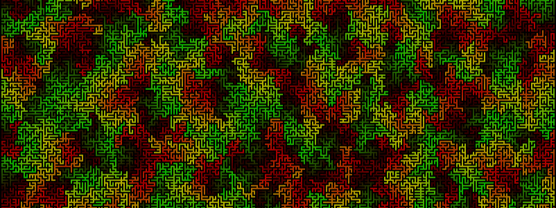

# Mathspp

## Building Bridges Between Mathematics and Programming

The best place to get started is the [blog](../blog). There you find articles with maths problems for you to solve, programming projects and tutorials and other miscellaneous things pertaining mathematics and programming.

You may also be interested in taking a look at [some workshops I have led](../workshops) or even at all the [random sentences](../random-sentences) that show up in the footer of this blog.
