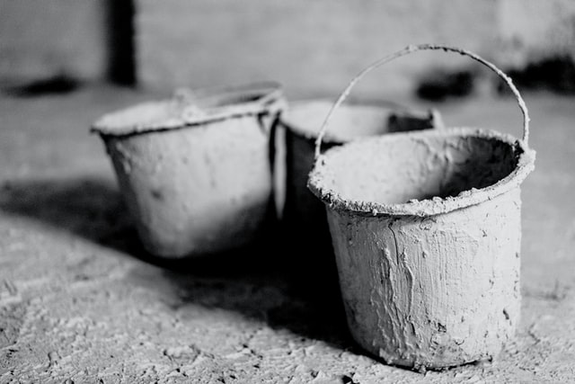

---
metadata:
    description: Este artigo expõe um problema relativo à charada com baldes de água
        e mostra que nem sempre a charada tem solução.
title: 'Problema #004 - solubilidade da charada dos baldes'
---

[Neste artigo][wbr post] eu falei de uma charada com baldes com água. Agora desafio-te a mostrares que há situações em que a charada é _impossível_ de resolver!

===

### Enunciado

Tens $n$ baldes e cada um tem capacidade para $c_i$ litros de água, $i = 1, \cdots, n$. Queres mexer nos baldes de maneira tal que consegues fazer com que um balde tenha exatamente $t$ litros de água, sabendo que as três coisas que podes fazer são:

 - encher completamente o balde $i$ para que ele passe a ter $c_i$ litros de água;
 - esvaziar completamente o balde $i$ para que ele passe a ter $0$ litros de água;
 - passar água do balde $i$ para o balde $j$, até que o balde $i$ fique vazio ou o balde $j$ fique cheio, o que quer que aconteça primeiro.

Prova que, se $t$ não for um múltiplo do maior divisor comum dos vários $c_i$, $i = 1, \cdots, n$ então é impossível que um balde contenha exatamente $t$ litros de água.

Por exemplo, se os baldes tiverem capacidades $4$ e $6$ e $t = 3$, então não há sequência de movimentos que permita ter exatamente $3$ litros de água num dos baldes, já que o maior divisor comum de $4$ e $6$ é $\texttt{mdc}(4, 6) = 2$ e $3$ _não_ é um múltiplo de $2$.

!!! Pensa um pouco... e tenta resolver o problema! Pega numa folha e num lápis e puxa pela cabeça!

Se precisares de clarificar alguma coisa, não hesites em perguntar na secção de comentários em baixo.

### Solução

Podes encontrar a minha proposta de solução [aqui][sol], para confirmares a tua resposta.

[sol]: ../../solutions/{{ page.slug }}
[wbr post]: ../../water-buckets
