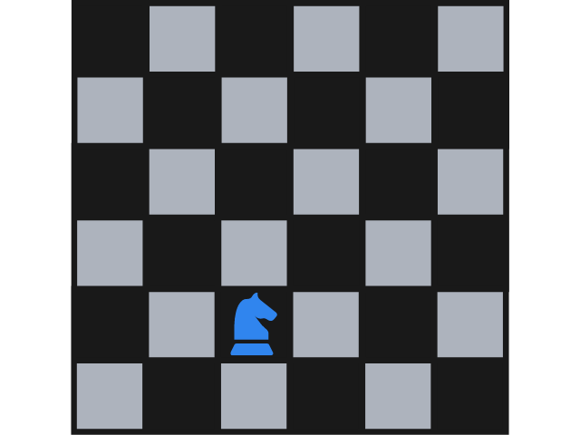
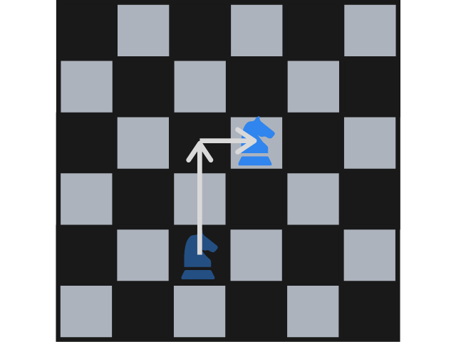
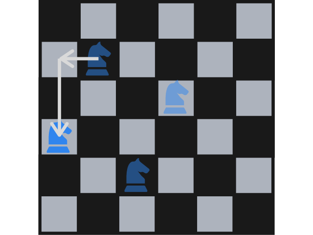

---
metadata:
    description: This problem pits Alice against Bob in a little game that takes place in a chessboard.
title: "Problem #025 - knight's tour"
---

Alice and Bob sit down, face to face, with a chessboard in front of them.
They are going to play a little game, but this game only has a single knight...
Who will win?

===

### Problem statement

Alice and Bob will play a special game of “chess”.
Alice will take the knight and place it in some square of the chessboard, any square she likes.

Then, Bob will take the knight and move it (according to chess rules) to a square of his choosing.

Then it's Alice's turn to do the same, and they will alternate moving the knight.
There is only a catch:

 > They **cannot** move the knight to a position that has already been visited by the knight.

In the example image below, the knight cannot be moved one row down and two columns right, as that is the place the knight started at.

Can any of them guarantee a win? Who? How?

!!! Give it some thought...

If you need any clarification whatsoever, feel free to ask in the comment section below.

This problem was posed to me by a university colleague that plays a lot of chess!

### Solution

The solution to this problem will be posted [here][sol] after this problem has been live for 2 weeks. You can also use that link to post your own solution in the comments! Please **do not** post spoilers in the comments here.
<!--You can read the solution [here][sol] to compare with your own solution. You can also use that link to post your own solution in the comments! Please **do not** post spoilers in the comments here.-->

---

If you enjoyed the problem and would like to get new problems directly in your inbox, be sure to [subscribe to the Problems newsletter][subscribe].

[sol]: ../../solutions/{{ page.slug }}
[subscribe]: https://mathspp.com/subscribe
