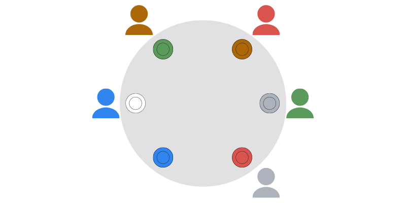

A waiter at a restaurant gets a group's order completely wrong.
Can you turn the table to get two or more orders right?

===

### Problem statement

An arbitrary number of people are people sitting down, around a round table,
waiting for their orders.
When the waiter brings their orders, they mix everything up and no single
person is served what they ordered.

Can you _always_ turn the table so that at least two orders are correctly aligned?
You can start by trying with the example in the figure above, assuming
you are not colour-blind (sorry if you are :/).

### Solution

The solution to this problem will be posted [here][sol] after this problem has been live for 2 weeks.
Feel free to [email me][email] your solution or to comment it here if you want it featured in the [solution page][sol].
<!--You can read the solution [here][sol] to compare with your own solution.
You can also use that link to post your own solution in the comments! Please avoid posting spoilers in the comments here.-->

---

If you enjoyed the problem and would like to get new problems directly in your inbox, be sure to [subscribe to the Problems newsletter][subscribe].

[email]: mailto:rodrigo@mathspp.com?subject=Solution%20to%20{{ page.title|regex_replace(['/ /'], ['%20']) }}
[subscribe]: https://mathspp.com/subscribe
[sol]: ../../solutions/{{ page.slug }}

