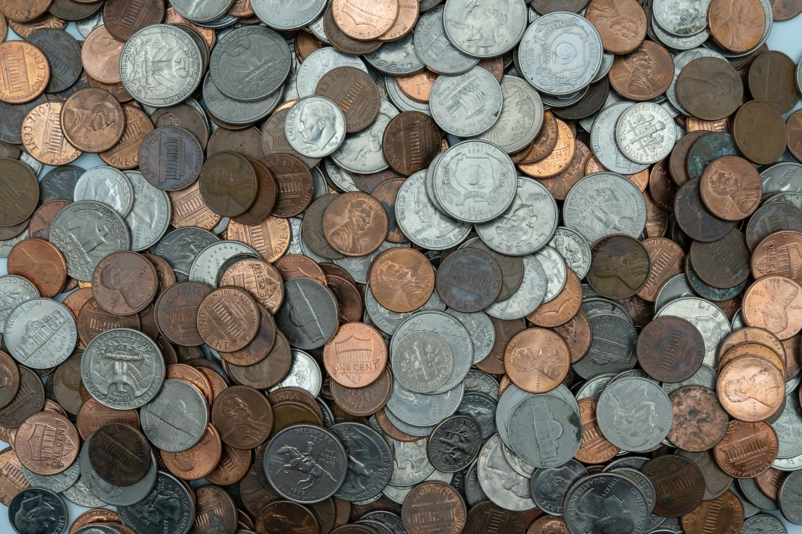

This is an algorithmic puzzle where you just have to turn some coins.

===

### Problem statement

You are inside a dark room, sitting at a table.
The table in front of you is covered with coins, which you can feel,
but you can't really see what their face up is.
You are told, however, that exactly 20 of those coins have _heads_ facing up
and all the others have _tails_ facing up.

Your task is to divide the coins in two groups,
such that both piles have the exact same number of coins with their _heads_ face up.

The only things you can really do are

 - move coins around (to put them in one group or the other); and
 - turn coins upside down.

Recall that the room is _so_ dark, you can't really tell which face each coin has up,
nor can you feel it with your touch.

!!! Give it some thought and [send me your solution][email]!

If you need any clarification whatsoever, feel free to ask in the comment section below.

This problem was shared by @TodiLiju, who comments these “problem”
posts from time to time.

### Solution

The solution to this problem will be posted [here][sol] after this problem has been live for 2 weeks.
Feel free to [email me][email] your solution if you want it featured in the [solution page][sol].
<!--You can read the solution [here][sol] to compare with your own solution.
You can also use that link to post your own solution in the comments! Please avoid posting spoilers in the comments here.-->

---

If you enjoyed the problem and would like to get new problems directly in your inbox, be sure to [subscribe to the Problems newsletter][subscribe].

[email]: mailto:rodrigo@mathspp.com?subject=Solution%20to%20{{ page.title|regex_replace(['/ /'], ['%20']) }}
[subscribe]: https://mathspp.com/subscribe
[sol]: ../../solutions/{{ page.slug }}
