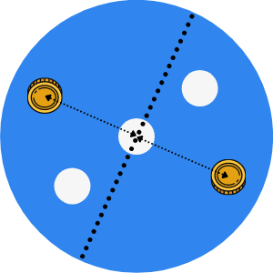

Alice and Bob sit across each other, ready for their game of coins.
Who will emerge victorious?

===

# Problem statement

Alice and Bob sit across each other at a circular table.
They will now play the “game of coins”!

The “game of coins” is simple:
they have access to a _huge_ pile of circular coins of the same size and,
in turns, they place a coin on the table.
That coin must not overlap with any other coins already placed; it must rest completely on the table.
The first player to not have enough room to place a coin, loses.

Alice will play first.

Can either of the two develop a winning strategy?
And what strategy would that be?

!!! Give it some thought!

If you need any clarification whatsoever, feel free to ask in the comment section below.

# Solvers

Congratulations to the ones that solved this problem correctly.
Because no one sent me their solution in time, I cannot list any winners for this time.

# Solution

Alice can win the game, because she is the first player.
Her winning strategy is easy:
she just has to play the first coin in the very centre of the table,
and then play diametrically opposite to Bob.

How does this work?
It is actually quite interesting!
Alice starts by placing a coin in the very centre of the table
so that the table starts to exhibit a very useful property (for her):
given any valid coin position, the diametrically opposite location
is also valid.

See it this way: when Alice places the first coin in the very centre of the table,
think of it as her drilling a hole in the centre of the table,
so that no coin can go there any more.

Now, it is Bob's turn to play, and he has to play a coin in a place with no holes,
so he just places his coin somewhere:

What Alice does is to figure out what is the play that is diametrically
opposite to Bob's:

After she replies, you can think of it as if their coins now also drilled
holes in the table:

Now, at this point, there are three holes in the table, instead of the single
hole that Alice “drilled” in the beginning, but one thing remains true:
for each point in that table, if a coin would fit there, then it would also
fit in the same location, but diametrically opposite to the centre.

So, Bob might play some coin somewhere:

Then, what Alice does is the same, she finds the diametrically opposite play:

And they do this back and forth, until Bob runs out of space to place a new coin.
It's never Alice who runs out of space because she is always replying
to Bob's moves.

[Don't forget to subscribe to the newsletter][subscribe] to get bi-weekly
problems sent straight to your inbox and to add your reaction below.

[email]: mailto:rodrigo@mathspp.com?subject=Solution%20to%20{{ page.title|regex_replace(['/ /'], ['%20']) }}
[subscribe]: https://mathspp.com/subscribe
