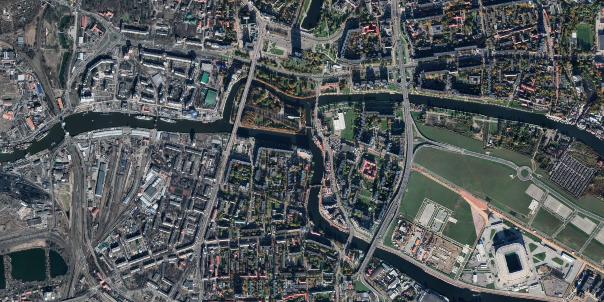
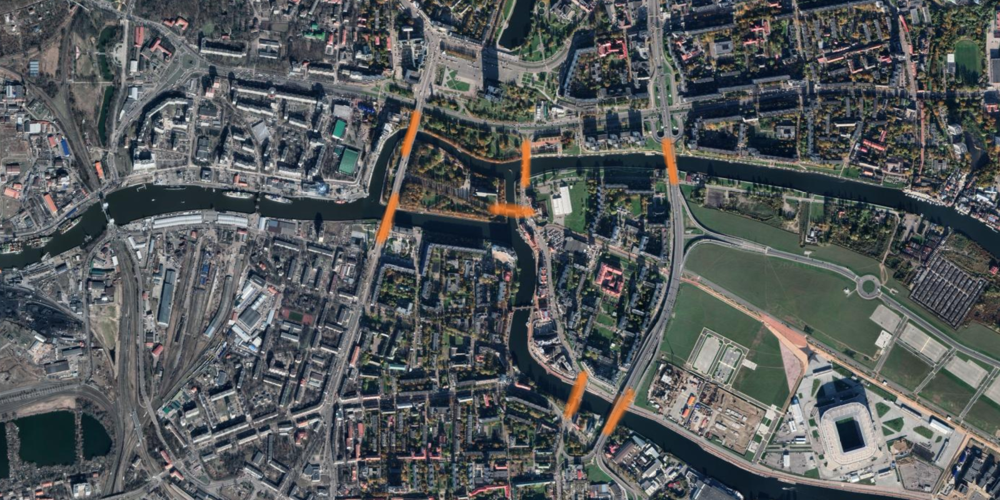

You are on vacation and must find the most efficient way to
cross all bridges.
How will you do that?

===

# Problem statement

If you like solving riddles and puzzles, it is likely that you have
already encountered this puzzle.
But even if you have, it is always good to go back
and think about the classics.
On top of that, I will formulate the problem in a slightly different
way, so that you can be entertained for a bit even if you already
know the more classic version.

Take a look at this satellite view from Kaliningrad, Russia,
where I have highlighted seven bridges:

Your task is to figure out what route to take if what you want to do
is cross all of the highlighted bridges at least once but,
at the same time, keep the total number of crossed bridges as low
as possible.

Having said that, what is the best route you can come up with?

(Just to be clear, I don't care about the length of the route –
the number of miles/kilometres you would walk/drive – I only
care about the number of bridges you cross.)

!!! Give it some thought!

If you need any clarification whatsoever, feel free to ask in the comment section below.

In case you are wondering, the classic version of this puzzle is
dubbed “the seven bridges of Königsberg” because that
is what this place was called when a famous mathematician first
dwelled on this problem.

# Solvers

[Email me][email] your solution to get your name (or an alias) featured in here!

<!--
Congratulations to the ones that solved this problem correctly and, in particular, to the ones
who sent me their correct solutions:

 - 

(The list is in no particular order.)
-->

# Solution

The solution to this problem will be posted here after this problem has been live for 2 weeks.

[Don't forget to subscribe to the newsletter][subscribe] to get bi-weekly
problems sent straight to your inbox and to add your reaction below.

[email]: mailto:rodrigo@mathspp.com?subject=Solution%20to%20{{ page.title|regex_replace(['/ /'], ['%20']) }}
[subscribe]: https://mathspp.com/subscribe
