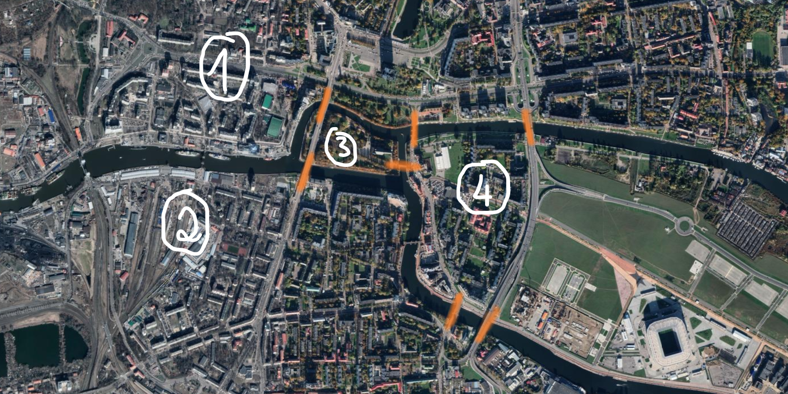
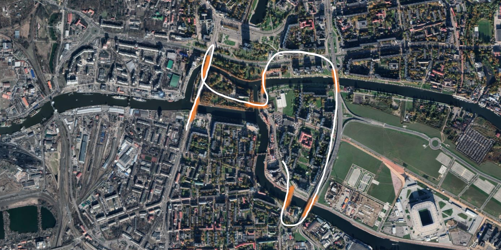

Estás de férias e tens de encontrar o caminho mais eficiente
para atravessar as pontes todas.
Consegues fazê-lo?

===

# Enunciado do problema

Se gostas de quebra-cabeças, é provável que já tenhas encontrado
o deste artigo.
Mas mesmo que já o tenhas encontrado, é sempre bom revisitar
os clássicos!
Além do mais, vou formular o problema de uma forma ligeiramente
diferente da forma clássica, para que todos tenham a oportunidade
de pensar um pouco no assunto.

Olha para esta vista de satélite de Kaliningrado, na Rússia,
na qual demarquei sete pontes:

O teu objetivo é encontrares qual o caminho que te permite atravessar
todas as pontes demarcadas pelo menos uma vez, sabendo que também
estás a tentar atravessar o menor número possível de pontes.

Dito isto, qual é o melhor caminho que consegues arranjar?

(Só para esclarecer, não estou preocupado com o comprimento do
caminho em termos de quilómetros que teriam de ser percorridos,
só me interessa o número de pontes atravessadas.)

!!! Pensa um pouco!

Se precisares de clarificar alguma coisa, não hesites em perguntar na secção de comentários em baixo.

# Submissões

Parabéns a todos os que conseguiram resolver o problema e,
em particular, aos que me enviaram as suas soluções:

 - Attila K., (Hungria)

# Solução

Queremos atravessar um total de sete pontes,
portanto sabemos que o caminho mais curto tem de passar por sete
pontes pelo menos.
O que vamos ver é que, na verdade, é impossível passar em todas
as pontes se não pudermos passar duas vezes por cima de nenhuma.

Para provar o que acabei de dizer, vamos olhar para a figura
que se segue:

Na figura em cima eu numerei cada uma das margens com um
número de uma a quatro.

Quantas pontes há em cada margem?

 1. tem 3 pontes;
 2. (também) tem 3 pontes;
 3. (também) tem 3 pontes; e
 4. tem 5 pontes.

Agora vamos usar esta informação para mostar que é impossível
ter um caminho que passa por cada ponte exatamente uma vez.

Vamos pensar num caminho hipotético que passaria em cada ponte
uma só vez.
Em particular, vamos pensar no que acontece a meio do nosso passeio.
Se estamos a meio do nosso passeio,
então quando chegamos a uma dada margem através de uma ponte,
temos imediatamente de sair dessa margem através de uma outra ponte.
Ou seja, de cada vemos que _chegamos_ a uma margem, temos de conseguir
_sair_ dessa margem.

Supõe que a margem $1$ não é a margem de onde partimos no início,
nem é a margem da chegada.
Isto quer dizer que, de cada vemos que chegamos à margem $1$,
também temos de sair dela,
o que quer dizer que precisamos de um número par de pontes ligadas a
$1$, para que eu possa _sempre_ sair da margem de cada vez que lá chego...
Mas a margem $1$ tem um número ímpar de pontes,
portanto a margem $1$ tem de ser o ponto de partida ou o ponto
de chegada.

No entanto, as quatro margens têm todas um número ímpar de pontes,
por isso este raciocínio aplicar-se-ia a qualquer uma dessas margens,
o que quer dizer que todas as margens teriam de ser o ponto de partida
ou o ponto de chegada.
Isto é impossível, porque o ponto de partida e o ponto de chegada são,
no máximo, dois pontos diferentes, e estamos a falar de quatro margens
diferentes.
Isto mostra que não pode existir um caminho que passe em cada ponte
exatamente uma vez.

Agora, será que existe um caminho que atravessa todas as pontes e que
só repete uma das pontes?

Aqui está um exemplo de um caminho desses:

Este é um dos problemas que eu costumo resolver no meu
[workshop de matemática recreativa][ws-recreational-maths]
e confesso que é sempre divertidíssimo explorar a matemática
que está por detrás deste quebra-cabeças!

Para os mais curiosos,
neste problema roçámos o conceito de [“caminho Euleriano”][euler-path].

Não te esqueças de [subscrever a newsletter][subscribe] para receberes os problemas diretamente na tua caixa de correio,
e deixa a tua reação a este problema em baixo.

[email]: mailto:rodrigo@mathspp.com?subject=Resposta%20para%20{{ page.title|regex_replace(['/ /'], ['%20']) }}
[subscribe]: https://mathspp.com/subscribe
[ws-recreational-maths]: /education/workshops/recreational-mathematics
[euler-path]: https://en.wikipedia.org/wiki/Eulerian_path#Properties
