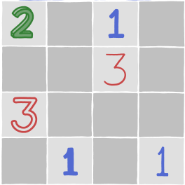
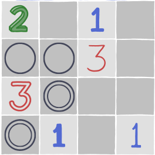
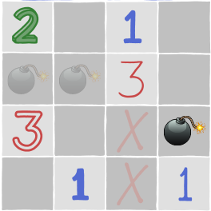

Consegues resolver este mini minesweeper?

===

# Enunciado do problema

O site [xkcd] publicou o cartoon [#2496][source],
que contém um mini jogo de minesweeper,
e é esse o problema com que vamos trabalhar:
vamos encontrar todas as minas na grelha mostrada em cima.

Para quem não conhece as regras do jogo, aqui estão elas:

 - alguns quadrados da grelha contém minas, outros não;
 - os quadrados que não têm minas contém números, e esses números
indicam quantas minas estão na vizinhança do quadrado com o número
(a vizinhança contém os quadrados diretamente adjacentes, bem como os quadrados cujos vértices se tocam na diagonal);
 - os quadrados cinzentos podem conter números ou minas.

Tens de encontrar todas as minas ao raciocinar sobre os números que estão à mostra.

Podes também jogar minesweeper online ou podes jogar o meu [remake do minesweeper][minesweeper-blog].

!!! Pensa um pouco!

Se precisares de clarificar alguma coisa, não hesites em perguntar na secção de comentários em baixo.

# Submissões

Parabéns a todos os que conseguiram resolver o problema e,
em particular, aos que me enviaram as suas soluções:

 - David H., Taiwan;
 - Gerard M., Irlanda;
 - Peter K., Estados Unidos;
 - Rodrigo H. M., México;
 - Rita F., Portugal;

Junta-te à comunidade e envia-me a tua solução por [email]!

# Solução

Vamos tentar encontrar as minas, juntos.

Esta é a grelha com que temos de trabalhar:

Vamos começar por olhar para o canto inferior esquerdo,
onde estão o `3` e o `1`.

O `3` tem quatro quadrados à sua beira:

Os dois quadrados que têm um círculo duplo estão juntos ao `1`,
o que significa que não pode haver minas nesses dois quadrados.
Consequentemente, os dois círculos do topo _têm_ de ter minas.

Já encontrámos duas minas!

O `3` para onde estamos a olhar já tem duas minas colocadas,
só falta encontrar uma.

Independentemente da posição dessa mina
(que será num dos dois círculos duplos),
vai sempre ficar adjacente ao `1` de baixo, à esquerda.
Isso significa que não pode haver _nenhuma_ mina entre os dois `1`
da fila de baixo.

Ao eliminarmos essas duas posições,
fica claro que o `1` de baixo, à direita,
tem uma mina mesmo por cima.

Para o passo seguinte, vamos olhar para o `1` em cima e à direita.
Esse `1` já tem uma mina adjacente (em baixo, à esquerda) o que
significa que já não há outras minas adjacentes a esse `1`.

Ao eliminarmos essas posições,
torna-se claro que o `3` da segunda fila, à direita,
já só tem uma posição livre para a sua terceira mina.
Assim, podemos colocar uma mina aí.

Ao colocarmos esta mina, concluímos o puzzle!
Vê por ti próprio:

Não te esqueças de [subscrever a newsletter][subscribe] para receberes os problemas diretamente na tua caixa de correio.

[email]: mailto:rodrigo@mathspp.com?subject=Resposta%20para%20{{ page.title|regex_replace(['/ /'], ['%20']) }}
[subscribe]: https://mathspp.com/subscribe
[source]: https://xkcd.com/2496/
[xkcd]: https://xkcd.com
[minesweeper-blog]: /blog/minesweeper-remake
