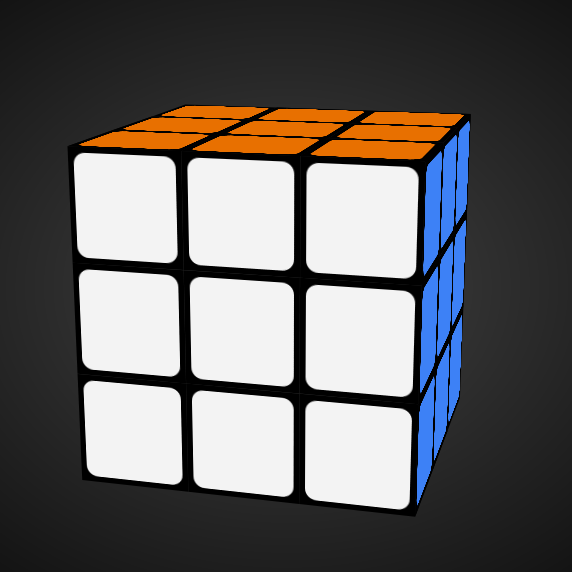
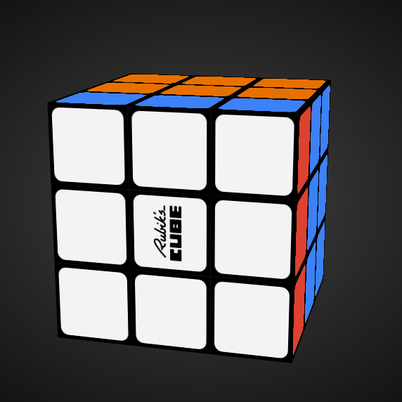
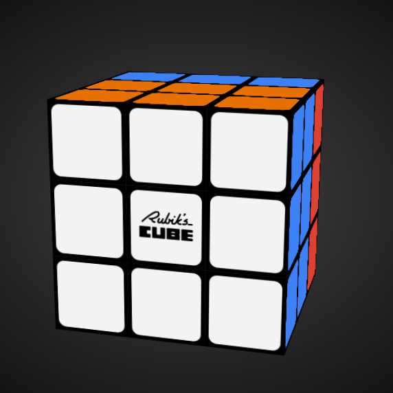
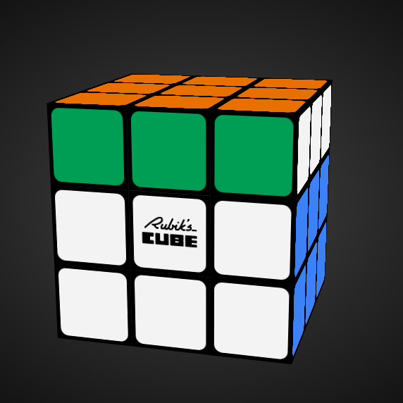
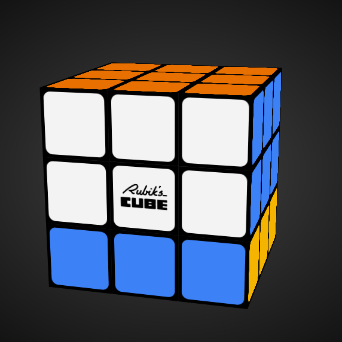

Se eu baralhar um cubo de Rubik tempo suficiente,
será que ele se resolve a si próprio?

===

# Enunciado do problema

Um cubo de Rubik é um brinquedo como o da fotografia em cima.
É um cubo 3 por 3 por 3, em que cada face tem uma de seis cores.
O cubo pode ser baralhado, o que faz com que as faces deixem
de ter uma cor uniforme.

O desafio que tenho para ti envolve provares algo.
Quero que proves a seguinte afirmação:

 > “Se pegares num cubo de Rubik resolvido, e o começares a baralhar,
 seguindo um conjunto fixo de passos repetidamente,
 vais acabar por regressar ao cubo de Rubik resolvido.”

Um exemplo simples de como isto é verdade acontece se rodares só
uma das faces.
Viras uma vez.
Viras a segunda vez.
A terceira.
E quando viras a quarta, o cubo volta à sua posição resolvida.

Mas isto também é verdade para sequências mais complicadas de movimentos.

Se tiveres um cubo de Rubik por perto, pega-lhe e tenta!
(Não é a mesma coisa, mas também podes tentar [neste simulador online][cube-simulator].)

Para tua conveniência, tens aqui um pequeno GIF de mim a baralhar
o cubo, sempre com os mesmos passos.
(Foram 3 minutos na vida real, o GIF está acelerado.)

Comecei com o cubo resolvido e terminei com o cubo resolvido.

Porquê?

!!! Pensa um pouco!

Se precisares de clarificar alguma coisa, não hesites em perguntar na secção de comentários em baixo.

# Submissões

Parabéns a todos os que conseguiram resolver o problema e,
em particular, aos que me enviaram as suas soluções:

 - David H., Taiwan;

Junta-te à comunidade e envia-me a tua solução por [email]!

# Solução

## Solução com teoria de grupos

Se estiveres confortável com conceitos de teoria de grupos,
a prova pode ser escrita de forma sucinta.
Se não sabes do que falo, podes passar à frente esta secção.

Seja $M$ a permutação do cubo de Rubik's que estamos a usar para baralhar o cubo,
e tomemos esta permutação como um elemento do grupo de permutações do cubo.

Para $m$ suficientemente grande, temos que existem duas permutações iguais em

$$M^0, M^1, \cdots, M^m, ~, $$

com $M^n = M^m$, $n < m$.
(Isto decorre do princípio do pombal e do facto de existir apenas um número finito de permutações do cubo.)
Se $M^{-1}$ for a permutação inversa de $M$, então

$$M^m = M^n \iff M^{m-n} = M^0 ~ .$$

Isto mostra que $M^{m - n}$ (com $m - n \geq 0$) é o cubo resolvido.

## Ideia geral da solução com menos matemática

Aqui segue a ideia geral da solução que vamos produzir juntos:

 1. mostramos que, se misturarmos o cubo indefinidamente,
 passamos por uma posição que já vimos antes;
 2. vamos listar todas as posições por que passamos ao baralhar o cubo;
 3. comparamos as duas posições iguas depois de as “desbaralharmos”; e
 4. concluímos que uma posição anterior correspondia ao cubo resolvido.

## Princípio do pombal

Vamos começar pelo início.

Um cubo de Rubik tem imensas posições diferentes, a que chamamos permutações.

Na verdade, um cubo de Rubik tem

 > 43,252,003,274,489,856,000

permutações.
Isto é imenso!

De acordo com um artigo,

 > “para pôr isto em perspetiva, se houvesse um cubo de Rubik para cada permutação possível, podíamos cobrir a superfície da Terra 275 vezes [...]”
 > ― [Cubo de Rubik, Wikipedia][wiki] [traduzido do Inglês]

No entanto, este número gigante é _finito_.
Por outras palavras, independentemente do quão bem baralhares o cubo,
_dado tempo suficiente_, **vais** revisitar uma dada permutação.

Porquê?

Porque só há um número finito de permutações diferentes.

Este argumento é semelhante ao seguinte argumento, que é mais palpável:
se lançares uma moeda ao ar três vezes, uma das faces vai aparecer repetida.

(Este argumento é conhecido como o [princípio do pombal][pigeonhole-principle].)

Agora sabes que, se baralharmos um cubo tempo suficiente,
acabaremos por visitar uma posição que já vimos.

## Notação dos movimentos

Antes de prosseguirmos, preciso de introduzir algo que me vai facilitar a vida,
e que vai fazer com que tenhas mais facilidade em perceber as coisas
de que estou a falar.

Para podermos falar univocamente do que estamos a fazer ao cubo quando o baralhamos,
vamos introduzir uma notação para os movimentos do cubo de Rubik.

Esta notação é apenas uma convenção que as pessoas seguem para falar
de movimentos específicos do cubo de Rubik.
Se conheces esta convenção e sabes o que é que os movimentos
L R F B U D e L' R' F' B' U' D' são, passa esta secção à frente!

Um cubo (de Rubik) tem seis faces.
Se uma delas estiver virada para ti, então podemos referir-nos às faces
pela sua posição relativa:
esqueda, direita, cima, baixo, frente, e trás.

Aqui tens uma imagem de um cubo de Rubik resolvido em que a face da frente é branca,
a face de cima é laranja, e a face da direita é azul:

A notação permite-nos falar de rotações (no sentido dos ponteiros do relógio) das faces ao usarmos a primeira letra do nome da face (em inglês).

Assim, o movimento U (“up”, cima) refere-se a uma rotação da face de cima, pondo o cubo nesta posição:

Rodando a face uma vez (90⁰), podemos ver que a cor da face de trás é amarela!
(Não que seja relevante 😂)

Se nos queremos referir a uma rotação no sentido contrário ao dos ponteiros do relógio, então usamos a mesma letra, mas juntamos-lhe um apóstrofe.
Assim, o movimento U' devolve o cubo à sua posição original/resolvida.

Aqui encontras uma tabela que mostra o que acontece a um cubo resolvido se lhe aplicarmos os 12 movimentos diferentes:

| | X | X' |
| :- | | |
| L (“left”, esquerda) |  |  |
| R (“right”, direita) |  |  |
| F (“front”, frente) |  |  |
| B (“back”, trás) |  |  |
| U (“up”, cima) |  |  |
| D (“down”, baixo) |  |  |

Não precisas de te tornar um mestre a usar esta notação,
só quero que fiques confortável o suficiente com a ideia de representar
movimentos do cubo através de letras do alfabeto.

Se quiseres, podes procurar mais informação sobre esta notação online.

## Movimento para misturar

### $M$

O enunciado do problema diz claramente (e isto é um detalhe importante!)
que o cubo é misturado sempre com a mesma sequência de passos.
Isto deve ser também claro nos GIFs em cima.

Tal como temos a notação para nos referirmos a um único movimento
de uma das faces do cubo,
vamos usar a letra $M$ para nos referirmos ao conjunto de movimentos
que estamos a usar para misturar o cubo, como um todo.

Quero que te abstraias do facto de que $M$ é composto por vários
movimentos mais “pequenos”.
Quero que penses no $M$ como um movimento que transforma o cubo.

### Notação com expoentes

Agora vamos fazer algo com esse $M$.
Vamos usar $M^n$ para dizer, de forma sucinta,
que fizemos o movimento $M$ um total de $n$ vezes.
Assim, $M^5$ é uma maneira curta de escrever $MMMMM$,
que representa o movimento $M$ cinco vezes.

Assim, $M^0$ é o cubo resolvido, porque fizemos o movimento $M$ zero vezes,
ou seja, o cubo ainda não foi misturado.
Aplicando o movimento $M$ uma vez, representamos o cubo por $M^1$.
Aplicando o movimento $M$ 41 vezes, representamos o cubo por $M^{51}$.

Isto está a fazer sentido?
Esta notação é importante para a minha solução!

## Posições iguais

Agora vamos pensar nos diferentes estados do cubo nas seguintes posições:

$$M^0, ~ M^1, ~ M^2, ~ M^3, ~ M^4, \cdots $$

Se listarmos posições suficientes,
vamos encontrar uma posição $M^m$ que será igual a uma outra posição
$M^n$, em que $n < m$.
Por outras palavras, a posição $M^m$ será uma repetição de $M^n$.

Agora vamos focar-nos somente nas posições que vão de $M^0$ a $M^m$,

$$M^0, ~ \cdots, ~ M^n, ~ \cdots, ~ M^m,$$

em que sabemos que $M^n = M^m$.

## Des-misturar

O próximo facto relevante prende-se com o facto de que o movimento $M$
pode ser desfeito se desfizermos os passos individuais.

Em cima, aprendemos a referir-nos a alguns movimentos básicos,
e vimos que alguns movimentos são opostos.
Por exemplo, L e L' são opostos um do outro.

Também podemos pensar numa sequência de movimentos em que vamos desfazendo $M$:

$$M^3 \rightarrow M^2 \rightarrow M^1 \rightarrow M^0 \rightarrow \cdots$$

Da esquerda para a direita, vamos desfazendo $M$, até chegarmos ao ponto de partida, representado por $M^0$.
No entanto, se estivermos com o cubo resolvido, e voltarmos a desfazer o movimento $M$,
onde é que vamos parar..?

Se olharmos para a sequência dos expoentes de $M$,
vemos que o próximo valor lógico será o $-1$:

$$\cdots \rightarrow M^1 \rightarrow M^0 \rightarrow M^{-1} \rightarrow \cdots$$

Assim, vemos que $M^{-1}$ representa o movimento oposto a $M$,
o seu _inverso_.
Tal como $M^3$ significa que fizemos o movimento $M$ três vezes,
$M^{-3}$ significa que fizemos o movimento $M^{-1}$ (o oposto de $M$) três vezes.

Agora, vamos retomar o facto de que há duas posições do cubo que são exatamente iguais, $M^n$ e $M^m$.
É exatamente a mesma posição,
$M^n$ e $M^m$ são apenas nomes diferentes para a mesma coisa.
Portanto, se aplicarmos o mesmo movimento nas duas representações,
obtemos a mesma posição de novo.

## Des-misturar e manipulações algébricas

O que acontece se aplicarmos o movimento $M^{-n}$ às duas representações do cubo?
As duas representações são a mesma antes dessa aplicação,
por isso terão de se manter a mesma depois:

$$M^n = M^m \implies M^n M^{-n} = M^m M^{-n} ~ .$$

O que é que $M^n M^{-n}$ significa?
Significa que aplicámos o movimento $M$ um total de $n$ vezes,
e depois desfizé-mo-lo um total de $n$ vezes...
Fazendo algo que depois é desfeito corresponde a não fazer nada,
pelo que $M^n M^{-n} = M^0$.

Substituindo $M^n M^{-n}$ por $M^0$ em cima, dá

$$M^0 = M^m M^{-n} ~ .$$

Será que também podemos simplificar $M^m M^{-n}$?

(Talvez tenhas reparado que a manipulação dos expoentes que estamos
a fazer corresponde com o que aprendeste a fazer na escola,
quando trabalhavas com números.
Isto não é uma coincidência, há uma relação profunda.)

$M^m M^{-n}$ significa que fazemos o movimento $M$ um total de $m$ vezes,
e depois desfizemo-lo $n$ vezes.
Mas isso corresponde a só ter feito o movimento $M$ um total de $m - n$ vezes, certo?

Por exemplo, $M^5 M^{-3}$ significa que fazemos $M$ cinco vezes, e depois desfazemos $M$ três vezes...
Feitas as contas, isto quer dizer que só fizémos $M$ duas vezes,
já que $5 - 3 = 2$.

Assim, podemos reescrever $M^m M^{-n}$ como $M^{m - n}$,
que pode ser substituído na expressão anterior.

## Eureka!

$$M^0 = M^m M^{-n} \implies M^0 = M^{m - n} ~ .$$

Já está!
É isso!

$M^0$ é a posição original – do cubo resolvido –
e estamos a dizer que $M^{m - n}$ é igual ao cubo resolvido!
Para além disso, $m > n$, portanto a posição $M^{m - n}$ aparece
_algures_ na lista que tínhamos:

$$M^0, ~ \cdots, ~ M^n, ~ \cdots, ~ M^m,$$

Isto mostra que, fazendo $M$ repetidamente,
conseguimos regressar à posição original!

Isto fez sentido?
Vou ser honesto contigo, eu tentei fazer com que esta explicação
fosse compreensível por pessoas curiosas que não têm conhecimentos
de matemática avançada.
Dei o meu melhor, mas pode não ter sido _suficiente_.
Deixa as tuas questões nos comentários e eu darei
o meu melhor para responder!

Não te esqueças de [subscrever a newsletter][subscribe] para receberes os problemas diretamente na tua caixa de correio.

[email]: mailto:rodrigo@mathspp.com?subject=Resposta%20para%20{{ page.title|regex_replace(['/ /'], ['%20']) }}
[subscribe]: /subscribe
[cube-simulator]: https://ruwix.com/online-puzzle-simulators/
