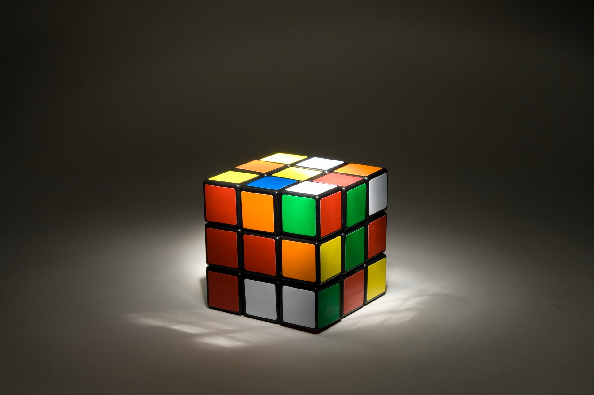

Se eu baralhar um cubo de Rubik tempo suficiente,
será que ele se resolve a si próprio?

===

# Enunciado do problema

Um cubo de Rubik é um brinquedo como o da fotografia em cima.
É um cubo 3 por 3 por 3, em que cada face tem uma de seis cores.
O cubo pode ser baralhado, o que faz com que as faces deixem
de ter uma cor uniforme.

O desafio que tenho para ti envolve provares algo.
Quero que proves a seguinte afirmação:

 > “Se pegares num cubo de Rubik resolvido, e o começares a baralhar,
 seguindo um conjunto fixo de passos repetidamente,
 vais acabar por regressar ao cubo de Rubik resolvido.”

Um exemplo simples de como isto é verdade acontece se rodares só
uma das faces.
Viras uma vez.
Viras a segunda vez.
A terceira.
E quando viras a quarta, o cubo volta à sua posição resolvida.

Mas isto também é verdade para sequências mais complicadas de movimentos.

Se tiveres um cubo de Rubik por perto, pega-lhe e tenta!
(Não é a mesma coisa, mas também podes tentar [neste simulador online][cube-simulator].)

Para tua conveniência, tens aqui um pequeno GIF de mim a baralhar
o cubo, sempre com os mesmos passos.
(Foram 3 minutos na vida real, o GIF está acelerado.)

Comecei com o cubo resolvido e terminei com o cubo resolvido.

Porquê?

!!! Pensa um pouco!

Se precisares de clarificar alguma coisa, não hesites em perguntar na secção de comentários em baixo.

# Submissões

Parabéns a todos os que conseguiram resolver o problema e,
em particular, aos que me enviaram as suas soluções:

 - David H., Taiwan;

Junta-te à comunidade e envia-me a tua solução por [email]!

# Solução

Uma proposta de solução vai ser publicada aqui quando tiverem passado duas semanas desde a publicação deste problema.

Não te esqueças de [subscrever a newsletter][subscribe] para receberes os problemas diretamente na tua caixa de correio.

[email]: mailto:rodrigo@mathspp.com?subject=Resposta%20para%20{{ page.title|regex_replace(['/ /'], ['%20']) }}
[subscribe]: /subscribe
[cube-simulator]: https://ruwix.com/online-puzzle-simulators/
