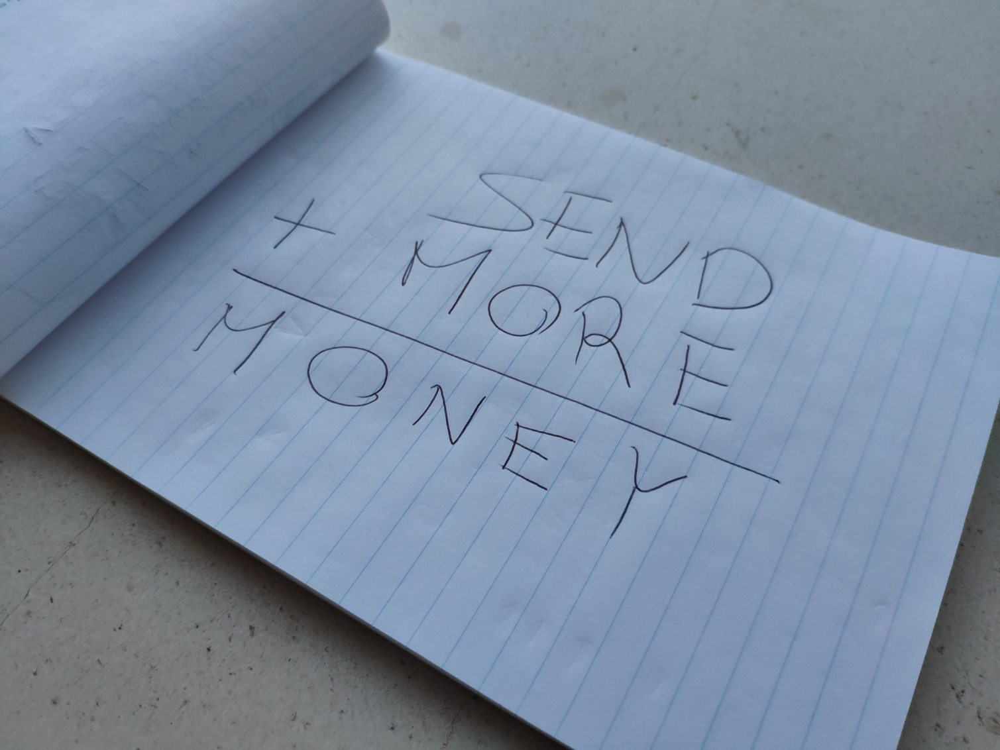

Can you solve this simple-looking arithmetic challenge?

===

# Problem statement

The image above represents an arithmetic calculation:

SEND + MORE = MONEY

Each letter represents a unique digit,
and each word represents a number with as many digits as letters
(there are no leading 0s).

Can you figure out the value of this simple addition?

!!! Give it some thought!

If you need any clarification whatsoever, feel free to ask in the comment section below.

# Solvers

Know how to solve this?
Be the first to join the list of solvers by [emailing me][email] your solution!

<!--
Congratulations to the ones that solved this problem correctly and, in particular, to the ones
who sent me their correct solutions:

 - 

Join the list of solvers by [emailing me][email] your solution!
-->

# Solution

The solution to this problem will be posted here after this problem has been live for 2 weeks.

[Don't forget to subscribe to the newsletter][subscribe] to get bi-weekly
problems sent straight to your inbox.

[email]: mailto:rodrigo@mathspp.com?subject=Solution%20to%20{{ page.title|regex_replace(['/ /'], ['%20']) }}
[subscribe]: /subscribe
