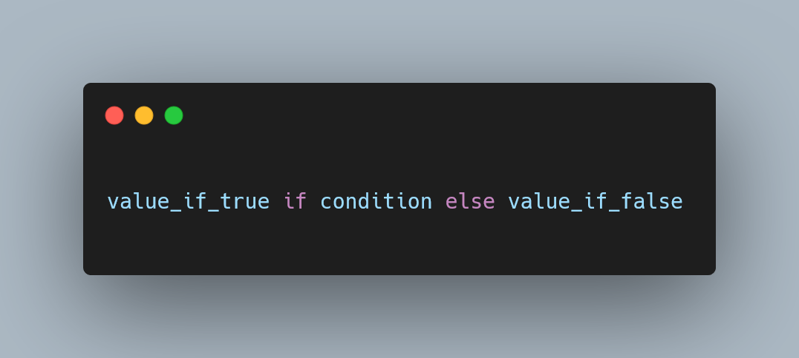

---
metadata:
    description: "This Pydon't will teach you how to use Python's conditional expressions."
title: "Conditional expressions | Pydon't 🐍"
---

This Pydon't will teach you how to use Python's conditional expressions.

===

<script async src="https://platform.twitter.com/widgets.js" charset="utf-8"></script>



(If you are new here and have no idea what a Pydon't is, you may want to read the
[Pydon't Manifesto][manifesto].)


# Introduction

Conditional expressions are what Python has closest to what is called a “ternary operator” in other languages.

In this Pydon't, you will:

 - learn about the syntax of conditional expressions;
 - understand the rationale behind conditional expressions;
 - learn about the precedence of conditional expressions;
 - see how to nest conditional expressions;
 - understand the relationship between `if: ... elif: ... else:` statements and conditional expressions;
 - see good and bad example usages of conditional expressions;

<!--v-->
!!! > You can now get your free copy of the ebook “Pydon'ts – Write beautiful Python code” [on Gumroad][gumroad-pydonts]
!!! > to help support the series of “Pydon't” articles 💪.
<!--^-->


# What is a conditional expression?

A conditional expression in Python is an expression
(in other words, a piece of code that evaluates to a result)
whose value depends on a condition.


## Expressions and statements

To make it clearer, here is an example of a Python expression:

```py
>>> 3 + 4 * 5
23
```

The code `3 + 4 * 5` is an expression, and that expression evaluates to 23.

Some pieces of code are not expressions.
For example, `pass` is not an expression because it does not evaluate to a result.
`pass` is just a statement, it does not “have” or “evaluate to” any result.

This might be odd (or not!) but to help you figure out if something is an expression or not,
try sticking it inside a `print` function.
Expressions can be used inside other expressions, and function calls are expressions.
Therefore, if it can go inside a `print` call, it is an expression:

```py
>>> print(3 + 4 * 5)
23
>>> print(pass)
  File "<stdin>", line 1
    print(pass)
          ^
SyntaxError: invalid syntax
```

The syntactic error here is that the statement `pass` cannot go inside the `print` function,
because the `print` function wants to print _something_,
and `pass` gives nothing.


## Conditions

We are very used to using `if` statements to run pieces of code when certain _conditions_ are met.
Rewording that, a condition can dictate what piece(s) of code run.

In conditional expressions, we will use a condition to change the value to which the expression evaluates.
Wait, isn't this the same as an `if` statement?
No!
Statements and expressions are _not_ the same thing.


## Syntax

Instead of beating around the bush, let me just show you the anatomy of a conditional expression:

```py
expr_if_true if condition else expr_if_false
```

A conditional expression is composed of three sub-expressions and the keywords `if` and `else`.
None of these components are optional.
All of them have to be present.

How does this work?

First, `condition` is evaluated.
Then, depending on whether `condition` evaluates to [Truthy or Falsy][pydont-truthy-falsy],
the expression evaluates `expr_if_true` or `expr_if_false`, respectively.

As you may be guessing from the names,
`expr_if_true` and `expr_if_false` can themselves be expressions.
This means they can be simple literal values like `42` or `"spam"`,
or other “complicated” expressions.

(Heck, the expressions in conditional expressions can even be
_other_ conditional expressions!
Keep reading for that 😉)


## Examples of conditional expressions

Here are a couple of simple examples,
broken down according to the `expr_if_true`, `condition`, and `expr_if_false`
anatomy presented above.

 1.
```py
>>> 42 if True else 0
42
```

| `expr_if_true` | `condition` | `expr_if_false`|
| :- | :- | :- |
| `42` | `True` | `0` |

 2.
```py
>>> 42 if False else 0
0
```

| `expr_if_true` | `condition` | `expr_if_false`|
| :- | :- | :- |
| `42` | `False` | `0` |

 3.
```py
>>> "Mathspp".lower() if pow(3, 27, 10) > 5 else "Oh boy."
'mathspp'
```

| `expr_if_true` | `condition` | `expr_if_false`|
| :- | :- | :- |
| `"Mathspp".lower()` | `pow(3, 27, 10) > 5` | `"Oh boy."` |

For reference:
```py
>>> pow(3, 27, 10)
7
```


## Reading a conditional expression

While the conditional expression presents the operands in an order
that may throw some of you off,
it is easy to read it as an English sentence.

Take this reference conditional expression:

```py
value if condition else other_value
```

Here are two possible English “translations” of the conditional expression:

 > “Evaluate to `value` if `condition` is true, otherwise evaluate to `other_value`.”

or

 > “Give `value` if `condition` is true and `other_value` otherwise.”

With this out of the way, ...

## Does Python have a ternary operator?

Many languages have a ternary operator that looks like `condition ? expr_if_true : expr_if_false`.
Python does not have such a ternary operator, but conditional expressions are similar.

Conditional expressions are similar in that they evaluate one of two values,
but they are syntactically different because they use keywords (instead of `?` and `:`)
and because the order of the operands is different.


# Rationale

The rationale behind conditional expressions is simple to understand:
programmers are often faced with a situation where they have to pick one of two values.

That's just it.

Whenever you find yourself having to choose between one value or another,
typically inside an `if: ... else: ...` block,
that might be a good use-case for a conditional expression.


## Examples with `if` statements

Here are some simple functions that show that:

 1. computing the parity of an integer:

```py
def parity(n):
    if n % 2:
        return "odd"
    else:
        return "even"

>>> parity(15)
"odd"
>>> parity(42)
"even"
```

 2. computing the absolute value of a number (this already exists as a built-in function):

```py
def abs(x):
    if x > 0:
        return x
    else:
        return -x

>>> abs(10)
10
>>> abs(-42)
42
```

These two functions have a structure that is very similar:
they check a condition and return a given value if the condition
evaluates to `True`.
If it doesn't, they return a different value.


## Refactored examples

Can you refactor the functions above to use conditional expressions?
Here is one possible refactoring for each:

```py
def parity(n):
    return "odd" if n % 2 else "even"
```

This function now reads as

 > “return `"odd"` if `n` leaves remainder when divided by `2` and `"even"` otherwise.”

As for the absolute value function,

```py
def abs(n):
    return x if x > 0 else -x
```

it now reads as

 > “return `x` if `x` is positive, otherwise return `-x`.”


# Short-circuiting

You may be familiar with [Boolean short-circuiting][pydont-boolean-short-circuiting],
in which case you might be pleased to know that conditional expressions
also short-circuit.

For those of you who don't know Boolean short-circuiting yet,
I can recommend [my thorough Pydon't article on the subject][pydont-boolean-short-circuiting].
Either way, it's something to understand for our conditional expressions:
a conditional expression will only evaluate what it really has to.

In other words, if your conditional expression looks like

```py
expr_if_true if condition else expr_if_false
```

then only one of `expr_if_true` and `expr_if_false` is ever evaluated.
This might look silly to point out, but is actually quite important.

Some times, we might want to do something (`expr_if_true`)
that _only_ works if a certain condition is met.

For example, say we want to implement the quad-UCS function from [APL].
That function is simple to explain:
it converts integers into characters and characters into integers.
In Python-speak, it just uses `chr` and `ord`,
whatever makes sense on the input.

Here is an example implementation:

```py
def ucs(x):
    if isinstance(x, int):
        return chr(x)
    else:
        return ord(x)

>>> ucs("A")
65
>>> ucs(65)
'A
>>> ucs(102)
'f'
>>> ucs("f")
102
```

What isn't clear from this piece of code is that
`ord` throws an error when called on integers,
and `chr` fails when called on characters:

```py
>>> ord(65)
Traceback (most recent call last):
  File "<stdin>", line 1, in <module>
TypeError: ord() expected string of length 1, but int found

>>> chr("f")
Traceback (most recent call last):
  File "<stdin>", line 1, in <module>
TypeError: an integer is required (got type str)
```

Thankfully, this is not a problem for conditional expressions,
and therefore `ucs` can be implemented with one:

```py
def ucs(x):
    return chr(x) if isinstance(x, int) else ord(x)

>>> ucs("A")
65
>>> ucs(65)
'A
>>> ucs(102)
'f'
>>> ucs("f")
102
```

Therefore, we see that when `x` is an integer, `ord(x)` never runs.
On the flip side, when `x` is _not_ an integer, `chr(x)` never runs.
This is a very useful subtlety!


# Conditional expressions and `if` statements

## Equivalence to `if`

This has been implicit throughout the article,
but I'll write it down explicitly now for the sake of clarity.

(And also because [“Explicit is better than implicit.”][pydont-zen-of-python] 😁!)

There is a close relationship between the conditional expression

```py
name = expr_if_true if condition else expr_if_false
```

and the `if` statement

```py
if condition:
    name = expr_if_true
else:
    name = expr_if_false
```

And that close relationship is that of equivalence.
The two pieces of code are exactly equivalent.


## Equivalence to `if`-`elif`-`else` blocks

Given the equivalence between conditional expressions and `if: ... else: ...` blocks,
it is natural to wonder whether there is some equivalent to the `elif` statement
in conditional expressions as well.

For example, can we rewrite the following function to use a conditional expression?

```py
def sign(x):
    if x == 0:
        return 0
    elif x > 0:
        return 1
    else:
        return -1

>>> sign(-73)
-1
>>> sign(0)
0
>>> sign(42)
1
```

How can we write this as a conditional expression?
Conditional expressions do not allow the usage of the `elif` keyword so,
instead, we start by reworking the `if` block itself:

```py
def sign(x):
    if x == 0:
        return 0
    else:
        if x > 0:
            return 1
        else:
            return -1
```

This isn't a great implementation,
but this intermediate representation makes it clearer that the bottom
of the `if` block can be replaced with a conditional expression:

```py
def sign(x):
    if x == 0:
        return 0
    else:
        return 1 if x > 0 else -1
```

Now, if we abstract away from the fact that the second return value
is a conditional expression itself,
we can rewrite the existing `if` block as a conditional expression:

```py
def sign(x):
    return 0 if x == 0 else (1 if x > 0 else -1)

>>> sign(-73)
-1
>>> sign(0)
0
>>> sign(42)
1
```

This shows that conditional expressions can be nested, naturally.
Now it is just a matter of checking whether the parenthesis are needed or not.

In other words, if we write

```py
A if B else C if D else E
```

does Python interpret it as

```py
(A if B else C) if D else E
```

or does it interpret it as

```py
A if B else (C if D else E)
```

As it turns out, it's the latter.
So, the `sign` function above can be rewritten as

```py
def sign(x):
    return 0 if x == 0 else 1 if x > 0 else -1
```

It's this chain of `if ... else ... if ... else ...` –
that can be arbitrarily long – that emulates `elif`s.

To convert from a long `if` block (with or without `elif`s)
to a conditional expression,
go from top to bottom and interleave values and conditions,
alternating between the keyword `if` and the keyword `else`.

When reading this aloud in English, the word “otherwise” helps clarify
what the longer conditional expressions mean:

```py
return 0 if x == 0 else 1 if x > 0 else -1
```

reads as

 > “return 0 if x is 0, otherwise, return 1 if x is positive otherwise return -1.”

The repetition of the word “otherwise” becomes cumbersome,
a good indicator that it is generally not a good idea to get carried
away and chaining several conditional expressions.

For reference, here's a “side-by-side” comparison of the first conditional block
and the final conditional expression:

```py
# Compare
if x == 0:
    return 0
elif x > 0:
    return 1
else:
    return -1

# to:
return 0 if x == 0 else 1 if x > 0 else -1
```


## Non-equivalence to function wrapper

Because of the equivalence I just showed,
many people may then believe that conditional expressions
could be implemented as a function enclosing the previous `if: ... else: ...` block:

```py
def cond(condition, value_if_true, value_if_false):
    if condition:
        return value_if_true
    else:
        return value_if_false
```

With this definition, we might _think_ we have implemented conditional expressions:

```py
>>> cond(pow(3, 27, 10) > 5, "Mathspp".lower(), "Oh boy.")
'mathspp'
>>> "Mathspp".lower() if pow(3, 27, 10) > 5 else "Oh boy."
'mathspp'
```

In fact, we haven't!
That's because the function call to `cond` only happens
after we have evaluated all the arguments.
This is different from what conditional expressions really do:
as I showed [above](#short-circuiting),
conditional expressions only evaluate the expression they need.

Hence, we can't use this `cond` to implement `ucs`:

```py
def ucs(x):
    return cond(isinstance(x, int), chr(x), ord(x))
```

This code looks sane, but it won't behave like we would like:

```py
>>> ucs(65)
Traceback (most recent call last):
  File "<stdin>", line 1, in <module>
  File "<stdin>", line 2, in ucs
TypeError: ord() expected string of length 1, but int found
```

When given `65`, the first argument evaluates to `True`,
and the second argument evaluates to `"A"`,
but the third argument raises an error!


# Precedence

Conditional expressions are the expressions with lowest precedence,
[according to the documentation][docs-precedence].

This means that sometimes you may need to parenthesise a conditional expression
if you are using it _inside_ another expression.

For example, take a look at this function:

```py
def foo(n, b):
    if b:
        to_add = 10
    else:
        to_add = -10
    return n + to_add

>>> foo(42, True)
52
>>> foo(42, False)
32
```

You might spot the pattern of assigning one of two values,
and decide to use a conditional expression:

```py
def foo(n, b):
    to_add = 10 if b else -10
    return n + to_add

>>> foo(42, True)
52
>>> foo(42, False)
32
```

But then, you decide there is no need to waste a line here,
and you decide to inline the conditional expression
(that is, you put the conditional expression _inside_
the arithmetic expression with `n + `):

```py
def foo(n, b):
    return n + 10 if b else -10
```

By doing this, you suddenly break the function when `b` is `False`:

```py
>>> foo(42, False)
-10
```

That's because the expression

```py
n + 10 if b else -10
```

is seen by Python as

```py
(n + 10) if b else -10
```

while you meant for it to mean

```py
n + (10 if b else -10)
```

In other words, and in not-so-rigourous terms,
the `+` “pulled” the neighbouring `10` and it's the whole
`n + 10` that is seen as the expression to evaluate if the condition
evaluates to Truthy.


# Conditional expressions that evaluate to Booleans

Before showing good usage examples of conditional expressions,
let me just go ahead and show you something you should _avoid_
when using conditional expressions

Conditional expressions are suboptimal when they evaluate to Boolean values.

Here is a silly example:

```py
def is_huge(n):
    return True if n > pow(10, 10) else False
```

Can you see what is wrong with this implementation of `is_huge`?

This function might look really good, because it is short and readable,
and its behaviour is clear:

```py
>>> is_huge(3.1415)
False
>>> is_huge(999)
False
>>> is_huge(73_324_634_325_242)
True
```

However...
The conditional expression isn't doing anything relevant!
The conditional expression just evaluates to the same value as the condition itself!

Take a close look at the function.
If `n > pow(10, 10)` evaluates to `True`, then we return `True`.
If `n > pow(10, 10)` evaluates to `False`, then we return `False`.

Here is a short table summarising this information:

| `n > pow(10, 10)` evaluates to... | We return... |
| :- | :- |
| `True` | `True` |
| `False` | `False` |

So, if the value of `n > pow(10, 10)` is the same as the thing we return,
why don't we _just_ return `n > pow(10, 10)`?
In fact, that's what we should do:

```py
def is_huge(n):
    return n > pow(10, 10)
```

Take this with you:
never use `if: ... else: ...` or conditional expressions to evaluate to/return Boolean values.
Often, it suffices to work with the condition alone.

A related use case where conditional expressions shouldn't be used
is when assigning default values to variables.
Some of these default values can be assigned with [Boolean short-circuiting][pydont-boolean-short-circuiting-defaults], using the `or` operator.


# Examples in code

Here are a couple of examples where conditional expressions shine.

You will notice that these examples aren't particularly complicated
or require much context to understand the mechanics of what is happening.

That's because the rationale behind conditional expressions is simple:
pick between two values.


## The dictionary `.get` method

The [`collections`][collections-chainmap] has a `ChainMap` class.
This can be used to chain several dictionaries together, as I've shown in a tweet in the past:

<blockquote class="twitter-tweet"><p lang="en" dir="ltr">In <a href="https://twitter.com/hashtag/Python?src=hash&amp;ref_src=twsrc%5Etfw">#Python</a>, you can use `collections.ChainMap` to create a larger mapping out of several other maps. Useful, for example, when you want to juxtapose user configurations with default configurations.<br><br>Follow for more <a href="https://twitter.com/hashtag/tips?src=hash&amp;ref_src=twsrc%5Etfw">#tips</a> about Python 🐍<a href="https://twitter.com/hashtag/learnpython?src=hash&amp;ref_src=twsrc%5Etfw">#learnpython</a> <a href="https://twitter.com/hashtag/learncode?src=hash&amp;ref_src=twsrc%5Etfw">#learncode</a> <a href="https://twitter.com/hashtag/100daysofcode?src=hash&amp;ref_src=twsrc%5Etfw">#100daysofcode</a> <a href="https://t.co/ip9IInItYG">pic.twitter.com/ip9IInItYG</a></p>&mdash; Rodrigo 🐍📝 (@mathsppblog) <a href="https://twitter.com/mathsppblog/status/1400764003488571397?ref_src=twsrc%5Etfw">June 4, 2021</a></blockquote>


What's interesting is that `ChainMap` also defines a `.get` method,
much like a dictionary.
The `.get` method tries to retrieve a key and returns a default value if it finds it:

```py
>>> from collections import ChainMap
>>> user_config = {"name": "mathspp"}
>>> default_config = {"name": "<noname>", "fullscreen": True}
# Access a key directly:
>>> config["fullscreen"]
True
# config["darkmode"] would've failed with a KeyError.
>>> config.get("darkmode", False)
False
```

Here is the full implementation of the `.get` method:

```py
# From Lib/collections/__init__.py in Python 3.9.2

class ChainMap(_collections_abc.MutableMapping):
    # ...

    def get(self, key, default=None):
        return self[key] if key in self else default
```

Simple!
Return the value associated with the `key` if `key` is in the dictionary,
otherwise return the default value!
Just that.


## Resolving paths

The module `pathlib` is great when you need to deal with paths.
One of the functionalities provided is the `.resolve` method,
that takes a path and makes it absolute,
getting rid of symlinks along the way:

```py
# Running this from C:/Users/rodri:
>>> Path("..").resolve()
WindowsPath('C:/Users')
# The current working directory is irrelevant here:
>>> Path("C:/Users").resolve()
WindowsPath('C:/Users')
```

Here is part of the code that resolves paths:

```py
# In Lib/pathlib.py from Python 3.9.2

class _PosixFlavour(_Flavour):
    # ...

    def resolve(self, path, strict=False):
        # ...

        base = '' if path.is_absolute() else os.getcwd()
        return _resolve(base, str(path)) or sep
```

As you can see, before calling the auxiliary function `_resolve` and returning,
the function figures out if there is a need to add a base to the path.

If the path I enter is relative, like the `".."` path above,
then the base is set to be the current working directory (`os.getcwd()`).
If the path is absolute, then there is no need for a base,
because it is already there.


# Conclusion

Here's the main takeaway of this Pydon't, for you, on a silver platter:

 > “*Conditional expressions excel at evaluating to one of two distinct values,
 depending on the value of a condition.*”


This Pydon't showed you that:

 - conditional expressions are composed of three sub-expressions interleaved with the `if` and `else` keywords;
 - conditional expressions were created with the intent of providing a convenient way of choosing between two values depending on a condition;
 - conditional expressions can be easily read out as English statements;
 - conditional expressions have the lowest precedence of all Python expressions;
 - short-circuiting ensures conditional expressions only evaluate one of the two “value expressions”;
 - conditional expressions can be chained together to emulate `if: ... elif: ... else: ...` blocks;
 - it is impossible to emulate a conditional expression with a function; and
 - if your conditional expression evaluates to a Boolean, then you should only be working with the condition.

<!-- v -->
If you liked this Pydon't be sure to leave a reaction below and share this with your friends and fellow Pythonistas.
Also, [subscribe to the newsletter][subscribe] so you don't miss
a single Pydon't!
<!-- ^ -->

[subscribe]: https://mathspp.com/subscribe
[manifesto]: /blog/pydonts/pydont-manifesto
[gumroad-pydonts]: https://gum.co/pydonts
[pydont-truthy-falsy]: /blog/pydonts/truthy-falsy-and-bool
[pydont-boolean-short-circuiting]: /blog/pydonts/boolean-short-circuiting
[pydont-boolean-short-circuiting-defaults]: /blog/pydonts/boolean-short-circuiting#define-default-values
[pydont-zen-of-python]: /blog/pydonts/pydont-disrespect-the-zen-of-python
[APL]: https://apl.wiki
[docs-precedence]: https://docs.python.org/3/reference/expressions.html#conditional-expressions
[collections-chainmap]: https://docs.python.org/3/library/collections.html#chainmap-objects
[pathlib-path-resolve]: https://docs.python.org/3/library/pathlib.html#pathlib.Path.resolve
