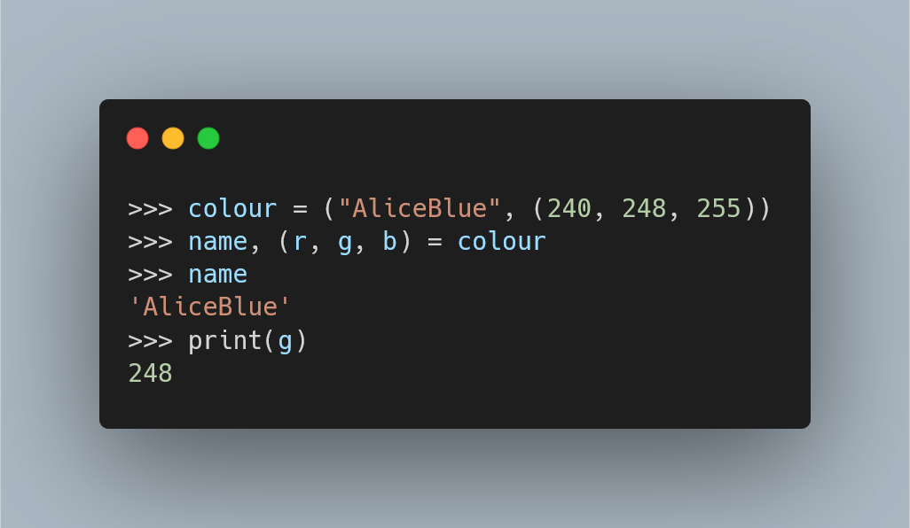

---
metadata:
    description: "Deep unpacking is a feature of Python's assignments that doesn't show up often, but when it does you are glad you know how to use it."
title: "Deep unpacking | Pydon't 🐍"
---

Deep unpacking (or nested unpacking) provides a more powerful way for you to
write assignments in your code.
Deep unpacking can be used to improve the readability of your code and help
protect you against unexpected bugs.
Learning about deep unpacking will also be very important in order to make
the most out of the [structural matching][pep-634] feature that is to be introduced
in Python 3.10.

===



(If you are new here and have no idea what a Pydon't is, you may want to read the
[Pydon't Manifesto][manifesto].)

# Introduction

In this Pydon't we will go over deep unpacking:
 - what it is;
 - how it works;
 - how to use it to improve code readability; and
 - how to use it to help debug your code.

Learning about deep unpacking will be **very** helpful in order to pave the road
for [structural matching][pep-634], a feature to be introduced in Python 3.10.

# Assignments

Before showing you how deep unpacking works,
let's have a quick look at two other nice features about Python's assignments.

## Multiple assignment

In Python, multiple assignment is what allows you to write things like

```py
>>> x = 3
>>> y = "hey"
>>> x, y = y, x    # Multiple assignment to swap variables.
>>> x
'hey'
>>> y
3
```

or

```py
>>> rgb_values = (45, 124, 183)
>>> # Multiple assignment unpacks the tuple.
>>> r, g, b = rgb_values
>>> g
124
```

With multiple assignment you can assign, well, multiple variables at the same time,
provided the right-hand side has as many items as the left-hand side expects.

## Starred assignment

Starred assignment, that I covered in depth in [this Pydon't][pydont-starred-assignment],
allows you to write things like

```py
>>> l = [0, 1, 2, 3, 4]
>>> head, *body = l
>>> print(head)
0
>>> print(body)
[1, 2, 3, 4]
>>> *body, tail = l
>>> print(tail)
4
>>> head, *body, tail = l
>>> print(body)
[1, 2, 3]
```

With starred assignment you can tell Python that you are not sure how many
items the right-hand side will have, but all of them can be stored
in a single place.

## Deep unpacking

Deep unpacking, or nested unpacking, is similar to multiple assignment in a sense.
Multiple assignment allows you to match the length of an iterable,
on the right-hand side of an assignment, and get each element into a variable.
In a similar fashion, deep unpacking allows you to match the *shape* of what
is on the right-hand side of an assignment; in particular, if there are nested
iterables, you can unpack those iterables at once.

For example, using multiple assignment twice in a row, you could do this:

```py
>>> colour_info = ("AliceBlue", (240, 248, 255))
>>> name, rgb_values = colour_info
>>> name
'AliceBlue'
>>> r, g, b = rgb_values
>>> g
248
```

But if you already know you want to get to the separate RGB values,
you could use deep unpacking:

```py
>>> colour_info = ("AliceBlue", (240, 248, 255))
>>> name, (r, g, b) = colour_info
>>> name
'AliceBlue'
>>> g
248
```

Notice how we group the `r`, `g`, and `b` variables with `()` to create a tuple,
mimicking the shape of the `colour_info` variable.
If we had simply written `name, r, g, b = colour_info` then Python would
think we are trying to do multiple assignment, and would expect `colour_info` to
have four items to unpack:

```py
>>> colour_info = ("AliceBlue", (240, 248, 255))
>>> name, r, g, b = colour_info
Traceback (most recent call last):
  File "<stdin>", line 1, in <module>
ValueError: not enough values to unpack (expected 4, got 2)
```

Our use of parentheses in `(r, g, b)` tells Python we actually want to go into
the nested structure of `colour_info`.

This might be clearer if we actually include the outer set of parentheses that
is usually omitted:

```py
>>> colour_info = ("AliceBlue", (240, 248, 255))
>>> (name, (r, g, b)) = colour_info
>>> name
'AliceBlue'
>>> g
248
```

Now if we put the left-hand side of the assignment, `(name, (r, g, b))`,
next to the value it is getting, it becomes very clear what values go where:

```py
>>> (name, (r, g, b)) = ("AliceBlue", (240, 248, 255))
```

!!! Did you know that in Python 2 you could use deep unpacking in function signatures?
!!! For example, this would be valid Python 2 code:
!!! ```py
!!! def print_some_colour_info(name, (r, g, b)):
!!!     print name + " has g value of " + str(g)
!!!
!!! # Prints 'AliceBlue has g value of 248'
!!! print_some_colour_info("AliceBlue", (240, 248, 255))
!!! ```
!!! This was removed with [PEP 3113][pep-3113].


## In loops

Deep unpacking can also be used in the implicit assignments of `for` loops,
it doesn't have to be in explicit assignments with an equals sign!
The examples below will show you that.

Deep unpacking, when used well, can improve the readability of your code –
by removing indexing clutter and by making the intent more explicit –
and can help you test your code for some errors and bugs.

Nothing better than showing you some code, so you can see for yourself.

# Examples in code

## Increasing expressiveness

Given the RGB values of a colour, you can apply a basic formula to convert it to greyscale,
which weighs the R, G, and B components differently.
We could write a function that takes the colour information like we have been using,
and then computes its greyscale value:

```py
def greyscale(colour_info):
    return 0.2126*colour_info[1][0] + 0.7152*colour_info[1][1] + \
            0.0722*colour_info[1][2]
```

(This formula we are using,

\[
    0.2126R + 0.7152G + 0.0722B ~ ,
\]

is usually the first step of a
slightly more involved formula, but it will be good enough for our purposes.)

Now you can use your function:

```py
colour = ("AliceBlue", (240, 248, 255))
print(greyscale(colour))  # prints 246.8046
```

But I think we can all agree that the function definition could surely be improved.
The long formula with the additions and multiplications doesn't look very nice.
In fact, if we use deep unpacking to extract the `r`, `g`, and `b` values,
the formula will be spelled out pretty much like if it were the original
mathematical formula I showed:

```py
def greyscale(colour_info):
    name, (r, g, b) = colour_info
    return 0.2126*r + 0.7152*g + 0.0722*b

colour = ("AliceBlue", (240, 248, 255))
print(greyscale(colour))  # still prints 246.8046
```

Of course, more cunning or suspicious readers might say
“That is all well and good, but you could have just defined the function
to take the separate `r`, `g`, and `b` values as arguments from the get-go.”.
And those people are right!
You could have defined your function to be

```py
def greyscale(r, g, b):
    return 0.2126*r + 0.7152*g + 0.0722*b
```

But sometimes you are writing code that interacts with other people's code,
and sometimes there are already types and formats of data that are in use,
and it is just simpler to adhere to whatever the standards are.

Now imagine that you have a list with some colours and want to compute the greyscales.
You can use deep unpacking in a `for` loop (and in a list comprehension too):

```py
colours = [
    ("AliceBlue", (240, 248, 255)),
    ("Aquamarine", (127, 255, 212)),
    ("DarkCyan", (0, 139, 139)),
]
greyscales = [
    round(0.2126*r + 0.7152*g + 0.0722*b, 2)
    for name, (r, g, b) in colours
]
print(greyscales)  # [246.8, 224.68, 109.45]
```

## Catching bugs

I said earlier that deep unpacking can also help you find bugs in your code.
It is not hard to believe that the `colours` list of the previous example
could have come from some other function, for example a function that
scrapes the webpage I have been checking, and creates those tuples
with colour information.

Let us pretend for a second that my web scraper isn't working 100%
well yet, and so it ended up producing the following list,
where it read the RGB values of two colours into the same one:

```py
colours = [
    ("AliceBlue", (240, 248, 255, 127, 255, 212)),
    ("DarkCyan", (0, 139, 139)),
]
```

If we were to apply the original `greyscale` function to `colours[0]`,
the function would just work:

```py
def greyscale(colour_info):
    return 0.2126*colour_info[1][0] + 0.7152*colour_info[1][1] + \
            0.0722*colour_info[1][2]

colours = [
    ("AliceBlue", (240, 248, 255, 127, 255, 212)),
    ("DarkCyan", (0, 139, 139)),
]

print(greyscale(colours[0]))  # 246.8046
```

_However_, if you were to use the function that uses deep unpacking,
then this would happen:

```py
def greyscale(colour_info):
    name, (r, g, b) = colour_info
    return 0.2126*r + 0.7152*g + 0.0722*b

colours = [
    ("AliceBlue", (240, 248, 255, 127, 255, 212)),
    ("DarkCyan", (0, 139, 139)),
]

# raises a ValueError: too many values to unpack (expected 3)
print(greyscale(colours[0]))
```

Deep unpacking expects the shapes to be correct, and so the part `(r, g, b)`
tells Python it expects a nested iterable with three elements, but all of a sudden
Python tries to give it six numbers and it complains!
Hitting this error, you would realise something is weird in your code and eventually
you will find the bug!

All in all, deep unpacking (or the chance to use it) isn't something you come across
very often, but when you do, it is nice knowing how to use it to your advantage.

# Conclusion

Here's the main takeaway of this article, for you, on a silver platter:

 > “Use deep unpacking to improve readability and to keep the shape
 of your variables in check.”

This Pydon't showed you that:

 - Python's assignments have plenty of interesting features;
 - deep unpacking can prevent cluttering your code with hardcoded indexing;
 - deep unpacking improves the readability of your code; and
 - some bugs related to iterable shape can be caught if using deep unpacking.

If you liked this Pydon't be sure to leave a reaction below and share this with your friends and fellow Pythonistas.

Also, [don't forget to subscribe to the newsletter][subscribe] so you don't miss
a single Pydon't!

# References

 - PEP 634 -- Structural Pattern Matching: Specification, [https://www.python.org/dev/peps/pep-0634/][pep-634];
 - PEP 3113 -- Removal of Tuple Parameter Unpacking, [https://www.python.org/dev/peps/pep-3113/][pep-3113];
 - Multiple assignment and tuple unpacking improve Python code readability, [https://treyhunner.com/2018/03/tuple-unpacking-improves-python-code-readability/#Using_a_list-like_syntax](https://treyhunner.com/2018/03/tuple-unpacking-improves-python-code-readability/#Using_a_list-like_syntax);
 - Unpacking Nested Data Structures in Python, [https://dbader.org/blog/python-nested-unpacking](https://dbader.org/blog/python-nested-unpacking);
 - W3Schools, HTML Color Names, [https://www.w3schools.com/colors/colors_names.asp](https://www.w3schools.com/colors/colors_names.asp);
 - Wikipedia, Grayscale, Converting color to grayscale, [https://en.wikipedia.org/wiki/Grayscale#Converting_color_to_grayscale](https://en.wikipedia.org/wiki/Grayscale#Converting_color_to_grayscale).

Online references last consulted on the 23rd of February of 2021.

[subscribe]: https://mathspp.com/subscribe
[manifesto]: /blog/pydonts/pydont-manifesto
[pydont-starred-assignment]: /blog/pydonts/unpacking-with-starred-assignments
[pep-634]: https://www.python.org/dev/peps/pep-0634/
[pep-3113]: https://www.python.org/dev/peps/pep-3113/
