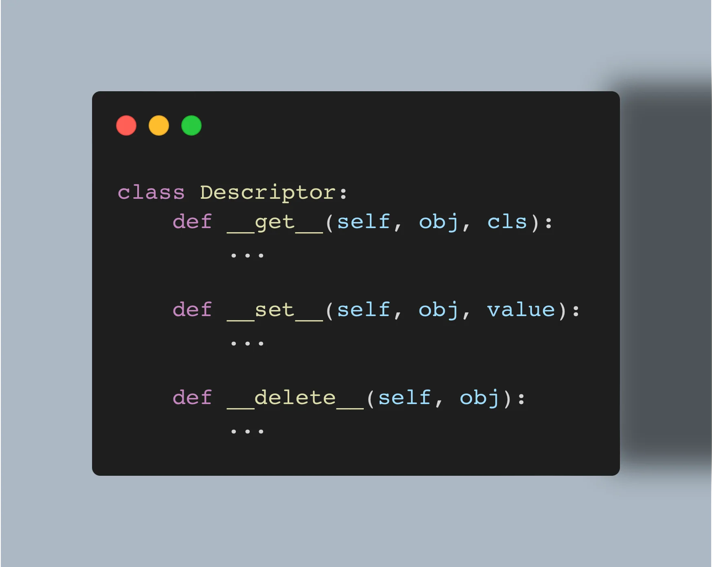

Descriptors are not black magic and this article will show you that.
In fact, you use descriptors every day and you don't even know it.

===



(If you are new here and have no idea what a Pydon't is, you may want to read the
[Pydon't Manifesto][manifesto].)


# Introduction

Descriptors are a piece of the Python world that many will declare as “obscure”, “dark magic”, or “too complex to bother learning”.
I will show you that this is _not_ true.

While we can all agree that descriptors do not belong in an introductory course to Python, descriptors are far from black magic and with a couple of good examples you can understand how they work and what they are useful for.

In this Pydon't, you will

 - see what a descriptor is;
 - learn how to implement your own descriptors;
 - read about descriptor-related [dunder methods][dunder-methods];
 - learn about the descriptor protocol:
   - `__get__`;
   - `__set__`; and
   - `__delete__`.
 - see how to use `__set_name__` with descriptors;
 - understand that descriptors play a key part in the way Python works, for example in:
   - methods;
   - the built-in `property`;
   - the built-in `staticmethod`; and
   - the built-in `classmethod`.
 - be mind blown by the fact that you use descriptors every day (spoiler: functions _are_ descriptors!);
 - study some common use cases for descriptors; and
 - solve some exercises and challenges to practise.


<!--v-->
!!! You can now get your free copy of the ebook “Pydon'ts – Write elegant Python code” [on Gumroad][gumroad-pydonts]
!!! to help support the series of “Pydon't” articles 💪.
<!--^-->


# The problem that descriptors solve

Consider the implementation of the class `Colour` below, which contains a `hex` attribute for the hexadecimal representation of the colour:

```py
class Colour:
    def __init__(self, hex):
        self.hex = hex
```

This class doesn't do much (at least, for now...):

```pycon
>>> colour = Colour("#f8f8f2")
>>> colour.hex
'#f8f8f2'
```

Now, suppose that you want to add the attributes `r`, `g`, and `b`, respectively for the red, green, and blue, components of the colour.
These attributes depend on the value of the hexadecimal representation of the colour, and you [know all about properties][properties-pydont], so you understand that defining three properties is the way to go, here:

```py
class Colour:
    def __init__(self, hex_string):
        self.hex = hex_string

    @property
    def r(self):
        return int(self.hex[1:3], 16)

    @property
    def g(self):
        return int(self.hex[3:5], 16)

    @property
    def b(self):
        return int(self.hex[5:7], 16)
```

This works as expected:

```py
>>> red = Colour("#ff0000")
>>> red.r
255
>>> red.g, red.b
(0, 0)
```

If you have an attentive eye, you will notice that the three properties are pretty much the same.
The only difference lies in the indices you use when slicing the parameter `hex`.

Descriptors, like properties, let you customise attribute lookup.
However, descriptors give you _more_ freedom because you implement a descriptor as a class.
This is different from properties that are usually implemented via their getter, setter, and deleter methods.

Later, you will understand that descriptors give you more freedom because properties _are_ a specific descriptor.
In a way, properties provide a type of descriptor blueprint for you to fill in, saving you some work.

By using a class, we can write a single descriptor that we can use for the attributes `r`, `g`, and `b` of the class `Colour`.
Let us see how.


# Your first descriptor

## What is a descriptor?

Strictly speaking, a descriptor is a class that follows the [descriptor protocol](#descriptor-protocol).
In practical terms, a descriptor is a class that you can use to customise attribute access, setting attributes, and other related things.


## Implementing a descriptor

Let me show you the code for your very first descriptor, the `ColourComponent` descriptor for the example above, and then I will explain what is going on:

```py
class ColourComponent:
    def __init__(self, start, end):
        self.start = start
        self.end = end

    def __get__(self, obj, _):
        return int(obj.hex[self.start : self.end], 16)


class Colour:
    r = ColourComponent(1, 3)
    g = ColourComponent(3, 5)
    b = ColourComponent(5, 7)

    def __init__(self, hex):
        self.hex = hex
```

As magic as this may look, it works:

```pycon
>>> red = Colour("#ff0000")
>>> red.r
255
>>> red.g, red.b
(0, 0)
```

So, what is going on?

`ColourComponent` is our descriptor class and its first lines of code should look familiar to you:

```py
class ColourComponent:
    def __init__(self, start, end):
        self.start = start
        self.end = end
```

This is standard and common Python code that initialises a class with two attributes:

```pycon
>>> cc = ColourComponent(1, 3)
>>> cc.start
1
>>> cc.end
3
```

What is interesting is what happens next.
Notice that we also define a [dunder method][dunder-methods] `__get__`:

```py
class ColourComponent:
    def __init__(self, start, end):
        self.start = start
        self.end = end

    def __get__(self, obj, cls):
        return int(obj.hex[self.start : self.end], 16)
```

This dunder method is called _automatically_ by Python when the class `ColourComponent` is assigned to an attribute.

So, the code below sets the attribute `r` to the descriptor instance `ColourComponent(1, 3)`:

```py
class Colour:
    r = ColourComponent(1, 3)
    ...
```

Now, I can talk about “the descriptor `ColourComponent`” because `ColourComponent` implements the dunder method `__get__`.
It is because of that method that `ColourComponent` is a descriptor.

Later, whenever I access the attribute `r` in a colour instance, Python will see that `r` is a `ColourComponent` descriptor with the method `__get__` and it will call that method `__get__` to fetch the actual value.
This call to `__get__` happens under the hood, automatically.

This shows that the essence of descriptors, and the essence of the dunder method `__get__`, is to turn attribute access into a function call.
This function call gives you all the freedom in the world to do whatever you want before returning the actual value of the attribute.


## Dunder method `__get__`

We have already seen that the dunder method `__get__` is called automatically by Python when the attribute is accessed.
That's because the responsibility of the method `__get__` _is_ to compute and return the _value_ of the attribute.

Of course, this method `__get__` doesn't _need_ to do much.
For example, the method `__get__` can simply return a fixed value:

```py
class GlorifiedAttribute:
    def __get__(self, obj, cls):
        return 73


class Person:
    age = GlorifiedAttribute()

    def __init__(self, name):
        self.name = name
```

Now, whenever you create a `Person` instance, their age will always be `73`:

```pycon
>>> john = Person("John Doe")
>>> john.name
'John Doe'
>>> john.age
73
```

Of course, having a descriptor like `GlorifiedAttribute` isn't useful.
The point of the method `__get__` is to _do_ useful things.
To do that, usually, the descriptor needs to know what was the original object that owned the descriptor.

To solve this issue, Python calls the dunder method `__get__` with two arguments:
 - `obj` is the original object that had one of its attributes accessed; and
 - `cls` is the type of the object passed in.

In other places, you may find `__get__` defined as `__get__(self, obj, objtype)` or `__get__(self, instance, owner)`, or other variations of these.
That is fine.
You can pick whatever names you want for your parameters; the name of the parameter will not change _what_ Python puts there for you.

Most of the time, you will use `obj` directly, for example to access other attributes on the object.
(In our example, we need `obj` to find the original hexadecimal representation of the colour we are working with.)
Let us change `ColourComponent` to print the arguments when the method `__get__` is called:

```py
class ColourComponent:
    def __init__(self, start, end):
        self.start = start
        self.end = end

    def __get__(self, obj, cls):
        print(f"Inside __get__ {obj} {cls}")
        return int(obj.hex[self.start : self.end], 16)

class Colour:
    ...
```

Now you can see that `__get__` is being called when you access the `r`, `g`, and `b`, attributes:

```pycon
>>> red = Colour("#ff0000")
>>> red.r
Inside __get__ <__main__.Colour object at 0x105171d50> <class '__main__.Colour'>
255
>>> red.g
Inside __get__ <__main__.Colour object at 0x105171d50> <class '__main__.Colour'>
0
>>> red.b
Inside __get__ <__main__.Colour object at 0x105171d50> <class '__main__.Colour'>
0
```

Now you know that it is via the arguments `obj` and `cls` that the dunder method `__get__` gets access to the original object.
There is a limitation, however, and I will put that limitation in evidence by giving you an exercise.


# Accessing the name of the original attribute

## Using a descriptor to implement getters for private attributes

Consider the class `Person` that follows:

```py
class Person:
    def __init__(self, first, last):
        self._first = first
        self._last = last

    @property
    def first(self):
        return self._first

    @property
    def last(self):
        return self._last
```

Notice how we defined two properties to provide getter methods for the two private attributes `_first` and `_last`.
This makes it so that the attributes `first` and `last` of a `Person` object cannot be modified accidentally.

But do we really need to go over all this trouble for such a simple piece of functionality?
We just want to create a layer of protection for our attributes.
What if we want to do this for many more attributes?

Let us use a descriptor to make this simpler:

```py
class PrivateAttrGetter:
    def __get__(self, obj, cls):
        return obj.___  # <- What do we put here?

class Person:
    first = PrivateAttrGetter()
    last = PrivateAttrGetter()

    def __init__(self, first, last):
        self._first = first
        self._last = last
```

This is the skeleton for our code, but how do we implement `__get__` so that we know exactly what private attribute to access?
In `ColourComponent` we did not have this issue because all we needed was the hexadecimal representation of the colour, which was stored in `hex`.
Here, we need to access a private attribute whose name depends on the attribute that is set to the descriptor itself!
So, how can the descriptor know whether we are trying to access `first` or `last`?


## The dunder method `__set_name__`

### How does the dunder method `__set_name__` work?

When a descriptor is first created and assigned to an attribute, Python will try to call a dunder method called `__set_name__` whose sole purpose is to tell the descriptor what is its name in the original object.

For example, in the code below, the first instance of the `PrivateAttrGetter` descriptor will receive the name `"first"` and the second instance of the `PrivateAttrGetter` descriptor will receive the name `"last"`.

Here is how you use the dunder method `__set_name__` to fix the descriptor `PrivateAttrGetter`:

```py
class PrivateAttrGetter:
    def __set_name__(self, owner, name):
        print(f"Inside __set_name__ with {owner} and {name!r}.")
        self.private_attribute_name = f"_{name}"

    def __get__(self, obj, cls):
        print(f"Inside __get__ and going to access {self.private_attribute_name}.")
        return getattr(obj, self.private_attribute_name)

class Person:
    first = PrivateAttrGetter()  # This will call __set_name__ with name = "first"
    last = PrivateAttrGetter()   # This will call __set_name__ with name =  "last"

    def __init__(self, first, last):
        self._first = first
        self._last = last
```

Now, we can use this with the class `Person` to access the attributes `first` and `last`:

```pycon
Inside __set_name__ with <class '__main__.Person'> and 'first'.
Inside __set_name__ with <class '__main__.Person'> and 'last'.
>>> john = Person("John", "Doe")
>>> john.first
Inside __get__ and going to access _first.
'John'
>>> john.last
Inside __get__ and going to access _last.
'Doe'
```

As you can see, the dunder method `__set_name__` is responsible for much of the flexibility that descriptors enjoy.
It is common for a descriptor to have a dunder method `__set_name__` that stores the original `name` argument and also computes one or more auxiliary names for related attributes that the original owner also contains.


### The built-ins `getattr`, `setattr`, and `delattr`

When using `__set_name__`, you will likely have to use the built-ins `getattr` (seen above), `setattr`, and `delattr`.
In the example above, we already used `getattr`.
So, what do these three functions do?

The three built-ins `getattr`, `setattr`, and `delattr`, allow you to dynamically get, set, and delete, – respectively – attributes on an object.

Let me show you:

```pycon
>>> class C:
...     value = 73
...
>>> my_object = C()

>>> getattr(my_object, "value")
73

>>> setattr(my_object, "other_value", 42)
>>> my_object.other_value
42
>>> getattr(my_object, "other_value")
42

>>> delattr(my_object, "value")
>>> vars(my_object)
{'other_value': 42}
>>> my_object.value
AttributeError: ...
```

So, in essence, these methods are used for the usual attribute operations, but they come in handy when you have the name of the attribute as a _string_!

 - `getattr(obj, "attr")` is the same as `obj.attr`;
 - `setattr(obj, "attr", value)` is the same as `obj.attr = value`; and
 - `delattr(obj, "attr")` is the same as `del obj.attr`.


### `__set_name__` and descriptors created after class initialisation

The method `__set_name__` is called automatically as a step of class initialisation.
That is, it is when the class `Person` above is being created that Python looks at `first` and `last`, sees they are instances of `PrivateAttrGetter`, and decides to call their methods `__set_name__`.

If you instantiate and assign a descriptor after the fact, `__set_name__` does not get called for you:

```py
class Person:
    def __init__(self, first):
        self._first = first

Person.first = PrivateAttrGetter()
print(Person("John").first)
# AttributeError: 'PrivateAttrGetter' object has no attribute 'private_attribute_name'
```

If you create a descriptor after the fact, like this, you need to call `__set_name__` manually.
To be able to do that, you need to know how to [access the descriptor object](#accessing-the-descriptor-objects), which you'll learn in a later section.


### `__set_name__` isn't a descriptor thing

The final thing to know about the dunder method `__set_name__` is that it is not exclusively a descriptor thing.
If you have any other class that implements the dunder method `__set_name__`, it will be called when you assign it to a class variable:

```py
class Test:
    def __set_name__(self, obj, name):
        print("Ahhh, inside Test.__set_name__.")

class MyClass:
    test = Test()

# Ahhh, inside Test.__set_name__.
```


# Descriptor exercises

Before we proceed, let me share a couple of challenges where the objective is for you to implement descriptors.


## Name descriptor for a class `Person`

Consider yet another implementation of a class `Person`:

```py
class Person:
    name = NameDescriptor()

    def __init__(self, first, last):
        self.first = first
        self.last = last

john = Person("John", "Doe")
print(john.name)  # John Doe
john.last = "Smith"
print(john.name)  # John Smith
```

Implement the descriptor `NameDescriptor` so that the attribute `name` returns the first and last names of the person, separated by a space.
For comparison, try doing the same thing [with the built-in `property`][properties-pydont].


## Filesystem directory inspection

Consider the class `Directory` below that contains an attribute called `nfiles`.
Implement the descriptor `NFilesDescriptor` that accesses the attribute `path` and determines how many files the directory pointed to by `path` contains:

```py
import pathlib  # You may want to use this to help you out.

class Directory:
    nfiles = NFilesDescriptor()

    def __init__(self, path):
        self.path = path

home = Directory(pathlib.Path("/"))
print(home.nfiles)  # Some integer here, for me it was 19.
```

For comparison, try doing the same thing [with the built-in `property`][properties-pydont].


## Attribute access counter

Implement a descriptor `AttributeAccessCounter` that has an internal counter that keeps track of how many times each attribute has been accessed.
(You can print the counter every time the attribute is accessed, for example.)
Then, fetch the actual attribute value from the private attribute with the same name.
(For example, the value of `name` is in `_name` and the value of `hex` is in `_hex`.)

Use these two classes to test your descriptor:

```py
class Person:
    first = AttributeAccessCounter()
    last = AttributeAccessCounter()

    def __init__(self, first, last):
        self._first = first
        self._last = last

john = Person("John", "Doe")
print(john.first)  # Counter at 1.
print(john.last)   # Counter at 1.
print(john.first)  # Counter at 2.
```

```py
class Colour:
    hex = AttributeAccessCounter()
    r = ColourComponent(1, 3)  # ColourComponent is the descriptor from above.
    g = ColourComponent(3, 5)
    b = ColourComponent(5, 7)

    def __init__(self, hex):
        self._hex = hex

red = Colour("#ff0000")
print(red.r, red.g, red.b)
print("---")
print(red.hex)  # Counter should be at 4 here.
```


# Descriptor protocol

## What is the descriptor protocol?

The descriptor protocol is what Python uses to determine if a class is actually a descriptor.
If your class implements _any_ of the dunder methods `__get__`, `__set__`, or `__delete__`, then it abides by the descriptor protocol and it is a descriptor.

The descriptor protocol is what Python uses to distinguish a regular class attribute assignment from the creation of a descriptor.

The dunder method `__get__` is part of the descriptor protocol and [we already covered it](#dunder-method-__get__) in a previous section.
We will talk about the methods `__set__` and `__delete__` now.


## `__set_name__` is not part of the descriptor protocol

The dunder method `__set_name__` is _not_ part of the descriptor protocol, which means that having the dunder method `__set_name__` does not make it a descriptor.

In other words, [`__set_name__` is not a descriptor thing](#__set_name__-isnt-a-descriptor-thing), it's just a convenience method used with descriptors.


## A quick tangent about properties

I am not sure if you figured this out already, but have you noticed how the three dunder methods that make up the descriptor protocol match the three methods you can implement in a property?

 1. The built-in `property` is generally used as a decorator around the getter method and there is also a decorator `@xxx.getter` to be used with the getter method.
 2. The decorator `@xxx.setter` is used around the setter method.
 3. The decorator `@xxx.deleter` is used around the deleter method.

It is _not_ a coincidence that there is this relationship and by the end of this Pydon't you will understand even better where this comes from.


# The dunder method `__set__`

So far, we have seen how descriptors let you access data, but descriptors can also be used to set data.
In order to do this, your descriptor needs to implement the dunder method `__set__`.


## What is the dunder method `__set__`?

If an attribute `obj.x` is a descriptor, writing `obj.x = value` will try to call the dunder method `__set__` on the descriptor.
The dunder method `__set__` is then responsible for doing whatever is needed to save the new value.


## Descriptor `__set__` example

As an example of how the dunder method `__set__` might work, let us go back to our `Colour` example:

```py
class ColourComponent:
    def __init__(self, start, end):
        self.start = start
        self.end = end

    def __get__(self, obj, cls):
        print(f"Inside __get__ {obj} {cls}")
        return int(obj.hex[self.start : self.end], 16)

class Colour:
    r = ColourComponent(1, 3)
    g = ColourComponent(3, 5)
    b = ColourComponent(5, 7)

    def __init__(self, hex):
        self.hex = hex
```

We want to modify the descriptor `ColourComponent` so that we can set the components `r`, `g`, and `b`, directly.
To allow this, the attribute `hex` of the colour must be updated with the hexadecimal representation of the value we set.

In short, we want to enable this behaviour:

```pycon
>>> colour = Colour("#ff0000")  # red
>>> colour.r = 0
>>> colour.g = 255
>>> colour.hex  # green
'#00ff00'
```

This is one possible implementation for the dunder method `__set__` in `ColourComponent`:

```py
class ColourComponent:
    ...

    def __set__(self, obj, value):
        component_hex = f"{value:02X}"
        obj.hex = obj.hex[: self.start] + component_hex + obj.hex[self.end :]
```

We use `f"{value:02X}"` to convert the integer value into a hexadecimal number (with the format specifier `X`).
Furthermore, that hexadecimal value is aligned inside a field of length `2` with leading zeroes `0`.


## `__set__` and `__set_name__`

The example descriptor `ColourComponent` knew that it had to access the attribute `hex` of the original `Colour` object, regardless of whether we were setting the attribute `r`, `g`, or `b`.

In other cases, you will need to know the original attribute you are trying to set, so that the descriptor can access the correct (private) attribute(s) of the original object.
In that case, don't forget to implement the dunder method `__set_name__`.

We will see an example of this now.


## Keeping an attribute value history with a descriptor

In this subsection we will see a more advanced example of a descriptor that uses `__get__`, `__set__`, and `__set_name__`, to add a value history to attributes.
With our descriptor, we will be able to get and set the value of our attribute, but also check its past values and undo a change.

This is what it will look like:

```pycon
c = C()
c.x = 1
c.x = 2
c.x = 73
print(c.x.value)    # 73
print(c.x.history)  # [1, 2]
c.x.undo()
print(c.x.value)    # 2
print(c.x.history)  # [1]
```

First, we determine that for an attribute `x`, we are going to store the current value in the attribute `_x` and the history of that value in the attribute `_x_history`.
For us to be able to do this, we need to save the name of the attribute that was assigned the descriptor.
We do this with `__set_name__`:

```py
class KeepHistory:
    def __set_name__(self, owner, name):
        self.private_name = f"_{name}"
        self.history_name = f"_{name}_history"
```

Now, when we set the attribute, we first store the old value in the attribute value history, and only then do we assign the new value to the private attribute:

```py
class KeepHistory:
    ...

    def __set__(self, obj, value):
        history = getattr(obj, self.history_name, [])
        sentinel = object()
        old_value = getattr(obj, self.private_name, sentinel)
        if old_value is not sentinel:
            history.append(old_value)
        setattr(obj, self.private_name, value)
        setattr(obj, self.history_name, history)
```

Notice that we use a default `sentinel = object()` because using another default like `None` would not let us distinguish our default value from the cases where the attribute is actually set to `None`.

Now that we can set the attribute, what is left is being able to get the attribute.
We cannot simply return the attribute value because the value in itself does not know how to retrieve its history or how to undo its last change.
Instead, we need to wrap the result in another class that provides that functionality.
In the code below, we wrap the result in an instance of `ValueWithHistory`, which already allows one to access the current value and the history of the value:


```py
class KeepHistory:
    ...

    class ValueWithHistory:
        def __init__(self, value, history):
            self.value = value
            self.history = history

    def __get__(self, obj, cls):
        value = getattr(obj, self.private_name)
        history = getattr(obj, self.history_name, [])
        return self.ValueWithHistory(value, history)
```

This means we can already use this descriptor:

```py
class C:
    x = KeepHistory()

c = C()
c.x = 1
c.x = 2
c.x = 73
print(c.x.value)    # 73
print(c.x.history)  # [1, 2]
```

To implement the “undo” functionality, we will add an `undo` method to the class `ValueWithHistory`.
Calling `undo` should pop the last value from the history and assign it to the private attribute.

Right now, the class `ValueWithHistory` that we return from the descriptor method `KeepHistory.__get__` only has a reference to the attribute value and to the attribute history, so we need to hook the `ValueWithHistory` to the descriptor in some way.
For example, we could define a method `undo` on the descriptor and then assign that same method to the instance of `ValueWithHistory` that we return.

Here is an example implementation of this behaviour:

```py
from functools import partial

class KeepHistory:
    class ValueWithHistory:
        def __init__(self, value, history, undo_method):
            self.value = value
            self.history = history
            self.undo = undo_method

    def __get__(self, obj, cls):
        value = getattr(obj, self.private_name)
        history = getattr(obj, self.history_name, [])
        return self.ValueWithHistory(
            value,
            history,
            partial(self.undo, obj),  # This was not here.
        )

    def undo(self, obj):
        history = getattr(obj, self.history_name, [])
        if not history:
            raise RuntimeError("Can't undo value change with empty history.")
        setattr(obj, self.private_name, history.pop())
        setattr(obj, self.history_name, history)

c = C()
c.x = 1
c.x = 2
c.x = 73
print(c.x.value)    # 73
print(c.x.history)  # [1, 2]
c.x.undo()
print(c.x.value)    # 2
print(c.x.history)  # [1]
```

We define the method `undo` inside the descriptor so that it has access to the descriptor via the `self` argument, which gives us access to the names `private_name` and `history_name`.
Then, inside `__get__` we use `functools.partial` to bind the object that owns the descriptor to the method `undo` so that `undo` can be called directly with `obj.attr.undo()` or, in our example, `c.x.undo()`.


## Dunder method `__set__` challenge

Above, you implemented a descriptor `AttributeAccessCounter`.
Now, modify it so that you also count how many times the attribute is set.
Make two versions for this:

 1. count the number of assignments together with the number of accesses; and
 2. count the number of assignments separately from the number of accesses.


# Accessing the descriptor objects

Here is a very dumb descriptor example that doesn't do much:

```py
import random

class Descriptor:
    def __init__(self):
        self.value = random.randint(1, 10)

    def __get__(self, obj, cls):
        return 42

class MyClass:
    x = Descriptor()
```

Notice that the descriptor `Descriptor` is being assigned to the _class_ variable `x`.
So, if we type `MyClass.x`, can we get hold of the actual descriptor object?
As it turns out, we can't:

```pycon
>>> MyClass.x
4
```

When we access the attribute from the class, the descriptor is still fired.
In this case, when we access an attribute from the class, the dunder method `__get__` gets a `None` as its second parameter (`obj`).

Let me change the implementation of `Descriptor` to show you this:

```py
import random

class Descriptor:
    def __init__(self):
        self.value = random.randint(1, 10)

    def __get__(self, obj, cls):
        print(f"In __get__ with {obj} and {cls}")
        return self.value

class MyClass:
    x = Descriptor()
```

Now, let us play with this:

```pycon
>>> c = MyClass()
>>> c.x
In __get__ with <__main__.MyClass object ...> and <class '__main__.MyClass'>
8
>>> MyClass.x
In __get__ with None and <class '__main__.MyClass'>
8
```

Notice that both `c.x` and `MyClass.x` triggered the dunder method `__get__`.
So, how do you get hold of the actual descriptor object?


## `vars`

In order to be able to access the descriptor itself, without Python trying to call `__get__` automatically, you have to access the `__dict__` attribute of the class.
A user-friendly way of doing this is via [the built-in `vars`][til-vars]:

```py
import random

class Descriptor:
    def __init__(self):
        self.value = random.randint(1, 10)

    def __get__(self, obj, cls):
        print(f"In __get__ with {obj} and {cls}")
        return self.value

class MyClass:
    x = Descriptor()

print(vars(MyClass))  # {..., 'x': <__main__.Descriptor object at 0x101121a50>, ...}
my_class_descriptor = vars(MyClass)["x"]
print(my_class_descriptor.value)  # 8
```

Now you know!
If you need to do dynamic things with your descriptor object, you can access it with the built-in `vars`.


## Escape route inside `__get__`

Another alternative to using `vars`, that you might see often, is to short-circuit the implementation of `__get__` to return the descriptor object when it is accessed from the class.

So, instead of implementing the class `Descriptor` as you saw above, you could add an `if` statement inside `__get__` that checks if `obj` is `None` and return `self` in that case:

```py
import random

class Descriptor:
    def __init__(self):
        self.value = random.randint(1, 10)

    def __get__(self, obj, cls):
        print(f"In __get__ with {obj} and {cls}")
        if obj is None:
            return self
        return self.value
```

This makes it more practical to access the descriptor object itself:

```py
class MyClass:
    x = Descriptor()

print(MyClass.x)
# In __get__ with None and <class '__main__.MyClass'>
# <__main__.Descriptor object at 0x1044eb850>
```

This shortcut with `if obj is None` isn't always possible, though.


# Built-in descriptors

There are three built-in "functions" that are actually descriptors, and those are

 1. `staticmethod`;
 2. `classmethod`; and
 3. `property`.

In this section we show three descriptors that implement these built-ins.
The implementations shown are _not_ faithful replicas of the built-ins but they serve an educational purpose and should help you understand better how descriptors and the built-ins listed above work.

## The decorator syntactic sugar and descriptor assignment

The key idea that will be relevant when implementing `staticmethod`, `classmethod`, _and_ `property`, is how the syntactic sugar for applying a decorator (with the at sign `@`) relates to the way a descriptor is created.

Remember that writing something like

```py
@decorator
def function(...):
    ...
```

is equivalent to

```py
def function(...):
    ...

function = decorator(function)
```

Now, suppose that your decorator is actually a descriptor.
Then, this code

```py
class MyClass:
    @descriptor
    def method(...):
        ...
```

is more or less the same as

```py
def method(...):
    ...

class MyClass:
    method = descriptor(method)
```

So, as we can see, we can use a descriptor as a decorator so long as the descriptor's dunder method `__init__` expects a function as an argument.
Then, the descriptor can save that function as an attribute and use it later.

Let us put this pattern into practice.


## Implementing `staticmethod` in Python

### What does `staticmethod` do?

Before trying to implement `staticmethod`, we need to know what it does.
If you don't know what `staticmethod` does yet, you can [check the docs][staticmethod-docs] or you can check the code example below for a quick reminder.

`staticmethod` is used as a decorator that creates a function that looks like a method but does not receive `self` as its first argument.

Here is an example:

```py
class MyClass:
    def method(self, arg):
        print(f"Self is {self} and arg is {arg}.")

    @staticmethod
    def foo(arg):
        print(f"Arg is {arg}")

my_object = MyClass()
my_object.method(73)
# Self is <__main__.MyClass object at ...> and arg is 73.
my_object.foo(42)
# Arg is 42
```

### `staticmethod` descriptor

To implement our `staticmethod` descriptor, we start by creating the dunder method `__init__`.
Inside `__init__` we save the function being decorated:

```py
class staticmethod_:
    def __init__(self, function):
        self.function = function
```

Then, when we try to access the static method, the dunder method `__get__` of the descriptor will be triggered, so at that point we need to return the function.
We return the function unchanged because we do not want to add any special arguments in the function:

```py
class staticmethod_:
    def __init__(self, function):
        self.function = function

    def __get__(self, obj, cls):
        return self.function
```

This is a very simple-looking descriptor, but it does the job:

```py
class staticmethod_:
    def __init__(self, function):
        self.function = function

    def __get__(self, obj, cls):
        return self.function

class MyClass:
    @staticmethod_
    def foo(arg):
        print(f"Arg is {arg}")

my_object = MyClass()
MyClass.foo(73)    # We can call the static method from the class.
my_object.foo(42)  # We can call the static method from instances.
```

What may be surprising here is that we did not need to do anything to _prevent_ the parameter `self` from being filled in.
In other words, we did not actively prevent `self` from being passed to the function.


## Implementing `classmethod` in Python

### What does `classmethod` do?

Before trying to implement `classmethod`, we need to know what it does.
[Check the docs][classmethod-docs] or see the code example below for a quick reminder.

`classmethod` is a built-in used as a decorator that creates a function that looks like a method but that expects the class (`cls`) as the first argument instead of the instance (`self`).

Here is an example:

```py
class MyClass:
    def method(self, arg):
        print(f"Self is {self} and arg is {arg}.")

    @classmethod
    def class_method(cls, arg):
        print(f"Cls is {cls} and arg is {arg}")

my_object = MyClass()
my_object.method(73)
# Self is <__main__.MyClass object at ...> and arg is 73.
my_object.class_method(42)
# Cls is <class '__main__.MyClass'> and arg is 42
```

Class methods can also be called directly on the class:

```py
MyClass.class_method(16)
# Cls is <class '__main__.MyClass'> and arg is 16
```


### `classmethod` descriptor

Implementing a descriptor to emulate the `classmethod` built-in is very similar to what we did [for the `staticmethod` descriptor](#staticmethod-descriptor).
However, instead of returning the function unchanged, we add the class as the first argument:

```py
from functools import partial

class classmethod_:
    def __init__(self, function):
        self.function = function

    def __get__(self, obj, cls):
        return partial(self.function, cls)
```

By using `functools.partial` we bind the argument `cls` to the function that is being decorated, which means that the class is passed in as the first argument to `function`.

! The implementation `classmethod_` above is just a model of how the built-in `classmethod` could be implemented in Python and there are “convoluted” edge cases in which `classmethod_` and `classmethod` have different behaviours.


## Implementing `property` in Python

To implement the built-in `property` in Python we have to do a bit more work than for `staticmethod` and `classmethod`.


### What does `property` do?

The built-in `property` allows you to turn methods into getters, setters, and deleters, for attributes.
[This Pydon't explains `property` in detail][properties-pydont], so take a look at that if you are not familiarised with properties.

The dummy example below exemplifies the behaviour of `property` in a nutshell:

```py
class MyClass:
    @property
    def value(self):
        """A random value."""
        return self._value

    @value.setter
    def value(self, value):
        self._value = value

    @value.deleter
    def value(self):
        del self._value

my_object = MyClass()
my_object.value = 73
print(my_object.value)  # 73
print("_value" in vars(my_object))  # True before deletion
del my_object.value
print("_value" in vars(my_object))  # False after deletion
```


### `property` descriptor

I think it is simpler to start off the `property` descriptor by implementing the dunder method `__init__` in a simpler form, which also happens to match the least-used form of `property`.

Notice how the example above could have been written as seen below, if we make use of the fact that `property` is a descriptor which can take all the relevant functions upon instantiation:

```py
def getter(obj):
    return obj._value

def setter(obj, value):
    obj._value = value

def deleter(obj):
    del obj._value

class MyClass:
    value = property(getter, setter, deleter, "A random value.")
```

To enable this behaviour, our descriptor needs to take these four arguments in its method `__init__`:

```py
class property_:
    def __init__(self, getter_func, setter_func, deleter_func, doc):
        self.getter_func = getter_func
        self.setter_func = setter_func
        self.deleter_func = deleter_func
        self.__doc__ = doc
```

Then, we just need to plug in the full [descriptor protocol](#descriptor-protocol), which is composed of the dunder methods `__get__`, `__set__`, and `__delete__`:

```py
class property_:
    def __init__(self, getter_func, setter_func, deleter_func, doc):
        self.getter_func = getter_func
        self.setter_func = setter_func
        self.deleter_func = deleter_func
        self.__doc__ = doc

    def __get__(self, obj, cls):
        return self.getter_func(obj)

    def __set__(self, obj, value):
        self.setter_func(obj, value)

    def __delete__(self, obj):
        self.deleter_func(obj)
```

This is a simpler version of the built-in `property`, but there is more to it.

For starters, the docstring for the descriptor can be inherited from the getter itself (if you look at the initial example [here](#what-does-property-do), you will see that it is the first definition of `value` that contains a docstring).

Additionally, none of the getter, setter, and deleter, methods need to be supplied upon instantiation.
In fact, the most common way to set the getter, setter, and deleter, methods is through a decorator.

So, let us check if the docstring is taken from the getter and let us make sure all the parameters are optional:

```py
class property_:
    def __init__(self, getter_func=None, setter_func=None, deleter_func=None, doc=None):
        self.getter_func = getter_func
        self.setter_func = setter_func
        self.deleter_func = deleter_func
        if doc is None and getter_func is not None:
            doc = getter_func.__doc__
        self.__doc__ = doc

    def __get__(self, obj, cls):
        return self.getter_func(obj)

    def __set__(self, obj, value):
        self.setter_func(obj, value)

    def __delete__(self, obj):
        self.deleter_func(obj)
```

Next, we implement the decorators!
We will start with the `getter` decorator and then the two other decorators should be the same:

```py
class property_:
    ...

    def getter(self, getter_func):
        self.getter_func = getter_func
        return self
```

The main thing to be aware of is that the decorator needs to return the object itself.
That is because the decorator `getter` will be used as seen below:

```py
class MyClass:
    value = property_()

    @value.getter
    def value(self):
        return 42


my_object = MyClass()
print(my_object.value)  # 42
```

The usage of `@value.getter` above the method `value` is equivalent to writing `value = value.getter(value)`, so we can see that `value.getter` needs to return _something_ (as it is the right-hand side of an assignment).
Because we are assigning back to the property, we return `self`.

Before moving on to the decorators `setter` and `deleter`, we just tweak the `getter` to update the docstring in case it is needed:

```py
class property_:
    ...

    def getter(self, getter_func):
        self.getter_func = getter_func
        if self.__doc__ is None and getter_func.__doc__ is not None:
            self.__doc__ = getter_func.__doc__
        return self
```

Now, we need to add the decorators for `setter` and `deleter`.
Go ahead and implement them yourself before checking the code that follows.

The implementations for `setter` and `deleter` are very similar to `getter`, but without updates to the docstring:

```py
class property_:
    ...

    def getter(self, getter_func):
        self.getter_func = getter_func
        if self.__doc__ is None and getter_func.__doc__ is not None:
            self.__doc__ = getter_func.__doc__
        return self

    def setter(self, setter_func):
        self.setter_func = setter_func
        return self

    def deleter(self, deleter_func):
        self.deleter_func = deleter_func
        return self
```

To round off our `property_` model, we just need to tweak the descriptor so that the error messages look similar to the built-in ones:

```py
class MyClass:
    value = property()

my_object = MyClass()

my_object.value
# AttributeError: property 'value' of 'MyClass' object has no getter
my_object.value = 73
# AttributeError: property 'value' of 'MyClass' object has no setter
del my_object.value
# AttributeError: property 'value' of 'MyClass' object has no deleter
```

Right now, if you replace `property` in the example above with `property_` you will get very different errors, and errors that are not as useful, because our implementation currently assumes that you are only using the getter, setter, or deleter, when they exist.

To improve the error messages, we need to keep track of the name of the attribute the property was assigned to, so we need to:

 - use `__set_name__` to save the name of the attribute that the property was assigned to; and
 - use that saved name when raising `AttributeError` inside the dunder methods that make up the descriptor protocol.

So, this is what our final `property_` looks like, with the improved error messages:

```py
class property_:
    def __init__(self, getter_func=None, setter_func=None, deleter_func=None, doc=None):
        self.getter_func = getter_func
        self.setter_func = setter_func
        self.deleter_func = deleter_func
        if doc is None and getter_func is not None:
            doc = getter_func.__doc__
        self.__doc__ = doc

        self.attr_name = ""  # Default value, in case the descriptor is assigned by hand.

    def __set_name__(self, obj, name):  # Save the original name of the attribute.
        self.attr_name = name

    def __get__(self, obj, cls):
        if self.getter_func is None:
            raise AttributeError(f"property {self.attr_name!r} has no getter")
        return self.getter_func(obj)

    def __set__(self, obj, value):
        if self.setter_func is None:
            raise AttributeError(f"property {self.attr_name!r} has no setter")
        self.setter_func(obj, value)

    def __delete__(self, obj):
        if self.deleter_func is None:
            raise AttributeError(f"property {self.attr_name!r} has no deleter")
        self.deleter_func(obj)

    def getter(self, getter_func):
        self.getter_func = getter_func
        if self.__doc__ is None and getter_func.__doc__ is not None:
            self.__doc__ = getter_func.__doc__
        return self

    def setter(self, setter_func):
        self.setter_func = setter_func
        return self

    def deleter(self, deleter_func):
        self.deleter_func = deleter_func
        return self
```

Have fun experimenting with your `property` model!

!!! If you follow [this link to the Pypy repository][property-pypy], you can find a more faithful implementation of `property` in pure Python.
!!! It looks a bit funky, but if you look hard enough you will find the similarities between the two.


# Methods and descriptors

The (almost) final thing I'd like to write about is the relationship between descriptors and methods.
Loosely speaking, a method is a function defined inside a class that receives a first argument `self` automatically.


## A descriptor for methods

In Python, behind the scenes, functions use a descriptor to implement the behaviour of methods!

Consider this Python snippet:

```py
class Runner:
    def __init__(self, speed):
        self.speed = speed

    def time_to_run(self, distance):
        return distance / self.speed

someone = Runner(15)
print(someone.time_to_run(30))  # 2
```

How can we mimic this behaviour without defining methods in the usual way?
Suppose that we didn't have the keyword `def` to use inside `Runner`?
How could we still define the class `Runner`?

We could use the descriptor `Method` like so:

```py
class Runner:
    __init__ = Method(lambda self, speed: setattr(self, "speed", speed))
    time_to_run = Method(lambda self, distance: distance / self.speed)

someone = Runner(15)
print(someone.time_to_run(30))  # 2
```

The only thing left is to implement the descriptor `Method`.
As a challenge, go ahead and try to implement a model for the descriptor `Method`.
It should be similar to `classmethod_`.
(You can use `def` to implement `Method`!)

Got it?
Ok, here is my proposal:

```py
class Method:
    def __init__(self, function):
        self.function = function

    def __get__(self, obj, cls):
        return partial(self.function, obj)

class Runner:
    __init__ = Method(lambda self, speed: setattr(self, "speed", speed))
    time_to_run = Method(lambda self, distance: distance / self.speed)

someone = Runner(15)
print(someone.time_to_run(30))  # 2
```

The descriptor `Method` above models how Python passes `self` as the first argument to methods.
Of course, this isn't the exact code that is written in Python, but the point here is that Python _uses_ descriptors in something as fundamental as method access.


## Functions are descriptors

Now, here is the _really_ cool twist.
Functions, in Python, _are_ descriptors!

Let us create a very simple function:

```py
def f():
    pass
```

Now, we can check that `f` has the `__get__` dunder method:

```pycon
>>> f.__get__
<method-wrapper '__get__' of function object at 0x102b90360>
```

Functions don't have `__set__` or `__delete__` methods, though:

```pycon
>>> f.__set__
# ...
AttributeError: 'function' object has no attribute '__set__'.
>>> f.__delete__
# ...
AttributeError: 'function' object has no attribute '__delete__'.
```

So, why are functions descriptors?
So that they can receive `self` as the first argument when called from within a function!
How can we see this in action?

First, let us see what a simple method inside a class looks like:

```py
class MyClass:
    def f(*args, **kwargs):
        print(args, kwargs)
```

Instead of treating `self` as a special argument, we'll just print whatever arguments the function receives.
Now, we can see what the function looks like:

```pycon
>>> MyClass.f
<function MyClass.f at 0x102b90400>
>>> my_object = MyClass()
>>> my_object.f
<bound method MyClass.f of <__main__.MyClass object at 0x102b81f10>>
```

Notice how accessing the attribute `f` from the class shows “function ...” whereas accessing the attribute `f` from an instance shows “bound method ...”!

Because `f` was implemented in such a general way, it can also be _called_ from the class or from the instance:

```py
>>> MyClass.f(73, 42)
(73, 42) {}
>>> my_object.f(73, 42)
(<__main__.MyClass object at 0x102b81f10>, 73, 42) {}
```

This was the default behaviour without our interference.
Now, we will see that using `f.__get__` actually yields the same results!

First, we create a standalone function that prints all its arguments:

```py
def f(*args, **kwargs):
    print(args, kwargs)
```

Next, we create an empty class:

```py
class MyClass:
    pass
```

Now, let us use `__get__` to emulate `MyClass.f` and `my_object.f`:

```pycon
>>> f.__get__(None, MyClass)  # Emulates MyClass.f
<function f at 0x102b90040>

>>> my_object = MyClass()
>>> f.__get__(my_object, type(my_object))  # Emulates my_object.f
<bound method f of <__main__.MyClass object at 0x102b81f10>>
```

Notice how the representations we get are exactly the same!

Now, can we _call_ the functions?
Yes, we can!

```pycon
>>> f.__get__(None, MyClass)(73, 42)  # Emulates MyClass.f(73, 42)
(73, 42) {}

>>> f.__get__(my_object, type(my_object))(73, 42)  # Emulates my_object.f(73, 42)
(<__main__.MyClass object at 0x102b81790>, 73, 42) {}

>>> my_object
<__main__.MyClass object at 0x102b81790>
```

Notice how the object `my_object` was passed in as an argument to `f`.
That was done by the dunder method `f.__get__`, showing how the fact that functions are descriptors enables Python to pass in the first argument `self`, to turn a function into a method!

A more direct way of showing how this all works together is by realising that if a function `f` is an instance of a descriptor, then we can assign it to a class variable like we did with all other descriptors.
So, we can repeat our experiments and see that a function becomes a method _because_ it is a descriptor:

```py
def f(*args, **kwargs):
    print(args, kwargs)

class MyClass:
    method = f

print(MyClass.method)
# <function f at 0x10534ff60>
my_object = MyClass()
print(my_object.method)
# <bound method f of <__main__.MyClass object at 0x1053496d0>>

MyClass.method(73, 42)
# (73, 42) {}
my_object.method(73, 42)
# (<__main__.MyClass object at 0x1053496d0>, 73, 42) {}
```


# Data and non-data descriptors

As you recall, [the descriptor protocol](#descriptor-protocol) is defined by three methods:

 - `__get__`;
 - `__set__`; and
 - `__delete__`.

However, a class can implement any subset of those three methods and _still_ be a descriptor.
For example, `DelDesc` below _is_ a descriptor, even though it only implements `__delete__` and does nothing with it:

```py
class DelDesc:
    def __delete__(self, obj):
        pass
```

Depending on what methods you implement from the descriptor protocol, you may have a data descriptor at hands or a non-data descriptor.
The distinction is easy:

 - If a descriptor only implements `__get__`, it is a non-data descriptor.
 - If a descriptor implements any of `__set__` or `__delete__`, it is a data descriptor.

Being a (non-)data descriptor impacts the precedence of attribute accessing and setting/deleting, as I explain next.


## Non-data descriptors

A non-data descriptor is a descriptor that _only_ implements `__get__`.

A common example of a non-data descriptor is that of functions.
As we saw [earlier](#functions-are-descriptors) that only implement the dunder method `__get__`, so functions are non-data descriptors.

When it comes to access precedence, a non-data descriptor that is set in a class has _lower_ precedence than an instance attribute.
This can be seen with the code below.

We start by creating a trivial non-data descriptor:

```py
class NonDataDesc:
    def __get__(self, obj, cls):
        return "__get__"
```

Next, we assign it to an attribute in a class:

```py
class MyClass:
    attr = NonDataDesc()
```

Now, we can access the descriptor and it behaves as usual:

```pycon
>>> MyClass.attr
'__get__'

>>> my_object = MyClass()
>>> my_object.attr
'__get__'
```

However, because `attr` is a non-data descriptor, we can assign to it in `my_object`, to create an instance attribute `attr`, and that will take precedence over the descriptor in `MyClass`:

```pycon
>>> my_object = MyClass()
>>> vars(my_object)  # Object has no instance attributes:
{}
>>> my_object.attr   # Triggers the descriptor:
'__get__'
>>> my_object.attr = 73
>>> vars(my_object)  # The instance attribute `attr` was created...
{'attr': 73}
>>> my_object.attr   # ... and it takes precedence over the descriptor:
73

>>> MyClass.attr     # The descriptor still exists:
'__get__'
```

Going back to the function/method example again, this shows that we can have a method and then override it with an instance attribute:

```py
class MyClass:
    def v(self):
        return "v"

my_object = MyClass()
print(my_object.v())  # v
my_object.v = 73
print(my_object.v)    # 73
```

When working with data descriptors, the precedence is different, as you will see now.


## Data descriptors

Data descriptors are descriptors that implement either the dunder method `__set__` or `__delete__`, regardless of whether they implement the dunder method `__get__`.

Below you can find the structure of all five possible data descriptors:

```py
# Only __set__
class S:
    def __set__(self, obj, value):
        pass

# Only __delete__
class D:
    def __delete__(self, obj):
        pass

# __get__ and __set__
class GS:
    def __get__(self, obj, cls):
        pass

    def __set__(self, obj, value):
        pass

# __get__ and __delete__
class GD:
    def __get__(self, obj, cls):
        pass

    def __delete__(self, obj):
        pass

# __get__, __set__, and __delete__
class GSD:
    def __get__(self, obj, cls):
        pass

    def __set__(self, obj, value):
        pass

    def __delete__(self, obj):
        pass
```

Data descriptors take precedence over instance attributes, as opposed to non-data descriptors that don't.
Again, this is better understood with some code.

Let me start by creating a data descriptor that does nothing:

```py
class DataDesc:
    def __get__(self, obj, cls):
        return "__get__"

    def __set__(self, obj, value):
        print("Inside __set__")

    def __delete__(self, obj):
        pass
```

Next, we assign it to an attribute in a class:

```py
class MyClass:
    attr = DataDesc()
```

Now, if we create an instance of this class, we can try setting the attribute and that assignment will _not_ create an instance attribute.
Instead, it will run the descriptor `__set__` method:

```pycon
>>> my_object = MyClass()
>>> my_object.attr = 73
Inside __set__
>>> my_object.attr
'__get__'
>>> vars(my_object)
{}
```

What is important to notice here is that the instance `my_object` won't get an attribute `attr` even if the descriptor only implements `__delete__` and not `__set__`:

```py
class DelDataDesc:
    def __get__(self, obj, cls):
        return "__get__"
    def __delete__(self, obj):
        pass

class MyClass:
    attr = DelDataDesc()

my_object = MyClass()
my_object.attr = 73     # AttributeError: __set__
print(vars(my_object))  # {}
print(my_object.attr)   # '__get__'
```

What is more, even if you use `vars` to create the instance attribute by hand, the descriptor will take precedence because it is a data descriptor:

```py
vars(my_object)["attr"] = 73
print(vars(my_object))  # {'attr': 73}
print(my_object.attr)   # '__get__'
```

The built-in `property` is a good example of a data descriptor.


# Complete descriptor example: attribute validation

In this section we will implement a complete descriptor that is an excellent example use case for descriptors:
a validation descriptor.

Our `Validator` descriptor will have a base class `Validator` that implements the logic that we need, and then specific validators are implemented by inheriting from `Validator` and implementing the method that does the validation.

This is the base class:

```py
from abc import ABC, abstractmethod

class ValidationError(Exception):
    """Raised when validation fails."""
    pass

class Validator(ABC):
    def __set_name__(self, obj, name):
        self.private_name = f"_{name}"

    def __get__(self, obj, cls):
        return getattr(obj, self.private_name)

    def __set__(self, obj, value):
        self.validate(value)
        setattr(obj, self.private_name, value)

    def __delete__(self, obj):
        delattr(obj, self.private_name)

    @abstractmethod
    def validate(self, value):
        """Validate a given value. Raises `ValidationError` if needed."""
        ...
```

Notice how `Validator` is a complete data descriptor.
The only thing missing is the method `validate` that must be implemented by classes that inherit from `Validator`.

For example, the class `InRange` below verifies that the attribute values are within a specified range:

```py
class InRange(Validator):
    def __init__(self, min, max):
        self.min = min
        self.max = max

    def validate(self, value):
        if value < self.min or value > self.max:
            raise ValidationError(
                f"{value!r} outside of the range {self.min!r} - {self.max!r}"
            )
```

Here is an example of it in action:

```py
class Person:
    age = InRange(0, 200)

    def __init__(self, name, age):
        self.name = name
        self.age = age


john = Person("John Doe", -3)
# ValidationError: -3 outside of the range 0 - 200
```

For your benefit, here are some ideas of further validators you can try to implement validators that check:

 - that the value is an instance of a given type (or set of types);
 - that an integer is positive;
 - that a string has a given length;
 - that a list has a certain length;
 - that the value belongs to a given list of valid options;
 - any other predicates you may come up with...


# Descriptors in the standard library

To close this off, I want to point you to some descriptors out there in the standard library that you can go study if you want to.

In the module `functools` you can find three descriptors:

 1. `partialmethod` – read the docs [here](https://docs.python.org/3/library/functools.html#functools.partialmethod);
 2. `singledispatchmethod` – read the docs [here](https://docs.python.org/3/library/functools.html#functools.singledispatchmethod); and
 3. `cached_property` – read the docs [here](https://docs.python.org/3/library/functools.html#functools.cached_property).

As an interesting exercise, you could try to implement your own version of `cached_property`.
It is pretty much like `property`, except that you add caching around the getter so that you only have to run it once.

In the standard library you can also find a descriptor that pretty much mimics the way `property` works, but with an extra twist.
This is `DynamicClassAttribute` from the module `types`, which is used by a custom `property` defined inside the module `enum`.


# Conclusion

Here's the main takeaway of this Pydon't, for you, on a silver platter:

 > “*Descriptors are a fundamental part of the Python programming (so much so that even functions are descriptors!).
 > A descriptor is an object that satisfies the descriptor protocol and that protocol determines how instance and class attributes are retrieved, set, and deleted.*”

This Pydon't showed you that:

 - a descriptor can be as simple as a class that implements the dunder method `__get__`;
 - to implement a descriptor you need to implement any of the dunder methods `__get__`, `__set__`, or `__delete__`; and
 - the three methods above make up the descriptor protocol;
 - the dunder method `__set_name__` can be useful when implementing descriptors; but
 - the dunder method `__set_name__` isn't a descriptor feature;
 - some built-ins are descriptors:
   - `property`;
   - `staticmethod`; and
   - `classmethod`.
 - functions are descriptors, and that's how `self` gets magically passed in as the first argument in methods;
 - there are many common and useful use cases for descriptors, such as
   - logging attribute access and setting;
   - keeping a cache for properties;
   - keeping a history of the values that an attribute takes; and
   - adding validation to attribute setting.

[dunder-methods]: /blog/pydonts/dunder-methods
[properties-pydont]: /blog/pydonts/properties
[property-docs]: https://docs.python.org/3/library/functions.html#property
[staticmethod-docs]: http://docs.python.org/3/library/functions.html#staticmethod
[classmethod-docs]: http://docs.python.org/3/library/functions.html#classmethod
[til-vars]: /blog/til/vars
[property-pypy]: https://github.com/mozillazg/pypy/blob/6fcba0cd24d7f978b7a6368f518284f2a12efcae/pypy/module/__builtin__/descriptor.py#L121

<!-- v -->
If you liked this Pydon't be sure to leave a reaction below and share this with your friends and fellow Pythonistas.
Also, [don't forget to subscribe to the newsletter][subscribe] so you don't miss
a single Pydon't!
<!-- ^ -->

[subscribe]: https://mathspp.com/subscribe
[manifesto]: /blog/pydonts/pydont-manifesto
[gumroad-pydonts]: https://gum.co/pydonts
