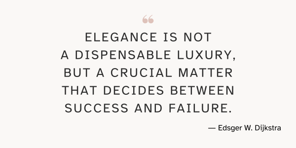

---
metadata:
    description: "In this Pydon't I'll tell you why I think elegance is such an important thing to take into account when writing code."
title: "Does elegance matter? | Pydon't 🐍"
---

Does elegance matter when writing computer programs..?

===



(If you are new here and have no idea what a Pydon't is, you may want to read the
[Pydon't Manifesto][manifesto].)


# Introduction

At the time of writing this article, I am finishing the preparation
of [my Python conference talk “Pydon'ts”][pydonts-europython] at [EuroPython].

For that matter, today's Pydon't will be a bit different.
Usually, I write about using Python's core features to write idiomatic, expressive,
elegant Python code.
In this Pydon't I will share with you _why_ this is important.


<!--v-->
 > You can now get your free copy of the ebook “Pydon'ts – Write elegant Python code” [on Gumroad][gumroad-pydonts]
 > to help support the “Pydon'ts” series of articles 💪.
<!--^-->

# Beware, opinions ahead

Idiomatic code, readable code, “Pythonic” code, elegant code,
these are all subjective things.
That means that whatever I write about these topics will never
be 100% consensual.
In other words, you might disagree.

I am fine with the fact that there are people who disagree with me,
and I do invite you to make yourself heard, maybe by writing me
or leaving a comment on the blog – diversity of points of view
is enriching.

I just want to let you know that this Pydon't might not be a good read
for you if you can't stand the fact that other people might think
differently from you 🙂.


# Elegance is not a dispensable luxury

Let me be honest with you:
when I was preparing my talk, and preparing this Pydon't,
I thought that part of my argument about why elegance is important was going
to draw from my experience as a mathematician – when doing mathematics,
people usually strive for writing elegant proofs, constructing simple arguments,
finding even simpler counter-examples to others' arguments, etc.

Then,
I found a quote by a respectable computer scientist that made this connection for me,
and I felt much more confident with the parallel I was trying to establish.
Edsger W. Dijkstra, a Dutch computer scientist,
after which the "[Dijkstra algorithm][dijkstra-alg]" was named, wrote:

 > “How do we convince people that in programming simplicity and clarity –
 > in short: what mathematicians call "elegance" –
 > are not a dispensable luxury, but a crucial matter that decides between success and failure?”
 >
 > ― Edsger W. Dijkstra, "Selected Writings on Computing: A Personal Perspective", p347.

I think Dijkstra's quote says it all:
simple and clear code is elegant code.
And this these are very desirable properties to have in code.
In fact, a little bit further down the page, Dijkstra adds

 > “[...] in the case of software unreliability is the greatest cost factor.
 > It may sound paradoxical, but a reliable (and therefore simple) program
 > is much cheaper to develop and use than a (complicated and therefore) unreliable one.”

From my experience, people mistake _beginner-level_ code for _simple_ and _clear_ code,
and that is something very dangerous, in my opinion.

Don't get me wrong, there is nothing inherently wrong with beginner-level code,
we all write it when we are learning.
What is wrong is when you hold yourself back,
or when others hold you back,
because they force you to write beginner-level code:
which is code that only uses the most basic tools in the language.


# Don't write that, that's unreadable

Think about whether or not you have been in this situation before,
or have witnessed it:
you write a beautiful couple of lines of code that does _exactly_
what needed to be done.
Then a peer of yours walks by
(or worse, someone hierarchically above you),
glances at your code,
and says “don't write code like that, that's unreadable”.
And as it turns out, they just said that
because you used a feature that they don't know of!
And because they don't know the feature that you used,
they _glanced_ at your code,
didn't feel _comfortable_ reading it,
and determined it was unreadable!

I don't know the Chinese language.
If I open a book written in Chinese,
do you think it makes sense that I look at the pages and assert
“this is unreadable!”?
What I need to do is acknowledge that I _can't_ read Chinese,
not that Chinese is unreadable.
If you don't know the language,
it doesn't make sense that you say a piece of it is unreadable.
The same thing goes for Python, or any other programming language.

Here is an [APL] expression:

```APL
      (a b c) ← 1 ¯4 3
      (2×a)÷⍨-b(+,-)0.5*⍨(b*2)-4×a×c
1 3
```

This computes the two solutions to the equation $x^2 + -4x + 3 = 0$.
Is that piece of code unreadable?
If you _know_ APL, then the answer is “no”, it is not unreadable,
because it is a very natural way of writing the quadratic formula in APL.
However, if you do _not_ know APL then your impulse will be to say
that it _is_ unreadable, when in fact you mean that you
_do not know how to read it_.

In short, something is unreadable when you know what all the constituent
pieces mean, and yet the pieces are put together in a way that doesn't
convey the global meaning well.
This could be due to the usage of the wrong constituent pieces,
because pieces are missing,
because there are superfluous pieces, etc.

Therefore,
if you don't know all the features that are being used in a piece of Python code,
I claim that you are not in a position to look at it and say that the code is unreadable.
First, you have to take the time to learn what all the different pieces are.
Only then you can look at that line of code and determine if the pieces were well put
together or not.

Of course this takes _time_ and is an effort that must be done consciously,
and that is why most people don't even bother.
Please, don't be like most people.


# The right tool for the job

To back me up, I have the words of legendary [Tim Peters][tim-peters],
the author of [The Zen of Python][pydont-zen-of-python].
Addressing some new features of Python, someone complained about
“the additional complexities to reading other's code”,
to which Tim Peters replied

 > “Here's the plan: When someone uses a feature you don't understand, simply shoot them.
 > This is easier than learning something new, and before too long
 > the only living coders will be writing in an easily understood, tiny subset
 > of Python 0.9.6 &lt;wink&gt;.”
 >
 > ― Tim Peters

I wasn't around writing Python code when we were at version 0.9.6,
but I'm guessing there wasn't too much back then.
Maybe your plain `for` loops and `if` statements.

If you want to improve, you have to learn.
That's just the way it is.

This is what my Pydon'ts try to address.
I try to teach you all the features there are to know about
the core Python, and then also show you examples of code where those
are put to good use, so that you extend your knowledge of Python.

And it is through the process of continuous learning
that you will be able to write elegant code.
As you learn more syntax, more functions, more modules,
more data types, etc, you get to know more tools to solve your problems.
And the more tools you have on your tool belt,
the more likely you are to know about
_the perfect tool for the job_ when you need to do something new.

If you have the right tool for the job,
then you can use it to solve your problem.
Simplicity, clarity, elegance; all those will follow naturally.

If you don't know about the tools,
your solution can end up being worse in a variety of ways, for example:

 - (much) longer – you have to write more code to make up for the fact
 that you don't know of better functions, modules, syntax, etc.;
 - (much) slower – the correct tool has probably been optimised
 for its use cases;
 - paradoxically, harder to maintain – the wrong tools won't be able
 to convey the same meaning in the same way, and thus that piece of
 code takes longer to understand, debug, tweak, etc..

By opposition, writing elegant and Pythonic code will make it

 - more succint;
 - clearer;
 - easier to maintain;
 - faster;


# Optimise for rewrite

At this point I am assuming that you are interested in this notion
of continuous learning –
and by that, I don't mean to say that
you should devour the full Python documentation in the next week.
You just agree with me in that trying to learn as much as possible
about the language will naturally lead you to write better code.

If you are continuously learning,
then it will happen that you look at an old piece of code of yours and go
“funny, I know a much better way to do that”.
Because you try to write simple and elegant code,
you can look at your code and quickly understand what that piece of code is doing,
hence, you can modify your old code to include the new, improved solution.
But that just made your code even clearer and more elegant.
And this is a loop that has the potential to go on forever.

Idiomatic code is code whose semantics are easy to understand, that is,
idiomatic code is code that conveys its intent really well.
If you do things right, elegant code and idiomatic code go hand-in-hand,
and if you strive to write code like that,
you are essentially opening up the doors for future rewrites of your code.
This is a good thing,
because code that can be changed is code that can be improved over time.

Would you rather write code that is easy to understand and modify,
or would you rather write code that everyone (including your future self)
is scared of going near to?


# Conclusion

Part of the elegance in your Python programs will come naturally
from learning about the features that Python has to offer,
about the built-ins, the modules in the standard library, etc.

By taking those and giving your best shot at employing them in the correct situations,
using them to solve the problems that they were made for,
you will be well on your path to writing idiomatic, elegant code.
And in writing code like that, you make it easier on yourself,
and on others, to continuously keep improving your code and,
as a consequence, your project/product.

So, next time someone looks at your code to flatten lists of lists
and says “that's unreadable”:

```py
>>> import itertools
>>> list_of_lists = [[1, 2, 3], [4], [5, 6]]
>>> list(itertools.chain(*list_of_lists))
[1, 2, 3, 4, 5, 6]
```

just tell them to go read the docs.


If you liked this Pydon't be sure to leave a reaction below and share this with your friends and fellow Pythonistas.
Also, [don't forget to subscribe to the newsletter][subscribe] so you don't miss
a single Pydon't!

[subscribe]: https://mathspp.com/subscribe
[manifesto]: /blog/pydonts/pydont-manifesto
[gumroad-pydonts]: https://gum.co/pydonts
[pydont-zen-of-python]: /blog/pydonts/pydont-disrespect-the-zen-of-python
[EuroPython]: https://ep2021.europython.eu/
[pydonts-europython]: https://ep2021.europython.eu/talks/Bz5dtEe-pydonts/
[dijkstra]: https://en.wikipedia.org/wiki/Edsger_W._Dijkstra
[APL]: https://apl.wiki
[tim-peters]: https://en.wikipedia.org/wiki/Tim_Peters_(software_engineer)
