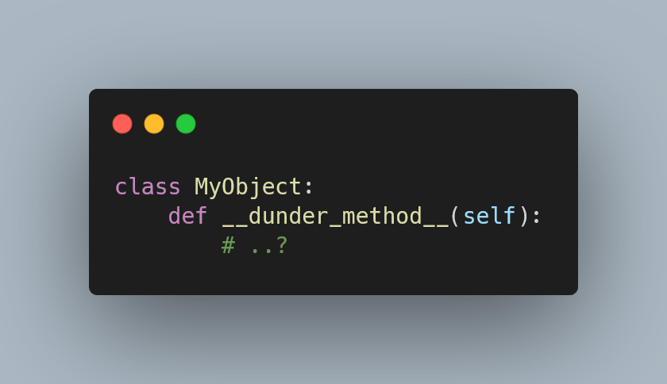

This is an introduction to dunder methods in Python,
to help you understand what they are and what they are for.

===



(If you are new here and have no idea what a Pydon't is, you may want to read the
[Pydon't Manifesto][manifesto].)


# Introduction

Python is a language that has a rich set of built-in functions and operators that work really well with the built-in types.
For example, the operator `+` works on numbers, as addition, but it also works on strings, lists, and tuples, as concatenation:

```pycon
>>> 1 + 2.3
3.3
>>> [1, 2, 3] + [4, 5, 6]
[1, 2, 3, 4, 5, 6]
```

But what is it that defines that `+` is addition for numbers (integers and floats)
and concatenation for lists, tuples, strings?
What if I wanted `+` to work on other types?
Can I do that?

The short answer is “yes”, and that happens through **dunder methods**,
the object of study in this Pydon't.
In this Pydon't, you will

 - understand what are dunder methods;
 - why they are called like that;
 - see various useful dunder methods;
 - learn about what dunder methods correspond to what built-ins;
 - write your own dunder methods for example classes; and
 - realise that dunder methods are like any other method you have written before.


<!--v-->
!!! You can now get your free copy of the ebook “Pydon'ts – Write beautiful Python code” [on Gumroad][gumroad-pydonts]
!!! to help support the series of “Pydon't” articles 💪.
<!--^-->


# What are dunder methods?

In Python, **dunder methods are methods that allow instances of a class to interact with the built-in functions and operators** of the language.
The word “dunder” comes from “double underscore”, because the names of dunder methods start and end with two underscores,
for example `__str__` or `__add__`.
Typically, dunder methods are not invoked directly by the programmer, making it look like they are called by magic.
That is why dunder methods are also referred to as “magic methods” sometimes.[^1]

[^1]: I very much prefer the name “dunder method” over “magic method” because “magic method” makes it look like it's difficult to understand because there is wizardry going on! Spoiler: there isn't.

Dunder methods are not called magically, though.
They are just called implicitly by the language, at specific times that are well-defined,
and that depend on the dunder method in question.


## The dunder method everyone knows

If you have defined classes in Python, you are bound to have crossed paths with a dunder method: `__init__`.
**The dunder method `__init__` is responsible for _initialising_ your instance of the class**,
which is why it is in there that you usually set a bunch of attributes related to arguments the class received.

For example, if you were creating an instance of a class `Square`,
you would create the attribute for the side length in `__init__`:

```py
class Square:
    def __init__(self, side_length):
        """__init__ is the dunder method that INITialises the instance.

        To create a square, we need to know the length of its side,
        so that will be passed as an argument later, e.g. with Square(1).
        To make sure the instance knows its own side length,
        we save it with self.side_length = side_length.
        """
        print("Inside init!")
        self.side_length = side_length

sq = Square(1)
# Inside init!
```

If you run the code above, you will see the message “Inside init!” being printed,
and yet, you did not call the method `__init__` directly!
The dunder method `__init__` was called implicitly by the language when you created your instance of a square.


## Why do dunder methods start and end with two underscores?

The two underscores in the beginning and end of the name of a dunder method do not have any special significance.
In other words, the fact that the method name starts and ends with two underscores, in and of itself, does nothing special.
The two underscores are there just to prevent name collision with other methods implemented by unsuspecting programmers.

Think of it this way:
Python has a built-in called `sum`.
You _can_ define `sum` to be something else,
but then you lose access to the built-in that sums things, right?

```pycon
>>> sum(range(10))
45
>>> sum = 45
>>> sum(range(10))
Traceback (most recent call last):
  File "<stdin>", line 1, in <module>
TypeError: 'int' object is not callable
```

Often, you see beginners using `sum` as a variable name because they do not know `sum` is actually a built-in function.
If the built-in was named `__sum__` instead of `sum`,
it would be much more difficult for you to override it by mistake, right?
But it would also make it much less convenient to use `sum`...

However, for magic methods, we do not need their names to be super convenient to type,
because you almost never type the name of a magic method.
Therefore, Python decided that the magic methods would have names that start and end with two underscores,
to make it less likely that someone would override one of those methods by accident!

All in all, dunder methods are just like any other method you have implemented,
with the small exception that dunder methods can be called implicitly by the language.


## Operator overloading in Python and dunder methods

All Python operators, like `+`, `==`, and `in`,
rely on dunder methods to implement their behaviour.

For example, when Python encounters the code `value in container`,
it actually turns that into a call to the appropriate dunder method `__contains__`,
which means that Python actually runs the expression `container.__contains__(value)`.

Let me show you:

```pycon
>>> my_list = [2, 4, 6]

>>> 3 in my_list
False
>>> my_list.__contains__(3)
False

>>> 6 in my_list
True
>>> my_list.__contains__(6)
True
```

Therefore, when you want to overload certain operators to make them work in a custom way with your own objects,
you need to implement the respective dunder methods.

So, if you were to create your own type of container,
you could implement the dunder method `__contains__` to make sure that your containers could be on the right-hand side of an expression with the operator `in`.


# List of dunder methods and their interactions

As we have seen, dunder methods are (typically) called implicitly by the language...
But when?
The dunder method `__init__` is called when initialising an instance of a class,
but what about `__str__`, or `__bool__`, or other dunder methods?

The table that follows lists all dunder methods together with one or more (simplified) usage examples that would implicitly call the respective dunder method.
This may include brief descriptions of situations where the relevant dunder method might be called,
or example function calls that depend on that dunder method.
These example situations may have caveats associated, so be sure to [read the documentation on dunder methods][docs-data-model]
whenever you want to play with a dunder method you are unfamiliar with.

The table also includes links to the documentation of the dunder method under the emoji 🔗.
When available, relevant Pydon'ts are linked under the emoji 🗒️.

Finally, the row order of the table matches the order in which these dunder methods are mentioned in the “Data Model” page of the documentation,
which does not imply any dependency between the various dunder methods,
nor does it imply a level of difficulty in understanding the methods.

| Dunder method | Usage / Needed for | Link |
| :- | :- | :- |
| `__init__` | Initialise object | [🔗](https://docs.python.org/3/reference/datamodel.html#object.__init__) |
| `__new__` | Create object | [🔗](https://docs.python.org/3/reference/datamodel.html#object.__new__) |
| `__del__` | Destroy object | [🔗](https://docs.python.org/3/reference/datamodel.html#object.__del__) |
| `__repr__` | Compute “official” string representation / `repr(obj)` | [🗒️](/blog/pydonts/str-and-repr) [🔗](https://docs.python.org/3/reference/datamodel.html#object.__repr__) |
| `__str__` | Pretty print object / `str(obj)` / `print(obj)` | [🗒️](/blog/pydonts/str-and-repr) [🔗](https://docs.python.org/3/reference/datamodel.html#object.__str__) |
| `__bytes__` | `bytes(obj)` | [🔗](https://docs.python.org/3/reference/datamodel.html#object.__bytes__) |
| `__format__` | Custom string formatting | [🗒️](/blog/pydonts/string-formatting-comparison#custom-formatting) [🔗](https://docs.python.org/3/reference/datamodel.html#object.__format__) |
| `__lt__` | `obj < ...` | [🔗](https://docs.python.org/3/reference/datamodel.html#object.__lt__) |
| `__le__` | `obj <= ...` | [🔗](https://docs.python.org/3/reference/datamodel.html#object.__le__) |
| `__eq__` | `obj == ...` | [🔗](https://docs.python.org/3/reference/datamodel.html#object.__eq__) |
| `__ne__` | `obj != ...` | [🔗](https://docs.python.org/3/reference/datamodel.html#object.__ne__) |
| `__gt__` | `obj > ...` | [🔗](https://docs.python.org/3/reference/datamodel.html#object.__gt__) |
| `__ge__` | `obj >= ...` | [🔗](https://docs.python.org/3/reference/datamodel.html#object.__ge__) |
| `__hash__` | `hash(obj)` / object as dictionary key | [🔗](https://docs.python.org/3/reference/datamodel.html#object.__hash__) |
| `__bool__` | `bool(obj)` / define Truthy/Falsy value of object | [🗒️](/blog/pydonts/truthy-falsy-and-bool) [🔗](https://docs.python.org/3/reference/datamodel.html#object.__bool__) |
| `__getattr__` | Fallback for attribute access | [🔗](https://docs.python.org/3/reference/datamodel.html#object.__getattr__) |
| `__getattribute__` | Implement attribute access: `obj.name` | [🔗](https://docs.python.org/3/reference/datamodel.html#object.__getattribute__) |
| `__setattr__` | Set attribute values: `obj.name = value` | [🔗](https://docs.python.org/3/reference/datamodel.html#object.__setattr__) |
| `__delattr__` | Delete attribute: `del obj.name` | [🔗](https://docs.python.org/3/reference/datamodel.html#object.__delattr__) |
| `__dir__` | `dir(obj)` |[🔗](https://docs.python.org/3/reference/datamodel.html#object.__dir__) |
| `__get__` | Attribute access in descriptor | [🔗](https://docs.python.org/3/reference/datamodel.html#object.__get__) |
| `__set__` | Set attribute in descriptor | [🔗](https://docs.python.org/3/reference/datamodel.html#object.__set__) |
| `__delete__` | Attribute deletion in descriptor | [🔗](https://docs.python.org/3/reference/datamodel.html#object.__delete__) |
| `__init_subclass__` | Initialise subclass | [🔗](https://docs.python.org/3/reference/datamodel.html#object.__init_subclass__) |
| `__set_name__` | Owner class assignment callback | [🔗](https://docs.python.org/3/reference/datamodel.html#object.__set_name__) |
| `__instancecheck__` | `isinstance(obj, ...)` | [🔗](https://docs.python.org/3/reference/datamodel.html#class.__instancecheck__) |
| `__subclasscheck__` | `issubclass(obj, ...)` | [🔗](https://docs.python.org/3/reference/datamodel.html#class.__subclasscheck__) |
| `__class_getitem__` | Emulate generic types | [🔗](https://docs.python.org/3/reference/datamodel.html#object.__class_getitem__) |
| `__call__` | Emulate callables / `obj(*args, **kwargs)` | [🔗](https://docs.python.org/3/reference/datamodel.html#object.__call__) |
| `__len__` | `len(obj)` | [🔗](https://docs.python.org/3/reference/datamodel.html#object.__len__) |
| `__length_hint__` | Estimate length for optimisation purposes | [🔗](https://docs.python.org/3/reference/datamodel.html#object.__length_hint__) |
| `__getitem__` | Access `obj[key]` | [🗒️](/blog/pydonts/inner-workings-of-sequence-slicing#getting-items-from-sequences) [🔗](https://docs.python.org/3/reference/datamodel.html#object.__getitem__) |
| `__setitem__` | `obj[key] = ...` or `obj[] | [🗒️](/blog/pydonts/inner-workings-of-sequence-slicing#setting-items-deleting-items-and-container-emulation) [🔗](https://docs.python.org/3/reference/datamodel.html#object.__setitem__) |
| `__delitem__` | `del obj[key]` | [🗒️](/blog/pydonts/inner-workings-of-sequence-slicing#setting-items-deleting-items-and-container-emulation) [🔗](https://docs.python.org/3/reference/datamodel.html#object.__delitem__) |
| `__missing__` | Handle missing keys in `dict` subclasses | [🔗](https://docs.python.org/3/reference/datamodel.html#object.__missing__) |
| `__iter__` | `iter(obj)` / `for ... in obj` (iterating over) | [🔗](https://docs.python.org/3/reference/datamodel.html#object.__iter__) |
| `__reversed__` | `reverse(obj)` | [🔗](https://docs.python.org/3/reference/datamodel.html#object.__reversed__) |
| `__contains__` | `... in obj` (membership test) | [🔗](https://docs.python.org/3/reference/datamodel.html#object.__contains__) |
| `__add__` | `obj + ...` | [🔗](https://docs.python.org/3/reference/datamodel.html#object.__add__) |
| `__radd__` | `... + obj` | [🔗](https://docs.python.org/3/reference/datamodel.html#object.__radd__) |
| `__iadd__` | `obj += ...` | [🔗](https://docs.python.org/3/reference/datamodel.html#object.__iadd__) |
| `__sub__` [^2] [^3] | `obj - ...` | [🔗](https://docs.python.org/3/reference/datamodel.html#object.__sub__) |
| `__mul__` [^2] [^3] | `obj * ...` | [🔗](https://docs.python.org/3/reference/datamodel.html#object.__mul__) |
| `__matmul__` [^2] [^3] | `obj @ ...` | [🔗](https://docs.python.org/3/reference/datamodel.html#object.__matmul__) |
| `__truediv__` [^2] [^3] | `obj / ...` | [🔗](https://docs.python.org/3/reference/datamodel.html#object.__div__) |
| `__floordiv__` [^2] [^3] | `obj // ...` | [🔗](https://docs.python.org/3/reference/datamodel.html#object.__floordiv__) |
| `__mod__` [^2] [^3] | `obj % ...` | [🔗](https://docs.python.org/3/reference/datamodel.html#object.__mod__) |
| `__divmod__` [^2] | `divmod(obj, ...)` | [🔗](https://docs.python.org/3/reference/datamodel.html#object.__divmod__) |
| `__pow__` [^2] [^3] | `obj ** ...` | [🔗](https://docs.python.org/3/reference/datamodel.html#object.__pow__) |
| `__lshift__` [^2] [^3] | `obj << ...` | [🔗](https://docs.python.org/3/reference/datamodel.html#object.__lshift__) |
| `__rshift__` [^2] [^3] | `obj >> ...` | [🔗](https://docs.python.org/3/reference/datamodel.html#object.__rshift__) |
| `__and__` [^2] [^3] | `obj & ...` | [🔗](https://docs.python.org/3/reference/datamodel.html#object.__and__) |
| `__xor__` [^2] [^3] | `obj ^ ...` | [🔗](https://docs.python.org/3/reference/datamodel.html#object.__xor__) |
| `__or__` [^2] [^3] | `obj | ...` | [🔗](https://docs.python.org/3/reference/datamodel.html#object.__or__) |
| `__neg__` | `-obj` (unary) | [🔗](https://docs.python.org/3/reference/datamodel.html#object.__neg__) |
| `__pos__` | `+obj` (unary) | [🔗](https://docs.python.org/3/reference/datamodel.html#object.__pos__) |
| `__abs__` | `abs(obj)` | [🔗](https://docs.python.org/3/reference/datamodel.html#object.__abs__) |
| `__invert__` | `~obj` (unary) | [🔗](https://docs.python.org/3/reference/datamodel.html#object.__invert__) |
| `__complex__` | `complex(obj)` | [🔗](https://docs.python.org/3/reference/datamodel.html#object.__complex__) |
| `__int__` | `int(obj)` | [🔗](https://docs.python.org/3/reference/datamodel.html#object.__int__) |
| `__float__` | `float(obj)` | [🔗](https://docs.python.org/3/reference/datamodel.html#object.__float__) |
| `__index__` | Losslessly convert to integer | [🔗](https://docs.python.org/3/reference/datamodel.html#object.__index__) |
| `__round__` | `round(obj)` | [🔗](https://docs.python.org/3/reference/datamodel.html#object.__round__) |
| `__trunc__` | `math.trunc(obj)` | [🔗](https://docs.python.org/3/reference/datamodel.html#object.__trunc__) |
| `__floor__` | `math.floor(obj)` | [🔗](https://docs.python.org/3/reference/datamodel.html#object.__floor__) |
| `__ceil__` | `math.ceil(obj)` | [🔗](https://docs.python.org/3/reference/datamodel.html#object.__ceil__) |
| `__enter__` | `with obj` (enter context manager) | [🔗](https://docs.python.org/3/reference/datamodel.html#object.__enter__) |
| `__exit__` | `with obj` (exit context manager) | [🔗](https://docs.python.org/3/reference/datamodel.html#object.__exit__) |
| `__await__` | Implement awaitable objects | [🔗](https://docs.python.org/3/reference/datamodel.html#object.__await__) |
| `__aiter__` | `aiter(obj)` | [🔗](https://docs.python.org/3/reference/datamodel.html#object.__aiter__) |
| `__anext__` | `anext(obj)` | [🔗](https://docs.python.org/3/reference/datamodel.html#object.__anext__) |
| `__aenter__` | `async with obj` (enter async context manager) | [🔗](https://docs.python.org/3/reference/datamodel.html#object.__aenter__) |
| `__aexit__` | `async with obj` (exit async context manager) | [🔗](https://docs.python.org/3/reference/datamodel.html#object.__aexit__) |

[^2]: this dunder method also has a “right” version, with the same name but prefixed by an `"r"`, and that is called when the object is on the right-hand side of the operation and the object on the left-hand side doesn't implement the behaviour. See `__radd__` above.
[^3]: this dunder method also has a “in-place” version, with the same name but prefixed by an `"i"`, and that is called for augmented assignment with the given operator. See `__iadd__` above.


# Exploring a dunder method

Whenever I learn about a new dunder method,
the first thing I do is to play around with it.

Below, I share with you the three steps I follow when I'm exploring a new dunder method:

 1. try to understand _when_ the dunder method is called;
 2. implement a stub for that method and trigger it with code; and
 3. use the dunder method in a useful situation.

I will show you how I follow these steps with a practical example,
the dunder method `__missing__`.


## What is the dunder method for?

What is the dunder method `__missing__` for?
The [documentation for the dunder method `__missing__` reads](https://docs.python.org/3/reference/datamodel.html#object.__missing__):

 > “Called by `dict.__getitem__()` to implement `self[key]` for `dict` subclasses when `key` is not in the dictionary.”

In other words, the dunder method `__missing__` is only relevant for subclasses of `dict`,
and it is called whenever we cannot find a given key in the dictionary.


## How to trigger the dunder method?

In what situations, that I can recreate, does the dunder method `__missing__` get called?

From the documentation text, it looks like we might need a dictionary subclass,
and then we need to access a key that does not exist in that dictionary.
Thus, this should be enough to trigger the dunder method `__missing__`:

```py
class DictSubclass(dict):
    def __missing__(self, key):
        print("Hello, world!")

my_dict = DictSubclass()
my_dict["this key isn't available"]
# Hello, world!
```

Notice how barebones the code above is:
I just defined a method called `__missing__` and made a print,
just so I could check that `__missing__` was being called.

Now I am going to make a couple more tests,
just to make sure that `__missing__` is really only called when trying to _get_ the value of a key that doesn't exist:

```py
class DictSubclass(dict):
    def __missing__(self, key):
        print(f"Missing {key = }")

my_dict = DictSubclass()
my_dict[0] = True
if my_dict[0]:
    print("Key 0 was `True`.")
# Prints: Key 0 was `True`
my_dict[1]  # Prints: Missing key = 1
```


## Using the dunder method in a useful situation

Now that we have a clearer picture of when `__missing__` comes into play,
we can use it for something useful.
For example, we can try implementing `defaultdict` based on `__missing__`.

`defaultdict` is a container from the module `collections`,
and it's just like a dictionary,
except that it uses a factory to generate default values when keys are missing.

For example, here is an instance of `defaultdict` that returns the value `0` by default:

```py
from collections import defaultdict

olympic_medals = defaultdict(lambda: 0)  # Produce 0 by default
olympic_medals["Phelps"] = 28

print(olympic_medals["Phelps"])  # 28
print(olympic_medals["me"])  # 0
```

So, to reimplement `defaultdict`, we need to accept a factory function,
we need to save that factory,
and we need to use it inside `__missing__`.

Just as a side note,
notice that `defaultdict` not only returns the default value,
but also assigns it to the key that wasn't there before:

```pycon
>>> from collections import defaultdict
>>> olympic_medals = defaultdict(lambda: 0)  # Produce 0 by default
>>> olympic_medals
defaultdict(<function <lambda> at 0x000001F15404F1F0>, {})
>>> # Notice the underlying dictionary is empty -------^^
>>> olympic_medals["me"]
0
>>> olympic_medals
defaultdict(<function <lambda> at 0x000001F15404F1F0>, {'me': 0})
>>> # It's not empty anymore --------------------------^^^^^^^^^
```

Given all of this, here is a possible reimplementation of `defaultdict`:

```py
class my_defaultdict(dict):
    def __init__(self, default_factory, **kwargs):
        super().__init__(**kwargs)
        self.default_factory = default_factory

    def __missing__(self, key):
        """Populate the missing key and return its value."""
        self[key] = self.default_factory()
        return self[key]

olympic_medals = my_defaultdict(lambda: 0)  # Produce 0 by default
olympic_medals["Phelps"] = 28

print(olympic_medals["Phelps"])  # 28
print(olympic_medals["me"])  # 0
```


# Conclusion

Here's the main takeaway of this Pydon't, for you, on a silver platter:

 > “*Dunder methods are specific methods that allow you to specify how your objects interact with the Python syntax, its keywords, operators, and built-ins.*”

This Pydon't showed you that:

 - dunder methods are methods that are called implicitly by the Python language in specific situations;
 - “dunder” comes from “double underscore”, referring to the two underscores that are the prefix and the suffix of all dunder methods;
 - dunder methods are sometimes called magic methods because they are often called without explicit calls;
 - learning about a new dunder method can be done through a series of small, simple steps; and
 - dunder methods are regular Python methods of regular Python classes.

<!-- v -->
If you liked this Pydon't be sure to leave a reaction below and share this with your friends and fellow Pythonistas.
Also, [don't forget to subscribe to the newsletter][subscribe] so you don't miss
a single Pydon't!
<!-- ^ -->

[subscribe]: https://mathspp.com/subscribe
[manifesto]: /blog/pydonts/pydont-manifesto
[gumroad-pydonts]: https://gum.co/pydonts

[docs-data-model]: https://docs.python.org/3/reference/datamodel.html
