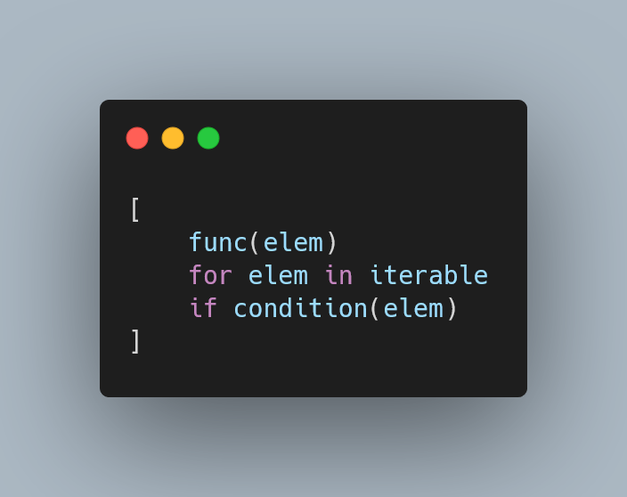
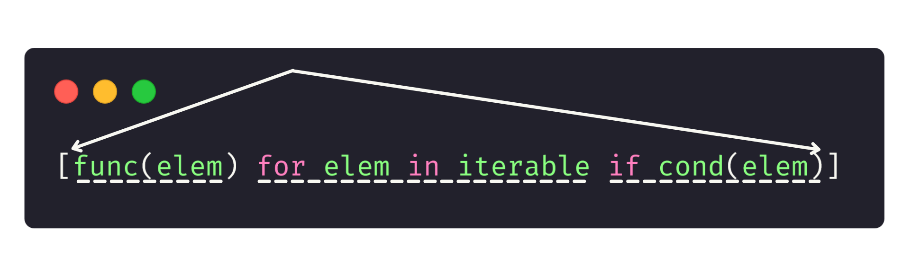
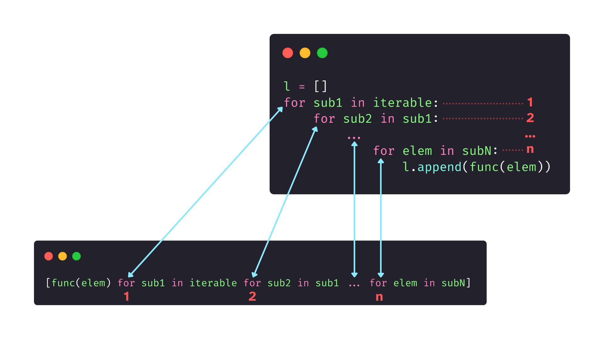
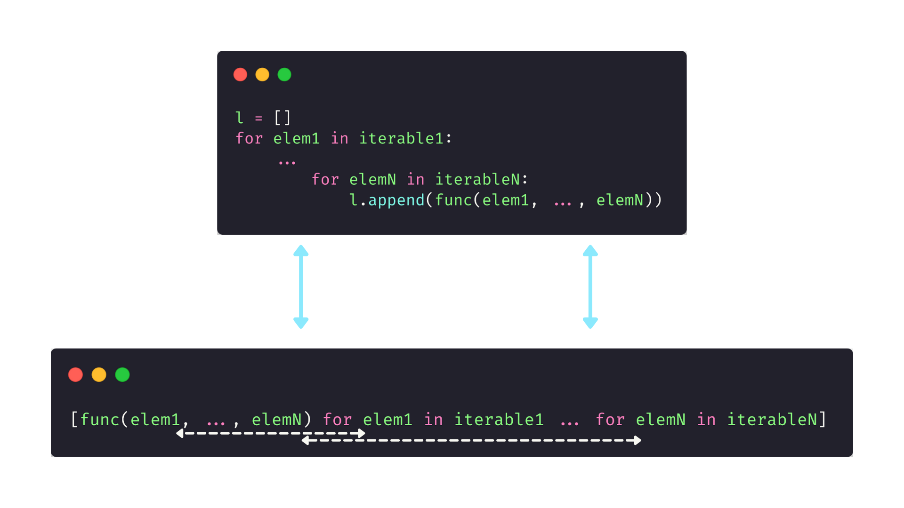
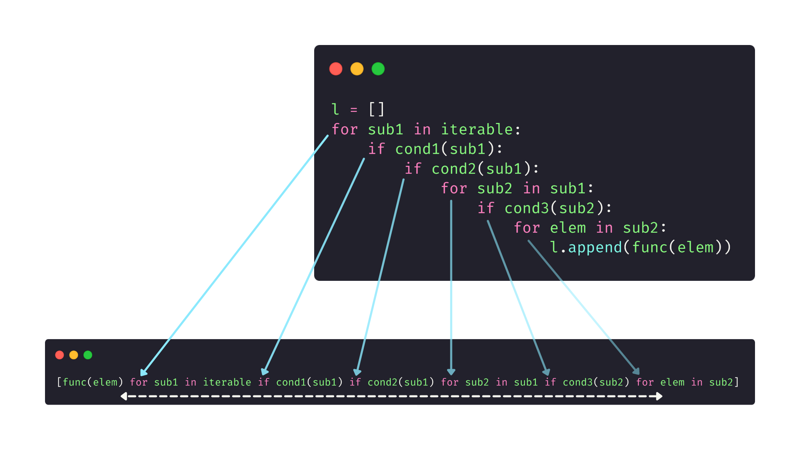
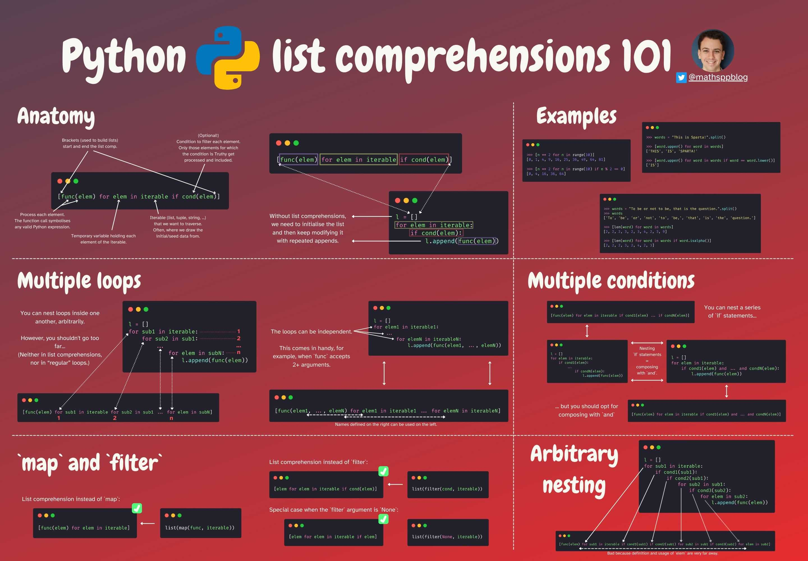

---
metadata:
    description: "This Pydon't will teach you the basics of list comprehensions in Python."
title: "List comprehensions 101 | Pydon't 🐍"
---

This Pydon't will teach you how the basics of list comprehensions in Python.

===



(If you are new here and have no idea what a Pydon't is, you may want to read the
[Pydon't Manifesto][manifesto].)


# Introduction

List comprehensions are, hands down,
one of my favourite Python features.

It's not THE favourite feature, but that's because Python
has a lot of things I really like!
List comprehensions being one of those.

This article (the first in a short series) will cover the basics of list comprehensions.

In this Pydon't, you will:

 - learn the anatomy of a list comprehension;
   - learn how to create list comprehensions; and
   - understand the building blocks of list comprehensions;
 - see the parallel that exists between some `for` loops and list comprehensions;
 - establish a correspondence between `map` and `filter`, and list comprehensions;
 - understand the main use-case for this feature; and
 - see good usages of list comprehensions in real code written by real people.

I also summarised the contents of this article in a cheatsheet
that you can get for free [from here][gumroad-cheatsheet].

<!--v-->
 > You can now get your free copy of the ebook “Pydon'ts – Write beautiful Python code” [on Gumroad][gumroad-pydonts]
 > to help support the series of “Pydon't” articles 💪.
<!--^-->


# What is a list comprehension?

A list comprehension is a Python expression that returns a list.

List comprehensions are great because they provide
a very convenient syntax to generate simple lists.
This often is a good alternative to using a full `for`
loop with a series of calls to the `.append` method
of the list you want to build.

However, list comprehensions have a structure that is very similar
to the equivalent `for` loops,
so list comprehensions should be easy to use if you understand
the relationship between a list comprehension and the corresponding loop.

The key idea behind list comprehensions is that many lists can be built
out of other, simpler iterables (lists, tuples, strings, ...).

For example, if you want to build a list with some square numbers,
you will probably start off by using a `range` to create a series of consecutive integers.


# Anatomy of a list comprehension

A list comprehension has four parts, one of which is optional.
Here is a diagram representing those four parts:



The first part is a set of opening and closing brackets,
that delimit the list comprehension.
The brackets, by themselves, do not automatically indicate a list comprehension,
because they can also be used to create list literal, like `[1, 2, 3]`.

The second part is the expression that you apply to each element
of the initial seed data you are using.
This is often a function call or another expression,
like an arithmetic expression, that transforms each element into a new one.
In the diagram above, this is represented by `func(elem)`.

The third part is the `for` component that establishes
what the initial data is, and where we are going to draw our elements from.
This is akin to the `for ... in ...` of a standard `for` loop.
In fact, it looks exactly the same as the initial statement of a `for` loop,
and it is represented by `for elem in iterable` in the diagram above.

The fourth part, which is optional, is an `if` statement.
This `if` statement is used to filter elements from the initial seed data,
in case we want to ignore some of it/only use part of the data.
This is represented by the `cond(elem)` above.

Enough of theoretical gibberish, let's look at some actual list comprehensions.


# Example list comprehensions without filtering

 1. First square numbers:

```py
>>> [n ** 2 for n in range(10)]
[0, 1, 4, 9, 16, 25, 36, 49, 64, 81]
```

 2. Uppercasing a series of words:

```py
>>> words = "This is Sparta!".split()
>>> [word.upper() for word in words]
['THIS', 'IS', 'SPARTA!'
```

 3. Find the length of each word in a sentence:

```py
>>> words = "To be or not to be, that is the question.".split()
>>> [len(word) for word in words]
[2, 2, 2, 3, 2, 3, 4, 2, 3, 9]
```


# Example list comprehensions with filtering

 1. First square numbers for even `n`:

```py
>>> [n ** 2 for n in range(10) if n % 2 == 0]
[0, 4, 16, 36, 64]
```

This is also equivalent to,

```py
>>> [n ** 2 for n in range(0, 10, 2)]
[0, 4, 16, 36, 64]
```

which is better because it uses less initial data.

 2. Uppercase a series of words if they are all lower case:

```py
>>> words = "This is Sparta!".split()
>>> [word.upper() for word in words if word == word.lower()]
['IS']
```

The result only contains the word “is” because that's the only word
that was entirely lower case in the original sentence “This is Sparta!”.

 3. Find the length of each word that does not have punctuation next to it:

```py
>>> words = "To be or not to be, that is the question.".split()
>>> words
['To', 'be', 'or', 'not', 'to', 'be,', 'that', 'is', 'the', 'question.']
>>> [len(word) for word in words if word.isalpha()]
[2, 2, 2, 3, 2, 4, 2, 3]
```

The final result only contains 8 numbers
(while the original sentence contains 10 words)
because the words “be,” and “question.” had punctuation next to them.


# Equivalence with `for` loops

Now that you looked at some list comprehensions,
it is time to create an analogy with `for` loops.
If you know your `for` loops well enough,
and if you study this equivalence,
you will master list comprehensions.

A list comprehension is equivalent to a `for` loop that consecutively
calls the `.append` method of an (initially) empty list:


This is, in fact,
one of the most common patterns that list comprehensions are useful for.

If you find a piece of code that initialises an empty list,
and then uses a `for` loop to populate it with data,
that's probably a good use case for a list comprehension.

Of course this isn't always doable in a sensible way,
list comprehensions are not meant to replace _all_ `for` loops.
But if you have a short loop exhibiting the structure above,
then that could probably be replaced by a list comprehension.

I challenge you to do just that.
Go through some code of yours and look for that pattern.
Then, try replacing it with a list comprehension.

Here are the list comprehensions from before,
with the equivalent `for` loops:

 1. Squaring:

```py
even_squares = [n ** 2 for n in range(10) if n % 2 == 0]
# ↑
# ↓
even_squares = []
for n in range(10):
    if n % 2 == 0:
        even_squares.append(n ** 2)
```

 2. Upper casing words:

```py
words = "This is Sparta!".split()
upper_cased = [word.upper() for word in words if word == word.lower()]
# ↑
# ↓
upper_cased = []
for word in words:
    if word == word.lower():
        upper_cased.append(word.upper())
```

 3. Finding length of words:

```py
words = "To be or not to be, that is the question.".split()
lengths = [len(word) for word in words if word.isalpha()]
# ↑
# ↓
lengths = []
for word in words:
    if word.isalpha():
        lengths.append(len(word))
```


# Nesting `for` loops

Much like in standard `for` loops,
list comprehensions can also have nested loops:



A prime usage example of this is to flatten a list of lists:

```py
>>> lists = [[1, 2, 3], [4, 5, 6, 7], [8, 9]]
>>> [elem for sublist in lists for elem in sublist]
[1, 2, 3, 4, 5, 6, 7, 8, 9]
```

The second loop doesn't need to depend explicitly on the first one;
it can iterate over another iterable, to create another variable.
When you do so, all the temporary variables that are going through
iterables become available to be used on the left.



This pattern arises naturally when you want to _combine_ information
from two or more data sources:

```py
>>> colours = ["red", "green", "blue"]
>>> clothes = ["t-shirt", "shirt"]
>>> [f"{colour} {clothing}" for colour in colours for clothing in clothes]
['red t-shirt', 'red shirt', 'green t-shirt', 'green shirt', 'blue t-shirt', 'blue shirt']
```

! Notice that, in here, to “combine” the information means to create
! all different pairings with the data from one and the other iterable.
! If you want to create pairings by traversing two iterables in parallel,
! then you should read up on [zip][pydont-zip].


# Nesting `if` statements

Much like you can nest `for` loops to iterate over more iterables,
you can nest `if` statements to create stricter filters.

When you have a series of `if` statements,
the second condition only runs if the first one passed;
the third condition only runs if the second one passed;
and so on.

However, with the `if` statements,
this is the same as combining the successive conditions with `and`s.
That's because [Boolean short-circuiting][pydont-boolean-short-circuiting]
makes sure that later conditions only get evaluated if the earlier ones evaluated to `True`.

This means there is a series of equivalences when we think about
list comprehensions with nested `if` statements:


# Arbitrary nesting

The two sections above showed you that you can nest multiple
`for` loops, and also multiple `if` statements.

Now, the only thing left for you to know is that these can be mixed
and nested arbitrarily.
Of course, you should not nest things too much,
because a long list comprehension is harder to read than the equivalent
nested formulation.

The diagram below helps you in understanding the correspondence
between the order of things in the nested formulation and the
left-to-right ordering of things in the list comprehension.

The further you are to the right in a list comprehension,
the deeper you are in the equivalent nested formulation:




# List comprehensions instead of `map` and `filter`

List comprehensions are often deemed a more Pythonic replacement
for calls to the built-in functions `map` and `filter`.

`map` takes a function and applies it to all elements of an iterable,
and that's straightforward to do with a list comprehension:


Similarly, the built-in `filter` can often be replaced with a more Pythonic list comprehension.


Please, bear in mind that the list comprehension versions
of `map` and `filter` are **not** equivalent to using
`map` and `filter`.
The underlying data is, but the containers themselves
are slightly different.

Not only that, but I'm also not saying that `map` and `filter` are useless.
A later Pydon't will be devoted to understanding when to use `map` and `filter`,
so make sure to [subscribe to the newsletter][subscribe] to not miss that Pydon't.


# Examples in code


## Random data

A neat little example of where a list comprehension is _the way_ to go,
is when generating some random data.

For example, to generate three integers to represent an RGB colour,

```py
>>> from random import randint
>>> r, g, b = [randint(0, 255) for _ in range(3)]
>>> r
180
>>> g
148
>>> b
188
```

or when generating a random string:

```py
>>> from string import ascii_lowercase, ascii_uppercase
>>> from random import choice
>>> "".join([choice(ascii_lowercase + ascii_uppercase) for _ in range(16)])
'qMQlkhvKJfdZGBEZ'
```


## Getting AWS prefixes

While browsing Twitter,
I found someone writing a little Python script to interact with Amazon Web Services
to get IP prefixes for different services.
(Whatever that means.)

At some point,
they had a simple `for` loop that was iterating through a bunch of prefixes
and storing them in a list, provided that that prefix had to do with a specific Amazon service.

This person is a self-proclaimed Python beginner,
and so I thought this was a good opportunity to [show how list comprehensions can be useful][daniel-list-comp-reply].

The relevant excerpt of the original code is as follows:

```py
def get_service_prefixes(amazon_service):
    aws_prefixes = get_aws_prefixes()
    count = 0
    service_prefixes = []
    for prefix in aws_prefixes["prefixes"]:
        if amazon_service in prefix["service"]:
            count += 1
            service_prefixes.append(prefix["ip_prefix"])

    # ...
```

Looking at the code above,
we can see that the list `service_prefixes` is being
created and then appended to in the `for` loop;
also, that's the _only_ purpose of that `for` loop.

!!! This is the generic pattern that indicates a list comprehension might be useful!

Therefore, we can replace the loop with a list comprehension.
The variable `count` is superfluous because it keeps
track of the length of the resulting list,
something we can find out easily with the function `len`.

Here is a possible alternative using a list comprehension:

```py
def get_service_prefixes(amazon_service):
    service_prefixes = [
        prefix for prefix in get_aws_prefixes()
        if amazon_service in prefix["service"]
    ]
    count = len(service_prefixes)

    # ...
```

# Conclusion

Here's the main takeaway of this Pydon't, for you, on a silver platter:

 > “*List comprehensions are a powerful Python feature that is useful for building lists.*”


This Pydon't was also summarised in [a free cheatsheet][gumroad-cheatsheet]:

[][gumroad-cheatsheet]


This Pydon't showed you that:

 - a list comprehension has 4 parts, one of which is optional;
 - list comprehensions can transform data drawn from another iterable;
 - list comprehensions can filter the data they transform;
 - each list comprehension is equivalent to a `for` loop that successively calls `.append` on a list that is initialised empty;
 - list comprehensions can nest arbitrarily many `for` loops;
 - list comprehensions can nest arbitrarily many `if` statements;
 - nesting `if` statements is equivalent to combining conditions with `and`;
 - `map` and `filter` can often be replaced with list comprehensions;
 - simple loops whose only job is to append to a `list` can often be replaced with list comprehensions.

<!-- v -->
If you liked this Pydon't be sure to leave a reaction below and share this with your friends and fellow Pythonistas.
Also, [subscribe to the newsletter][subscribe] so you don't miss
a single Pydon't!
<!-- ^ -->

[subscribe]: https://mathspp.com/subscribe
[manifesto]: /blog/pydonts/pydont-manifesto
[gumroad-cheatsheet]: https://gum.co/cheatsheet_list_comps_101
[gumroad-pydonts]: https://gum.co/pydonts
[pydont-zip]: /blog/pydonts/zip-up
[pydont-boolean-short-circuiting]: /blog/pydonts/boolean-short-circuiting
[daniel-list-comp-reply]: https://twitter.com/mathsppblog/status/1430463304401670145
