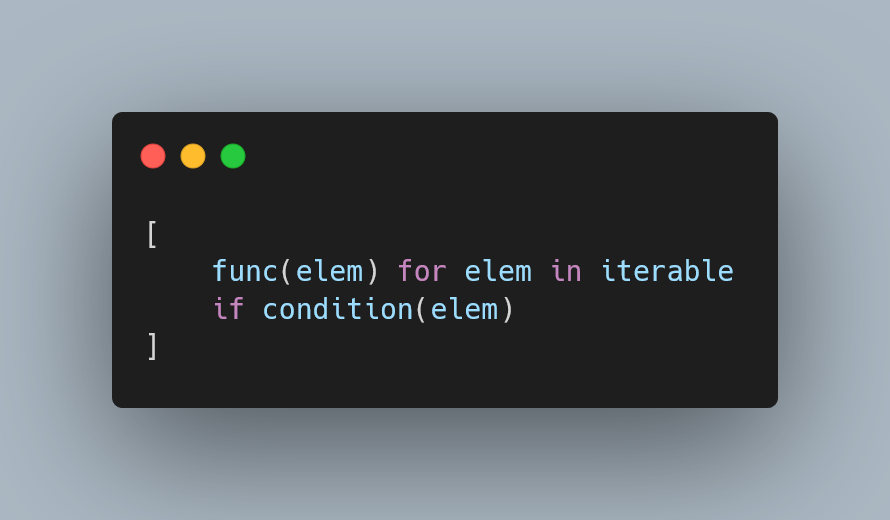

---
metadata:
    description: "This Pydon't will teach you the basics of list comprehensions in Python."
title: "List comprehensions 101 | Pydon't 🐍"
---

This Pydon't will teach you the basics of list comprehensions in Python.

===



(If you are new here and have no idea what a Pydon't is, you may want to read the
[Pydon't Manifesto][manifesto].)


# Introduction

List comprehensions are, hands down,
one of my favourite Python features.

It's not THE favourite feature, but that's because Python
has a lot of things I really like!
List comprehensions being one of those.

This article (the first in a short series) will cover the basics of list comprehensions.

In this Pydon't, you will:

 - learn the anatomy of a list comprehension;
   - learn how to create list comprehensions; and
   - understand the building blocks of list comprehensions;
 - see the parallel that exists between some `for` loops and list comprehensions;
 - read about the four main advantages of list comprehensions;
 - understand the main use-case for this feature; and
 - see good usages of list comprehensions in real code written by real people.

I also summarised the contents of this article in a cheatsheet
that you can get for free [from here][gumroad-cheatsheet].

<!--v-->
!!! You can now get your free copy of the ebook “Pydon'ts – Write elegant Python code” [on Gumroad][gumroad-pydonts]
!!! to help support the series of “Pydon't” articles 💪.
<!--^-->


# What is a list comprehension?

A list comprehension is a Python expression that builds a list.

List comprehensions are great because they provide
a very convenient syntax to _create lists_.
That's it, really.

For people who already know Python, list comprehensions are best understood when compared to a `for` loop.
If you come from a functional language, have a strong mathematical background, or if you are just very comfortable with maths notation, you may have an easier time learning about [list comprehensions from first principles](#list-comprehensions-from-first-principles).
I think list comprehensions are best understood when compared to a `for` loop, so let me show you that.


# A loop that builds a list

Consider the loop below.
It builds a list called `squares` which contains the first square numbers:

```py
squares = []
for num in range(10):
    squares.append(num ** 2)
```

This loop exhibits a very common pattern:
the pattern of going over an iterable (in this case, `range(10)`) to do something with its data and to append it to a new list (in this case, `squares`).

The key idea behind list comprehensions is that many lists can be built out of other, simpler iterables (lists, tuples, strings, `range`, ...) by _transforming_ the data that comes out of those iterables.
In those cases, we want to focus on the _data transformation_ that we are doing.

So, in the case of the loop above, the equivalent list comprehension would look like like this:

```py
squares = [num ** 2 for num in range(10)]
```

What we can see, by comparing the two, is that the list comprehension extracts the most important bits out of the loop and then drops the fluff:

 - the initialisation of the list (`squares = []`); and
 - the call to `append` (`squares.append(...)`).

The diagram below puts this point across visually:


## Transforming a loop into a list comprehension

If you are comfortable with `for` loops that build lists by calling `append` consecutively, this should be a good way to learn about list comprehensions:
understand that the list comprehension is exactly like the loop, except things are reordered to move what's inside `append` to the beginning.

The animation below should help put this point across:

<video width="100%" aspect-ratio="auto" poster="/blog/pydonts/list-comprehensions-101/_list_comps_animation.mp4.thumb.webp" controls>
  <source src="/blog/pydonts/list-comprehensions-101/_list_comps_animation.mp4" type="video/mp4">
  Short animation that shows how to turn a Python for loop into a list comprehension, by Rodrigo Girão Serrão. See https://mathspp.com/blog/pydonts/list-comprehensions-101 for more details.
  You can see it at this URL: https://snappify.com/embed/8f4e27cc-bdda-42d5-a818-38673dab5ce6.
</video>

## Example loops to rewrite as list comprehensions

I believe this idea of transforming a loop into a list comprehension is really powerful, so I have a couple of loops for you to practice on.
Go ahead and convert the loops below into list comprehensions.

 1. First square numbers:

```py
squares = []
for n in range(10):
    squares.append(num ** 2)
```

 2. Uppercasing a series of words:

```py
words = "This is Sparta!".split()
upper_words = []
for word in words:
    upper_words.append(word.upper())
```

 3. Find the length of each word in a sentence:

```py
words = "To be or not to be, that is the question.".split()
lengths = []
for word in words:
    lengths.append(len(word))
```

If you want +250 exercises on list comprehensions and all related concepts, you may want to check out my book “[Comprehending Comprehensions][comps-book]”.


# Filtering data in a list comprehension

The list comprehensions we saw above let you build a new list by transforming data from another source iterable.
However, list comprehensions also allow you to filter data, so that the new list only transforms _some_ of the data that comes from the source iterable.

This can be understood if we look at a modification of the previous loop that built a list of squares.
This time, we'll square only the odd numbers:

```py
odd_squares = []
for num in range(10):
    if num % 2:
        odd_squares.append(num ** 2)
```

(For educational purposes, we're ignoring the fact that we could've just used `range(1, 10, 2)`.)

Again, this is a common pattern that can readily be converted into a list comprehension.
Because the `if` statement is optional (we built a list comprehension before without it), it goes in the _end_ of the list comprehension:

```py
odd_squares = [num ** 2 for num in range(10) if num % 2]
```

Notice that the order of the three components of the list comprehension is:

 1. data transformation (`num ** 2`);
 2. sourcing the data (`for num in range(10)`); and
 3. filtering the data (`num % 2`).

A list comprehension is often written across multiple lines, so as to occupy less horizontal space.
For example, the comprehension above could've been written as seen below:

```py
odd_squares = [
    num ** 2
    for num in range(10)
    if num % 2
]
```

When splitting a list comprehension across multiple lines, I am a personal fan of having the three components on _separate_ lines.
It is OK for list comprehensions to span across multiple lines; they _don't_ have to be written in a single line.
What is more, the multi-line representation makes the list comprehension more amenable to a direct comparison with the explicit `for` loop with a conditional expression, as the diagram below shows:


The animation below should help you see how to go from a `for` loop and an `if` statement to a list comprehension.

<video width="100%" aspect-ratio="auto" poster="/blog/pydonts/list-comprehensions-101/_list_comps_if_animation.mp4.thumb.webp" controls>
  <source src="/blog/pydonts/list-comprehensions-101/_list_comps_if_animation.mp4" type="video/mp4">
  Short animation that shows how to turn a Python for loop with a conditional statement into a list comprehension, by Rodrigo Girão Serrão. See https://mathspp.com/blog/pydonts/list-comprehensions-101 for more details.
  You can see it at this URL: https://snappify.com/embed/3376594d-9b43-4f6e-907a-bead21af4443.
</video>


## More example loops to rewrite as list comprehensions

Go ahead and convert the loops below into list comprehensions to practice.

 1. Squaring:

```py
even_squares = []
for n in range(10):
    if n % 2 == 0:
        even_squares.append(n ** 2)
```

 2. Upper casing words:

```py
words = "This is Sparta!".split()
upper_cased = []
for word in words:
    if word == word.lower():
        upper_cased.append(word.upper())
```

 3. Finding length of words:

```py
words = "To be or not to be, that is the question.".split()
lengths = []
for word in words:
    if word.isalpha():
        lengths.append(len(word))
```

If you want +250 exercises on list comprehensions and all related concepts, you may want to check out my book “[Comprehending Comprehensions][comps-book]”.


# List comprehensions from first principles

If you are mathematically inclined or come from a functional language, then list comprehensions may make more sense as a construct that has merit on its own rather than something derived from a common `for` loop pattern.

The idea of a list comprehension is to provide a syntactical construct that lets you build lists, much like literal list notation.
However, when writing out a list literal you need to write down _every single element_ you want in your list:

```py
squares = [0, 1, 4, 9, 16, 25, 36, 49, 64, 81]
```

A list comprehension, akin to the mathematical set notation, is a way to define a list by _comprehensively describing_ which elements you want in the list without having to write down all of them.
For example, we can use mathematical notation to define something similar to the list `squares` above:

$$
\{n^2| ~ n = {0, ~ \dots, ~ 9}\}
$$

The $n^2$ is the description of what we want: the squares.
The $n = {0, ~ \dots, ~ 9}$ complements the description by saying where we get the values of $n$ from.
The two, together, give me enough information to determine what are the contents of the object I'm building.

In Python, we do a similar thing.
The description of what we want can be any expression whatsoever (for example, a function call, a method call, or a mathematical computation).
Then, the way we specify where we get the values from is via what looks like a `for` loop, by specifying an iterable from where we get the values:

```py
squares = [n ** 2 for n in range(10)]
#          ^^^^^^ ^^^^^^^^^^^^^^^^^^ This specifies where we get the data from.
#          ^^^^^^ This describes what we want (squares).
```

In addition to specifying where the data comes from, we can specify further restrictions, or filters, on the data we use.
For example, we can expand our example to compute more squares, but only if $n$ is divisible by 3 or 5:

$$
\{n^2| ~ n = {0, ~ \dots, ~ 99}, 3 | n \vee 5 | n \}
$$

We can do a similar thing in list comprehensions by using an `if` to filter:

```py
squares = [n ** 2 for n in range(100) if (n % 3 == 0) or (n % 5 == 0)]
```

Then, in Python, you may prefer to split the components of the list comprehension over multiple lines:

```py
squares = [
    n ** 2
    for n in range(100)
    if (n % 3 == 0) or (n % 5 == 0)
]
```

This is optional, but useful if your list comprehension becomes long.
(Some linters will do it for you.)


# Full anatomy of a list comprehension

As you've seen, the anatomy of a list comprehension is dictated by three components enclosed in square brackets `[]`:

 1. a data transformation;
 2. a data source; and
 3. a data filter (which is optional).

This is summarised in the diagram below:


However, list comprehensions do not have restrictions as to how many data sources or data filters you can provide, much like you can nest `for` loops and `if` statements arbitrarily.
For example, the nested structure below, which contains 12 statements, could be converted into a list comprehension:

```py
my_list = []
for it2 in it1:
 for _ in it3:
  if p1(it2):
   for it4 in it2:
    for v1 in it4:
     if p2(v1):
      if p3(it4):
       for it6 in it5:
        for v2, it7 in it6:
         for v3, it8, it9 in it7:
          if p2(v1):
           for v4, v5 in zip(it8, it9):
            my_list.append(func(v1, v2, v3, v4, v5))
```

In fact, converting the nested structure above into a list comprehension is as difficult as it is to convert a structure with a single loop and a single condition.
That's because the mechanics of the transformation are always the same:

 1. what's inside the call to `append` goes to the beginning of the list comprehension; and
 2. everything else stays exactly in the same place.

Give it a go yourself.
Convert the code above into a list comprehension.
You should arrive at this list comprehension:

```py
my_list = [
    func(v1, v2, v3, v4, v5)
    for it2 in it1
    for _ in it3
    if p1(it2)
    for it4 in it2
    for v1 in it4
    if p2(v1)
    if p3(it4)
    for it6 in it5
    for v2, it7 in it6
    for v3, it8, it9 in it7
    if p2(v1)
    for v4, v5 in zip(it8, it9)
]
```

Putting both side-by-side highlights the fact that the ordering of the nested statements was preserved:


However, bear in mind that just because it is _possible_, it doesn't mean you _should_ do it.
List comprehensions should be kept simple and with a relatively small number of data sources and data filters.
For most people, that's just one data source and one data filter (one `for` and one `if`) or two data sources and no data filters (two `for` and zero `if`).


# Advantages of list comprehensions

The main advantages of using list comprehensions over the equivalent nested structures are

 - speed;
 - conciseness;
 - purity; and
 - readability.

I'll write a paragraph or two about each, in particular to show you that **the main advantage of a list comprehension is its readability**, and not any of the other three advantages listed above.


## Speed

List comprehensions are faster than the equivalent loops when we're not dealing with trivial cases because of the internals of CPython.
When we have a loop, Python needs to keep going back and forth between C and Python itself to do the looping and computing the elements to append to the new list.
In a list comprehension, we don't need to do this and because there's less back-and-forth, list comprehensions are slightly faster than the equivalent loop structures.


## Conciseness

The animations above have shown that, quite literally, you have to delete code from a loop to turn it into a list comprehension.
Thus, a list comprehension is objectively shorter than the equivalent loop.

Be careful, though, because some people think that list comprehensions _must fit into one line_.
List comprehensions _can_ be made to span across multiple lines and often that improves its readability at _no_ cost.


## Purity

“Purity” here is meant in the functional programming sense, or in the mathematical sense.
When a `for` loop runs, it has a side-effect:
it will create (or modify) the auxiliary variable that is used to loop.
This is not the case in Python, as the variable(s) used in the loop(s) inside a list comprehension are not available outside of the list comprehension.

These two snippets should exemplify this:

```py
squares = []
for num in range(10):
    squares.append(num ** 2)

print(num)  # 9, the last value of the loop.
```

```py
squares = [num ** 2 for num in range(10)]

print(num)  # NameError, the variable `num` doesn't exist.
```

Because the construct of a list comprehension does not have side-effects by nature, if you need to use a loop to create side-effects, you should _not_ use a list comprehension.
List comprehensions should be used solely for the purpose of creating new lists by transforming data from other iterables.


## Readability

Although readability is a subjective matter, there is something objective to be said about the readability of list comprehensions.
List comprehensions, by definition, show the data transformation that they employ at the very beginning.
This makes it easier for people reading your code to understand what's going into the list you are creating.

This is especially important if we consider that code is usually read in context.
Your list comprehensions/loop will be inside a function, or a method, or in the middle of a script with more context.

For example, consider this incomplete piece of code:

```py
with open("my_file.txt", "r") as f:
    lines = [...
```

The context manager gives you context that's very relevant for the variable `lines`, which is going to be a list.
When you read the context manager and when you see that there is a variable called `lines`, you can guess with certainty that I'm about to iterate over the lines of `f`.
**The context of the code already tells you what the data source is**.
What you don't know is _what_ I will do to each line!

In a list comprehension, the data transformation is the _first_ thing you read:

```py
with open("my_file.txt", "r") as f:
    lines = [line.strip() ...
```

After you've read that part of the code, you can pretty much guess what comes next, which is `for line in f`.

So, list comprehensions reorder things so that the most important bit comes first.
That's it.
This, together with the fact that list comprehensions have less code than the equivalent loop, is the reason that many people feel that list comprehensions are readable.


# Examples in code

List comprehensions are _not_ a drop-in replacement for every single loop.
List comprehensions are useful when you are building a list out of an existing iterable.

I have a few examples below that show good and bad list comprehension use-cases from real-world code.
If you want more examples and +250 exercises, you should check my book “[Comprehending Comprehensions][comps-book]”!

## Good use-cases

### Simple list comprehension

```py
# Lib/email/quoprimime.py in Python 3.11
['=%02X' % c for c in range(256)]
```

This list comprehension was taken from the standard library and it is as good as they get.
This is a textbook example of a good list comprehension:

 - it is short;
 - it's applying some string formatting to a bunch of values; and
 - we're getting the values directly from a simple iterable, `range(256)`.

You may or may not need a second to process the string formatting `'=%02X' % c`, which uses [ancient formatting syntax][pydont-string-formatting], but you'll need that second regardless of whether we have a list comprehension or a loop.
So, might as well just see that upfront, so you can spend your brain power on what really matters (understanding the formatting).


### Flattening a list of lists

It is reasonable to use list comprehensions with two loops and a great example of such a list comprehension is this:

```py
# Lib/asyncio/base_events.py in Python 3.11
[exc for sub in exceptions for exc in sub]
```

What this list comprehension does is flatten a list of lists.
That's it.
This is a very common pattern!
Just bear in mind that there is another alternative in the standard library that may or may not be more well-suited for your use-case: [`itertools.chain`](http://docs.python.org/3/library/itertools.html#itertools.chain).


### Filtering one iterable based on another one

```py
# Lib/_pydecimal.py in Python 3.11
[sig for sig, v in self.flags.items() if v]
```

This list comprehension shows another pattern that is quite common, in which we are filtering elements of one iterable based on a second iterable.
In this case, we are actually getting keys and values from a dictionary, but this is also commonly done by putting together two iterables with [the built-in `zip`][pydont-zip].


### Initialising data

This example comes from the [Textual][textual] code base:

```py
# src/textual/_compository.py in Textual 0.36.0
[[0, width] for _ in range(height)]
```

This is a personal favourite of mine and shows how to initialise a list with data.
In the snippet above, we create a list that contains the same value repeatedly.
I also use a similar pattern to create random data.
For example, here is how I would create a random RGB colour:

```py
from random import randint
colour = [randint(0, 255) for _ in range(3)]
```

The key here is the `_` inside the loop, which is an [idiom that shows we don't care about the current iteration][pydont-underscores], because we are doing the same thing over and over again.


### A simple loop and a simple filter

This one has a bit more context and it came from an interaction I had on Twitter.
While browsing Twitter, I found someone writing a little Python script to interact with Amazon Web Services to get IP prefixes for different services. (Whatever that means.)

At some point, they had a simple `for` loop that was iterating through a bunch of prefixes and storing them in a list, provided that that prefix had to do with a specific Amazon service.

This person is a self-proclaimed Python beginner, and so I thought this was a good opportunity to [show how list comprehensions can be useful][daniel-list-comp-reply].

The relevant excerpt of the original code is as follows:

```py
def get_service_prefixes(amazon_service):
    aws_prefixes = get_aws_prefixes()
    count = 0
    service_prefixes = []
    for prefix in aws_prefixes["prefixes"]:
        if amazon_service in prefix["service"]:
            count += 1
            service_prefixes.append(prefix["ip_prefix"])

    # ...
```

Looking at the code above, we can see that the list `service_prefixes` is being created and then appended to in the `for` loop; also, that's the _only_ purpose of that `for` loop.

!!! This is the generic pattern that indicates a list comprehension might be useful!

Therefore, we can replace the loop with a list comprehension.
The variable `count` is superfluous because it keeps track of the length of the resulting list, something we can find out easily with the function `len`.
This is what I proposed:

```py
def get_service_prefixes(amazon_service):
    service_prefixes = [
        prefix for prefix in get_aws_prefixes()
        if amazon_service in prefix["service"]
    ]
    count = len(service_prefixes)

    # ...
```

## Bad use-cases

Let me also show you some examples of bad list comprehensions, because list comprehensions aren't something that can replace all of your loops.


### Initialising another list

This is something I see beginners do surprisingly often, so I thought I'd get this out of the way right now:

```py
squares = []
[squares.append(num ** 2) for num in range(10)]
```

What's happening above?
We're creating an empty list `squares` and we're appending to it from inside _another_ list...
Which is totally not the point of list comprehensions!

The issue here is that our list comprehension has side-effects (it changes the contents of _another_ list) and list comprehensions are not supposed to have side-effects.

Another indication that this list comprehension is flawed – and this is an indicator that you can use yourself – is that the final result of the code does _not_ depend on whether or not we assigned the list comprehension to another variable.
In fact, the snippet of code above has a list comprehension that is _not_ assigned to a variable, which means we are creating a list (that's what the list comprehension does) and we're wasting it.

If we were to assign the list comprehension above, this is what the result would look like:

```py
squares = []
some_list = [squares.append(num ** 2) for num in range(10)]
print(some_list)  # [None, None, None, None, None, None, None, None, None, None]
```


### Side-effects

The case above was a very specific version of the bad example I'm showing, which is when the list comprehension has side-effects.
In the example below, that's a call to the `print` function:

```py
[print(value) for value in iterable]
```

Again, how could you know that this is a bad list comprehension?
Because it does things even if you don't assign it to a variable!


### Replacing built-ins

Another bad use-case for list comprehensions is when we're trying to replace some built-in.
A common one is this:

```py
lst = [value for value in iterable]
```

This looks like a perfect list comprehension: short and simple!
However, the code above is just `lst = list(iterable)`.
Another built-in you may end up reiventing is `reversed`.

There is also a lot to be said about the built-ins `map` and `filter`, but I will leave that for a follow-up article on the more advanced bits of list comprehensions.


# Conclusion

Here's the main takeaway of this Pydon't, for you, on a silver platter:

 > “*List comprehensions are a powerful Python feature that lets you build lists in a short and readable way.*”


This Pydon't showed you that:

 - a list comprehension has 4 parts, one of which is optional;
 - list comprehensions can transform data drawn from another iterable;
 - list comprehensions can filter the data they transform;
 - each list comprehension is equivalent to a `for` loop that successively calls `.append` on a list that is initialised empty;
 - list comprehensions can nest arbitrarily many `for` loops;
 - list comprehensions can nest arbitrarily many `if` statements;
 - list comprehensions are typically faster, shorter, purer, and more readable than their loop counterparts; and
 - simple loops whose only job is to append to a `list` can often be replaced with list comprehensions.


This Pydon't was also summarised in [a free cheatsheet][gumroad-cheatsheet] and this is just a small part of what I cover in my book “[Comprehending Comprehensions][comps-book]”, which covers advanced list comprehensions, set and dictionary comprehensions, generator expressions, and has over 250 exercises with solutions.

<!-- v -->
If you liked this Pydon't be sure to leave a reaction below and share this with your friends and fellow Pythonistas.
Also, [subscribe to the newsletter][subscribe] so you don't miss
a single Pydon't!
<!-- ^ -->

[subscribe]: https://mathspp.com/subscribe
[manifesto]: /blog/pydonts/pydont-manifesto
[gumroad-cheatsheet]: https://gum.co/cheatsheet_list_comps_101
[gumroad-pydonts]: https://gum.co/pydonts
[pydont-zip]: /blog/pydonts/zip-up
[pydont-boolean-short-circuiting]: /blog/pydonts/boolean-short-circuiting
[daniel-list-comp-reply]: https://twitter.com/mathsppblog/status/1430463304401670145
[comps-book]: https://mathspp.com/comprehending-comprehensions
[pydont-string-formatting]: /blog/pydonts/string-formatting-comparison
[pydont-underscores]: /blog/pydonts/usages-of-underscore
