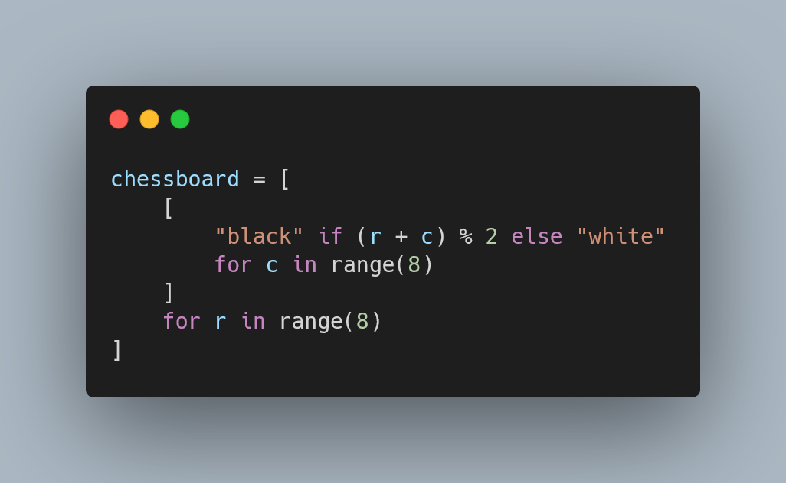

This article teaches you more advanced patterns and use cases for list comprehensions.

===



(If you are new here and have no idea what a Pydon't is, you may want to read the
[Pydon't Manifesto][manifesto].)


# Introduction

Python is a language that has a rich set of built-in functions and operators that work really well with the built-in types.
For example, the operator `+` works on numbers, as addition, but it also works on strings, lists, and tuples, as concatenation:

```pycon
>>> 1 + 2.3
3.3
>>> [1, 2, 3] + [4, 5, 6]
[1, 2, 3, 4, 5, 6]
```

But what is it that defines that `+` is addition for numbers (integers and floats)
and concatenation for lists, tuples, strings?
What if I wanted `+` to work on other types?
Can I do that?

The short answer is “yes”, and that happens through **dunder methods**,
the object of study in this Pydon't.
In this Pydon't, you will

 - understand what are dunder methods;
 - why they are called like that;
 - see various useful dunder methods;
 - learn about what dunder methods correspond to what built-ins;
 - write your own dunder methods for example classes; and
 - realise that dunder methods are like any other method you have written before.


<!--v-->
!!! You can now get your free copy of the ebook “Pydon'ts – Write beautiful Python code” [on Gumroad][gumroad-pydonts]
!!! to help support the series of “Pydon't” articles 💪.
<!--^-->


#


# Conclusion

Here's the main takeaway of this Pydon't, for you, on a silver platter:

 > “”

This Pydon't showed you that:

 - 

<!-- v -->
If you liked this Pydon't be sure to leave a reaction below and share this with your friends and fellow Pythonistas.
Also, [don't forget to subscribe to the newsletter][subscribe] so you don't miss
a single Pydon't!
<!-- ^ -->

[subscribe]: https://mathspp.com/subscribe
[manifesto]: /blog/pydonts/pydont-manifesto
[gumroad-pydonts]: https://gum.co/pydonts

[list-comps]: /blog/pydonts/list-comprehensions-101
