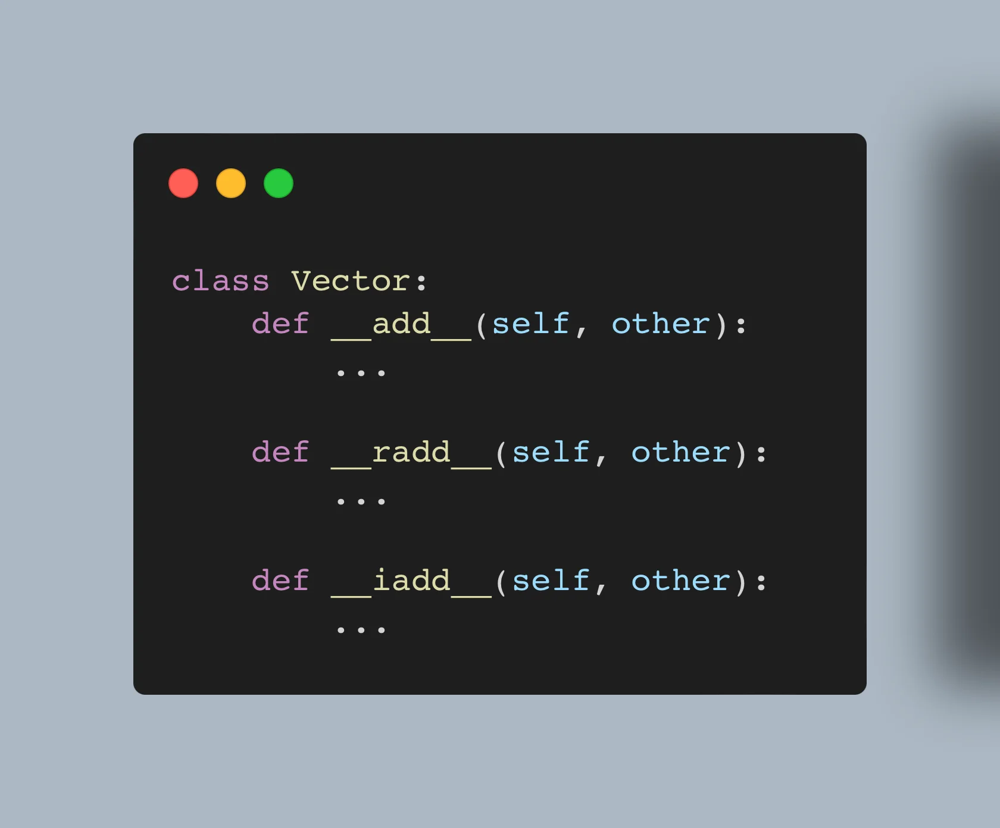

This article shows you how to overload the arithmetic operators in Python with dunder methods.

===



# Introduction

Python lets you override the arithmetic operators like `+` for addition or `*` for multiplication through [dunder methods][dunder-methods].
[Dunder methods][dunder-methods] are special methods whose name starts and ends with a double underscore (hence, “dunder”), and some [dunder methods][dunder-methods] are specific to arithmetic operations.

In this Pydon't, you will learn:

 - how to implement unary arithmetic operators:
   - negation (`-p`);
   - (`+p`);
   - absolute value (`abs(p)`); and
   - inverse (`~`).
 - how to implement binary arithmetic operators:
   - addition (`+`);
   - subtraction (`-`);
   - multiplication (`*`);
   - division (`/`);
   - floor division (`//`);
   - modulo (`%`);
   - (`divmod`); and
   - exponentiation (`pow`).
 - how to implement binary arithmetic operators for bitwise operations:
   - left shift (`<<`);
   - right shift (`>>`);
   - bitwise and (`&`);
   - bitwise or (`|`);
   - bitwise xor (`^`);
 - what the reflected arithmetic dunder methods are;
 - what the augmented arithmetic dunder methods are;
 - what `NotImplemented` is and how it differs from `NotImplementedError`; and
 - how Python determines which arithmetic dunder method to call.

We will start by explaining how dunder methods work and we will give a couple of examples by implementing the unary operators.
Then, we introduce the mechanics behind the binary arithmetic operators, basing the examples on the binary operator `+`.

After we introduce all the concepts and mechanics that Python uses to handle binary arithmetic operators, we will provide an example of a class that implements all the arithmetic dunder methods that have been mentioned above.


<!--v-->
!!! You can now get your free copy of the ebook “Pydon'ts – Write beautiful Python code” [on Gumroad][gumroad-pydonts]
!!! to help support the series of “Pydon't” articles 💪.
<!--^-->


# The example we will be using

The example we will be using throughout this article will be that of a `Vector`.
A `Vector` will be a class for geometrical vectors, like vectors in 2D, or 3D, and it will provide operations to deal with vectors.
For example, by the end of this article, you will have an implementation of `Vector` that lets you do things like these:

```pycon
>>> from vector import Vector
>>> v = Vector(3, 2)
>>> v + Vector(4, 10)
Vector(7, 12)
>>> 3 * v
(9, 6)
>>> -v
(-3, -2)
```

Let us go ahead and start!

This is the starting vector for our class `Vector`:

```py
# vector.py
class Vector:
    def __init__(self, *coordinates):
        self.coordinates = coordinates

    def __repr__(self):
        return f"Vector{self.coordinates}"


if __name__ == "__main__":
    print(Vector(3, 2))
```

Running this code will show this output:

```
Vector(3, 2)
```

This starting vector also shows two dunder methods that we are using right off the bat:

 1. we use [the dunder method `__init__`][dunder-init] to initialise our `Vector` instance; and
 2. we use [the dunder method `__repr__`][dunder-repr] to provide a string representation of our `Vector` objects.

This shows that dunder methods are **not** magical.
They look funny because of the leading and trailing underscores in their names, but they are regular Python methods that Python calls automatically.

We will start by covering the unary arithmetic operations because those are simpler.
Then, we will move along to the binary arithmetic operations.
Good luck! 🐍🚀


# Your first arithmetic dunder method

Take a look at this piece of code:

```pycon
>>> x = 73
>>> -x
-73
```

Does the result surprise you?
Probably not!

Now, look at this:

```pycon
>>> x = 73
>>> x.__neg__()
-73
```

Was this surprising?
The method `__neg__` is the dunder method that is responsible for implementing the unary operation of negation.

Currently, our class `Vector` does not have support for the operation of negation:

```pycon
>>> v = Vector(1, 2)
>>> -v
Traceback (most recent call last):
  File "<stdin>", line 1, in <module>
TypeError: bad operand type for unary -: 'Vector'
```

If we implement a method `__neg__` in our class `Vector`, we can add support for this operation.
The method `__neg__` only accepts the argument `self` and should return the result of negating `self`.
For illustrative purposes, we can start by implementing a method `__neg__` that always returns `"Hello, world!"`:

```py
class Vector:
    ...

    def __neg__(self):
        return "Hello, world!"
```

Now, we can use the unary operation minus:

```pycon
>>> -Vector(1, 2)
'Hello, world!'
```

Of course, it doesn't make much sense for the negation of a vector to be the string `"Hello, world!"`.

The unary negation we will implement for real will negate each coordinate, one by one:

```py
class Vector:
    ...

    def __neg__(self):
        return Vector(*[-coord for coord in self.coordinates])
```

This is a more sensible operation, which enables this:

```pycon
>>> -Vector(1, -2, 3, -4)
Vector(-1, 2, -3, 4)
```

That's it!
This was your first arithmetic dunder method! 🎉

Now, we'll implement the remaining unary arithmetic operations.


# The dunder methods for the unary arithmetic operations

There are four unary arithmetic operations for a vector `v`:

 1. `-v` is negation and is implemented via `__neg__`;
 2. `+v` is implemented via `__pos__` (I have no idea what it's called!);
 3. `abs(v)` is the absolute coord and is implemented via `__abs__`; and
 4. `~v` is inversion and is implemented via `__invert__`.

These four dunder methods are all unary, which means the only argument they take is `self`, which is going to be the instance of `Vector` that they need to operate on.


## The dunder method `__neg__` for negation

This one was already implemented above!


## The dunder method `__pos__`

When used on integers and floats, `__pos__` acts as a no-op:

```pycon
>>> x = 73
>>> +x
73
>>> x.__pos__()
73

>>> x = -73
>>> +x
-73
>>> x.__pos__()
-73
```

So, we will do the same thing for vectors.
However, because the other unary arithmetic operations return _different_ instances, we will be sure to return a _different_ instance that has the same coordinates:

```py
class Vector:
    ...

    def __pos__(self):
        return Vector(*self.coordinates)

if __name__ == "__main__":
    v = Vector(1, 2, 3)
    print(+v)  # Vector(1, 2, 3)
    print((+v) is v)  # False
```


## The dunder method `__abs__` for the absolute value

The dunder method `__abs__` is called when we use the built-in `abs`.

```pycon
>>> 1 + 2j
(1+2j)
>>> abs(1 + 2j)
2.23606797749979
>>> (1 + 2j).__abs__()
2.23606797749979
```

For our class `Vector`, we will return the _magnitude_ of the vector, which is the square root of the sum of the squares of all the coordinates.

```py
class Vector:
    ...

    def __abs__(self):
        return pow(sum(coord ** 2 for coord in self.coordinates), 0.5)

if __name__ == "__main__":
    v = Vector(1, 2)
    print(abs(v))
```


## The dunder method `__invert__` for inversion

The dunder method `__invert__` is called when the unary arithmetic operation `~` is used.
For integers, this operation is based on binary.
(Try to figure out what it does!)

For our class `Vector`, we can do whatever we want.
The operation I'm implementing is inspired by geometry.
It looks like this:

```py
class Vector:
    ...

    def __invert__(self):
        """Compute a vector that is orthogonal to this one."""
        if len(self.coordinates) <= 1:
            raise TypeError(
                f"Cannot invert vector of length {len(self.coordinates)}."
            )

        # Look for two non-zero coordinates to swap.
        to_flip = [0, 1]
        for idx, coord in enumerate(self.coordinates):
            if coord:
                to_flip.append(idx)

        # Zero out all coordinates...
        coordinates = [0] * len(self.coordinates)
        # except the two we are swapping out.
        coordinates[to_flip[-1]] = self.coordinates[to_flip[-2]]
        coordinates[to_flip[-2]] = -self.coordinates[to_flip[-1]]
        return Vector(*coordinates)
```

What does this do?
Given a vector, it will look for two coordinates that are _not_ zero and it will swap them out, while also flipping the sign in one of them.
All other coordinates of the result will be 0.

Here are some small examples:

```pycon
>>> ~Vector(1, 2, 3)
Vector(0, -3, 2)
>>> ~Vector(1, 0, 3)
Vector(-3, 0, 1)
>>> ~Vector(1, 0, 0)
Vector(0, -1, 0)
```

Here are some examples with longer vectors:

```pycon
>>> ~Vector(1, 2, 3, 4, 5, 6, 7)
Vector(0, 0, 0, 0, 0, -7, 6)
>>> ~Vector(1, 0, 0, 0, 5, 0, 0)
Vector(-5, 0, 0, 0, 1, 0, 0)
>>> ~Vector(0, 2, 0, 4, 0, 0, 7)
Vector(0, 0, 0, -7, 0, 0, 4)
```

This is not a random operation I came up with, it is something from geometry.
You can read [this Wikipedia article](https://en.wikipedia.org/wiki/Orthogonality) to learn about "orthogonal vectors".
This will also make more sense when we implement the dunder method `__matmul__`, later.


## Unary arithmetic operations summary

If you got to this point, it means you have implemented all unary arithmetic operations.
Good job! 🚀

Here is all the code up until this point:

```py
class Vector:
    def __init__(self, *coordinates):
        self.coordinates = coordinates

    def __repr__(self):
        return f"Vector{self.coordinates}"

    def __matmul__(self, other):
        return sum(c1 * c2 for c1, c2 in zip(self.coordinates, other.coordinates))

    def __neg__(self):
        return Vector(*[-coord for coord in self.coordinates])

    def __pos__(self):
        return Vector(*self.coordinates)

    def __abs__(self):
        return pow(sum(coord**2 for coord in self.coordinates), 0.5)

    def __invert__(self):
        """Compute a vector that is orthogonal to this one."""
        if len(self.coordinates) <= 1:
            raise TypeError(
                f"Cannot invert vector of length {len(self.coordinates)}."
            )

        # Look for two non-zero coordinates to swap.
        to_flip = [0, 1]
        for idx, coord in enumerate(self.coordinates):
            if coord:
                to_flip.append(idx)

        # Zero out all coordinates...
        coordinates = [0] * len(self.coordinates)
        # except the two we are swapping out.
        coordinates[to_flip[-1]] = self.coordinates[to_flip[-2]]
        coordinates[to_flip[-2]] = -self.coordinates[to_flip[-1]]
        return Vector(*coordinates)
```


# The dunder methods for binary arithmetic operations

Up until now, we dealt with _unary_ operators.
This means that the operator expected a _single_ object to work with.
As we delve into _binary_ operators, the dunder methods we will implement will take two arguments: `self` and `other`.

This will be explained right away, as we start implementing addition.


# Addition and the dunder method `__add__`

To implement addition between our `Vector` instances we need to implement the dunder method `__add__`.
When Python finds an expression like `a + b`, Python will try to run `a.__add__(b)`, which is why we can use the dunder method `__add__` to implement addition for our objects.

Because addition is a binary operator (you add _two_ things), the dunder method `__add__` takes two arguments:

 1. `self`; and
 2. the other thing that is being added, that we typically call `other`.

Remember:
`a + b` turns into `a.__add__(b)`, which is a regular method call!
So, `b` will be the “`other`” thing that we want to add to `self` and will be passed in as an argument.

For our `Vector` class, the signature of `__add__` looks like this:

```py
class Vector:
    ...

    def __add__(self, other):
        ...
```

Now, instead of `...` we just need to provide the actual implementation.
Adding `Vector` instances amounts to adding up all their respective coordinates:

```py
class Vector:
    ...

    def __add__(self, other):
        result_coordinates = [a + b for a, b in zip(self.coordinates, other.coordinates)]
        return Vector(*result_coordinates)


if __name__ == "__main__":
    print(Vector(3, 2) + Vector(10, 4))  # Vector(13, 6)
```

!!! I'm using a [list comprehension][list-comp] and the built-in [`zip`][zip] to go over the respective coordinates of each `Vector` instance.

This is all it takes to implement a dunder method.


# Adding validation to your dunder methods

Now, the implementation we provided above is pretty barebones.
For example, it is going to raise an interesting error if we try to add a vector to an integer:

```pycon
>>> Vector(1, 2) + 3
Traceback (most recent call last):
  File "<stdin>", line 1, in <module>
  File "/Users/rodrigogs/Documents/vector.py", line 9, in __add__
    result_coordinates = [a + b for a, b in zip(self.coordinates, other.coordinates)]
                                                        ^^^^^^^^^^^^
AttributeError: 'int' object has no attribute 'coordinates'
```

We get an error because we _assumed_ that `other` was going to be an instance of a `Vector`, but we tried to add a vector and an integer, and so our assumption didn't hold.
In general, you will want to use `isinstance` to make sure you can do the operation you really want to do:

```py
class Vector:
    ...

    def __add__(self, other):
        if isinstance(other, Vector):
            result_coordinates = [a + b for a, b in zip(self.coordinates, other.coordinates)]
            return Vector(*result_coordinates)
```

When we add this check, the error goes away entirely:

```pycon
>>> from vector import Vector
>>> Vector(1, 2) + 3
>>> # It didn't error?!
```

That is also not quite what we wanted.
What we would like to see is one of those `TypeError`s that the language raises when we mix types in the wrong way:

```pycon
>>> 3 + "3"
Traceback (most recent call last):
  File "<stdin>", line 1, in <module>
TypeError: unsupported operand type(s) for +: 'int' and 'str'
```

How do we raise this error?
You might think of actually raising the error yourself, with `raise TypeError(...)`, but there is a built-in mechanism that does this.


# Using `NotImplemented` to flag operations you don't support

## The built-in constant `NotImplemented`

When there is a combination of arguments that you do not have support for, you need to return the built-in constant `NotImplemented`.

The `NotImplemented` constant is like `None` in the sense that it is built-in and that there is only one.
You don't instantiate `None` values, you just use the value `None`.
Similarly, you don't instantiate `NotImplemented` values, you just use `NotImplemented`.

If you need to return `NotImplemented` if you do not know how to add the vector with the other argument, you need to modify the method `__add__` like so:

```py
class Vector:
    ...

    def __add__(self, other):
        if isinstance(other, Vector):
            result_coordinates = [a + b for a, b in zip(self.coordinates, other.coordinates)]
            return Vector(*result_coordinates)
        return NotImplemented
```

! You should _return_ the value `NotImplemented`.
! Please, do not mistake this for _returning_ the value `NotImplementedError` or for _raising_ the exception `NotImplementedError`.

When you return `NotImplemented`, you are telling Python that a vector cannot be added with whatever type `other` was, so Python will take care of raising the appropriate `TypeError` for you:

```pycon
>>> from vector import Vector
>>> Vector(1, 2) + 3
Traceback (most recent call last):
  File "<stdin>", line 1, in <module>
TypeError: unsupported operand type(s) for +: 'Vector' and 'int'
```

You can even see this is what happens behind the curtains with some built-in types!
For example, `3 + "hello"` raises an error, but `(3).__add__("hello")` returns `NotImplemented`:

```pycon
>>> (3).__add__("hello")
NotImplemented
```


## The difference between `NotImplemented` and `NotImplementedError`

The two built-ins `NotImplemented` and `NotImplementedError` may look similar, but they have very distinct use cases.

The built-in _constant_ `NotImplemented` is used _only_ in the context of arithmetic dunder methods to tell Python that a specific operation can't be handled by a specific class, whereas the built-in _exception_ `NotImplementedError` is raised when you have defined the body of a function or a method to specify its signature, but you haven't implemented the behaviour yet.

This is useful, for example, when you use a class as an abstract base class and you specify the signatures of the methods that the subclasses will need, but you don't implement them because it is up to the subclasses to provide that behaviour.
Here is a short `Shape` example:

```py
class Shape:
    def __init__(self, name):
        self.name = name

    def area(self):
        raise NotImplementedError("Subclass must implement this method")

    def perimeter(self):
        raise NotImplementedError("Subclass must implement this method")
```

The `Shape` specifies that all subclasses of the class `Shape` must implement the methods `area` and `perimeter`:

```py
class Rectangle(Shape):
    def __init__(self, length, width):
        super().__init__("Rectangle")
        self.length = length
        self.width = width

    def area(self):
        return self.length * self.width

    def perimeter(self):
        return 2 * (self.length + self.width)

rect = Rectangle(5, 3)
print(rect.area()) # 15
print(rect.perimeter()) # 16
```

!!! Python has more complete mechanisms to handle abstract base classes (called interfaces, in other languages), but this small example illustrates the point.


# Extending your dunder method to more types

Before taking this little tangent about the difference between `NotImplemented` and `NotImplementedError`, we saw that our vectors cannot be added to integers.
However, we wish to extend our implementation of `Vector` to handle integer and float addition.
To add an integer or a float to a `Vector` means that all coordinates of the `Vector` get shifted by the given amount.

To implement that behaviour, we need to add an extra branch to our `if` statement inside `__add__`:

```py
class Vector:
    ...

    def __add__(self, other):
        if isinstance(other, Vector):
            result_coordinates = [a + b for a, b in zip(self.coordinates, other.coordinates)]
            return Vector(*result_coordinates)
        elif isinstance(other, (int, float)):
            result_coordinates = [coord + other for coord in self.coordinates]
            return Vector(*result_coordinates)
        return NotImplemented
```

Now, `Vector` instances can be added to numbers!
It works with integers:

```py
class Vector:
    ...

if __name__ == "__main__":
    print(Vector(1, 2) + 3)  # Vector(4, 5)
```

It works with floats:

```py
class Vector:
    ...

if __name__ == "__main__":
    print(Vector(1, 2) + 3)  # Vector(4, 5)
    print(Vector(1, 2) + 4.5)  # Vector(5.5, 6.5)
```

And it even works backwards:

```py
class Vector:
    ...

if __name__ == "__main__":
    print(Vector(1, 2) + 3)  # Vector(4, 5)
    print(Vector(1, 2) + 4.5)  # Vector(5.5, 6.5)
    print(3 + Vector(1, 2))  # Raises: TypeError: unsupported operand type(s) for +: 'int' and 'Vector'
```

Huh?
What do you mean?
We _just_ implemented addition between instances of `Vector` and `int`...

Let us add a couple of print statements for debugging:

```py
class Vector:
    ...

    def __add__(self, other):
        print(f"About to add {self} with {other}")
        if isinstance(other, Vector):
            result_coordinates = [a + b for a, b in zip(self.coordinates, other.coordinates)]
            return Vector(*result_coordinates)
        elif isinstance(other, (int, float)):
            print(f"{other} is an int or a float!")
            result_coordinates = [coord + other for coord in self.coordinates]
            return Vector(*result_coordinates)
        return NotImplemented

if __name__ == "__main__":
    print("Vector plus int")
    print(Vector(1, 2) + 3)  # Vector(4, 5)
    print()
    print("Vector plus float")
    print(Vector(1, 2) + 4.5)  # Vector(5.5, 6.5)
    print()
    print("int plus Vector")
    print(3 + Vector(1, 2))  # Raises: TypeError: unsupported operand type(s) for +: 'int' and 'Vector'
```

Now, if we re-run the file, we see... Nothing!
This is the output:

```
Vector plus int
About to add Vector(1, 2) with 3
3 is an int or a float!
Vector(4, 5)

Vector plus float
About to add Vector(1, 2) with 4.5
4.5 is an int or a float!
Vector(5.5, 6.5)

int plus Vector
Traceback (most recent call last):
  File "/Users/rodrigogs/Documents/vector.py", line 29, in <module>
    3 + Vector(1, 2)
    ~~^~~~~~~~~~~~~
TypeError: unsupported operand type(s) for +: 'int' and 'Vector'
```

Notice that we get the error without seeing the prints from within `__add__`...
And you know why?
Well, obviously because `__add__` never got called.

Let me explain:


# Reflected dunder methods

To be precise, when your arithmetic dunder method returns `NotImplemented`, it tells Python that that specific method call failed.
For example, when `Vector.__add__` returns `NotImplemented`, it tells Python that the class `Vector` does not know how to add vectors with whatever was in the argument `other`.

However, when Python sees the return value `NotImplemented` coming out of an arithmetic dunder method, Python does not raise the `TypeError` exception immediately!
In fact, it will try to run a plan B, first.

When you write `a + b`, Python will start by trying to run `a.__add__(b)`.
If that fails (that is, if it returns `NotImplemented`), Python will then try to run `b.__radd__(a)`!

!!! Notice that I wrote `__radd__` with an extra `r`, and not just `__add__`.

`__radd__` is the “reflected dunder dunder `__add__`”, and it is like the plan B for addition.

So, when we wrote `3 + Vector(1, 2)`, Python started by trying to run `(3).__add__(Vector(1, 2))`, which returns `NotImplemented`:

```py
>>> from vector import Vector
>>> (3).__add__(Vector(1, 2))
NotImplemented
```

Then, Python will try to run `Vector(1, 2).__radd__(3)`.
Because we have not implemented that method, Python raises the exception `TypeError`.

All other arithmetic dunder methods also have a “reflected” version which has the same name but with the letter `r` prefixed.
_Some_ examples of reflected dunder methods include:

 - the method `__rsub__` which is the reflected dunder method for subtraction;
 - the method `__rmul__` which is the reflected dunder method for multiplication; or
 - the more exotic method `__rpow__` which is the reflected dunder method for exponentiation.

So, all things considered, if we want to be able to write expressions like `3 + Vector(1, 2)`, we need to implement the dunder method `Vector.__radd__`.


# Implementing reflected dunder methods

## Commutative operations

For our example, `Vector(1, 2) + 3` is supposed to return the same value as `3 + Vector(1, 2)`, so we can implement `__radd__` in terms of `__add__`:

```py
class Vector:
    ...

    def __radd__(self, other):
        print(f"Inside __radd__ with {self} and {other}")
        return self + other

if __name__ == "__main__":
    print(3 + Vector(1, 2))
```

If you run this code, it outputs the following:

```py
Inside __radd__ with Vector(1, 2) and 3
About to add Vector(1, 2) with 3
3 is an int or a float!
Vector(4, 5)
```

In fact, because addition with instances of `Vector` is commutative (that is, the result does not depend on the order of the left and right operands), you could even say that `__radd__ = __add__`:

```py
class Vector:
    ...

    def __add__(self, other):
        # Implementation omitted for brevity...

    __radd__ = __add__
```

This would still work.
Give it a try.


## Non-commutative operations

Not all arithmetic operations are commutative.
In fact, even addition isn't _always_ commutative!
Addition of strings – which we call concatenation – isn't commutative because `a + b` is usually different from `b + a`:

```pycon
>>> a = "Hello, "
>>> b = "world!"
>>> a + b
'Hello, world!'
>>> b + a
'world!Hello, '
```

When the operation isn't commutative, you have to implement the reflected dunder method like any other dunder method.
You will see examples of this throughout this article.


## `NotImplemented` in reflected dunder methods

Reverse dunder methods should _also_ return `NotImplemented` when the operation isn't defined for certain types of other arguments.

For example, if we were to implement `__radd__` explicitly for `Vector`, we would still return `NotImplemented` at the end of the method.
Suppose that we didn't:

```py
class Vector:
    ...

    def __radd__(self, other):
        print(f"About to radd {self} with {other}")
        if isinstance(other, Vector):
            result_coordinates = [a + b for a, b in zip(self.coordinates, other.coordinates)]
            return Vector(*result_coordinates)
        elif isinstance(other, (int, float)):
            print(f"{other} is an int or a float!")
            result_coordinates = [coord + other for coord in self.coordinates]
            return Vector(*result_coordinates)
        # return NotImplemented  # <-- Do we need this?
```

Can you guess what's going to happen now?
What should be the result of running the code below?

```py
class Vector:
    ...


if __name__ == "__main__":
    print("Adding a list and a vector:")
    print([1, 2] + Vector(1, 2))
```

Addition between lists and vectors is not defined, so this should result in a `TypeError`.
However, because `Vector.__radd__` does not return `NotImplemented`, Python actually thinks that this results in `None`.
The output of running that code is:

```
Adding a list and a vector:
About to radd Vector(1, 2) with [1, 2]
None
```

What is happening here is that the method `__radd__` has no explicit return at the end, which means the method returns `None` when using `__radd__` to add a `Vector` to something else that isn't a `Vector`, an integer, or a float.

If we want to get the `TypeError`, we need to return `NotImplemented`:

```py
class Vector:
    ...

    def __radd__(self, other):
        print(f"About to radd {self} with {other}")
        if isinstance(other, Vector):
            result_coordinates = [a + b for a, b in zip(self.coordinates, other.coordinates)]
            return Vector(*result_coordinates)
        elif isinstance(other, (int, float)):
            print(f"{other} is an int or a float!")
            result_coordinates = [coord + other for coord in self.coordinates]
            return Vector(*result_coordinates)
        return NotImplemented  # <-- We need this!
```

Now, when we run this code, Python gives us a great error message:

```
About to radd Vector(1, 2) with [1, 2]
Traceback (most recent call last):
  File "/Users/rodrigogs/Documents/vector.py", line 43, in <module>
    print([1, 2] + Vector(1, 2))
          ~~~~~~~^~~~~~~~~~~~~
TypeError: can only concatenate list (not "Vector") to list
```


## Reflected dunder methods and subclasses

There is another situation in which reflected dunder methods come in handy, and that is when the right operand is from a subclass of the left operand.
Let me explain.

You are writing some code and you implement a class `S` that just holds a string.
Then, you implement addition between instances of the type `S`:

```py
class S:
    def __init__(self, value):
        self.value = value

    def __add__(self, other):
        if isinstance(other, S):
            return self.value + other.value
        return NotImplemented
```

This works just fine:

```pycon
>>> s1 = S("Hello, ")
>>> s2 = S("world!")
>>> s1 + s2
'Hello, world!'
```

Then, you decide to create a subclass of `S`, called `E`, which always holds the empty string.
Something like this:

```py
class E(S):
    def __init__(self):
        super().__init__("")
```

Because `E` is a subclass of `S`, you can add instances of `S` and `E` without a problem:

```pycon
>>> S("Hey") + E()
'Hey'
>>> E() + S("Hey")
'Hey'
>>> E() + E()
''
```

Everything is fine, right?
However, `E` is _always_ the empty string, which means that when you add an instance of `E` to another instance of `S`, the result is _always_ the string saved in the other instance, right?

So, you could optimise addition with instances of the type `E` by saying that you only need to return the string from the other instance.
Something like this:

```py
class S:
    def __init__(self, value):
        self.value = value

    def __add__(self, other):
        print("S.__add__")  # <-- Added this here.
        if isinstance(other, S):
            return self.value + other.value
        return NotImplemented


class E(S):
    def __init__(self):
        super().__init__("")

    def __add__(self, other):
        print("E.__add__")  # <-- Helper print.
        if isinstance(other, S):
            return other.value
        return NotImplemented

    def __radd__(self, other):
        print("E.__radd__")  # <-- Helper print.
        if isinstance(other, S):
            return other.value
        return NotImplemented
```

Because this behaviour is more specialised and because it comes from a subclass of `S`, Python will give priority to `E`'s way of adding things together if we try to add an instance of `S` with an instance of `E`:

```pycon
>>> S("Oi") + E()
E.__radd__
'Oi'
```

Notice that we didn't see the print from `S.__add__` because `E.__radd__` has priority over `S.__add__`.
That priority comes from the fact that `E` is a subclass of `S`.

To conclude, in an expression `a + b`, the call `b.__radd__(a)` will happen if:

 1. the call `a.__add__(b)` returned `NotImplemented`; or
 2. the type of `b` is a subclass of the type of `a`, in which case `b.__radd__(a)` is called _before_ `a.__add__(b)`.


# Augmented arithmetic assignment

In Python, we can write things like `counter += 1` and `multiplier *= 2`.
This is called augmented assignment and there are dunder methods used to implement this behaviour.

The dunder methods that are used for augmented assignment start with an “i”, which I am guessing stands for “in-place”.
The rationale for these methods is that they should try to do the operation in-place.
If it makes sense for your object to be modified in place, then you should implement the augmented arithmetic assignment dunder methods.
For example, for addition that is going to be `__iadd__`.

Of course, augmented assignment works even without implementing the dunder method `__iadd__`.
Try running this code:

```py
if __name__ == "__main__":
    v = Vector(1, 2)
    print(v, id(v))
    v += Vector(3, 4)
    print(v, id(v))
```

The output should be the following:

```bash
❯ python point.py
Vector(1, 2) 4305034320
About to add Vector(1, 2) with Vector(3, 4)
Vector(4, 6) 4305036176
```

Notice two things:

 1. We see the helper `print` from the dunder method `__add__`; and
 2. The ID of the vector changed.

That is because, when running `v += ...`, Python wants to do `v.__iadd__(...)` but it can't, because we haven't implemented that method.
So, Python unrolls the augmented assignment and tries to evaluate `v = v + ...` instead, which is why we saw that `__add__` was called.

To provide a true augmented assignment implementation, we could write something like this:

```py
class Vector:
    ...

    def __iadd__(self, other):
        if isinstance(other, Vector):
            self.coordinates = tuple(
                self_coord + other_coord
                for self_coord, other_coord in zip(self.coordinates, other.coordinates)
            )
            return self
        elif isinstance(other, (int, float)):
            self.coordinates = tuple(coord + other for coord in self.coordinates)
            return self
        return NotImplemented


if __name__ == "__main__":
    v = Vector(1, 2)
    print(v, id(v))
    v += Vector(3, 4)
    print(v, id(v))
```

If you run this, the output you get is

```bash
❯ python point.py
Vector(1, 2) 4342701264
Vector(4, 6) 4342701264
```

As you can see, the ID of `v` doesn't change because we implemented a true in-place dunder method.
Another thing to note is that even though we are modifying `self`, we still need to return the result.
(Which is `self`.)


# Full implementation of all arithmetic dunder methods

In this section, we will take all of the knowledge from the previous sections and provide an example class that provides a full implementation of all the arithmetic operators and respective dunder methods:

 - [subtraction `-`](#subtraction-and-the-operator)
 - [multiplication `*`](#multiplication-and-the-operator)
 - [division `/`](#division-and-the-operator)
 - [floor division `//`](#floor-division-and-the-operator)
 - [modulo `%`](#modulo-and-the-operator)
 - [`divmod`](#divmod-and-the-built-in-function-divmod)
 - [exponentiation `**`/`pow`](#exponentation-and-the-operator--and-built-in-function-pow)
 - [matrix multiplication `@`](#matrix-multiplication-and-the-operator)
 - [bitwise left shift `<<`](#bitwise-left-shift-and-the-operator)
 - [bitwise right shift `>>`](#bitwise-right-shift-and-the-operator)
 - [bitwise and `&`](#bitwise-and-and-the-operator)
 - [bitwise exclusive or `^`](#bitwise-exclusive-or-xor-and-the-operator)
 - [bitwise or `|`](#bitwise-or-and-the-operator)


## Subtraction and the operator `-`

The binary operator `-` is the binary operator for subtraction.
It is common for addition and subtraction to be closely related and, when they are, you _can_ exploit those relationships.

### Example of the dunder methods `__sub__`, `__rsub__`, and `__isub__` for subtraction

For plain subtraction, we can realise that `a - b` is just `a + (-b)`, and we already implemented the unary negation operator (with the dunder method `__neg__`), so we can use that shortcut:

```py
class Vector:
    ...

    def __sub__(self, other):
        return self + (-other)

if __name__ == "__main__":
    v = Vector(1, 2)
    print(v - 1)
    print(v - Vector(1, 2))
```

This code produces the following output:

```bash
❯ python point.py
About to add Vector(1, 2) with -1
-1 is an int or a float!
Vector(0, 1)
About to add Vector(1, 2) with Vector(-1, -2)
Vector(0, 0)
```

Of course, because we implemented subtraction in terms of addition and negation, we get a bunch of prints from those dunder methods.

To implement reflected subtraction in terms of addition and negation, we need to be careful!
In `Vector.__rsub__`, we will have `self` and `other` and we will be trying to compute `other - self`, so we need to return `other + (-self)`:

```py
class Vector:
    ...

    def __rsub__(self, other):
        return other + (-self)

if __name__ == "__main__":
    p = Vector(1, 2)
    print(1 - p)
```

This code produces the following output:

```bash
❯ python point.py
About to radd Vector(-1, -2) with 1
1 is an int or a float!
Vector(0, -1)
```

Finally, to implement augmented subtraction, we can do it in terms of augmented addition:

```py
class Vector:
    ...

    def __isub__(self, other):
        self += -other
        return self

if __name__ == "__main__":
    v = Vector(1, 2)
    print(v, id(v))
    v -= 2
    print(v, id(v))
```

This produces the following output:

```bash
❯ python point.py
Vector(1, 2) 4372225424
Vector(-1, 0) 4372225424
```


## Multiplication and the operator `*`

The binary operator `*` is the operator for multiplication.
Multiplying a vector with another number will produce a second vector whose coordinates have all been multiplied by that single number.

### Example of the dunder methods `__mul__`, `__rmul__`, and `__imul__` for multiplication

```py
class Vector:
    ...

    def __mul__(self, other):
        if isinstance(other, (int, float)):
            coordinates = [coord * other for coord in self.coordinates]
            return Vector(*coordinates)
        return NotImplemented

if __name__ == "__main__":
    v = Vector(1, 2)
    print(v * 10)
```

```bash
❯ python point.py
Vector(10, 20)
```

Multiplication between vectors and numbers is commutative, so we implement `__rmul__` in terms of `__mul__`:

```py
class Vector:
    ...

    def __rmul__(self, other):
        return self * other

if __name__ == "__main__":
    v = Vector(1, 2)
    print(v * 10)
    print(0.1 * v)
```

```bash
❯ python point.py
Vector(10, 20)
Vector(0.1, 0.2)
```

Augmented multiplication is very similar to regular multiplication, although we return `self` instead of a new object:

```py
class Vector:
    ...

    def __imul__(self, other):
        if isinstance(other, (int, float)):
            self.coordinates = tuple(coord * other for coord in self.coordinates)
            return self
        return NotImplemented

if __name__ == "__main__":
    v = Vector(1, 2)
    print(v, id(v))
    v *= 10
    print(v, id(v))
```

```bash
❯ python point.py
Vector(1, 2) 4301232784
Vector(10, 20) 4301232784
```


## Division and the operator `/`

Given that addition, subtraction, and multiplication, are called `__add__`, `__sub__`, and `__mul__`, respectively, one might assume that division is called `__div__`.
However, `/` is called `__truediv__`.
That is to disambiguate from `//`, which is then called `__floordiv__`.

For division, we will say that a vector can be divided by a number or vice-versa.
In both cases, we will just take the number and map the division out across all coordinates of the vector.

### Example of the dunder methods `__truediv__`, `__rtruediv__`, and `__itruediv__` for division

```py
class Vector:
    ...

    def __truediv__(self, other):
        if isinstance(other, (int, float)):
            coordinates = [coord / other for coord in self.coordinates]
            return Vector(*coordinates)
        return NotImplemented

    def __rtruediv__(self, other):
        if isinstance(other, (int, float)):
            coordinates = [other / coord for coord in self.coordinates]
            return Vector(*coordinates)
        return NotImplemented

    def __itruediv__(self, other):
        if isinstance(other, (int, float)):
            self.coordinates = tuple(coord / other for coord in self.coordinates)
            return self
        return NotImplemented


if __name__ == "__main__":
    v = Vector(1, 2, 3, 4)
    print(v / 2)
    print(2 / v)
    v /= 10
    print(v)
```

The code above produces the following output:

```bash
❯ python point.py
Vector(0.5, 1.0, 1.5, 2.0)
Vector(2.0, 1.0, 0.6666666666666666, 0.5)
Vector(0.1, 0.2, 0.3, 0.4)
```


## Floor division and the operator `//`

Floor division is `//` and its dunder method is `__floordiv__`, not to be confused with `__truediv__` for the operation of division `/`.

Much like with regular division, we will say that a vector can be divided by a number or vice-versa.
In both cases, we will just take the number and map the division out across all coordinates of the vector.

### Example of the dunder methods `__floordiv__`, `__rfloordiv__`, and `__ifloordiv__` for division

The implementation below was essentially copied and pasted from the implementation of `__truediv__` above, except I replaced the operation `/` with `//`...

```py
class Vector:
    ...

    def __floordiv__(self, other):
        if isinstance(other, (int, float)):
            coordinates = [coord // other for coord in self.coordinates]
            return Vector(*coordinates)
        return NotImplemented

    def __rfloordiv__(self, other):
        if isinstance(other, (int, float)):
            coordinates = [other // coord for coord in self.coordinates]
            return Vector(*coordinates)
        return NotImplemented

    def __ifloordiv__(self, other):
        if isinstance(other, (int, float)):
            self.coordinates = tuple(coord // other for coord in self.coordinates)
            return self
        return NotImplemented


if __name__ == "__main__":
    v = Vector(9, 12, 23, 24)
    print(v // 10)
    print(30 // v)
    v //= 10
    print(v)
```

The code above produces the following output:

```bash
❯ python point.py
Vector(0, 1, 2, 2)
Vector(3, 2, 1, 1)
Vector(0, 1, 2, 2)
```


## Modulo and the operator `%`

The binary operator `%` is the operator for modulo.
To keep in line with other operators, using modulo between a number and a vector will apply the operation element-wise.

### Example of the dunder methods `__mod__`, `__rmod__`, and `__imod__` for modulo

```py
class Vector:
    ...

    def __mod__(self, other):
        if isinstance(other, (int, float)):
            coordinates = [coord % other for coord in self.coordinates]
            return Vector(*coordinates)
        return NotImplemented

    def __rmod__(self, other):
        if isinstance(other, (int, float)):
            coordinates = [other % coord for coord in self.coordinates]
            return Vector(*coordinates)
        return NotImplemented

    def __imod__(self, other):
        if isinstance(other, (int, float)):
            self.coordinates = tuple(coord % other for coord in self.coordinates)
            return self
        return NotImplemented


if __name__ == "__main__":
    v = Vector(9, 12, 23, 24)
    print(v % 10)
    print(30 % v)
    v %= 10
    print(v)
```

The code above produces the following output:

```bash
❯ python point.py
Vector(9, 2, 3, 4)
Vector(3, 6, 7, 6)
Vector(9, 2, 3, 4)
```


## Divmod and the built-in function `divmod`

The built-in function `divmod` puts together the operators `/` (division) and `%` (modulo).
The function call `divmod(x, y)` should be equivalent to `(x / y, x % y)`, so that is the behaviour we implement.

### Example of the dunder methods `__divmod__` and `__rdivmod__` for divmod

Notice that there is no in-place/augmented operator `__idivmod__` for us to implement because we cannot write the augmented operator `divmod=`.
That does not make any sense in Python.

```py
class Vector:
    ...

    def __divmod__(self, other):
        if isinstance(other, (int, float)):
            return (self // other, self % other)
        return NotImplemented

    def __rdivmod__(self, other):
        if isinstance(other, (int, float)):
            return (other // self, other % self)
        return NotImplemented

if __name__ == "__main__":
    v = Vector(9, 12, 23, 24)
    print(divmod(v, 10))
    print(divmod(10, v))
```

The code above produces the following output:

```bash
❯ python point.py
(Vector(0, 1, 2, 2), Vector(9, 2, 3, 4))
(Vector(1, 0, 0, 0), Vector(1, 10, 10, 10))
```


## Exponentation and the operator `**` and built-in function `pow`

The operation of exponentiation can be expressed both via the binary operator `**` and the built-in function `pow`.
The operator `**` takes the left operand and raises it to the power of the right operand.
The built-in function `pow` does a similar thing, except that `pow` takes an optional third argument that is the modulo under which the exponentiation is computed.

For the implementation, we will allow either the left or right arguments of `**` to be vectors, but the other one must be a number.
Furthermore, the only value that is acceptable as the optional third argument is a number.

### Example of the dunder methods `__pow__`, `__rpow__`, and `__ipow__` for modulo

```py
class Vector:
    ...

    def __pow__(self, other, modulo=None):
        if isinstance(other, (int, float)):
            coordinates = [pow(coord, other, modulo) for coord in self.coordinates]
            return Vector(*coordinates)
        return NotImplemented

    def __rpow__(self, other, modulo=None):
        if isinstance(other, (int, float)):
            coordinates = [pow(other, coord, modulo) for coord in self.coordinates]
            return Vector(*coordinates)
        return NotImplemented

    def __ipow__(self, other, modulo=None):
        if isinstance(other, (int, float)):
            self.coordinates = tuple(
                pow(coord, other, modulo) for coord in self.coordinates
            )
            return self
        return NotImplemented

if __name__ == "__main__":
    print(2 ** Vector(0, 1, 2, 3, 4))
    # Some squares:
    print(Vector(1, 9, 37, 45, 467) ** 2)
    # Some squares, modulo 10
    print(pow(Vector(1, 9, 37, 45, 467), 2, 10))

    v = Vector(10, 100)
    v **= 2
    print(v)
```

The code above produces the following output:

```bash
❯ python point.py
Vector(1, 2, 4, 8, 16)
Vector(1, 81, 1369, 2025, 218089)
Vector(1, 1, 9, 5, 9)
Vector(100, 10000)
```


## Matrix multiplication and the operator `@`

The binary operator `@` is the operator for matrix multiplication.
At the time of writing, `@` isn't used for any operations in vanilla Python but it is used in places like NumPy, where matrix multiplication is a common operation.

In our example, `@` between two vectors will implement dot product, an operation that only works if the two vectors have the same length.
First, we multiply the corresponding coordinates of the two vectors together and then we sum those values.

Notice that `@` between two vectors will produce a single number.
Thus, `v1 @= v2` is an operation that may look like it does not make sense because `v1` will cease to be a vector and it will become a number.
However, this behaviour is in line with vanilla Python:

```pycon
>>> x = 3
>>> x *= [0]
>>> x
[0, 0, 0]
```

### Example of the dunder methods `__matmul__`, `__rmatmul__`, and `__imatmul__` for modulo

For matrix multiplication, the only thing we support is matrix multiplication between two vectors.
Because of that, we do not need to implement `__rmatmul__`.
So, we can either leave `__rmatmul__` out, or we define it but the only statement we include is `return NotImplemented`.

On a different note, because matrix multiplication between two vectors returns a number, there is also no point in defining `__imatmul__` because the statement `v1 @= v2` will not modify `v1` in place.
Instead, it will replace `v1` with the number result of the expression `v1 @ v2`.
So, we could implement `__imatmul__` to be equal to `__matmul__`, but there is no point.

Thus, for matrix multiplication, we can boil our code down to:

```py
class Vector:
    ...

    def __matmul__(self, other):
        if isinstance(other, Vector):
            return sum(c1 * c2 for c1, c2 in zip(self.coordinates, other.coordinates))
        return NotImplemented

    def __rmatmul__(self, other):
        return NotImplemented

if __name__ == "__main__":
    v = Vector(-3, 1, 2, 3)
    print(v @ (~v))
    v @= ~v
    print(v)
```

The code above produces the following output:

```bash
❯ python point.py
0
0
```


## Bitwise left shift and the operator `<<`

The binary operator `<<` is the bitewise left shift operator.
(It is called _bitewise_ because it operates on bits of integers.)

For vectors, we will implement the left shift operator with an integer argument and a vector argument, and it will rotate the coordinates of the vector the amount of times specified by the integer.
We will do the same thing, regardless of whether the integer shows up on the left or on the right.

Here are some examples:

```pycon
>>> v = Vector(1, 2, 3, 4)
>>> 0 << v
Vector(1, 2, 3, 4)
>>> v << 1  # Doesn't matter if `v` is on the left or right.
Vector(2, 3, 4, 1)
>>> 2 << v
Vector(3, 4, 1, 2)
```

### Example of the dunder methods `__lshift__`, `__rlshift__`, and `__ilshift__` for bitwise left shift

```py
class Vector:
    ...

    def __lshift__(self, other):
        if isinstance(other, int):
            coordinates = self.coordinates[other:] + self.coordinates[:other]
            return Vector(*coordinates)
        return NotImplemented

    def __rlshift__(self, other):
        if isinstance(other, int):
            coordinates = self.coordinates[other:] + self.coordinates[:other]
            return Vector(*coordinates)
        return NotImplemented

    def __ilshift__(self, other):
        if isinstance(other, int):
            self.coordinates = self.coordinates[other:] + self.coordinates[:other]
            return self
        return NotImplemented

if __name__ == "__main__":
    v = Vector(1, 2, 3, 4)
    print(0 << v)
    print(v << 1)
    print(2 << v)

    v <<= 2
    print(v)
```

The code above produces the following output:

```bash
❯ python point.py
Vector(1, 2, 3, 4)
Vector(2, 3, 4, 1)
Vector(3, 4, 1, 2)
Vector(3, 4, 1, 2)
```


## Bitwise right shift and the operator `>>`

The binary operator `>>` is the bitewise right shift operator.

Our implementation for the right shift operator will match the implementation for the left shift operator, seen above, but it will work in the other direction.

Here are some examples:

```pycon
>>> v = Vector(1, 2, 3, 4)
>>> 0 >> v
Vector(1, 2, 3, 4)
>>> v >> 1  # Doesn't matter if `v` is on the left or right.
Vector(4, 1, 2, 3)
>>> 2 >> v
Vector(3, 4, 1, 2)
```

### Example of the dunder methods `__rshift__`, `__rrshift__`, and `__irshift__` for bitwise right shift

The implementation of the bitwise right shift is very similar to the implementation of the bitwise left shift and we use negative indices and slicing to get the shifting behaviour.

You can read [this article about slicing][pydont-slicing] to learn about the idiomatic slicing patterns being used below.

```py
class Vector:
    ...

    def __rshift__(self, other):
        if isinstance(other, int):
            coordinates = self.coordinates[-other:] + self.coordinates[:-other]
            return Vector(*coordinates)
        return NotImplemented

    def __rrshift__(self, other):
        if isinstance(other, int):
            coordinates = self.coordinates[-other:] + self.coordinates[:-other]
            return Vector(*coordinates)
        return NotImplemented

    def __irshift__(self, other):
        if isinstance(other, int):
            self.coordinates = self.coordinates[-other:] + self.coordinates[:-other]
            return self
        return NotImplemented

if __name__ == "__main__":
    v = Vector(1, 2, 3, 4)
    print(0 >> v)
    print(v >> 1)
    print(2 >> v)

    v >>= 2
    print(v)
```

The code above produces the following output:

```bash
❯ python point.py
Vector(1, 2, 3, 4)
Vector(4, 1, 2, 3)
Vector(3, 4, 1, 2)
Vector(3, 4, 1, 2)
```


## Bitwise and and the operator `&`

The binary operator `&` is the bitewise "and" operator, _not_ to be confused with the keyword `and` that operates on Boolean values.
We will use the bitwise and operator to implement concatenation of vectors, like so:

```py
>>> Vector(1, 2) & Vector(3, 4)
Vector(1, 2, 3, 4)
```

### Example of the dunder methods `__and__`, `__rand__`, and `__iand__` for bitwise and

Because we only defined the operator `&` between instances of vectors, there is nothing we need to do inside `__rand__`.
So, we provide an empty implementation that just returns `NotImplemented` so that we can show we didn't forget `__rand__`, but at the same time to say that it won't do anything for an expression `x & v`, where `x` is of a type other than `Vector`.

```py
class Vector:
    ...

    def __and__(self, other):
        if isinstance(other, Vector):
            coordinates = self.coordinates + other.coordinates
            return Vector(*coordinates)
        return NotImplemented

    def __rand__(self, other):
        return NotImplemented

    def __iand__(self, other):
        if isinstance(other, Vector):
            self.coordinates = self.coordinates + other.coordinates
            return self
        return NotImplemented

if __name__ == "__main__":
    v = Vector(1, 2, 3, 4)
    print(v & Vector(5, 6))

    v &= Vector(5, 6)
    print(v)
```

The code above produces the following output:

```bash
❯ python point.py
Vector(1, 2, 3, 4, 5, 6)
Vector(1, 2, 3, 4, 5, 6)
```


## Bitwise exclusive or (xor) and the operator `^`

The binary operator `^` is the bitewise exclusive "or" operator.
We will use the bitwise exclusive or operator to implement an operation between numbers and vectors.
Given a number and a vector, we will create a vector of zeroes and ones:

 - coordinates that have the same sign as the number operator get a 1; and
 - coordinates that have a different sign get a 0.

(This operation has no particular meaning that I am aware of, it is just an example operation that we will implement here.)

Here are some examples:

```py
>>> 1 ^ Vector(-3, 0, 5)
Vector(0, 0, 1)
>>> 0 ^ Vector(-3, 0, 5)
Vector(0, 1, 0)
>>> -73 ^ Vector(-3, 0, 5)
Vector(1, 0, 0)
>>> Vector(-3, 0, 5) ^ -73
Vector(1, 0, 0)
```

### Example of the dunder methods `__xor__`, `__rxor__`, and `__ixor__` for bitwise exclusive or (xor)

```py
def sign(x):
    if x < 0:
        return -1
    elif x == 0:
        return 0
    elif x > 0:
        return 1

class Vector:
    ...

    def __xor__(self, other):
        if isinstance(other, (int, float)):
            coordinates = [
                int(sign(coord) == sign(other)) for coord in self.coordinates
            ]
            return Vector(*coordinates)
        return NotImplemented

    def __rxor__(self, other):
        if isinstance(other, (int, float)):
            coordinates = [
                int(sign(coord) == sign(other)) for coord in self.coordinates
            ]
            return Vector(*coordinates)
        return NotImplemented

    def __ixor__(self, other):
        if isinstance(other, (int, float)):
            self.coordinates = tuple(
                int(sign(coord) == sign(other)) for coord in self.coordinates
            )
            return self
        return NotImplemented

if __name__ == "__main__":
    print(1 ^ Vector(-3, 0, 5))
    print(0 ^ Vector(-3, 0, 5))
    print(-73 ^ Vector(-3, 0, 5))
    print(Vector(-3, 0, 5) ^ -73)

    v = Vector(-3, 0, 5)
    v ^= -73
    print(v)
```

The code above produces the following output:

```bash
❯ python point.py
Vector(0, 0, 1)
Vector(0, 1, 0)
Vector(1, 0, 0)
Vector(1, 0, 0)
Vector(1, 0, 0)
```


## Bitwise or and the operator `|`

The binary operator `|` is the bitewise "or" operator.
We will use the bitwise or operator to determine whether the left vector operand is a multiple of the right vector operand.
In other words, `v1 | v2` will check if there is a number `x` such that `v1 == x * v2`.
If there isn't, we will return `None`.

(This operation also has no particular meaning that I am aware of, it is just an example operation that we will implement here.)

Here are some examples:

```py
>>> Vector(6) | Vector(2)
3
>>> Vector(2, 4) | Vector(1, 2)
2
>>> Vector(2, 4) | Vector(8, 16)
0.25
>>> Vector(2, 4) | Vector(1, 4)
None
```

### Example of the dunder methods `__or__`, `__ror__`, and `__ior__` for bitwise or

The bitwise or only operates between vectors, so there is no behaviour that we can implement inside `__ror__`.
For that reason, we just return `NotImplemented`.
Leaving out `__ror__` would have the same effect.

Because the operator `|` produces numbers when applied to two vectors, it also doesn't make sense to implement `__ior__`, although we could implement `__ior__` to be exactly the same as `__or__`.

```py
class Vector:
    ...

    def __or__(self, other):
        if isinstance(other, Vector):
            mult = (
                self.coordinates[0] / other.coordinates[0]
                if other.coordinates[0]
                else 0
            )
            for c1, c2 in zip(self.coordinates, other.coordinates):
                if c1 != mult * c2:
                    return None
            return mult
        return NotImplemented

    def __ror__(self, other):
        return NotImplemented

if __name__ == "__main__":
    print(Vector(6) | Vector(2))
    print(Vector(2, 4) | Vector(1, 2))
    print(Vector(2, 4) | Vector(8, 16))
    print(Vector(2, 4) | Vector(1, 4))
    print(Vector(0, 0) | Vector(0, 0))
    print(Vector(4, 2) | Vector(0, 1))
```

The code above produces the following output:

```bash
❯ python point.py
3.0
2.0
0.25
None
0
None
```


## Full implementation of the class `Vector`

If you want to see the full implementation of the class `Vector`, go ahead and take a look below.

<details>
<summary>Full implementation.</summary>

```py
def sign(x):
    if x < 0:
        return -1
    elif x == 0:
        return 0
    elif x > 0:
        return 1


class Vector:
    def __init__(self, *coordinates):
        self.coordinates = coordinates

    def __repr__(self):
        return f"Vector{self.coordinates}"

    def __abs__(self):
        return pow(sum(coord**2 for coord in self.coordinates), 0.5)

    def __pos__(self):
        return Vector(*self.coordinates)

    def __neg__(self):
        return Vector(*[-coord for coord in self.coordinates])

    def __invert__(self):
        """Compute a vector that is orthogonal to this one."""
        if len(self.coordinates) <= 1:
            raise TypeError(f"Cannot invert cvector of length {len(self.coordinates)}.")

        # Look for two non-zero coordinates to swap.
        to_flip = [0, 1]
        for idx, coord in enumerate(self.coordinates):
            if coord:
                to_flip.append(idx)

        # Zero out all coordinates...
        coordinates = [0] * len(self.coordinates)
        # except the two we are swapping out.
        coordinates[to_flip[-1]] = self.coordinates[to_flip[-2]]
        coordinates[to_flip[-2]] = -self.coordinates[to_flip[-1]]
        return Vector(*coordinates)

    def __add__(self, other):
        print(f"About to add {self} with {other}")
        if isinstance(other, Vector):
            result_coordinates = [
                a + b for a, b in zip(self.coordinates, other.coordinates)
            ]
            return Vector(*result_coordinates)
        elif isinstance(other, (int, float)):
            print(f"{other} is an int or a float!")
            result_coordinates = [coord + other for coord in self.coordinates]
            return Vector(*result_coordinates)
        return NotImplemented

    def __radd__(self, other):
        print(f"About to radd {self} with {other}")
        if isinstance(other, Vector):
            result_coordinates = [
                a + b for a, b in zip(self.coordinates, other.coordinates)
            ]
            return Vector(*result_coordinates)
        elif isinstance(other, (int, float)):
            print(f"{other} is an int or a float!")
            result_coordinates = [coord + other for coord in self.coordinates]
            return Vector(*result_coordinates)
        return NotImplemented

    def __iadd__(self, other):
        if isinstance(other, Vector):
            self.coordinates = tuple(
                self_coord + other_coord
                for self_coord, other_coord in zip(self.coordinates, other.coordinates)
            )
            return self
        elif isinstance(other, (int, float)):
            self.coordinates = tuple(coord + other for coord in self.coordinates)
            return self
        return NotImplemented

    def __sub__(self, other):
        return self + (-other)

    def __rsub__(self, other):
        return other + (-self)

    def __isub__(self, other):
        self += -other
        return self

    def __mul__(self, other):
        if isinstance(other, (int, float)):
            coordinates = [coord * other for coord in self.coordinates]
            return Vector(*coordinates)
        return NotImplemented

    def __rmul__(self, other):
        return self * other

    def __imul__(self, other):
        if isinstance(other, (int, float)):
            self.coordinates = tuple(coord * other for coord in self.coordinates)
            return self
        return NotImplemented

    def __truediv__(self, other):
        if isinstance(other, (int, float)):
            coordinates = [coord / other for coord in self.coordinates]
            return Vector(*coordinates)
        return NotImplemented

    def __rtruediv__(self, other):
        if isinstance(other, (int, float)):
            coordinates = [other / coord for coord in self.coordinates]
            return Vector(*coordinates)
        return NotImplemented

    def __itruediv__(self, other):
        if isinstance(other, (int, float)):
            self.coordinates = tuple(coord / other for coord in self.coordinates)
            return self
        return NotImplemented

    def __floordiv__(self, other):
        if isinstance(other, (int, float)):
            coordinates = [coord // other for coord in self.coordinates]
            return Vector(*coordinates)
        return NotImplemented

    def __rfloordiv__(self, other):
        if isinstance(other, (int, float)):
            coordinates = [other // coord for coord in self.coordinates]
            return Vector(*coordinates)
        return NotImplemented

    def __ifloordiv__(self, other):
        if isinstance(other, (int, float)):
            self.coordinates = tuple(coord // other for coord in self.coordinates)
            return self
        return NotImplemented

    def __mod__(self, other):
        if isinstance(other, (int, float)):
            coordinates = [coord % other for coord in self.coordinates]
            return Vector(*coordinates)
        return NotImplemented

    def __rmod__(self, other):
        if isinstance(other, (int, float)):
            coordinates = [other % coord for coord in self.coordinates]
            return Vector(*coordinates)
        return NotImplemented

    def __imod__(self, other):
        if isinstance(other, (int, float)):
            self.coordinates = tuple(coord % other for coord in self.coordinates)
            return self
        return NotImplemented

    def __divmod__(self, other):
        if isinstance(other, (int, float)):
            return (self // other, self % other)
        return NotImplemented

    def __rdivmod__(self, other):
        if isinstance(other, (int, float)):
            return (other // self, other % self)
        return NotImplemented

    def __pow__(self, other, modulo=None):
        if isinstance(other, (int, float)):
            coordinates = [pow(coord, other, modulo) for coord in self.coordinates]
            return Vector(*coordinates)
        return NotImplemented

    def __rpow__(self, other, modulo=None):
        if isinstance(other, (int, float)):
            coordinates = [pow(other, coord, modulo) for coord in self.coordinates]
            return Vector(*coordinates)
        return NotImplemented

    def __ipow__(self, other, modulo=None):
        if isinstance(other, (int, float)):
            self.coordinates = tuple(
                pow(coord, other, modulo) for coord in self.coordinates
            )
            return self
        return NotImplemented

    def __matmul__(self, other):
        if isinstance(other, Vector):
            return sum(c1 * c2 for c1, c2 in zip(self.coordinates, other.coordinates))
        return NotImplemented

    def __rmatmul__(self, other):
        return NotImplemented

    def __lshift__(self, other):
        if isinstance(other, int):
            coordinates = self.coordinates[other:] + self.coordinates[:other]
            return Vector(*coordinates)
        return NotImplemented

    def __rlshift__(self, other):
        if isinstance(other, int):
            coordinates = self.coordinates[other:] + self.coordinates[:other]
            return Vector(*coordinates)
        return NotImplemented

    def __ilshift__(self, other):
        if isinstance(other, int):
            self.coordinates = self.coordinates[other:] + self.coordinates[:other]
            return self
        return NotImplemented

    def __rshift__(self, other):
        if isinstance(other, int):
            coordinates = self.coordinates[-other:] + self.coordinates[:-other]
            return Vector(*coordinates)
        return NotImplemented

    def __rrshift__(self, other):
        if isinstance(other, int):
            coordinates = self.coordinates[-other:] + self.coordinates[:-other]
            return Vector(*coordinates)
        return NotImplemented

    def __irshift__(self, other):
        if isinstance(other, int):
            self.coordinates = self.coordinates[-other:] + self.coordinates[:-other]
            return self
        return NotImplemented

    def __and__(self, other):
        if isinstance(other, Vector):
            coordinates = self.coordinates + other.coordinates
            return Vector(*coordinates)
        return NotImplemented

    def __rand__(self, other):
        return NotImplemented

    def __iand__(self, other):
        if isinstance(other, Vector):
            self.coordinates = self.coordinates + other.coordinates
            return self
        return NotImplemented

    def __xor__(self, other):
        if isinstance(other, (int, float)):
            coordinates = [
                int(sign(coord) == sign(other)) for coord in self.coordinates
            ]
            return Vector(*coordinates)
        return NotImplemented

    def __rxor__(self, other):
        if isinstance(other, (int, float)):
            coordinates = [
                int(sign(coord) == sign(other)) for coord in self.coordinates
            ]
            return Vector(*coordinates)
        return NotImplemented

    def __ixor__(self, other):
        if isinstance(other, (int, float)):
            self.coordinates = tuple(
                int(sign(coord) == sign(other)) for coord in self.coordinates
            )
            return self
        return NotImplemented

    def __or__(self, other):
        if isinstance(other, Vector):
            mult = (
                self.coordinates[0] / other.coordinates[0]
                if other.coordinates[0]
                else 0
            )
            for c1, c2 in zip(self.coordinates, other.coordinates):
                if c1 != mult * c2:
                    return None
            return mult
        return NotImplemented

    def __ror__(self, other):
        return NotImplemented

if __name__ == "__main__":
    print("Negation -")
    print(-Vector(1, -2, 3, -4))

    print("Unary +")
    v = Vector(1, 2, 3)
    print(+v)  # Vector(1, 2, 3)
    print((+v) is v)  # False

    print("Absolute value")
    v = Vector(1, 2)
    print(abs(v))

    print("Inversion ~")
    print(~Vector(1, 2, 3))
    print(~Vector(1, 0, 3))
    print(~Vector(1, 0, 0))
    print(~Vector(1, 2, 3, 4, 5, 6, 7))
    print(~Vector(1, 0, 0, 0, 5, 0, 0))
    print(~Vector(0, 2, 0, 4, 0, 0, 7))

    print("Addition +")
    print(Vector(1, 2) + 3)  # Vector(4, 5)
    print(Vector(1, 2) + 4.5)  # Vector(5.5, 6.5)
    print(Vector(3, 2) + Vector(10, 4))  # Vector(13, 6)
    print(3 + Vector(1, 2))  # Vector(4, 5)
    v = Vector(1, 2)
    print(v, id(v))
    v += Vector(3, 4)
    print(v, id(v))

    print("Subtraction -")
    v = Vector(1, 2)
    print(v - 1)
    print(v - Vector(1, 2))
    p = Vector(1, 2)
    print(p, id(p))
    p -= 2
    print(p, id(p))

    print("Multiplication *")
    v = Vector(1, 2)
    print(v * 10)
    print(v * 10)
    print(0.1 * v)
    print(v, id(v))
    v *= 10
    print(v, id(v))

    print("Division /")
    v = Vector(1, 2, 3, 4)
    print(v / 2)
    print(2 / v)
    v /= 10
    print(v)

    print("Floor division //")
    v = Vector(9, 12, 23, 24)
    print(v // 10)
    print(30 // v)
    v //= 10
    print(v)

    print("Modulo %")
    v = Vector(9, 12, 23, 24)
    print(v % 10)
    print(30 % v)
    v %= 10
    print(v)

    print("divmod")
    v = Vector(9, 12, 23, 24)
    print(divmod(v, 10))
    print(divmod(10, v))

    print("Exponentiation **/pow")
    print(2 ** Vector(0, 1, 2, 3, 4))
    # Some squares:
    print(Vector(1, 9, 37, 45, 467) ** 2)
    # Some squares, modulo 10
    print(pow(Vector(1, 9, 37, 45, 467), 2, 10))
    v = Vector(10, 100)
    v **= 2
    print(v)

    print("Matrix multiplication @")
    v = Vector(-3, 1, 2, 3)
    print(v @ (~v))
    v @= ~v
    print(v)

    print("Bitwise left shift <<")
    v = Vector(1, 2, 3, 4)
    print(0 << v)
    print(v << 1)
    print(2 << v)
    v <<= 2
    print(v)

    print("Bitwise right shift >>")
    v = Vector(1, 2, 3, 4)
    print(0 >> v)
    print(v >> 1)
    print(2 >> v)
    v >>= 2
    print(v)

    print("Bitwise and &")
    v = Vector(1, 2, 3, 4)
    print(v & Vector(5, 6))
    v &= Vector(5, 6)
    print(v)

    print("Bitwise exclusive or ^")
    print(1 ^ Vector(-3, 0, 5))
    print(0 ^ Vector(-3, 0, 5))
    print(-73 ^ Vector(-3, 0, 5))
    print(Vector(-3, 0, 5) ^ -73)
    v = Vector(-3, 0, 5)
    v ^= -73
    print(v)

    print("Bitwise or |")
    print(Vector(6) | Vector(2))
    print(Vector(2, 4) | Vector(1, 2))
    print(Vector(2, 4) | Vector(8, 16))
    print(Vector(2, 4) | Vector(1, 4))
    print(Vector(0, 0) | Vector(0, 0))
    print(Vector(4, 2) | Vector(0, 1))
```

</details>


# Exercises

 1. Modify the implementations of `+` and `-` so that a `ValueError` is raised when the two vectors being added/subtracted do not have the same length.
 2. Modify the implementation of the operator `*` so that we can also multiply vectors together.
 In order to be able to multiply two vectors together, the two vectors need to have the same length and then you'll multiply corresponding coordinates together.
 3. Modify the implementation of the operators `/` and `//` so that we can also divide vectors together.
 In order to be able to divide two vectors together, the two vectors need to have the same length and then you'll divide corresponding coordinates.
 4. Write down a paragraph explaining why it is that we don't need to implement methods like `__ror__` and `__rmatmul__`.
 5. Experiment with implementing `__imatmul__` and `__ior__` and see if the fact that those two methods return numbers instead of vectors breaks expressions like `v1 |= v2` and `v1 @= v2`.


# Conclusion

Here's the main takeaway of this Pydon't, for you, on a silver platter:

 > “*The behaviour of arithmetic operators in Python is implemented via their respective dunder methods (and the reversed and in-place variants) and the singleton value `NotImplemented`.*”

This Pydon't showed you that:

 - the arithmetic operators are implemented through special methods called dunder methods;
 - the arithmetic dunder methods are called automatically by Python behind the scenes;
 - custom objects can interact with the standard arithmetic operators via those same dunder methods;
 - binary arithmetic operators correspond to dunder methods with two parameters;
 - the singleton value `NotImplemented` is used behind the scenes to flag operator/argument(s) combinations that cannot be handled;
 - you need to use `NotImplemented` so that Python knows what methods to call;
 - the singleton value `NotImplemented` is distinct from the exception `NotImplementedError`;
 - binary arithmetic operators have a reflected variant, with an `r` prepended to the name;
 - the reflected variants are called when
   - the original call wasn't handled by the left operand of the operator (that is, it returned `NotImplemented`); or
   - when the right operand is from a subclass of the left operand.
 - binary arithmetic operators have an in-place variant, with an `i` prepended to the name;
 - the in-place variants are called by the augmented assignment operators, like `+=` and `-=`; and
 - if the in-place variants are not available, Python unfolds the augmented assignment naturally.

Additionally, we also provided a custom class that implements virtually every single arithmetic dunder method (reversed and in-place variants included) and we provided a couple of exercises for you to practise.

<!-- v -->
If you liked this Pydon't be sure to leave a reaction below and share this with your friends and fellow Pythonistas.
Also, [don't forget to subscribe to the newsletter][subscribe] so you don't miss a single Pydon't!
<!-- ^ -->


[dunder-methods]: /blog/pydonts/dunder-methods
[dunder-init]: /blog/object-initialisation-with-__init__
[dunder-repr]: /blog/pydonts/str-and-repr
[list-comp]: /blog/pydonts/list-comprehensions-101
[zip]: /blog/pydonts/zip-up
[pydont-slicing]: /blog/pydonts/idiomatic-sequence-slicing
