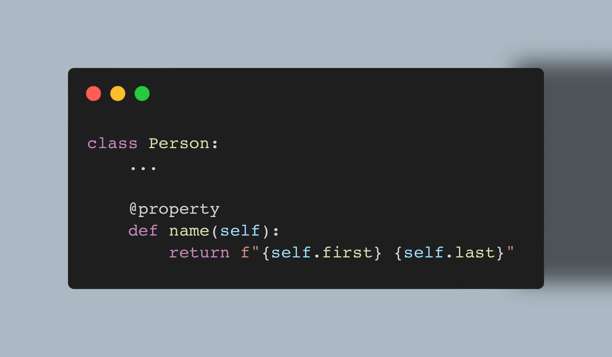

Learn how to use properties to add dynamic behaviour to your attributes.

===



(If you are new here and have no idea what a Pydon't is, you may want to read the
[Pydon't Manifesto][manifesto].)


# Introduction

Properties, defined via the `property` built-in, are a Python feature that lets you add dynamic behaviour behind what is typically a static interface: an attribute.
Properties also have other benefits and use cases, and we will cover them here.

In this Pydon't, you will

 - understand what a property is;
 - learn how to implement a property with the built-in `property`;
 - learn how to use `property` to implement read-only attributes;
 - see that `property` doesn't have to be used as a decorator;
 - add setters to your properties;
 - use setters to do data validation and normalisation;
 - read about deleters in properties; and
 - see usages of `property` in the standard library.


<!--v-->
!!! You can now get your free copy of the ebook “Pydon'ts – Write beautiful Python code” [on Gumroad][gumroad-pydonts]
!!! to help support the series of “Pydon't” articles 💪.
<!--^-->


# What is a property?

A property is an attribute that is computed dynamically.
That's it.
And you will understand what this means in a jiffy!


## The problem

This is a class `Person` with three vanilla attributes:

```py
class Person:
    def __init__(self, first, last):
        self.first = first
        self.last = last
        self.name = f"{self.first} {self.last}"

john = Person("John", "Doe")
```

However, there is an issue with the implementation.
Can you see what is the issue with this implementation?

I'll give you a hint:

```pycon
>>> john = Person("John", "Doe")
>>> john.name
'John Doe'
>>> john.last = "Smith"
>>> john.name
# ?
```

When you implement `name` as a regular attribute, it can go out of sync when you change the attributes upon which `name` depended on.

How do we fix this?
Well, we could provide methods that the user can use to set the first and last names of the `Person` instance, and those methods could keep `name` in sync:

```py
class Person:
    def __init__(self, first, last):
        self.first = first
        self.last = last
        self.name = f"{self.first} {self.last}"

    def set_first(self, first):
        self.first = first
        self.name = f"{self.first} {self.last}"

    def set_last(self, last):
        self.last = last
        self.name = f"{self.first} {self.last}"


john = Person("John", "Doe")
```

This works:

```pycon
>>> john = Person("John", "Doe")
>>> john.name
'John Doe'
>>> john.set_first("Charles")
>>> john.name
'Charles Doe'
```

However, we had to add two methods that look pretty much the same...
And this would get worse if we introduced an attribute for middle names, for example...
Essentially, this isn't a very Pythonic solution – it isn't very elegant.
(Or, at least, we can do better!)

There is another alternative...
Instead of updating `name` when the other attributes are changed, we could add a method that computes the name of the user on demand:

```py
class Person:
    def __init__(self, first, last):
        self.first = first
        self.last = last

    def get_name(self):
        return f"{self.first} {self.last}"
```

This also works:

```pycon
>>> john = Person("John", "Doe")
>>> john.get_name()
'John Doe'
>>> john.first = "Charles"
>>> john.get_name()
'Charles Doe'
```

But this isn't very elegant, either.
However, it serves as an excellent starting point for our discussion!
How can we replace this “getter method” with a property?


## An elegant solution

The Pythonic solution to this problem of computing an attribute dynamically – because the name of a person is essentially just an attribute of a person – comes in the form of properties!

To define a property:

 1. you write a method that returns the desired value of the attribute; and
 2. you set the name of the method to be the desired name of the attribute.

Then, you wrap that method in `@property`.
So, we take the code for the method `get_name`, we change the name of the method to match the name of the attribute (`name`), and then add the decorator:

<div style="overflow:hidden;margin-left:auto;margin-right:auto;border-radius:10px;width:100%;max-width:607.76px;position:relative"><div style="width:100%;padding-bottom:100%"></div><iframe width="607.76" height="607.76" title="" src="https://snappify.com/embed/8040eee0-a60c-490c-8d33-7949e985c95e?responsive" allow="clipboard-write" allowfullscreen="" style="background:#eee;position:absolute;left:0;top:0;width:100%" frameborder="0"></iframe></div>

How do you use this?
Well, you just access the attribute `name` as you regularly would.
Behind the scenes, Python will run the method `name` and return the value:

```pycon
>>> john = Person("John", "Doe")
>>> john.name
'John Doe'
>>> john.last = "Smith"
>>> john.name
'John Smith'
```

Congratulations!
You just wrote your first property!


# Common property use cases

## Dynamic attribute computation

As we have seen before, properties are excellent for when you want to have an attribute that depends dynamically on something else.
For the example above, the attribute `Person.name` depended on two other attributes:

```py
class Person:
    def __init__(self, first, last):
        self.first = first
        self.last = last

    @property
    def name(self):
        return f"{self.first} {self.last}"
```

We can extend our class `Person` to keep track of the birth date of the person.
Then, we can add an attribute `age` that returns the age of the person:

```py
import datetime as dt

class Person:
    def __init__(self, first, last, birthdate):
        self.first = first
        self.last = last
        self.birthdate = birthdate

        today = dt.date.today()
        current_year = today.year
        # Will the person still celebrate their birthday this current year?
        will_celebrate = birthdate.replace(year=current_year) > today
        self.age = current_year - birthdate.year - will_celebrate

    @property
    def name(self):
        return f"{self.first} {self.last}"
```

Now, if you have been paying attention, you can probably tell there is something wrong with the code above.
What?

Just like before, if the attribute `birthdate` is updated, then `age` is likely to become wrong.
But what is even worse is that the attribute `age` can become wrong over time!
If you instantiate the `Person` at a given point in time, and then your program runs over day change, or if you serialise your data and then load it back, you might have outdated values.
That is why `age` should be a property:

```py
import datetime as dt

class Person:
    def __init__(self, first, last, birthdate):
        self.first = first
        self.last = last
        self.birthdate = birthdate

    @property
    def age(self):
        today = dt.date.today()
        current_year = today.year
        # Will the person still celebrate their birthday this current year?
        will_celebrate = self.birthdate.replace(year=current_year) > today
        self.age = current_year - self.birthdate.year - will_celebrate

    @property
    def name(self):
        return f"{self.first} {self.last}"
```

If you want to see some examples of properties that implement attributes that depend dynamically on other attributes of an object, go check the source code for the module `pathlib`.
You will find many such usages of `@property` there.
For example, `path.name` is a property:

```py
# datetime.py, Python 3.11
class PurePath(object):
    # ...

    @property
    def name(self):
        """The final path component, if any."""
        print("Computing the name!")  # <- Added by me!
        parts = self._parts
        if len(parts) == (1 if (self._drv or self._root) else 0):
            return ''
        return parts[-1]
```
```pycon
>>> from pathlib import PurePath
>>> p = PurePath("~/Documents/readme.md")
>>> p.name
Computing the name!
'readme.md'
```

Before I show you another use case for properties, here is a small challenge for you.
Try creating a property `hex` for the class `Colour` that is shown below.
The property `hex` should return a string that starts with `#` and that contains the hexadecimal value of the colour.

```py
class Colour:
    def __init__(self, r, g, b):
        self.r = r
        self.g = g
        self.b = b
```

If you get it right, you should be able to use the class `Colour` like so:

```pycon
>>> c = Colour(146, 255, 0)
>>> c.hex
'#92ff00'
```


## When should I use a property?

There is no hard rule for when you should use a property attribute versus a getter method.
There seems to be some consensus, however, on some indicators of times when it might be a good idea to use a property:

 - the value can be computed fast (it would look weird to use dot notation to access an attribute and then it takes a long time to return the value);
 - the value is a piece of data intrinsically associated with the instance we are talking about; and
 - the value is a simple piece of data.
 (There is nothing against it, but it is not very common to see a property that returns a list of dictionaries whose keys are strings and that map into triples of integers, Booleans, and file paths.
 Properties tend to be relatively simple pieces of data.)

The more you study and read code from others, the better your appreciation will be for when to use properties.
Don't be afraid to try them out, and rest assured that it is not the end of the world if you use a property in a place where you “shouldn't”.

On top of the rules of thumb listed above, if you realise you need any of the functionalities that will be listed next, then that might be an excellent indicator of your need for a property.


## Read-only attributes

One thing that we haven't noted is that the properties that we have defined so far cannot be assigned to.
Let us go back to the `Person` class with a `name` property:

```py
class Person:
    def __init__(self, first, last):
        self.first = first
        self.last = last

    @property
    def name(self):
        return f"{self.first} {self.last}"
```

If you use this class in your REPL, you will see you _cannot_ assign to `name`:

```py
>>> john = Person("John", "Doe")
>>> john.name
'John Doe'
>>> john.name = "Charles Smith"
...
AttributeError: ...
```

Reading from `john.name` will run the method `name` that returns John's name.
But what would `john.name = "Charles Smith"` mean/do..?

While we let that question stew in the back of our minds, we can leverage this `AttributeError` for something else:
we can create read-only attributes!

To create a read-only attribute, all you have to do is hide the value you care about behind another attribute (typically, the same attribute preceded by an underscore `_`) and then use a property to read from that private attribute.
For example, this is how you can make the attributes `first` and `last` in the class `Person` private:

<div style="overflow:hidden;margin-left:auto;margin-right:auto;border-radius:10px;width:100%;max-width:607.76px;position:relative"><div style="width:100%;padding-bottom:100%"></div><iframe width="607.76" height="607.76" title="" src="https://snappify.com/embed/6c203786-5d9d-4a86-a0fa-2010a39c2acd?responsive" allow="clipboard-write" allowfullscreen="" style="background:#eee;position:absolute;left:0;top:0;width:100%" frameborder="0"></iframe></div>

There is an obvious limitation to this method, though.
If the user goes digging, they will figure out that the property is just a thin wrapper around another attribute, and _that_ attribute can be changed:

```pycon
>>> john = Person("John", "Doe")
>>> john.first = "Charles"
Traceback (most recent call last):
  File "<stdin>", line 1, in <module>
AttributeError: property 'first' of 'Person' object has no setter
>>> john._first = "Charles"
>>> john.first
'Charles'
```

This is ok, though.
Python is a language for consenting adults.
By creating a property that sets a read-only attribute, users should understand that they are not supposed to be going around and changing those attributes, and that making those changes could have unintended consequences.
However, if they still choose to change the underlying private attributes, they do so at their own risk.

This pattern for read-only attributes can also be found in the standard library, for example in the class `Fraction` of the module `fractions`:

```py
# fractions.py, Python 3.11

class Fraction(numbers.Rational):
    # ...

    @property
    def numerator(a):
        return a._numerator
```

As we can see, the attribute `numerator` is actually a read-only property:

```pycon
>>> from fractions import Fraction
>>> f = Fraction(1, 2)
>>> f.numerator
1
>>> f.numerator = 3
...
AttributeError: ...
```

However, we _can_ set the value of the “private” attribute `_numerator`:

```pycon
>>> f = Fraction(1, 2)
>>> f._numerator = 3
>>> f.numerator
3
>>> f
Fraction(3, 2)
```


# Properties with setters

## The setter decorator

So far, we have used properties only to read attributes from objects.
However, properties can also be used to provide more control over how we _set_ attributes.

To go back to our `Person` example, what if we wanted the user to also be able to set `name`?
If we did that, we'd need to split the name to fetch the first and last names and then update the corresponding attributes.
So, we do that.

We will start by providing this behaviour in a method `set_name`:

```py
class Person:
    def __init__(self, first, last):
        self.first = first
        self.last = last

    @property
    def name(self):
        return f"{self.first} {self.last}"

    def set_name(self, name):
        first, last = name.split()
        self.first = first
        self.last = last
```
```pycon
>>> john = Person("John", "Doe")
>>> john.name
'John Doe'
>>> john.set_name("Charles Smith")
>>> john.first
'Charles'
>>> john.name
'Charles Smith'
```

Now, what we want is to be able to move the functionality of `set_name` to the direct assignment into `name`, which doesn't work right now:

```pycon
>>> john.name = "Anne Johnson"
...
AttributeError: property 'name' of 'Person' object has no setter
```

Notice that Python specifically says that the property `name` has no _setter_.
To turn the method `set_name` into a property setter, we just need to do two things:

 1. rename it to match the property we want it to set; and
 2. wrap it in the `@attribute.setter` decorator.

In the above, “attribute” should actually match the _name_ of the property.
So, in our case, we'll use the decorator `@name.setter`:

<div style="overflow:hidden;margin-left:auto;margin-right:auto;border-radius:10px;width:100%;max-width:632.89px;position:relative"><div style="width:100%;padding-bottom:100%"></div><iframe width="632.89" height="632.89" title="" src="https://snappify.com/embed/1c486c4b-2d52-40b8-8fbe-edcb589bdd40?responsive" allow="clipboard-write" allowfullscreen="" style="background:#eee;position:absolute;left:0;top:0;width:100%" frameborder="0"></iframe></div>

The module `urllib` from the standard library also follows a similar pattern.
The object `Request` contains a property `full_url` that can be set via a property setter:

```py
# urllib/request.py, Python 3.11
class Request:
    # ...

    @full_url.setter
    def full_url(self, url):
        # unwrap('<URL:type://host/path>') --> 'type://host/path'
        self._full_url = unwrap(url)
        self._full_url, self.fragment = _splittag(self._full_url)
        self._parse()
```

As we can see, `urllib` uses a property setter so that changing the value of `full_url` updates a few related things:

 - not only does it update the attributes `_full_url` and `fragment`;
 - but it also triggers an internal call to `_parse()` which does further work under the hood!

In general, we do not define setter methods like `set_name` in Python.
If you need to control how an attribute is set, use a property and the `setter` decorator.
This can be useful to validate the new value, to normalise it, or to further process it, as shown by the examples for `Person.name` and `Request.full_url`.

For a second challenge, go back to the example for the property `Colour.hex` and try defining a setter for it.
The setter should make this interaction possible:

```pycon
>>> c = Colour(146, 255, 0)
>>> c.hex
'#92ff00'
>>> c.hex = "#ff00ff"
>>> c.r, c.g, c.b
(255, 0, 255)
```


## What is the error message “property of object has no setter”?

To conclude this discussion on property setters, let us go back to the `AttributeError` exception that was raised when we first tried to set the value of `name` to something else:

```pycon
>>> john = Person("John", "Doe")
>>> john.name
'John Doe'
>>> john.name = "Charles Smith"
...
AttributeError: property 'name' of 'Person' object has no setter
```

When you see this `AttributeError`, you should immediately know that this means you tried to set the value of a property that:

 - either is supposed to be read-only; or
 - that hasn't defined a setter _yet_.

If you are messing with your own code, it probably means you forgot to define the setter via the `@xxx.setter` attribute.
If you are using a module you installed, it probably means you are dealing with an attribute that is supposed to be read-only.


# Property deleters

Property attributes can have one more functionality associated with them, and that's the third behaviour that is associated with general attributes.
In fact, attributes can be:

 1. read;
 2. set; and
 3. deleted.

Naturally, property attributes can also be deleted if you specify a deleter method.
By default, you get an `AttributeError` if you try to delete a property with the statement `del instance.attribute`:

```pycon
>>> john = Person("John", "Doe")
>>> john.name
'John Doe'
>>> del john.name
...
AttributeError: property 'name' of 'Person' object has no deleter
```

Just like with the setter, you can define a deleter by using the decorator `@xxx.deleter` on a method that does the necessary deleting.
For example, the class `Person` below defines a simple property attribute `first` with a getter, a setter, and a deleter:

```py
class Person:
    def __init__(self, first):
        self._first = first

    @property
    def first(self):
        return self._first

    @first.setter
    def first(self, first_name):
        self._first = first_name.strip().capitalize()

    @first.deleter
    def first(self):
        del self._first
```
```pycon
>>> john = Person("John")
>>> john.first
'John'
>>> john.first = "CHArles"
>>> john.first
'Charles'
>>> del john.first
>>> john.first
Traceback (most recent call last):
  File "<stdin>", line 1, in <module>
  File "/Users/rodrigogs/Documents/properties.py", line 43, in first
    return self._first
           ^^^^^^^^^^^
AttributeError: 'Person' object has no attribute '_first'. Did you mean: 'first'?
```

As you can see, when we try to access `john.first` _after_ deleting `john.first`, we get an `AttributeError`.
However, it may look like a confusing error, since we accessed the attribute `first`, Python complained it doesn't know about an attribute `_first`, and then asked if we were talking about `first`...
The issue here was that the deleter only deleted the private attribute `_first` but it didn't get rid of the attribute property itself.

Because of this intricacy, the deleter is usually used when we may need to clean up other attributes that are auxiliary to the main property attribute.
For example, if you use other private attributes to cache information about your property, you'd clear those in the deleter.

As an example, we can take a look at the `Request.full_url` property from the module `urllib` again:

```py
# urllib/request.py, Python 3.11
class Request:
    # ...

    @full_url.setter
    def full_url(self, url):
        # unwrap('<URL:type://host/path>') --> 'type://host/path'
        self._full_url = unwrap(url)
        self._full_url, self.fragment = _splittag(self._full_url)
        self._parse()

    @full_url.deleter
    def full_url(self):
        self._full_url = None
        self.fragment = None
        self.selector = ''
```

Notice how the deleter cleans up the attributes `_full_url` _and_ `fragment`, which were set inside the setter.
The `selector`, which is also cleared inside the deleter, was set inside the call to `_parse`.


# The property descriptor

Before we conclude this Pydon't, let us take a look at the nature of the built-in `property`.
We have used `property` as a decorator, so far, but is `property` really a decorator..?

[The documentation][property-docs] shows the built-in `property` used in a different way:

```py
# Pasted from the docs.
class C:
    def __init__(self):
        self._x = None

    def getx(self):
        return self._x

    def setx(self, value):
        self._x = value

    def delx(self):
        del self._x

    x = property(getx, setx, delx, "I'm the 'x' property.")
```

The definition of the property attribute `x`, seen above, is equivalent to the definition seen below, which uses the syntax we saw before:

```py
# Using the syntax we have seen.
class C:
    def __init__(self):
        self._x = None

    @property
    def x(self):
        """I'm the 'x' property."""
        return self._x

    @x.setter
    def x(self, value):
        self._x = value

    @x.deleter
    def x(self):
        del self._x
```

Well, it is not entirely equivalent.
The first definition, pasted from the docs, defines methods that can be used directly:

```pycon
# Using C from the docs.
>>> c = C()
>>> c.setx(3)
>>> c.getx()
3
```

As a real-life example of this behaviour, the module `calendar` does something similar:

```py
# calendar.py, Python 3.11
class Calendar(object):
    """
    Base calendar class. This class doesn't do any formatting. It simply
    provides data to subclasses.
    """

    def __init__(self, firstweekday=0):
        self.firstweekday = firstweekday # 0 = Monday, 6 = Sunday

    def getfirstweekday(self):
        return self._firstweekday % 7

    def setfirstweekday(self, firstweekday):
        self._firstweekday = firstweekday

    firstweekday = property(getfirstweekday, setfirstweekday)
```

This shows that if you want to define getter/setter methods that you want the user to have access to, you can use `property` in an assignment like the one you saw above.
This is not a very common thing to do, though.

This does show, however, that there is a mechanism that is even _more_ powerful than `property` in Python.
In fact, if you look closely, all we did in the example for the classes `C` and `Calendar`, was _assign_ to a name (`C.x` and `Calendar.firstweekday`).
From that, Python is able to customise the behaviours for reading from, writing to, and deleting that same attribute!
Doesn't that sound insane..?

It may sound insane the first time you hear about it, but it is all thanks to _descriptors_.
Descriptors are a really neat topic that will be covered next!


# Conclusion

Here's the main takeaway of this Pydon't, for you, on a silver platter:

 > “*`property` is the Pythonic interface for adding dynamic behaviour to your interactions with attributes in classes.*”

This Pydon't showed you that:

 - you can add dynamic dependencies between your class attributes;
 - the decorator `property` will turn a method into a property attribute of the same name;
 - there are a couple of rules of thumb to decide _when_ to use a property;
 - properties can be used to implement read-only attributes;
 - property attributes can also be set if one makes use of the decorator `@xxx.setter`;
 - you can use setters to add some data validation and normalisation to attribute setting;
 - property attributes can also have deleter methods;
 - the decorator `property` isn't really a decorator, but a descriptor (whatever that may mean); and
 - the standard library has plenty of properties.

[property-docs]: https://docs.python.org/3/library/functions.html#property

<!-- v -->
If you liked this Pydon't be sure to leave a reaction below and share this with your friends and fellow Pythonistas.
Also, [don't forget to subscribe to the newsletter][subscribe] so you don't miss
a single Pydon't!
<!-- ^ -->

[subscribe]: https://mathspp.com/subscribe
[manifesto]: /blog/pydonts/pydont-manifesto
[gumroad-pydonts]: https://gum.co/pydonts
