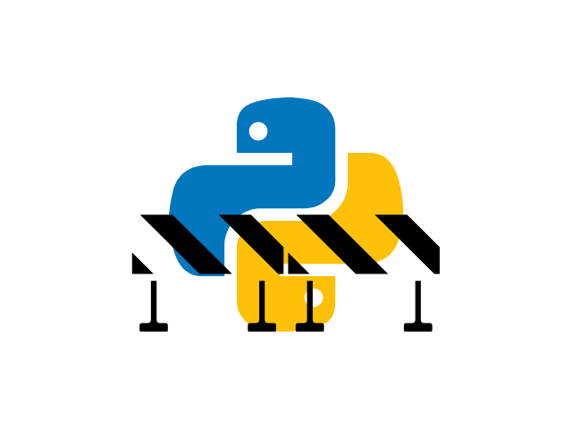

---
metadata:
    description: "The Pydon't Manifesto explains what \"Pydon'ts\" are and why they are important when you are looking to improve your Python programming skills."
title: "Pydon't Manifesto 🐍"
---

"*Pydon'ts*" are short, to-the-point, meaningful Python programming tips.
Pydon'ts will help you write more Pythonic code.

===

# Purpose

The aim of this "*Pydon't*" series is to provide a series of programming tips
for Python programmers that will help them take their Python programming to the next level.
This goal will be achieved by showing “bad” Python code,
and then comparing it to better, more Pythonic, alternatives.

# Who for

Pydon'ts are useful to Python programmers that are looking to improve their Python skills.
Above all, they are aimed at developers who are willing to put in the effort to improve.
I can't do all the hard work for you, because improving your skills is hard work...
But I can make the hard work easier for you!

The Pydon'ts are aimed especially at beginners and intermediate users,
and also at programmers who are fluent with some _other_ programming language
and just want to get up to speed with the Python way of doing things.

If you are committed to learning Python and improving your skills,
be sure to [subscribe to my newsletter][subscribe],
so that you get access to all the Python knowledge I put out there.

# How many Pydon'ts will there be?

As of the beginning of 2022, there are over 25 Pydon'ts that have been published,
and at least a dozen more are still to come,
covering topics such as iterables, generators, decorators, OOP, and dunder methods.

# Format

All the Pydon'ts follow roughly the same structure:

 1. A readable explanation of the topic at hands, illustrated with clear examples.
 2. Real code examples you can try and play around with, often taken from the Python Standard Library.
 3. "Bad" vs "good" code comparisons, so you can better understand what not to do and what to do.
 4. Exercises to help you practise your new skill.
 5. Links to references and resources for further reading.

# Book

The Pydon'ts have been compiled into a free ebook that you can get online,
[here][pydonts-book].

<!-- v -->
Are you looking forward to this series?

Let me know in the comments below if you are expecting any tips about any specific
topics and leave an "emoji response" to show your support.

Also, [don't forget to subscribe to the newsletter][subscribe] so you don't miss
a single Pydon't!
<!-- ^ -->

[subscribe]: https://mathspp.com/subscribe
[pydonts-book]: /books
