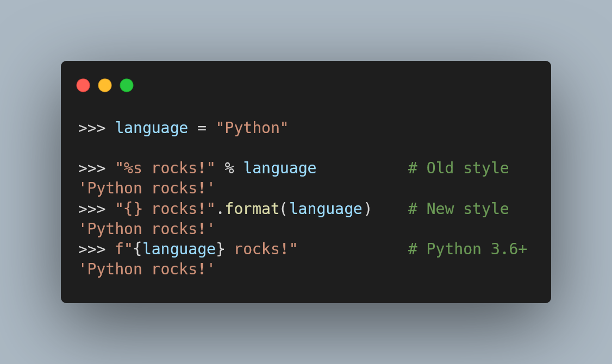

This article compares the three main string formatting methods in Python and suggests which methods to use in each situation.

===

<script async src="https://platform.twitter.com/widgets.js" charset="utf-8"></script>



(If you are new here and have no idea what a Pydon't is, you may want to read the
[Pydon't Manifesto][manifesto].)


# Introduction

The [Zen of Python][zen] says that

 > “There should be one – and preferably only one – obvious way to do it.”

And yet, there are three main ways of doing string formatting in Python.
This Pydon't will settle the score,
comparing these three methods and helping you decide which one is the obvious one to use
in each situation.

In this Pydon't, you will:

 - learn about the old C-style formatting with %;
 - learn about the string method `.format`;
 - learn about the Python 3.6+ feature of literal string interpolation and f-strings;
 - understand the key differences between each type of string formatting; and
 - see where each type of string formatting really shines.

<!--v-->
 > You can now get your **free** copy of the ebook “Pydon'ts – Write beautiful Python code” [on Gumroad][gumroad-pydonts].
<!--^-->


# String formatting rationale

Let's pretend, for a second, that Python had zero ways of doing string formatting.

Now, I have a task for you:
write a function that accepts a programming language name and returns a string
saying that said programming language rocks.
Can you do it?
Again, _without_ any string formatting whatsoever!

Here is a possible solution:

```py
def language_rocks(language):
    return language + " rocks!"

# ---
>>> language_rocks("Python")
'Python rocks!'
```

Great job!

Now, write a function that accepts a programming language name and its (estimated) number of users,
and returns a string saying something along the lines of
“<insert language> rocks! Did you know that <insert language> has around <insert number> users?”.

Can you do it?
Recall that you are _not_ supposed to use any string formatting facilities, whatsoever!

Here is a possible solution:

```py
def language_info(language, users_estimate):
    return (
        language + " rocks! Did you know that " + language +
        " has around " + str(users_estimate) + " users?!"
    )

# ---
>>> language_info("Python", 10)
'Python rocks! Did you know that Python has around 10 users?!'
```

Notice how that escalated quite quickly:
the purpose of our function is still very simple,
and yet we have a bunch of string concatenations happening all over the place,
just because we have some pieces of information that we want to merge into the string.

This is what string formatting is for:
it's meant to make your life easier when you need to put information inside strings.


# Three string formatting methods

Now that we've established that string formatting is useful,
let's take a look at the three main ways of doing string formatting in Python.

First, here is how you would refactor the function above:

```py
# Using C-style string formatting:
def language_info_cstyle(language, users_estimate):
    return (
        "%s rocks! Did you know that %s has around %d users?!" %
        (language, language, users_estimate)
    )

# Using the Python 3 `.format` method from strings:
def language_info_format(language, users_estimate):
    return "{} rocks! Did you know that {} has around {} users?!".format(
        language, language, users_estimate
    )

# Using f-strings, from Python 3.6+:
def language_info_fstring(language, users_estimate):
    return (
        f"{language} rocks! Did you know that {language}" +
        f" has around {users_estimate} users?!"
    )
```

All three functions above behave in the same way.

 1. `language_info_cstyle` uses old-style string formatting, borrowed from the similar C syntax that does the same thing;
 2. `language_info_format` uses the string method `.format`, that was introduced in [PEP 3101][pep3101]; and
 3. `language_info_fstring` uses the new f-strings, which were introduced in [PEP 498][pep498] for Python 3.6+.


## C-style formatting

The C-style formatting, which is the one that has been around the longer,
is characterised by a series of percent signs (`"%"`) that show up in the template strings.

(By “template strings”, I mean the strings in which we want to fill in the gaps.)

These percent signs indicate the places where the bits of information should go,
and the character that comes next (above, we've seen `"%s"` and `"%d"`) determine
how the information being passed in is treated.

Additionally, the way in which you apply the formatting is through the binary operator `%`:
on the left you put the template string,
and on the right you put all the pieces of information you need to pass in.


## String method `.format`

The string method `.format` is, like the name suggests, _a method of the string type_.
This means that you typically have a format string and, when you get access to the missing pieces of information,
you just call the `.format` method on that string.

Strings that use the method `.format` for formatting are typically characterised
by the occurrence of a series of curly braces `"{}"` within the string.
It is also common to find that the method `.format` is called where/when
the string literal is defined.


## Literal string interpolation, or f-strings

Literal string interpolation is the process through which you interpolate
values into strings.
Notice the definition of the word “interpolate”:

 > verb: interpolate – insert (something of a different nature) into something else.

That's exactly what this technique does:
it directly inserts the additional values into the template string.

When people talk about “f-strings” they are also talking about this technique.
That's because you need to prepend an `f` to your string to use literal string interpolation.

Literal string interpolation is (clearly) characterised by the `f` prefix
on the string literals, and also the curly braces `"{}"` inside the string.
Unlike with the string method `.format`, the braces _always_ have something inside them.

!!! In case you are wondering, using a letter as a prefix to a string literal
!!! isn't an idea introduced with literal string interpolation.
!!! Two common examples include `r` (raw) strings, and `b` (binary) strings:
!!!
!!! ```py
!!! >>> b"This is a bytes object!"
!!! b'This is a bytes object!'
!!! >>> type(_)         # Use _ to refer to the previous string.
!!! <class 'bytes'>
!!! >>> r"This is a \nstring"
!!! 'This is a \\nstring'
!!! ```

Now that we have taken a look at the three string formatting methods,
we will show a series of different (simple) scenarios and how
formatting would work with the three options.

As we will see, the C-style formatting will almost always look clunkier
and less elegant, which should help you realise that f-strings
and the string method `.format` are the way to go.

After this series of comparisons, we will give some suggestions
as to what type of formatting to use, and when.


# Value conversion

When we do string formatting,
the objects that we want to format into the template string need to be
converted to a string.

This is typically done by calling `str` on the objects,
which in turn calls the dunder method `__str__` of those objects.
However, sometimes it is beneficial to have the object be represented
with the result from calling `repr`, and not `str`.
(I wrote about why you would want this before, so [read this Pydon't][str-and-repr]
if you are not familiar with how `__str__`/`__repr__` works.)

There are special ways to determine which type of string conversion happens.

Take this dummy class:

```py
class Data:
    def __str__(self):
        return "str"
    def __repr__(self):
        return "repr"
```

With that class defined, the three following strings are the same:

```py
"%s %r" % (Data(), Data())

"{!s} {!r}".format(Data(), Data())

f"{Data()!s} {Data()!r}"

# Result is 'str repr'
```

With C-style formatting we use `"%s"` and `"%r"` to distinguish
from the regular string version of the object or its representation.
The two more modern methods do the distinction with the `!s` and `!r` flags.


# Alignment

When we need to format many values across many lines,
for example to display a table-like piece of output,
we may want to align all values and pad the accordingly.
This is one of the great use cases where string formatting shines.

```py
lang = "Python"

"%-10s" % lang

"{:<10}".format(lang)

f"{lang:<10}"

# Result is 'Python    '
```

The C-style aligns on the right, by default, whereas `.format` and f-strings
format on the left.
Hence, above we could have written

```py
"{:10}".format(lang)
f"{lang:10}"
```

and we would still get the same result.
However, for the sake of comparison, I decided to include the `<` for
left alignment.

C-style formatting can't do it, but the two modern methods can use `^`
to align the output in the centre:

```py
"{:^10}".format(lang)
f"{lang:^10}"

# Result is '  Python  '
```

To right align, use `>` for the modern methods, or use nothing at all
for the C-style formatting.

Remember, the modern methods use `<^>` for alignment,
and the tip of the arrow points to the alignment direction.

<!--v-->
<blockquote class="twitter-tweet"><p lang="en" dir="ltr">📐 You can align fields when doing string formatting in Python 🐍<br><br>You can specify the width after the colon `:`, and you can use &lt;^&gt; to pick different alignment directions.<br><br>It&#39;s easy to remember: the tip of the symbol points in the same direction as the alignment itself! <a href="https://t.co/o9eNf0gXFS">pic.twitter.com/o9eNf0gXFS</a></p>&mdash; Rodrigo 🐍📝 (@mathsppblog) <a href="https://twitter.com/mathsppblog/status/1457674196167929865?ref_src=twsrc%5Etfw">November 8, 2021</a></blockquote>
<!--^-->


# Named placeholders

For longer strings, or strings with many slots to be filled in,
it may be helpful to include placeholder strings,
instead of just the symbol to denote string formatting.
With f-strings, this happens more or less automatically,
but C-style formatting and `.format` also support that:

```py
name, age = "John", 73

"%(name)s is %(age)d years old." % {"name": name, "age": age}

"{name} is {age} years old.".format(name=name, age=age)

f"{name} is {age} years old."

# Result is 'John is 73 years old.'
```


# Accessing nested data structures

Let's look at the example above again,
but let's imagine that the name and age were actually stored in a dictionary.

In this case, the old-style formatting and the string method `.format`
are particularly handy:

```py
data = {"name": "John", "age": 73}

"%(name)s is %(age)d years old." % data

"{data[name]} is {data[age]} years old.".format(data=data)
# or
"{name} is {age} years old.".format(**data)

f"{data['name']} is {data['age']} years old."

# Result is 'John is 73 years old.'
```

The first usage of the string method `.format` shows an interesting
feature that formatting with `.format` allows:
the formatted objects can be indexed and they can also have their
attributes accessed.

Here is a very convoluted example:

```py
class ConvolutedExample:
    values = [{"name": "Charles"}, {42: "William"}]

ce = ConvolutedExample()

"Name is: {ce.values[0][name]}".format(ce=ce)

f"Name is: {ce.values[0]['name']}"

# Result is 'Name is: Charles'
```


# Parametrised formatting

Sometimes, you want to do some string formatting,
but the exact formatting you do is dynamic:
for example, you might want to print something with variable width,
and you'd like for the width to adapt to the longest element in a sequence.

For example, say you have a list of companies and their countries
of origin, and you want that to be aligned:

```py
data = [("Toyota", "Japanese"), ("Ford", "USA")]

for brand, country in data:
    print(f"{brand:>7}, {country:>9}")

"""
Result is
 Toyota,  Japanese
   Ford,       USA
"""
```

The thing is, what if we now include a company with a longer name?

```py
data = [("Toyota", "Japanese"), ("Ford", "USA"), ("Lamborghini", "Italy")]

for brand, country in data:
    print(f"{brand:>7}, {country:>9}")

"""
Result is
 Toyota,  Japanese
   Ford,       USA
Lamborghini,     Italy
"""
```

The output is no longer aligned because the word “Lamborghini” does not fit
within the specified width of 7.
Therefore, we need to dynamically compute the maximum lengths and use them
to create the correct format specification.
This is where parametrising the format specification comes in handy:

```py
data = [("Toyota", "Japanese"), ("Ford", "USA"), ("Lamborghini", "Italy")]
# Compute brand width and country width needed for formatting.
bw = 1 + max(len(brand) for brand, _ in data)
cw = 1 + max(len(country) for _, country in data)

for brand, country in data:
    print(f"{brand:>{bw}}, {country:>{cw}}")

"""
Result is
      Toyota,  Japanese
        Ford,       USA
 Lamborghini,     Italy
"""
```

Old style formatting only allows parametrisation of the width of the field
and the precision used.
For the string method `.format` and for f-strings,
parametrisation can be used with all the format specifier options.

```py
month = "November"
prec = 3
value = 2.7182

"%.*s = %.*f" % (prec, month, prec, value)

"{:.{prec}} = {:.{prec}f}".format(month, value, prec=prec)

f"{month:.{prec}} = {value:.{prec}f}"

# Result is 'Nov = 2.718'
```


# Custom formatting

Finally, the string method `.format` and f-strings allow you to define
how your own custom objects should be formatted,
and that happens through the dunder method `__format__`.

The dunder method `__format__` accepts a string (the format specification)
and it returns the corresponding string.

Here is a (silly) example:

```py
class YN:
    def __format__(self, format_spec):
        return "N" if "n" in format_spec else "Y"

"{:aaabbbccc}".format(YN()) # Result is 'Y'

f"{YN():nope}"              # Result is 'N'
```

Of course, when possible, you would want to implement a format specification
that matches the [built-in format spec][builtin-format-spec].


# Examples in code

As the little snippets of code above have shown you,
there is hardly any reason to be using the old string formatting style.
Of course, remember that consistency is important, so it might still
make sense if you are maintaining an old code base that uses old-style
formatting everywhere.

Otherwise, you are better off using the string method `.format` and/or f-strings.
Now, I will show you some usage patterns and I will help you figure
out what type of string formatting works best in those cases.


## Plain formatting

F-strings are very, very good.
They are short to type, they have good locality properties
(it is easy to see what is being used to format that specific portion of the string),
and they are fast.

For all your plain formatting needs, prefer f-strings over the method `.format`:

```py
# Some random variables:
name, age, w = "John", 73, 10

# ✅ Prefer...
f"{name!s} {name!r}"
f"{name:<10}"
f"{name} is {age} years old."
f"{name:^{w}}"

#  ❌... over `.format`
"{!s} {!r}".format(name, name)
"{:<10}".format(name)
"{name} is {age} years old.".format(name=name, age=age)
"{:^{w}}".format(name, w=w)
```


## Data in a dictionary

If all your formatting data is already in a dictionary,
then using the string method `.format` might be the best way to go.

This is especially true if the keys of said dictionary are strings.
When that is the case, using the string method `.format` almost
looks like using f-strings!
Except that, when the data is in a dictionary,
using f-strings is much more verbose when compared to the usage of `**` in `.format`:

```py
data = {"name": "John", "age": 73}

# This is nice:
"{name} is {age} years old.".format(**data)

# This is cumbersome:
f"{data['name']} is {data['age']} years old."
```

In the example above, we see that the `.format` example exhibits the usual locality
that f-strings tend to benefit from!


## Deferred formatting

If you need to create your formatting string first,
and only format it later,
then you cannot use f-strings.

When that is the case, using the method `.format` is probably the best way to go.

This type of scenario might arise, for example,
from programs that run in (many) different languages:

```py
def get_greeting(language):
    if language == "pt":
        return "Olá, {}!"
    else:
        return "Hello, {}!"

lang = input(" [en/pt] >> ")
name = input(" your name >> ")
get_greeting(lang).format(name)
```

# Conclusion

Here's the main takeaway of this Pydon't, for you, on a silver platter:

 > “*Don't use old-style string formatting: use f-strings whenever possible,
 and then `.format` in the other occasions.*”

This Pydon't showed you that:

 - Python has three built-in types of string formatting;
 - using `.format` and/or f-strings is preferred over %-formatting;
 - you can use `!s` and `!r` to specify which type of string representation to use;
 - alignment can be done with the `<^>` specifiers;
 - format specifications can be parametrised with an extra level of `{}`;
 - custom formatting can be implemented via the dunder method `__format__`;
 - f-strings are very suitable for most standard formatting tasks;
 - the method `.format` is useful when the formatting data is inside a dictionary; and
 - for deferred string formatting, f-strings don't work,
 meaning `.format` is the recommended string formatting method.


<!-- v -->
If you liked this Pydon't be sure to leave a reaction below and share this with your friends and fellow Pythonistas.
Also, [subscribe to the newsletter][subscribe] so you don't miss
a single Pydon't!
<!-- ^ -->

[subscribe]: https://mathspp.com/subscribe
[manifesto]: /blog/pydonts/pydont-manifesto
[gumroad-pydonts]: https://gum.co/pydonts
[str-and-repr]: /blog/pydonts/str-and-repr

[zen]: /blog/pydonts/pydont-disrespect-the-zen-of-python
[pep3101]: https://www.python.org/dev/peps/pep-3101/
[pep498]: https://www.python.org/dev/peps/pep-0498/
[builtin-format-spec]: https://docs.python.org/3/library/string.html#format-specification-mini-language
