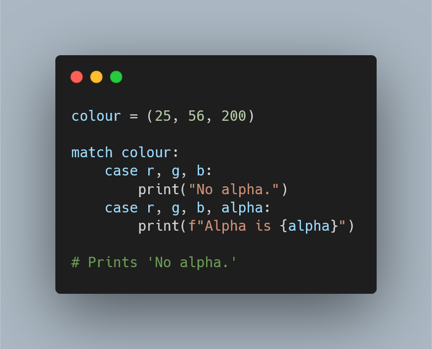

---
metadata:
    description: "Structural pattern matching is coming in Python 3.10 and this article explores how to use it to write Pythonic code, showing the best use cases for the `match` statement."
title: "Structural pattern matching tutorial | Pydon't 🐍"
---

Structural pattern matching is coming in Python 3.10 and this article
explores how to use it to write Pythonic code,
showing the best use cases for the `match` statement.

===



(If you are new here and have no idea what a Pydon't is, you may want to read the
[Pydon't Manifesto][manifesto].)


# Introduction

Structural pattern matching is coming to Python, and while it may look
like a plain switch statement like many other languages have,
Python's `match` statement was not introduced to serve as a simple
switch statement.

PEPs [634][pep-634], [635][pep-635], and [636][pep-636] have plenty of
information on what structural pattern matching is bringing to Python,
how to use it, the rationale for adding it to Python, etc.
In this article I will try to focus on using this new feature to
write beautiful code.

! At the time of writing, Python 3.10 is still a pre-release,
! so you have to look [in the right place][py-pre-re] if you want to download
! Python 3.10 and play with it.


I also summarised the contents of this article in a cheatsheet
that you can get for free [from here][gumroad-cheatsheet].


# Structural pattern matching Python could already do

Structural pattern matching isn't completely new in Python.
For a long time now, we have been able to do things like
starred assignments:

```py
>>> a, *b, c = [1, 2, 3, 4, 5]
>>> a
1
>>> b
[2, 3, 4]
>>> c
5
```

And we can also do deep unpacking:

```py
>>> name, (r, g, b) = ("red", (250, 23, 10))
>>> name
'red'
>>> r
250
>>> g
23
>>> b
10
```

I covered these in detail in [“Unpacking with starred assignments”][pydont-sa]
and [“Deep unpacking”][pydont-du], so go read those Pydon'ts if
you are unfamiliar with how to use these features to write Pythonic code.

The `match` statement will use ideas from both starred assignments
and deep unpacking, so knowing how to use them is going to be helpful.


# Your first `match` statement

For your first match statement, let's implement the factorial function.
A factorial function is a textbook example when introducing people to recursion,
and you could write it like so:

```py
def factorial(n):
    if n == 0 or n == 1:
        return 1
    else:
        return n * factorial(n-1)
factorial(5)    # 120
```

Instead of using an `if` statement, we could use a `match`:

```py
def factorial(n):
    match n:
        case 0 | 1:
            return 1
        case _:
            return n * factorial(n - 1)
factorial(5)
```

Notice a couple of things here:
we start our `match` statement by typing `match n`, meaning
we will want to do different things depending on what `n` is.
Then, we have `case` statements that can be thought of the
different possible scenarios we want to handle.
Each `case` must be followed by a pattern that we will try
to match `n` against.

Patterns can also contain alternatives, denoted by the `|`
in `case 0 | 1`, which matches if `n` is either 0 or 1.
The second pattern, `case _:`, is the go-to way of matching
*anything* (when you don't care about *what* you are matching),
so it is acting more or less like the `else` of
the first definition.


# Pattern matching the basic structure

While `match` statements can be used like plain `if` statements,
as you have seen above, they really shine when you are dealing
with structured data:

```py
def normalise_colour_info(colour):
    """Normalise colour info to (name, (r, g, b, alpha))."""

    match colour:
        case (r, g, b):
            name = ""
            a = 0
        case (r, g, b, a):
            name = ""
        case (name, (r, g, b)):
            a = 0
        case (name, (r, g, b, a)):
            pass
        case _:
            raise ValueError("Unknown colour info.")
    return (name, (r, g, b, a))

# Prints ('', (240, 248, 255, 0))
print(normalise_colour_info((240, 248, 255)))
# Prints ('', (240, 248, 255, 0))
print(normalise_colour_info((240, 248, 255, 0)))
# Prints ('AliceBlue', (240, 248, 255, 0))
print(normalise_colour_info(("AliceBlue", (240, 248, 255))))
# Prints ('AliceBlue', (240, 248, 255, 0.3))
print(normalise_colour_info(("AliceBlue", (240, 248, 255, 0.3))))
```

Notice here that each `case` contains an expression like the left-hand side
of an unpacking assignment, and when the structure of `colour` matches
the structure that the `case` exhibits, then the names get assigned to the
variable names in the `case`.

This is a great improvement over the equivalent code with `if` statements:

```py
def normalise_colour_info(colour):
    """Normalise colour info to (name, (r, g, b, alpha))."""

    if not isinstance(colour, (list, tuple)):
        raise ValueError("Unknown colour info.")

    if len(colour) == 3:
        r, g, b = colour
        name = ""
        a = 0
    elif len(colour) == 4:
        r, g, b, a = colour
        name = ""
    elif len(colour) != 2:
        raise ValueError("Unknown colour info.")
    else:
        name, values = colour
        if not isinstance(values, (list, tuple)) or len(values) not in [3, 4]:
            raise ValueError("Unknown colour info.")
        elif len(values) == 3:
            r, g, b = values
            a = 0
        else:
            r, g, b, a = values
    return (name, (r, g, b, a))
```

I tried writing a decent, equivalent piece of code to the one using
structural pattern matching, but this doesn't look that good.
Someone else has suggested, [in the comments](http://disq.us/p/2fmg1ht),
another alternative that also doesn't use `match`.
That suggestion looks better than mine, but is much more complex
and larger than the alternative with `match`.

The `match` version becomes even better when we add type validation to it,
by asking for the specific values to actually match Python's built-in types:

```py
def normalise_colour_info(colour):
    """Normalise colour info to (name, (r, g, b, alpha))."""

    match colour:
        case (int(r), int(g), int(b)):
            name = ""
            a = 0
        case (int(r), int(g), int(b), int(a)):
            name = ""
        case (str(name), (int(r), int(g), int(b))):
            a = 0
        case (str(name), (int(r), int(g), int(b), int(a))):
            pass
        case _:
            raise ValueError("Unknown colour info.")
    return (name, (r, g, b, a)))

# Prints ('AliceBlue', (240, 248, 255, 0))
print(normalise_colour_info(("AliceBlue", (240, 248, 255))))
# Raises # ValueError: Unknown colour info.
print(normalise_colour_info2(("Red", (255, 0, "0"))))
```

How do you reproduce all this validation with `if` statements..?


# Matching the structure of objects

Structural pattern matching can also be used to match the
structure of class instances.
Let us recover the `Point2D` class I have used as an example
in a couple of posts, in particular the
[Pydon't about `__str__` and `__repr__`][pydont-str-repr]:

```py
class Point2D:
    """A class to represent points in a 2D space."""

    def __init__(self, x, y):
        self.x = x
        self.y = y

    def __str__(self):
        """Provide a good-looking representation of the object."""
        return f"({self.x}, {self.y})"

    def __repr__(self):
        """Provide an unambiguous way of rebuilding this object."""
        return f"Point2D({repr(self.x)}, {repr(self.y)})"
```

Imagine we now want to write a little function that takes a `Point2D` and
writes a little description of where the point lies.
We can use pattern matching to capture the values of the `x` and `y` attributes
and, what is more, we can use short `if` statements to help narrow down the
type of matches we want to succeed!

Take a look at the following:

```py
def describe_point(point):
    """Write a human-readable description of the point position."""

    match point:
        case Point2D(x=0, y=0):
            desc = "at the origin"
        case Point2D(x=0, y=y):
            desc = f"in the vertical axis, at y = {y}"
        case Point2D(x=x, y=0):
            desc = f"in the horizontal axis, at x = {x}"
        case Point2D(x=x, y=y) if x == y:
            desc = f"along the x = y line, with x = y = {x}"
        case Point2D(x=x, y=y) if x == -y:
            desc = f"along the x = -y line, with x = {x} and y = {y}"
        case Point2D(x=x, y=y):
            desc = f"at {point}"

    return "The point is " + desc

# Prints "The point is at the origin"
print(describe_point(Point2D(0, 0)))
# Prints "The point is in the horizontal axis, at x = 3"
print(describe_point(Point2D(3, 0)))
# Prints "# The point is along the x = -y line, with x = 3 and y = -3"
print(describe_point(Point2D(3, -3)))
# Prints "# The point is at (1, 2)"
print(describe_point(Point2D(1, 2)))
```


# `__match_args__`

Now, I don't know if you noticed, but didn't all the `x=` and `y=`
in the code snippet above annoy you?
Every time I wrote a new pattern for a `Point2D` instance, I had to specify
what argument was `x` and what was `y`.
For classes where this order is not arbitrary, we can use `__match_args__`
to tell Python how we would like `match` to match the attributes of our object.

Here is a shorter version of the example above, making use of `__match_args__`
to let Python know the order in which arguments to `Point2D` should match:

```py
class Point2D:
    """A class to represent points in a 2D space."""

    __match_args__ = ["x", "y"]
    def __init__(self, x, y):
        self.x = x
        self.y = y

def describe_point(point):
    """Write a human-readable description of the point position."""

    match point:
        case Point2D(0, 0):
            desc = "at the origin"
        case Point2D(0, y):
            desc = f"in the vertical axis, at y = {y}"
        case Point2D(x, 0):
            desc = f"in the horizontal axis, at x = {x}"
        case Point2D(x, y):
            desc = f"at {point}"

    return "The point is " + desc

# Prints "The point is at the origin"
print(describe_point(Point2D(0, 0)))
# Prints "The point is in the horizontal axis, at x = 3"
print(describe_point(Point2D(3, 0)))
# Prints "# The point is at (1, 2)"
print(describe_point(Point2D(1, 2)))
```


# Wildcards

Another cool thing you can do when matching things is to use wildcards.

## Asterisk `*`

Much like you can do things like

```py
>>> head, *body, tail = range(10)
>>> print(head, body, tail)
0 [1, 2, 3, 4, 5, 6, 7, 8] 9
```

where the `*body` tells Python to put in body whatever does *not*
go into `head` or `tail`, you can use `*` and `**` wildcards.
You can use `*` with lists and tuples to match the *remaining* of it:

```py
def rule_substitution(seq):
    new_seq = []
    while seq:
        match seq:
            case [x, y, z, *tail] if x == y == z:
                new_seq.extend(["3", x])
            case [x, y, *tail] if x == y:
                new_seq.extend(["2", x])
            case [x, *tail]:
                new_seq.extend(["1", x])
        seq = tail
    return new_seq

seq = ["1"]
print(seq[0])
for _ in range(10):
    seq = rule_substitution(seq)
    print("".join(seq))

"""
Prints:
1
11
21
1211
111221
312211
13112221
1113213211
31131211131221
13211311123113112211
11131221133112132113212221
"""
```

This builds the sequence I showed above, where each number is derived
from the previous one by looking at its digits and describing what you
are looking at.
For example, when you find three equal digits in a row, like `"222"`, you
rewrite that as `"32"` because you are seeing three twos.
With the `match` statement this becomes much cleaner.
In the `case` statements above, the `*tail` part of the pattern matches the
remainder of the sequence, as we are only using `x`, `y`, and `z` to match
in the beginning of the sequence.


## Plain dictionary matching

Similarly, we can use `**` to match the remainder of a dictionary.
But first, let us see what is the behaviour when matching dictionaries:

```py
d = {0: "oi", 1: "uno"}
match d:
    case {0: "oi"}:
        print("yeah.")
# prints yeah.
```

While `d` has a key `1` with a value `"uno"`, and that is not specified
in the only case statement, there is a match and we enter the statement.
When matching with dictionaries, we only care about matching the structure
that was explicitly mentioned, and any other extra keys that the original
dictionary has are ignored.
This is unlike matching with lists or tuples, where the match has to be
perfect if no wildcard is mentioned.

## Double asterisk `**`

However, if you want to know what the original dictionary had that was
not specified in the match, you can use a `**` wildcard:

```py
d = {0: "oi", 1: "uno"}
match d:
    case {0: "oi", **remainder}:
        print(remainder)
# prints {1: 'uno'}
```

Finally, you can use this to your advantage if you want to match a dictionary
that contains **only** what you specified:

```py
d = {0: "oi", 1: "uno"}
match d:
    case {0: "oi", **remainder} if not remainder:
        print("Single key in the dictionary")
    case {0: "oi"}:
        print("Has key 0 and extra stuff.")
# Has key 0 and extra stuff.
```

You can also use variables to match the values of given keys:

```py
d = {0: "oi", 1: "uno"}
match d:
    case {0: zero_val, 1: one_val}:
        print(f"0 mapped to {zero_val} and 1 to {one_val}")
# 0 mapped to oi and 1 to uno
```


# Naming sub-patterns

Sometimes you may want to match against a more structured pattern,
but then give a name to a part of the pattern, or to the whole thing,
so that you have a way to refer back to it.
This may happen especially when your pattern has alternatives,
which you add with `|`:

```py
def go(direction):
    match direction:
        case "North" | "East" | "South" | "West":
            return "Alright, I'm going!"
        case _:
            return "I can't go that way..."

print(go("North"))      # Alright, I'm going!
print(go("asfasdf"))    # I can't go that way...
```

Now, imagine that the logic to handle that “going” somewhere is nested
inside something more complex:

```py
def act(command):
    match command.split():
        case "Cook", "breakfast":
            return "I love breakfast."
        case "Cook", *wtv:
            return "Cooking..."
        case "Go", "North" | "East" | "South" | "West":
            return "Alright, I'm going!"
        case "Go", *wtv:
            return "I can't go that way..."
        case _:
            return "I can't do that..."

print(act("Go North"))       # Alright, I'm going!
print(act("Go asdfasdf"))    # I can't go that way...
print(act("Cook breakfast")) # I love breakfast.
print(act("Drive"))          # I can't do that...
```

And, not only that, we want to know where the user wants to go,
in order to include that in the message.
We can do this by leaving the options up, but then capturing
the result of the match in a variable:

```py
def act(command):
    match command.split():
        case "Cook", "breakfast":
            return "I love breakfast."
        case "Cook", *wtv:
            return "Cooking..."
        case "Go", "North" | "East" | "South" | "West" as direction:
            return f"Alright, I'm going {direction}!"
        case "Go", *wtv:
            return "I can't go that way..."
        case _:
            return "I can't do that..."

print(act("Go North"))       # Alright, I'm going North!
print(act("Go asdfasdf"))    # I can't go that way...
```


# Traversing recursive structures

Another type of situation in which structural pattern matching
is expected to succeed quite well is in handling recursive
structures.

I have seen great examples of this use-case in the references
I included below, and will now share one of my own.

Imagine you want to transform a mathematical expression into
prefix notation, e.g. `"3 * 4"` becomes `"* 3 4"`
and `1 + 2 + 3` becomes `+ 1 + 2 3` or `+ + 1 2 3` depending
on whether `+` associates from the left or from the right.

You can write a little `match` to deal with this:

```py
import ast

def prefix(tree):
    match tree:
        case ast.Expression(expr):
            return prefix(expr)
        case ast.Constant(value=v):
            return str(v)
        case ast.BinOp(lhs, op, rhs):
            match op:
                case ast.Add():
                    sop = "+"
                case ast.Sub():
                    sop = "-"
                case ast.Mult():
                    sop = "*"
                case ast.Div():
                    sop = "/"
                case _:
                    raise NotImplementedError()
            return f"{sop} {prefix(lhs)} {prefix(rhs)}"
        case _:
            raise NotImplementedError()

print(prefix(ast.parse("1 + 2 + 3", mode="eval")))     # + + 1 2 3
print(prefix(ast.parse("2**3 + 6", mode="eval"))       # + * 2 3 6
# Prints '- + 1 * 2 3 / 5 7', take a moment to digest this one.
print(prefix(ast.parse("1 + 2*3 - 5/7", mode="eval")))
```

## Careful with the hype

Now, here is a word of caution: `match` isn't the best solution always.
Looking up to the prefix notation example above, perhaps there are better ways to
transform each possible binary operator to its string representation..?
The current solution spends two lines for each different operator,
and if we add support for many more binary operators, that part
of the code will become unbearably long.

In fact, we can (and probably should) do something else about that.
For example,

```py
import ast

def op_to_str(op):
    ops = {
        ast.Add: "+",
        ast.Sub: "-",
        ast.Mult: "*",
        ast.Div: "/",
    }
    return ops.get(op.__class__, None)

def prefix(tree):
    match tree:
        case ast.Expression(expr):
            return prefix(expr)
        case ast.Constant(value=v):
            return str(v)
        case ast.BinOp(lhs, op, rhs):
            sop = op_to_str(op)
            if sop is None:
                raise NotImplementedError()
            return f"{sop} {prefix(lhs)} {prefix(rhs)}"
        case _:
            raise NotImplementedError()

print(prefix(ast.parse("1 + 2 + 3", mode="eval")))     # + + 1 2 3
print(prefix(ast.parse("2*3 + 6", mode="eval"))        # + * 2 3 6
# Prints '- + 1 * 2 3 / 5 7', take a moment to digest this one.
print(prefix(ast.parse("1 + 2*3 - 5/7", mode="eval")))
```

# Conclusion

Here's the main takeaway of this article, for you, on a silver platter:

 > “Structural pattern matching introduces a feature that can simplify and increase
the readability of Python code in many cases, but it will not be the go-to solution
in every single situation.”

This Pydon't was also summarised in [a free cheatsheet][gumroad-cheatsheet]:

[][gumroad-cheatsheet]

This Pydon't showed you that:

 - structural pattern matching with the `match` statement greatly extends
the power of the already-existing starred assignment and structural assignment features;
 - structural pattern matching can match literal values and arbitrary patterns
 - patterns can include additional conditions with `if` statements
 - patterns can include wildcards with `*` and `**`
 - `match` statements are very powerful when dealing with the structure of class instances
 - `__match_args__` allows to define a default order for arguments to be matched in
when a custom class is used in a `case`
 - built-in Python classes can be used in `case` statements to validate types

If you liked this Pydon't be sure to leave a reaction below and share this with your friends and fellow Pythonistas.
Also, [don't forget to subscribe to the newsletter][subscribe] so you don't miss
a single Pydon't!


[pizza]: https://buymeacoffee.com/mathspp
[subscribe]: https://mathspp.com/subscribe
[manifesto]: /blog/pydonts/pydont-manifesto
[gumroad-cheatsheet]: https://gum.co/cheatsheet_match_statement
[pep-622]: https://www.python.org/dev/peps/pep-0622/
[pep-634]: https://www.python.org/dev/peps/pep-0634/
[pep-635]: https://www.python.org/dev/peps/pep-0635/
[pep-636]: https://www.python.org/dev/peps/pep-0636/
[py-pre-re]: https://www.python.org/download/pre-releases/
[pydont-du]: https://mathspp.com/blog/pydonts/deep-unpacking
[pydont-sa]: https://mathspp.com/blog/pydonts/unpacking-with-starred-assignments
[pydont-str-repr]: https://mathspp.com/blog/pydonts/str-and-repr
