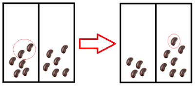
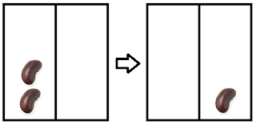
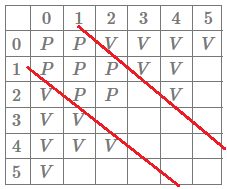
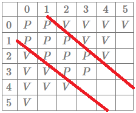

---
metadata:
    description: 'Duas cervejas e duas pilhas de feijões: assim se faz um jogo matemático'
title: 'Problema #006 - pilhas de feijões'
---

O problema deste artigo foi-me colocado nas Jornadas de Matemática da Faculdade de Ciências da UP, numa sessão de *jogos matemáticos*. O problema é particularmente engraçado porque assenta num jogo que se pode jogar entre duas pessoas.

===

# Enunciado do problema

Suponha-se que sobre uma mesa estão dois montes de feijões, um com 19 feijões e outro com 20 feijões. A Ana e o João vão jogar um jogo com esses montes de feijões: cada jogada consiste em retirar $2n$ feijões de um monte e pôr $n$ feijões no outro monte. Assim, na primeira jogada podemos, por exemplo, tirar 10 feijões do monte com $19$ (que agora só tem $9$) e pôr $5$ feijões no monte que tinha $20$ (que agora fica com $20$).

Será que algum dos jogadores consegue garantir a sua vitória?

!!! Pensa um pouco... A minha sugestão seria tentares perceber em que posições é que é claro que um certo jogador já perdeu.

Este jogo tem regras muito simples e é bastante engraçado, vale a pena jogá-lo com alguém só para entender realmente como funciona a dinâmica do jogo. Não precisas de jogar com feijões, podes usar moedas ou cartas ou qualquer outra coisa que tenhas à mão. Decidi incluir aqui em baixo uma pequena janela para que se possa jogar o jogo contra um jogador virtual que não segue nenhuma estratégia em particular, exceto quando, perto do fim, ele reconhece uma jogada vencedora.

Para jogar há que carregar no triângulo por cima do código e escrever as jogadas no terminal. "Escrever uma jogada" corresponde a escrever os novos tamanhos das pilhas depois da alteração que queremos fazer. Por exemplo, para fazermos a jogada descrita no enunciado escrevemos `9, 25`. O computador joga pelo João por defeito; para alterar isto basta escrever `1` em vez de `0` à frente de `GOES_FIRST = `.

<iframe allowfullscreen="true" allowtransparency="true" frameborder="no" height="400px" sandbox="allow-forms allow-pointer-lock allow-popups allow-same-origin allow-scripts allow-modals" scrolling="no" src="https://repl.it/@RojerGS/StackedBeans?lite=true" width="100%"></iframe>

Se precisares de clarificar alguma coisa, não hesites em perguntar na secção de comentários em baixo.

# Solução

Vamos mostrar que o João (isto é, o segundo jogador) tem uma estratégia vencedora. Em vez de apresentar apenas a prova de que o João consegue ganhar sempre, vou tentar recriar todo o meu raciocínio que levou a esta conclusão.

Representamos o número de feijões nos montes por um par $(x, y)$. A primeira coisa óbvia a notar é que as jogadas que se podem fazer em $(x, y)$ também se podem fazer em $(y, x)$, portanto tudo o que concluírmos sobre a posição $(x, y)$ aplica-se à posição $(y, x)$ e vice-versa. Agora começamos por notar que, se for a nossa vez de jogar, e estivermos em alguma das posições $(0, 0)$, $(1, 0)$, $(0, 1)$ e $(1, 1)$ perdemos imediatamente... O que quer dizer que o nosso objetivo é estar numa posição qualquer e jogar de modo a que o nosso adversário passe a estar numa das quatro posições anteriores. De onde é que podem surgir essas jogadas?

Notamos que é impossível chegar à jogada $(0, 0)$, já que em cada jogada tiramos feijões de um monte e pomos feijões noutro, portanto há sempre um monte de feijões que tem mais do que $0$ feijões. E como é que podemos chegar a $(1, 0)$? É fácil de ver que só a posição $(0, 2)$ pode dar origem à posição $(1, 0)$, da maneira representada pela figura seguinte:

De modo semelhante, podemos concluir que para chegar à posição $(1, 1)$ temos de ter vindo da posição $(3, 0)$ (ou da posição $(0, 3)$, claro). Neste momento já sabemos qual é o resultado de um jogo, jogado por dois jogadores perfeitos, que comece numa das posições $(0, 0)$, $(1, 0)$, $(0, 1)$, $(2, 0)$, $(0, 2)$, $(3, 0)$ e $(0, 3)$. Vamos continuar este tipo de raciocínio e sistematizar as nossas conclusões numa tabela. Dizemos que uma posição é perdedora $P$ se, num jogo começado nessa posição, o primeiro jogador perde. De modo semelhante, dizemos que uma posição é vencedora $V$ se, num jogo começado nessa posição, o primeiro jogador vence. Por exemplo, a posição $(1, 0)$ é $P$. O que sabemos até agora é o seguinte:

$$
\begin{array}{|c|c|c|c|c|c|c|}
\hline & 0 & 1 & 2 & 3 & 4 & 5 \\
\hline
 0 & P & P & V & V & & \\
\hline 1 &  P & P & & & & \\
\hline
 2 &  V &  & & & & \\
\hline 3 & V & & & & & \\
\hline 4 &  &  & & & & \\
\hline 5 &  & & & & & \\
\hline
\end{array}
$$

Continuamos a preencher a tabela, concluindo com alguma facilidade que as posições $(2, 1)$ e $(2, 2)$ são perdedoras. De seguida, podemos concluir que as posições $(3, 1)$, $(4, 0)$, $(4, 1)$, $(5, 0)$, $(6, 0)$ e $(4, 2)$ são vencedoras, porque todas elas podem chegar a $(2, 1)$ ou $(2, 2)$. Note-se que para uma posição ser vencedora basta que **uma** jogada sobre essa posição leve a uma posição perdedora. Por exemplo, na posição $(4, 0)$ podemos passar para $(2, 1)$ ou $(2, 0)$. Se passarmos para $(2, 1)$ ganhamos, porque $(2, 1)$ é uma posição $P$, mas se passarmos para $(2, 0)$ acabámos de dar a vitória ao nosso adversário.

Por outro lado, para uma posição ser perdedora é necessário que **todas** as jogadas a partir dessa posição dêem a vitória ao adversário, i.e. o jogador $A$ só está numa posição $P$ se, independentemente do que fizer, o jogador $B$ ficar numa posição $V$.

Preenchendo a tabela com as nossas novas conclusões, obtemos

$$
\begin{array}{|c|c|c|c|c|c|c|}
\hline & 0 & 1 & 2 & 3 & 4 & 5 \\
\hline
 0 & P & P & V & V & V & V \\
\hline 1 &  P & P & P & V & V & \\
\hline
 2 &  V & P & P & & V & \\
\hline 3 & V & V & & & & \\
\hline 4 & V  & V & V & & & \\
\hline 5 & V  & & & & & \\
\hline
\end{array}
$$

Neste ponto podemos começar a notar que um certo padrão parece emergir, que evidencio na tabela seguinte:

Neste momento podemos ser levados a conjeturar que as posições perdedoras são as posições da forma $(x, x+1)$, $(x, x)$ e $(x+1, x)$.

Antes de testarmos essa hipótese vamos ainda preencher as posições $(3, 2)$, $(3, 3)$ e $(2, 3)$. Se estas também forem posições $P$ então a nossa conjetura ganha ainda mais relevância.

De facto, notamos que estando na posição $(3, 2)$ apenas conseguimos ir para $(1, 3)$ e $(4, 0)$, que são duas posições $V$. Deste modo, $(3, 2)$ (e $(2, 3)$) é uma posição $P$. De modo análogo temos que $(3, 3)$ é $P$:

Poderíamos continuar a preencher a tabela, mas neste ponto já vale a pena tentar provar a nossa conjetura; não porque temos a certeza absoluta de que ela é verdade, mas porque se não for, somos capazes de compreender melhor que outro tipo de posições também são posições $P$.

**Conjetura**: Uma posição $(x,y)$ é uma posição $P$ se e só se $y \in \{x-1, x, x+1\}$. Isto é, toda a posição $P$ é da forma $(x,x-1),(x,x)$ ou $(x,x+1)$ e toda a posição dessa forma é uma posição $P$.

Começamos por provar que todas as posições da forma anterior são perdedoras, por indução no tamanho da primeira pilha. O caso base é para as posições $(1,0), (1,1)$ e $(1,2)$, que é trivialmente verdade pela tabela que já construímos. Supomos agora que as posições $(k,k-1), (k,k)$ e $(k,k+1)$ são todas perdedoras, para $k < x, x>1$, e mostramos que isso implica que as três posições $(x,x-1), (x,x), (x,x+1)$ são perdedoras também; para tal, verificaremos que, independentemente da jogada feita a partir dessas posições, o adversário consegue sempre jogar de maneira tal que voltamos a estar numa das posições na zona a vermelho. Relembramos ainda que o caso $(x, x-1)$ é dado de graça pela hipótese de indução, uma vez que $(x, x-1) \approx (x-1, x) = (k, k+1), k=x-1$ é uma posição perdedora pela hipótese de indução.

Note-se que, se da posição $(x, y)$ pudémos fazer a jogada $(x - 2n, y + n)$, então assumindo que $y + n \geq 2n$ podemos fazer a jogada $(x - 2n, y+n) \to ((x-2n) + n, (y+n) - 2n) = (x - n, y - n)$, i.e. mantemos a diferença entre os tamanhos das pilhas ($(x-n)-(y-n) = x-y$) mas diminuimos o tamanho total das pilhas. Basta agora notar que tanto no caso $(x,x)$ como no caso $(x,x+1)$ podemos fazer sempre a segunda jogada descrita anteriormente. Explanamos o raciocínio para a posição $(x, x+1)$: o primeiro jogador leva-nos para a posição $(x - 2n, x + n + 1)$ ou para a posição $(x + n, x - 2n + 1)$.

Estando no caso $(x - 2n, x + n + 1)$, é óbvio que podemos retirar $2n$ da segunda pilha: se pudemos retirar $2n$ feijões de uma pilha com $x$ feijões, então podemos retirar $2n$ feijões de uma pilha com $x + n + 1$, e ficamos na posição $(x - n, x + 1 - n)$ que, pela hipótese de indução, é perdedora. Se estivermos no caso $(x + n, x - 2n + 1)$ temos necessariamente que $2n \leq x + 1 \implies n \leq \frac{x+1}{2}$ uma vez que $x-2n+1\geq 0$. Ora $x + n \leq 2n \iff x \leq n \iff \frac{x}{2} \leq \frac{n}{2} \implies \frac{x+1}{2} \leq \frac{n+1}{2} = \frac{n}{2} + \frac{1}{2} \leq \frac{n}{2} + \frac{n}{2} = n$ e portanto podemos fazer a jogada $(x - 2n, x + n + 1) \to (x - n, x + 1 - n)$ que, pela hipótese de indução, é uma posição perdedora.

Concluímos assim que todas as posições da forma $(x, x-1), (x,x), (x, x+1)$ são posições perdedoras. Para mostrarmos que todas as posições perdedoras são desta forma, basta mostrar que qualquer outra posição é uma posição vencedora; de facto, se estamos na posição $(x, y)$ com $x > y+1$ então há um $n \geq 1$ tal que $(x - 2n, y + n)$ é de uma das formas anteriores (em particular tomando $n = \lfloor \frac{x-y}{3}\rfloor$).

De facto, se $x > y + 1$ então $x - y = 3n \vee x - y = 3n-1 \vee x - y = 3n + 1$ para algum $n \geq 1$. Fazendo uma jogada com esse mesmo $n$ na maior pilha dá o pretendido.

Conluímos assim a prova da nossa conjetura, e aplicando ao jogo do enunciado, notamos que a posição inicial é uma posição perdedora, i.e. o João tem uma estratégia vencedora se seguir a estratégia evidenciada pelo nosso raciocínio.

Na consola abaixo podem experimentar jogar contra o computador que, sempre que possível, vai adotar a estratégia vencedora. Para jogar basta carregar no triângulo por cima do código, para que este seja executado. Fazer uma jogada corresponde a dizer quais são os tamanhos com que as pilhas ficam depois de retirarmos os $2n$ feijões de uma das pilhas e posto $n$ na outra.

<iframe allowfullscreen="true" allowtransparency="true" frameborder="no" height="400px" sandbox="allow-forms allow-pointer-lock allow-popups allow-same-origin allow-scripts allow-modals" scrolling="no" src="https://repl.it/@RojerGS/PerfectStackedBeans?lite=true" width="100%"></iframe>

Não te esqueças de [subscrever a newsletter][subscribe] para receberes os problemas diretamente na tua caixa de correio,
e deixa a tua reação a este problema em baixo.

[email]: mailto:rodrigo@mathspp.com?subject=Resposta%20para%20{{ page.title|regex_replace(['/ /'], ['%20']) }}
[subscribe]: https://mathspp.com/subscribe
