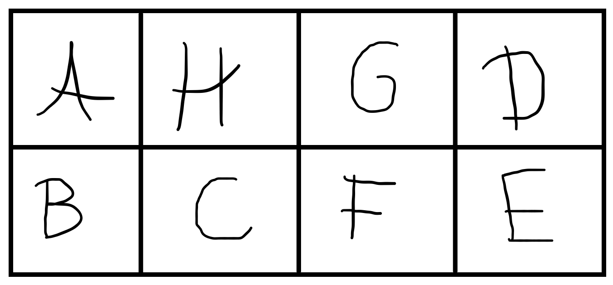

---
metadata:
    description: Help me fold this piece of paper so that the alphabet comes in order!
title: 'Problem #019 - fold the alphabet'
---

Take out a piece of paper and a pencil, I am going to ask you to write some letters in your sheet of paper and then I am going to challenge you to fold the sheet of paper... with a twist!

===

# Setup

Seriously though, please take out a piece of paper and lay it out horizontally (or in "landscape mode", were the piece of paper a mobile device).

Now I need you to crease your sheet of paper in half, along a horizontal line; then I need you to crease it in half along a vertical line, and then in half again, along a vertical line.

In the end, you should have your piece of paper creased like this:

Except that your creases should be nicely centered, unlike the drawing I made... Oh well!

# Problem statement

Now the challenge is the following: I am going to ask you to write the letters `ABCDEFGH` in the rectangles you created and I need you to fold the piece of paper in such a way that,

 - the eight small rectangles are on top of each other, making a stack of eight squares of paper;
 - if you go through the rectangles one at a time, the letters show up in order.

The only restriction is that you can't cut your sheet of paper! The point is to _fold it_, not to take a pair of scissors and cut the paper along the creases.

There are going to be three levels, corresponding to three different letter layouts in the rectangles you creased. Start with level 1, write down the letters and try to fold the paper correctly. When you get it right, erase the letters and write down the letters for level 2, and then for level 3! Good luck!

## Level 1

## Level 2

## Level 3

!!! Give it some thought... and most important of all, try it for real with an actual piece of paper! Let me know how it went in the comment section below ;)

!!!! **Tip**: if you are having a hard time keeping track of which rectangle is which, consider also writing the letters on the back of the sheet of paper, but be sure to **label them correctly**; a single rectangle should have the **same** letter front and back!

!!!! **Tip**: if the paper is too strong and you are having a hard time manipulating it, consider scrambling it and then flattening again before continuing.

I heard of these from a friend and he learned about this problem by watching [this YouTube video](https://www.youtube.com/watch?v=GpClxF41ugg).

# Solution

## Level 1

For this one, all you had to do was fold the paper along the horizontal line and then fold the resulting piece of paper like a concertina.

## Level 2

This one is much harder to explain in words so I made some more drawings and made some markings on the sheet of paper:

Now if you flip the sheet of paper (to the back) you also need these markings:

Now this is how you go about it:

 1. fold in half vertically, so that the two red circles (in `H` and `G`) touch. Pinch the paper on letters `H` and `G`;
   
 2. fold in half horizontally, so that the two yellow squares (in `G` and `F`) touch. Pinch the paper on letters `H` and `C`;
   
 3. look for the two blue stars (in `F` and `H`) and pinch on top of them with your thumb and index finger. I want your fingers to really touch the markers, so that there's _exactly_ three layers of paper between your thumb and index fingers;

 4. you are going to take letters `E` and `D` and fold them, inside the fold you are holding, so that the green triangles touch each other;

 5. make the final fold so that `B` goes on top of `C`.

_Voilà!_

## Level 3

In my opinion this one is easier to understand how it is going to work but it is much harder to do without ruining the piece of paper! Lets get to it!

Here is the front side with some markings:

And the back:

Now here's how you do it:

 1. fold the leftmost vertical crease so that the two yellow circles (in `A` and `H`) touch;
 2. fold from the left again, so that both green squares (the one on `A` just became visible) touch;
 3. fold horizontally so that the red triangles (in `B` and `C`) touch;
 4. fold from the right so that the blue stars (in `E` and `F`) touch;

And that is it! _Almost_. Now comes the hard part... Everything is fine, except `H` is covering your `A`, so the `H` should move from the top of the stack to the bottom... And the way you go about it is by turning the fold inside out, like if you were folding a sock (similar to what happens at [minute 3:44 of this video](https://youtu.be/124L94hoBQg?t=224))...

It took me a couple of tries to get this one right; expect your piece of paper to tear just a little bit... In fact, here's what happened on my first attempt:

As you can see, the `H` was about to be completely ripped from the sheet of paper!
