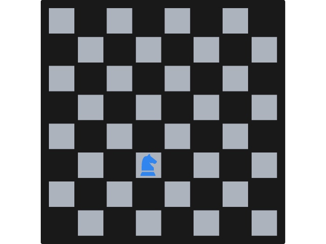
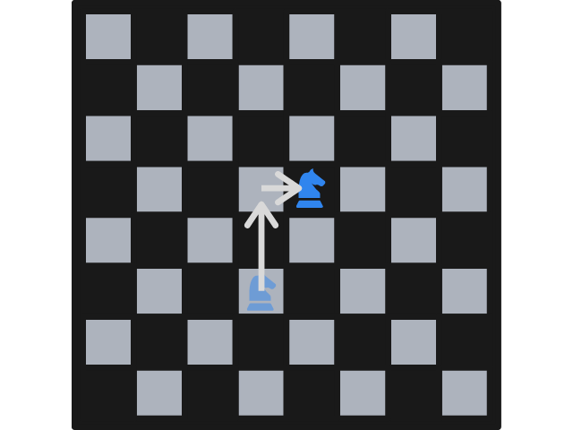
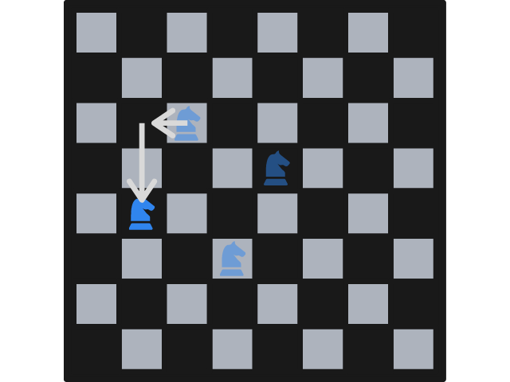
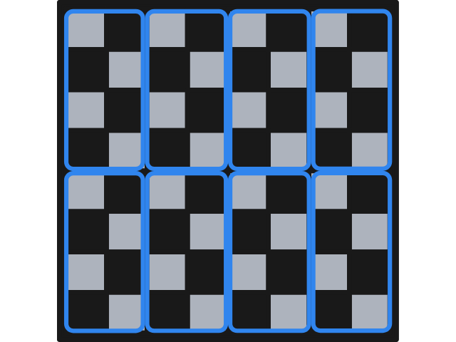
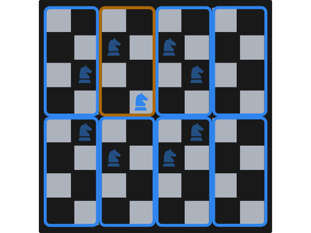
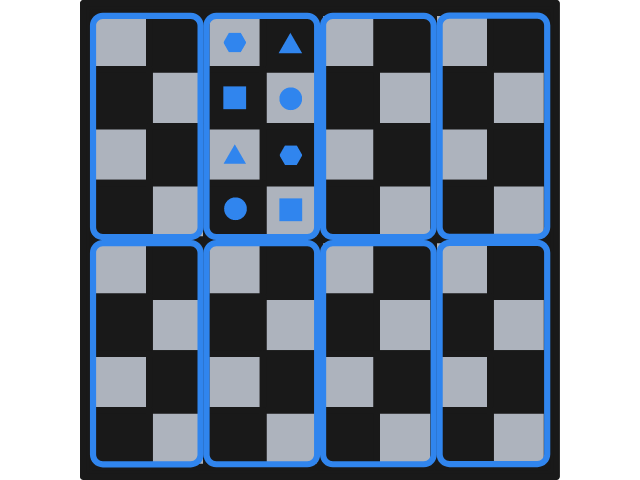

---
metadata:
    description: Neste problema a Alice e o Bruno vão jogar um joguinho que também se joga num tabuleiro de xadrez, mas não é xadrez!
title: 'Problema #025 - passeio do cavalo'
---

A Alice e o Bruno vão sentar-se, frente a frente, com um tabuleiro de xadrez entre eles.
Vão jogar um jogo, mas neste jogo só entra uma única peça: um cavalo.
Quem vai ganhar?

===

# Enunciado do problema

A Alice e o Bruno vão jogar um “jogo de xadrez” especial.
A Alice vai pegar no cavalo e vai pô-lo no tabuleiro, num quadro qualquer à escolha dela.

Depois, o Bruno vai pegar no cavalo e vai movê-lo de acordo com as regras do xadrez, para uma posição à escolha dele.

Depois a Alice faz o mesmo, e vão alternando a fazer estes movimentos.
Só há um pequeno senão:

 > **Não podem** mover o cavalo para uma posição que já tenha sido visitada pelo cavalo.

Por exemplo, na imagem em baixo o cavalo não pode ir para a casa que está uma fila para baixo e duas colunas para a direita, porque foi aí que o cavalo começou.

Por causa disso, o primeiro jogador que não conseguir mexer o cavalo perde.

Será que algum dos dois consegue garantir uma vitória? Quem? Como?

!!! Pensa um pouco...

Se quiseres, [aqui](https://mathspp.com/pt/games/knights-tour) podes experimentar jogar este jogo contra o computador.

Se precisares de clarificar alguma coisa, não hesites em perguntar na secção de comentários em baixo.

Este problema foi-me colocado por um colega do curso que gosta bastante de jogar xadrez.

# Solução

Vamos mostrar que o Bruno (o segundo jogador) consegue ganhar o jogo, sempre.
Para isso, vamos seguir uma estratégia simples: vamos mostrar que,
independentemente do que a Alice fizer, o Bruno consegue *sempre* fazer uma jogada.
Se o Bruno consegue *sempre* fazer uma jogada, e se o jogo é um jogo finito
(o jogo nunca pode durar mais do que $64$ jogadas porque o tabuleiro só tem $64$ casas),
então a Alice perde sempre.

A primeira coisa que fazemos é dividir o tabuleiro em oito retângulos com dimensões
$4 \times 2$, tal como ilustrado na figura em baixo.

Repara que as casas do tabuleiro estão todas dentro de *algum* retângulo e, o *mais
importante de tudo*, qualquer casa do tabuleiro tem apenas uma outra casa, à distância
de um cavalo, e no mesmo retângulo $4\times 2$.

A título de exemplo, supõe que um cavalo está numa posição tão central quanto possível,
na quarta linha a contar de cima e na quarta coluna a contar da esquerda.
Esse cavalo tem oito movimentos possíveis, mas apenas um desses oito vai aterrar dentro
do retângulo de onde o cavalo partiu.
Isto é ilustrado na figura que se segue, onde cada cavalo translúcido representa um
movimento legal e onde um retângulo foi colorido de forma diferente,
para realçar a posição inicial do cavalo e o único movimento legal que permite ao
cavalo mudar de posição sem mudar de retângulo.

Este é um padrão muito claro que funciona de forma semelhante para cada um dos oito
retângulos.
A figura seguinte esquematiza os pares de quadrados entre os quais um cavalo pode
saltitar, sem sair do mesmo retângulo.
No exemplo de cima, o cavalo estava numa das posições marcadas com um quadrado e só
poderia saltar para a outra posição marcada com um quadrado.
Se estivesse numa das posições marcadas com um círculo, só poderia saltar para a outra
posição marcada com um círculo (assumindo que o cavalo não quer mudar de retângulo).

Reflete um pouco sobre isto.

Agora que entendes o que isto quer dizer, é fácil de ver que o Bruno pode ganhar
sempre!

A Alice começa por escolher uma posição qualquer no tabuleiro.
Sempre que é a vez do
Bruno, tudo o que ele tem de fazer é mexer o cavalo para a única posição legal que
mantém o cavalo dentro do mesmo retângulo.
Esta posição está sempre livre, porque sempre que a Alice joga ela tem de mexer o
cavalo para um par de posições que ainda não foi visitado, e sempre que o Bruno joga
ele garante que o par de posições é completamente visitado.

E é assim que a Alice perde sempre para a estratégia brilhante do Bruno.
Se quiseres, podes testar esta estratégia jogando contra o computador [aqui][game].

Não te esqueças de [subscrever a newsletter][subscribe] para receberes os problemas diretamente na tua caixa de correio,
e deixa a tua reação a este problema em baixo.

[sol]: ../../solutions/{{ page.slug }}
[subscribe]: https://mathspp.com/subscribe
