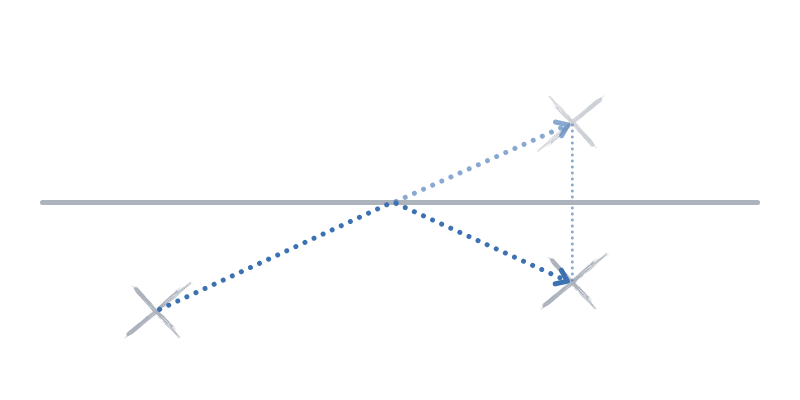

---
metadata:
    description: "A simple problem that builds around the experience of sunbathing in a beach."
title: "Problem #030 - efficiency at the beach"
---

You are sunbathing when you decide to go and talk to some friends
under a nearby sun umbrella, but first you want to get your
feet wet in the water.
What is the most efficient way to do this?

===

# Problem statement

The problem statement is just like you read above.
You are on the sand and need to go to another place on the sand,
but first you need to go to the shoreline, which you can assume
is a straight line:

How do you pick your path so that you walk as little as possible
(because the sand is really hot!)?

!!! Give it some thought...

If you need any clarification whatsoever, feel free to ask in the comment section below.

# Solvers

Congratulations to the ones that solved this problem correctly and, in particular, to the ones
who sent me their correct solutions:

 - “Todi Liju”, Portugal;
 - João F., Portugal;
 - António, Portugal;
 - David, Portugal;
 - Eleonora, Portugal.

(The list is in no particular order.)

# Solution

The easiest way to formulate the solution is as follows:

You just have to reflect one of the umbrellas to the other side of the shoreline,
and then the shortest path between the reflection and the other umbrella is a straight
line.
This path crosses the shoreline, so it does what is needed.
When you reach the shoreline, instead of walking into the ocean you turn around
and keep walking in a straight line to the other umbrella.

This works because the distance from any point in the shoreline to an umbrella
is the same as the distance from that same point to the umbrella reflected along
the shoreline.

[Don't forget to subscribe to the newsletter][subscribe] to get bi-weekly
problems sent straight to your inbox and to add your reaction below.

[email]: mailto:rodrigo@mathspp.com?subject=Solution%20to%20{{ page.title|regex_replace(['/ /'], ['%20']) }}
[subscribe]: https://mathspp.com/subscribe
[sol]: ../../solutions/{{ page.slug }}

