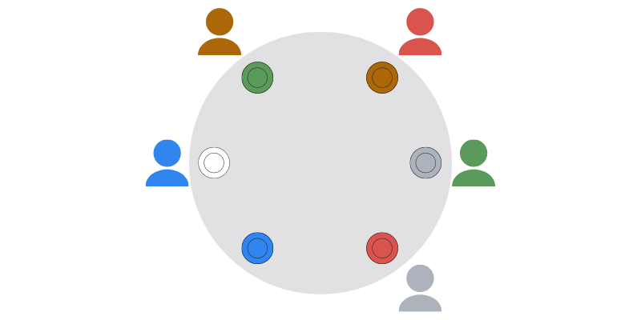

Um empregado de restaurante distribui os pedidos de forma totalmente errada.
Será que se consegue girar a mesa para que pelo menos dois pedidos fiquem à
frente da pessoa certa?

===

# Enunciado do problema

Um grupo de pessoas está sentado à volta de uma mesa redonda, à espera dos seus pedidos.
Quando a comida chega, os pratos são distribuídos de forma totalmente errada
e ninguém recebeu aquilo que tinha pedido.

Será que há _sempre_ uma maneira de girar a mesa para que duas pessoas (ou mais)
passem a ter o seu prato à sua frente?
Podes começar por testar o caso esquematizado em cima, assumindo que consegues
distinguir as cores no boneco (desculpa se não conseguires :/).

# Submissões

Parabéns a todos os que conseguiram resolver o problema e,
em particular, aos que me enviaram as suas soluções:

 - Attila K., Hungria;
 - Filippo M., Itália;
 - Luís S.;
 - André S..

(A lista não está ordenada.)

# Solução

Recebi algumas propostas de solução muito interessantes,
mas o que vou partilhar é uma versão daquela que eu acho a solução
mais elegante.

Sim, é sempre possível rodar a mesa por forma a que pelo menos duas
pessoas fiquem com o pedido certo à sua frente.

Suponhamos que cada pessoa que está sentada à mesa começa por olhar
para a sua esquerda e contar o número de pratos a que o seu pedido
está.

Por exemplo, se as pessoas estivessem sentadas desta maneira:

Então as contagens seriam:

Se há $n$ pessoas à mesa, então o número de cada pessoa há de ser
um valor inteiro entre $1$ e $n - 1$, inclusivé.
O número de uma pessoa não pode ser $0$ porque isso significaria
que essa pessoa tinha o seu próprio prato à sua frente, e não
pode ser $n$ ou um número ainda maior porque $n$ representa uma volta inteira à mesa.

Assim, cada pessoa tem um número que está dentro do conjunto

$$
\{ 1, 2, \cdots, n-1 \} ~~~,
$$

mas há um total de $n$ pessoas e apenas $n - 1$ opções distintas.
Se aplicarmos o princípio do pombal, isto significa que há pelo menos
duas pessoas cujo número é igual a $d$.
Desta feita, se movermos a mesa $d$ lugares no sentido oposto ao
dos ponteiros do relógio, então essas pessoas passam a ter
o seu pedido à sua frente.

Não te esqueças de [subscrever a newsletter][subscribe] para receberes os problemas diretamente na tua caixa de correio,
e deixa a tua reação a este problema em baixo.

[email]: mailto:rodrigo@mathspp.com?subject=Resposta%20para%20{{ page.title|regex_replace(['/ /'], ['%20']) }}
[subscribe]: https://mathspp.com/subscribe
[sol]: ../../solutions/{{ page.slug }}
