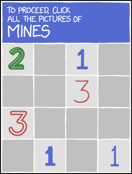
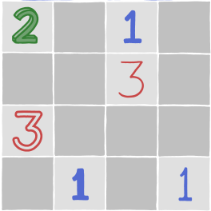
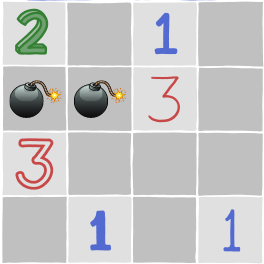
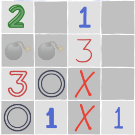
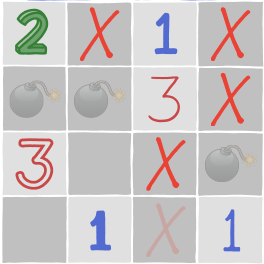
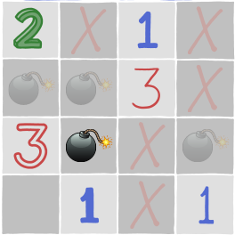
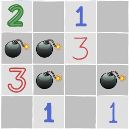

Can you solve this little minesweeper puzzle?

===

# Problem statement

The [xkcd] website published its cartoon [#2496][source], containing a minesweeper grid,
and that is the problem for this post:
to locate all of the mines in the minesweeper grid above.

For those of you who don't know the minesweeper game,
here are the rules:

 - some squares contain mines, others don't;
 - squares that do not contain mines contain numbers instead,
and those numbers indicate how many mines are neighbours to that numbered square
(the neighbourhood of a square contains the squares that are directly
adjacent to it, plus the squares that share a vertex in the diagonal).
 - gray squares can contain mines or other numbers.

You must find all the mines by reasoning about the numbers you see.

You can play minesweeper online or you can play [my minesweeper remake][minesweeper-blog].

!!! Give it some thought!

If you need any clarification whatsoever, feel free to ask in the comment section below.

# Solvers

Congratulations to the ones that solved this problem correctly and, in particular, to the ones
who sent me their correct solutions:

 - David H., Taiwan;
 - Gerard M., Ireland;
 - Peter K., USA;
 - Rodrigo H. M., Mexico;
 - Rita F., Portugal;

Join the list of solvers by [emailing me][email] your solution!

# Solution

Let's look for the mines together!

This is the mine field we have to work with:

Let's look at the lower-left corner, at the `3` and the `1`.

The `3` has four neighbouring cells:

The two cells that have a double circle are next to the `1`,
and therefore we can't have mines in both of those cells.
Therefore, the two top circles _must_ contain mines.

Two mines have been found!

The `3` that we were looking at now has two mines placed
next to it, so we only have to find the last one.

Regardless of where that mine is (one of the two double circles below),
it is always going to be next to the bottom-left `1`.
This means that there can be _no_ mines between the two `1`s
on the bottom row.

By crossing out those two locations, we know that the bottom-right
`1` has a mine right above it.

For the next step, we can look at the top-right `1`.
The top-right `1` already has a neighbouring mine
(to the left, and down) which means all other neighbouring
cells must be empty.

In crossing out those positions,
we realise that the `3` on the second row, to the right,
only has one position left for its third mine.
Therefore, we can place a mine there.

As we place that mine, the puzzle is complete!
Take a look for yourself:

[Don't forget to subscribe to the newsletter][subscribe] to get bi-weekly
problems sent straight to your inbox.

[email]: mailto:rodrigo@mathspp.com?subject=Solution%20to%20{{ page.title|regex_replace(['/ /'], ['%20']) }}
[subscribe]: https://mathspp.com/subscribe
[source]: https://xkcd.com/2496/
[xkcd]: https://xkcd.com
[minesweeper-blog]: /blog/minesweeper-remake
