If I scramble a Rubik's cube for long enough,
will it solve itself?

===

# Problem statement

A Rubik's cube is a toy like the one you can see in the picture above.
It's a 3 by 3 by 3 cube, where each face has one of six colours.
The cube can be scrambled, and at that point the colours of the faces
no longer match.

The challenge I have for you involves proving something.
I want you to prove the following statement:

 > “If you take a solved Rubik's cube and start scrambling it
 by following a fixed set of steps, you eventually end up with a solved
 Rubik's cube again.”

A silly example of how this is true is if you start turning the top face.
You rotate it once.
Twice.
Thrice.
A final turn, and it's back at the initial position!

But this also applies to more complicated sequences of turns!

If you have one, go grab a Rubik's cube and give it a go!
(It's not the same thing, but you can also try [this online simulator][cube-simulator].)

For your convenience, here is a short GIF of me scrambling
a cube by repeating the same set of steps.

First, here is an excerpt of the process, showing the set of steps I do repeatedly.
If you look closely, you can see that I only do two movements:

Now, here is a sped up version from start to finish.
(It took me around 3 minutes total to get back to the beginning
through repeated scrambling!)

I started out with a solved cube and ended up with a solved cube.

Why?

!!! Give it some thought!

If you need any clarification whatsoever, feel free to ask in the comment section below.

# Solvers

Congratulations to the ones that solved this problem correctly and, in particular, to the ones
who sent me their correct solutions:

 - David H., Taiwan;

Join the list of solvers by [emailing me][email] your solution!

# Solution

## Solution with group theory

If you are comfortable with the basics of group theory,
the proof can be stated succinctly.
If you don't know what I'm talking about, that's fine, skip this!

Let $M$ denote the permutation we are using to scramble the cube, as an element of the group of permutations of the Rubik's cube.

For $m$ large enough, we have that in

$$
M^0, M^1, \cdots, M^m, ~ ,
$$

two permutations are going to be the same, $M^n = M^m$, with $n < m$.
(This follows from the pigeonhole principle and the fact that
there's a finite number of permutations of the Rubik's cube.)
If $M^{-1}$ denotes the inverse permutation, then

$$
M^m = M^n \iff M^{m-n} = M^0 ~ .
$$

This shows that $M^{m - n}$ (where $m - n \geq 0$) is the solved cube.

## Overview of less math-y solution

Here is the generic overview of the solution we will produce together:

 1. we prove that if we keep scrambling the cube, we eventually re-visit a position
 that we have already seen;
 2. we list all cube positions we go through by repeatedly scrambling;
 3. we compare the two equal positions after un-scrambling both of them; and
 4. we conclude that an earlier position was the cube solved again.

## Pigeonhole principle

Let's start from the beginning.

A Rubik's cube has many, many, many different ways it can be shuffled.

In fact, a shuffled Rubik's cube can be in any one of **43,252,003,274,489,856,000** positions.
That's a lot!

Quoting an article on this,

 > “To put this into perspective, if one had one standard-sized Rubik's Cube for each permutation, one could cover the Earth's surface 275 times [...]”
 > ― [Rubik's Cube, Wikipedia][wiki]

However, this huge number is _finite_.
In other words, regardless of how much you scramble the cube,
_given enough time_, you **will** see a repeated position.

Why is that?

Because there is a finite number of positions available!

Here is a similar argument, but maybe easier to understand:
if you flip a coin three times, one of the faces will show up repeated.

(This argument is known as the [Pigeonhole principle][pigeonhole-principle].)

Now we know that if we keep shuffling the cube repeatedly,
we eventually end up in a repeated position.

## Move notation

Before we move on, I need to introduce something that
will make my life easier when explaining the solution,
and that will also make your life easier when understanding the solution.

In order to make sure you understand what I mean when I talk about
a specific cube movement, I will introduce Rubik's cube notation.

This notation is just a convention used when people talk about specific
movements of the Rubik's cube.
If you already know this convention and you know what
L R F B U D and L' R' F' B' U' D' mean, go ahead and skip this section.

A (Rubik's) cube has six faces.
If one of the faces is directly facing you,
then we can name the faces by their relative position:
left, right, up, down, front, and back.

Here is an image of a solved Rubik's cube where the front face is white,
the up face is orange, and the right face is blue:

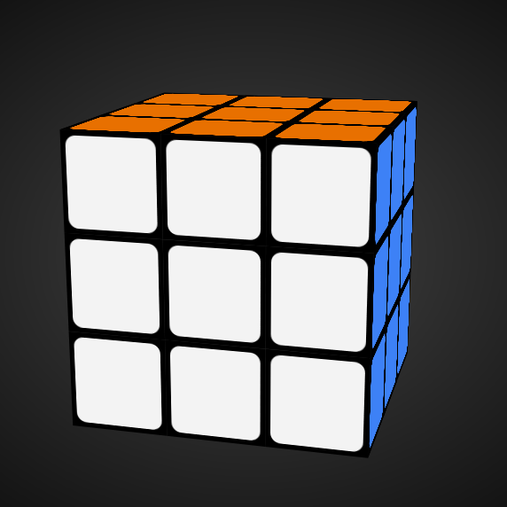

The notation allows us to refer to clockwise rotations of the faces
by employing the first letter of the name of the face.

That is, the move U refers to a clockwise turn of the up face,
putting the cube in this position:

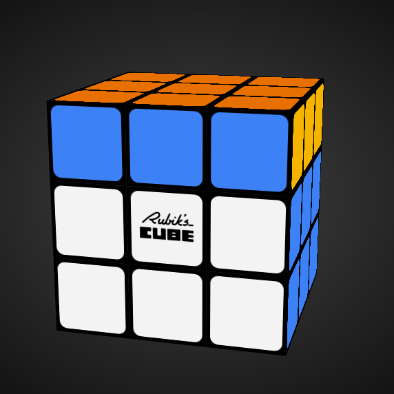

By rotating the up face once (or 90⁰), we can tell that the colour
of the back face is actually yellow!
(Not that it matters 😂)

When we want to refer to a turn in the counter-clockwise direction,
we use the first letter of the name of the face, with an apostrophe.
Therefore, the move U' (read as “U-prime”) restores the cube
to its solved position.

Here is a table summarising what happens to a solved cube if we apply
the 12 different moves that exist:

| | X | X' |
| :- | | |
| L (left) | 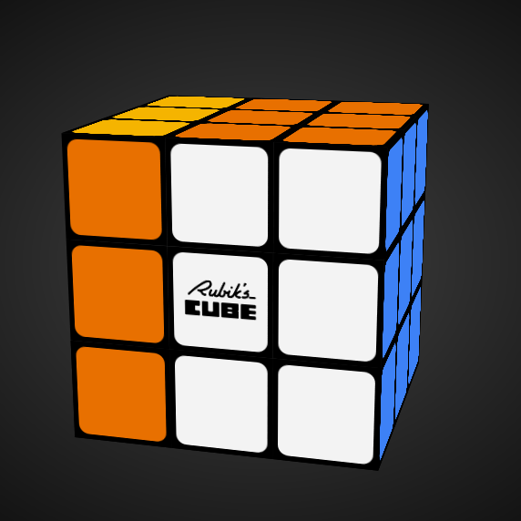 | 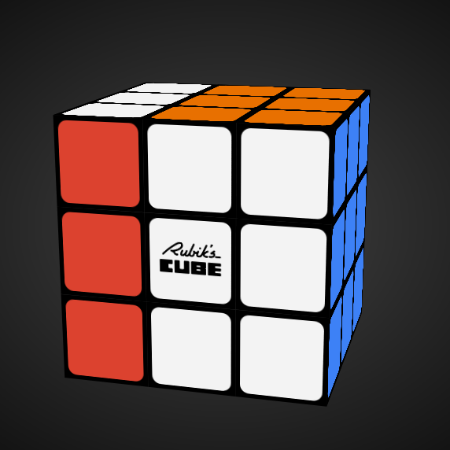 |
| R (right) | 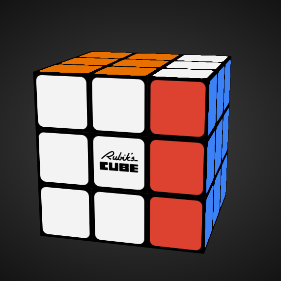 | 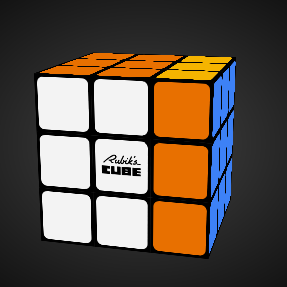 |
| F (front) | 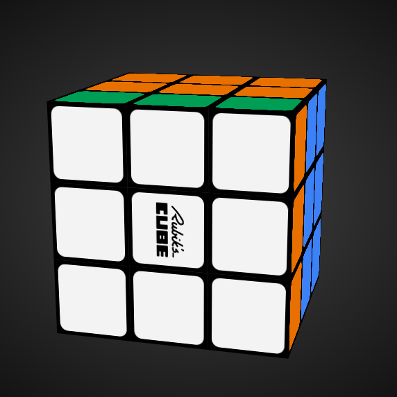 | 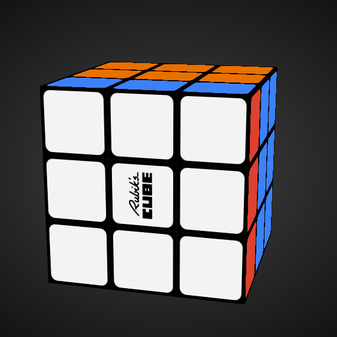 |
| B (back) | 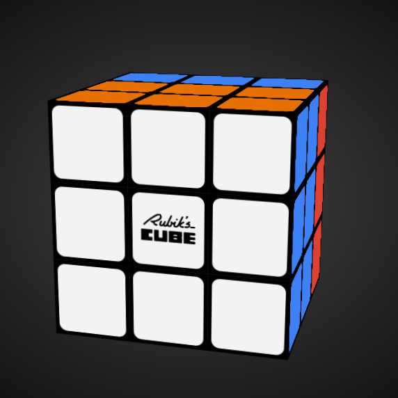 | 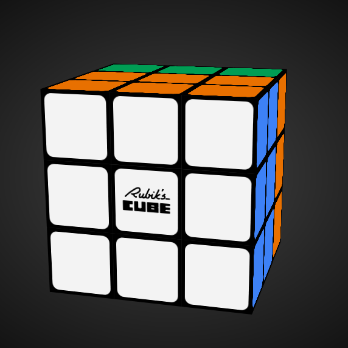 |
| U (up) | 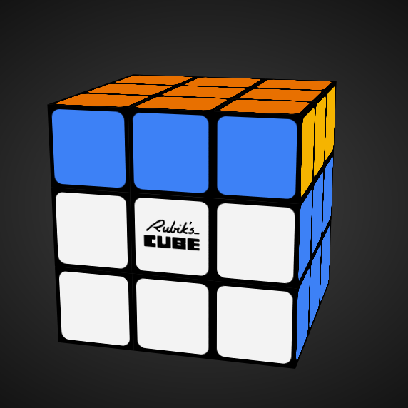 | 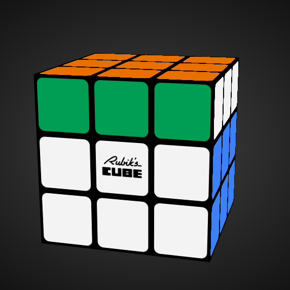 |
| D (down) | 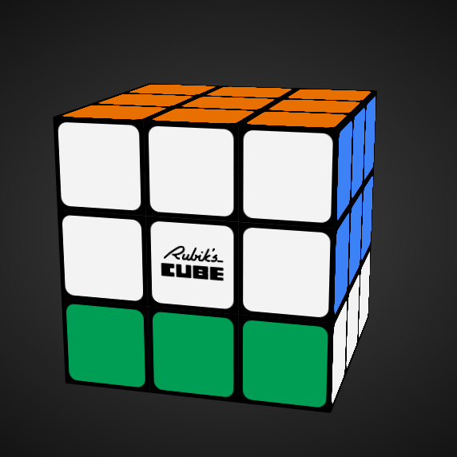 | 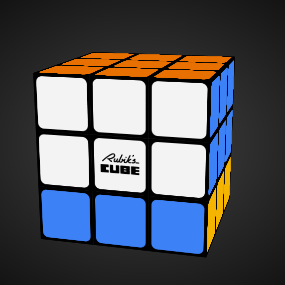 |

I don't need you to become a master of this notation,
I just want you to be comfortable enough to refer to cube movements
through letters of the alphabet.

If you really want to, you can google more information on this notation.

## Scrambling move

### $M$

The problem statement says specifically (and that is a very important detail)
that we shuffle the cube by repeating the same movements over and over again.
This should be visible in the GIFs above.

Much like we have the notation (explained above) to denote a single turn
of a single face of the cube,
let's now use $M$ to denote the set of moves that are being repeated over and over again.

I want you to forget that $M$ is composed of smaller steps.
I want you to think of $M$ as a single movement that transforms your cube.

### Exponent notation

Now we do something with $M$.
We use $M^n$ to say that we have done the movement $M$ exactly $n$ times.
Hence, $M^5$ is just a shorter way of writing $MMMMM$ to represent
5 times the move $M$.

So, $M^0$ is a solved cube, because we haven't done the movement $M$ yet.
If I do $M$ once, then I represent the cube by $M^1$.
If I do $M$ 51 times, then I represent the cube by $M^{51}$.

Is this making sense?
This notation is going to make it easier for more to explain my solution,
so take your time.

## Equal positions

Now we'll reason about the different cube states in these positions:

$$
M^0, ~ M^1, ~ M^2, ~ M^3, ~ M^4, \cdots 
$$

If we keep listing these positions,
we will eventually find a position $M^m$ that is going
to be the same as some other position $M^n$, with $n < m$.
In other words, the position $M^m$ will be a repetition of position $M^n$.

Now, we will focus solely on the positions that go from
$M^0$ to $M^m$,

$$
M^0, ~ \cdots, ~ M^n, ~ \cdots, ~ M^m,
$$

and we know that $M^n = M^m$.

## Un-scrambling

The next thing we want to take a look at is the fact that the
move $M$ can be undone.

Above, we learned some basic moves, and some moves undo each other.
For example, L' undoes L, and L undoes L'.

We can also think about a sequence where we keep undoing $M$:

$$
M^3 \rightarrow M^2 \rightarrow M^1 \rightarrow M^0 \rightarrow \cdots
$$

From left to right, we keep undoing $M$ once, until we get to the starting point,
which we can represent with $M^0$.
However, if we are at the starting point and we undo $M$ again, where do we end at..?

Looking at the exponents next to $M$, the next value seems to be $-1$:

$$
\cdots \rightarrow M^1 \rightarrow M^0 \rightarrow M^{-1} \rightarrow \cdots
$$

So, $M^{-1}$ represents the move that is opposite to $M$, the _inverse_ of $M$.
Much like $M^3$ means we did $M$ three times,
$M^{-1}$ means we did $M^{-1}$ (the inverse of $M$) a total of three times.

Now, let us go back to the fact that the cube looks exactly the same at positions $M^n$ and $M^m$.
It's exactly the same position, $M^n$ and $M^m$ just represent different names for the same thing.
So, if we apply the same set of moves to both representations, we should end up again at the same position.

## Un-scrambling and algebraic manipulations

So, what if we apply the moves $M^{-n}$ to both cubes?
They look the same in the beginning, so they have to look the same in the end:

$$
M^n = M^m \implies M^n M^{-n} = M^m M^{-n} ~ .
$$

What does $M^n M^{-n}$ mean?
It means we did the move $M$ a total of $n$ times, and then we undid it $n$ times as well...
But doing something and then undoing it just puts us back at the beginning,
so $M^n M^{-n} = M^0$.

If we replace $M^n M^{-n}$ with $M^0$ above, we get

$$
M^0 = M^m M^{-n} ~ .
$$

Now, can we simplify $M^m M^{-n}$?

(At this point, you might have realised that we are manipulating the exponents here
just like we do when doing exponentiation with “regular numbers” in school.
That's not a coincidence, there's actually a deep relationship here.)

$M^m M^{-n}$ means we do move $M$ a total of $m$ times and then undo it $n$ times.
But that's the same as just doing $M$ a total of $m - n$ times, right?

For example, $M^5 M^{-3}$ means we do $M$ five times and then undo it three times...
Which, in the end, means we only really did $M$ a total of two times,
and $2 = 5 - 3$.

Therefore, we can rewrite $M^m M^{-n}$ as $M^{m - n}$,
which we can substitute back into the expression we had before.

## Eureka!

$$
M^0 = M^m M^{-n} \implies M^0 = M^{m - n} ~ .
$$

But that's it!
We are done!

$M^0$ is the original position – the solved cube – and we are saying that
$M^{m - n}$ looks exactly like the solved cube!
What is more, $m > n$, so the position $M^{m - n}$ shows up _somewhere_ in the list we had:

$$
M^0, ~ \cdots, ~ M^n, ~ \cdots, ~ M^m,
$$

This proves that, in doing the move $M$ repeatedly,
we eventually cycle back to the original position!

Did this make sense?
I am going to be honest with you, I tried to make this explanation
understandable by curious people who do not know advanced maths.
I did my best, but maybe it wasn't good enough _yet_.
Leave questions in the comments and I'll gladly answer!

[Don't forget to subscribe to the newsletter][subscribe] to get bi-weekly
problems sent straight to your inbox.

[email]: mailto:rodrigo@mathspp.com?subject=Solution%20to%20{{ page.title|regex_replace(['/ /'], ['%20']) }}
[subscribe]: /subscribe
[cube-simulator]: https://ruwix.com/online-puzzle-simulators/
[wiki]: https://en.wikipedia.org/wiki/Rubik's_Cube#Permutations
[pigeonhole-principle]: https://en.wikipedia.org/wiki/Pigeonhole_principle
