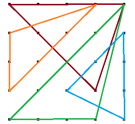

Can you draw 4 triangles in this 5 by 5 grid, covering all dots?

===

# Problem statement

Your challenge is to draw 4 triangles in a regular 5 by 5 grid.
Of course, there are some restrictions:

 - all vertices of all triangles have to lie on the dots;
 - all 25 dots have to be covered by the vertices/edges of the triangles; and
 - no triangle may have a right angle
 (thus, the image above is a bad start: the triangle to the right has a right angle).

!!! Give it some thought!

If you need any clarification whatsoever, feel free to ask in the comment section below.

I originally found this puzzle in the [Puzzling Stack Exchange][source] website.

# Solvers

Congratulations to the ones that solved this problem correctly and, in particular, to the ones
who sent me their correct solutions:

 - David H., Taiwan;
 - Michael W., USA;
 - Pedro G., Portugal;
 - B. Praveen R., India;
 - Kees L., The Netherlands;
 - Jerry J., USA;
 - Mihalis G., Greece;
 - Alfredo E., Mexico;
 - Martin J., Czeck Republic;

Join the list of solvers by [emailing me][email] your solution!

# Solution

There are many different solutions to this problem.

Jerry, from the USA, submitted the solution that I am most fond of:

This solution is my favourite because of the vertical symmetry between the two larger triangles
and because the two smaller triangles are rotations of the other.

Just for reference, here is another possible solution (among the many that exist!);
this one was from Martin, picked randomly among the others.

[Don't forget to subscribe to the newsletter][subscribe] to get bi-weekly
problems sent straight to your inbox.

[email]: mailto:rodrigo@mathspp.com?subject=Solution%20to%20{{ page.title|regex_replace(['/ /'], ['%20']) }}
[subscribe]: /subscribe
[source]: https://puzzling.stackexchange.com/questions/110702/four-non-right-angled-triangles-passing-through-every-dot-of-a-5x5-grid
