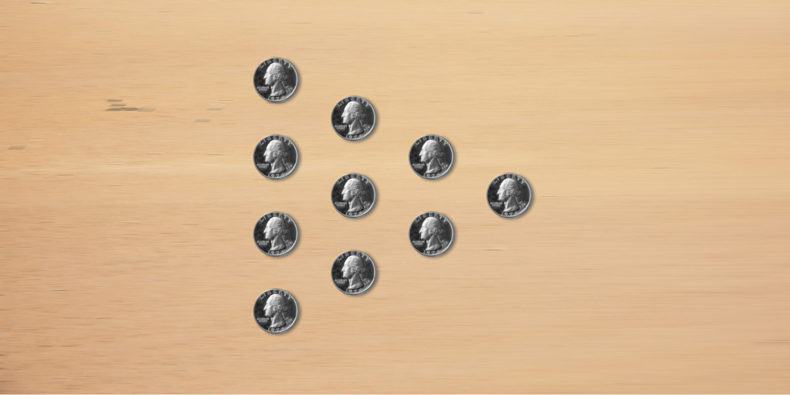
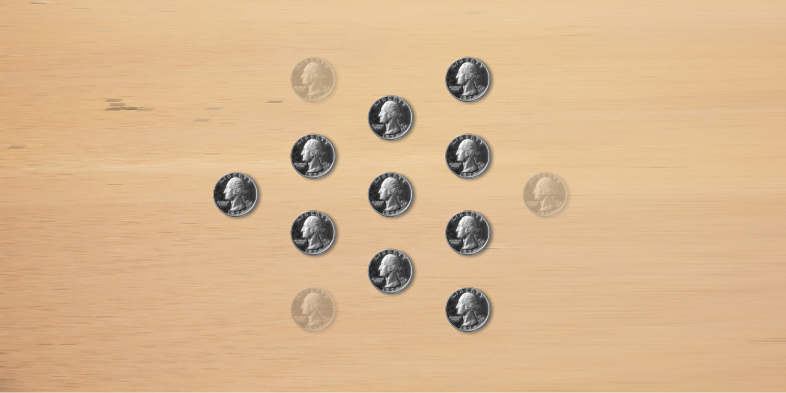

Can you make the pyramid point the other way by moving only three coins?

===



# Problem statement

The image above shows a pyramid composed of 10 coins:
4 coins, then 3, then 2, then 1.

Your task is to make the pyramid point the other way by moving
_only_ three coins.

In the image above, that means you want the pyramid to be pointing to the left.

With a figure, if the initial pyramid is

```txt
O O O O
 O O O
  O O
   O
```

you have to make it look like

```txt
   O
  O O 
 O O O
O O O O
```

Again, only moving 3 coins.

The purpose of the puzzle is not for you to find a loophole in the instructions.

!!! Give it some thought!

If you need any clarification whatsoever, feel free to ask in the comment section below.

This problem was shared by a solver of a previous problem, so thank _you_!


# Solvers


Congratulations to the ones that solved this problem correctly and, in particular, to the ones
who sent me their correct solutions:

 - David H., Taiwan;
 - Zech Z., US;
 - Diana O., Venezuela;
 - Michael W., US;
 - Christ van W., Netherlands;
 - Arun, Canada;
 - Gabbar S., India;
 - André R., Canada;
 - Luiz G., UK;
 - Daniel D., Sweden;
 - Nishant M., India;
 - Tahoor B., India;
 - Nelson R., India;
 - Rex B., US;
 - Marco M., Italy;
 - Pedro G., Portugal;
 - Vikas Z., India;
 - Robin B., Scotland;
 - Michal K., Czech Republic;
 - “Helaxious”, Brazil;
 - Kees de L., Netherlands;
 - Reza M., Kenya;
 - Alex van V., Netherlands;

Know how to solve this?

Join the list of solvers by [emailing me][email] your solution!


# Solution

It is easier to _show_ you the solution than it is to explain it to you,
but what you want to do is take the three corner coins and “move them to the opposite side”:




[Don't forget to subscribe to the newsletter][subscribe] to get bi-weekly
problems sent straight to your inbox.

[email]: mailto:rodrigo@mathspp.com?subject=Solution%20to%20{{ page.title|regex_replace(['/ /'], ['%20']) }}
[subscribe]: /subscribe
