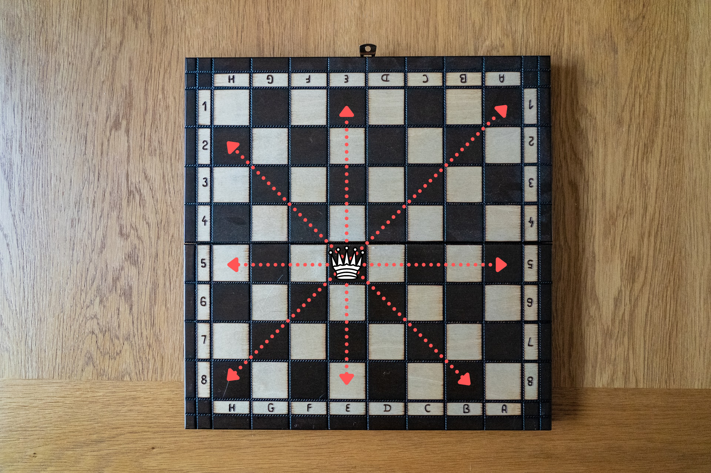
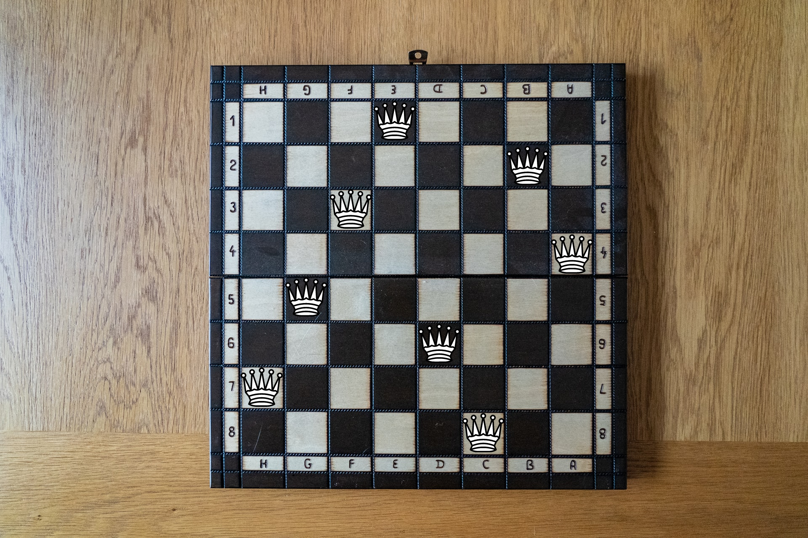
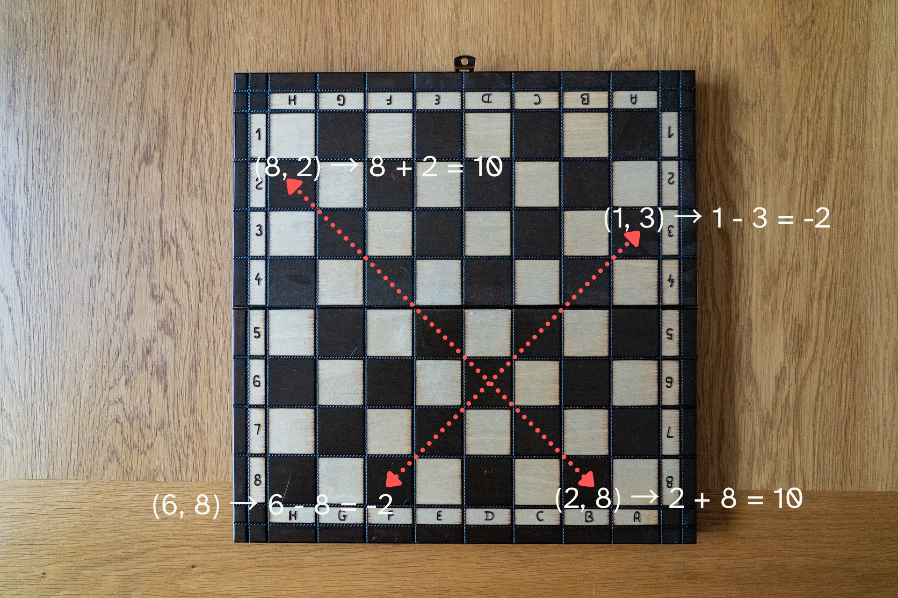

In how many ways can you place 8 queens on a chessboard?

===



# Problem statement

The image above shows you what positions a single queen attacks on a chessboard:
all positions in the same vertical, horizontal, and diagonal lines.

Your job is to place 8 queens on a chessboard, so that no two queens attack each other.
(In how many different ways can you do this?)

Is this too easy?
Don't worry, the next one will be a harder variant of this puzzle.

!!! Give it some thought!

If you need any clarification whatsoever, feel free to ask in the comment section below.


# Solvers

Congratulations to the ones that solved this problem correctly and, in particular, to the ones
who sent me their correct solutions:

 - David H., Taiwan;
 - Kees de L., Netherlands;
 - B. Praveen R., India;
 - Kishan M., India;
 - Mario V., Guatemala;
 - Pavel D., Czech Republic;

Know how to solve this?

Join the list of solvers by [emailing me][email] your solution!


# Solution

Here is an example placement of 8 queens on a chessboard:



This is a neat little puzzle, but I can't offer a better solution other than “do it by trial and error”.

As for the total number of solutions, there are 92.
Again, sadly I don't know of a nice way to compute that by hand,
but I can show you a Python program that computes all the solutions:

```py
>>> from itertools import permutations
>>> for queens in permutations(range(8)):
...     diags = {r - c for r, c in enumerate(queens)}
...     antidiags = {r + c for r, c in enumerate(queens)}
...     if len(diags) == len(antidiags) == 8:
...         # print(list(enumerate(queens)))
...         c += 1
...
>>> c
92
```

This is a Python snippet that solves this problem.
By using `itertools.permutations`, we manage to get all possible queen placements
where no queen attacks another queen horizontally or vertically.
Then, we are left with checking for the diagonals.

For the diagonals (and representing both rows and columns as integers),
we have that each diagonal has an invariant.
For one set of diagonals, that invariant is the sum of the two coordinates,
and for the other set of diagonals, it's the difference between the two coordinates.

For example, letting the letters “A” through “H” represent the integers 1 through 8,
here is an image that shows how, along one diagonal,
the sum of the two coordinates is always 10 and, along another diagonal,
the difference of the two coordinates is always -2:



Therefore, we can just check if all the invariants are different because,
if they are, that's because the queens are not attacking each other diagonally.

Now, was this easy?
I have a [similar, but harder problem][queens-and-knights] waiting for you.


[Don't forget to subscribe to the newsletter][subscribe] to get bi-weekly
problems sent straight to your inbox.

[email]: mailto:rodrigo@mathspp.com?subject=Solution%20to%20{{ page.title|regex_replace(['/ /'], ['%20']) }}
[subscribe]: /subscribe
[queens-and-knights]: /blog/problems/queens-and-knights
