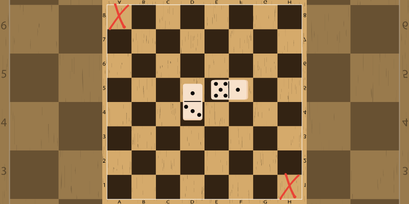

Can you tile a chessboard with two missing squares?

===

# Problem statement

If you remove two opposite corners of a chessboard,
can you still tile it with 2 x 1 rectangles?

In other words, can you cover a whole chessboard with 2 x 1 domino tiles while leaving two opposite corners uncovered and without overlapping domino tiles?

# Solvers

Congratulations to the ones that solved this problem correctly and, in particular, to the ones
who sent me their correct solutions:

 - David H., Taiwan;
 - Kees de L., Netherlands;

Know how to solve this?

Join the list of solvers by [emailing me][email] your solution!

# Solution

It is _impossible_ to do this and the proof follows.

We start by realising that whenever we place a 2x1 domino tile on a chessboard, we always cover two squares of opposite colours, regardless of where we place the domino tile and regardless of its orientation.

Now, consider the colours of the squares of a chessboard with two opposite corners removed.
Opposite corners are of the same colour, so if we remove two white corners, the chessboard remains with 30 white squares and 32 black squares.
Whenever we place a domino tile on the board, each of the two quantities decreases by 1.
So, after we place 30 domino tiles, there will be 0 white squares left to cover and 2 black squares, which cannot be covered by a single domino tile.

[Don't forget to subscribe to the newsletter][subscribe] to get bi-weekly
problems sent straight to your inbox.

[email]: mailto:rodrigo@mathspp.com?subject=Solution%20to%20{{ page.title|regex_replace(['/ /'], ['%20']) }}
[subscribe]: /subscribe
