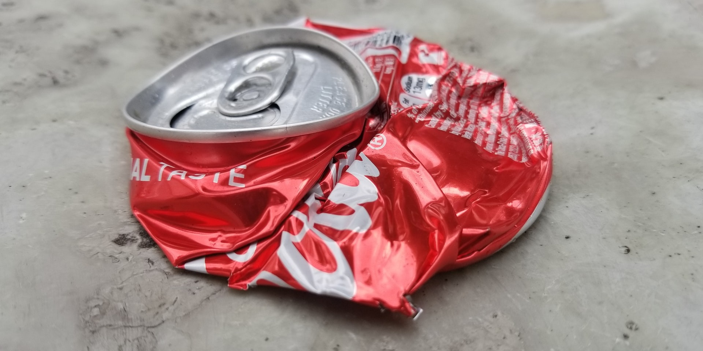

Can you show that perfect compression is impossible?

===

# Problem statement

Compression is great: it is what lets you take that giant folder you have and reduce its size to save some memory on your laptop.
Of course, you only do these compressions happily because you know you don't lose information when you compress things.
The data is just... compressed!

For compression to be useful, it has to be bidirectional: you must be able to recover the original data from the compressed version.
This is only possible if two different pieces of data never get compressed into the same thing.
(In mathematical terms, we say that the compression must be injective.)

Now, on top of that, we are interested in compression that actually works, right?
That is, in compression that reduces the size of things.
Right?

Right!
Now, the challenge is for you to show that no compression mechanism is perfect.
In other words, show that if a compression mechanism is bidirectional and it manages
to take some pieces of data and transform them into something smaller,
then, there are pieces of data that will become **larger** by the action of the compression mechanism.

If it makes it easier for you,
we can suppose that the data we are talking about are just sequences of letters.
So, we are talking about compression mechanisms that take sequences of letters and try to build smaller
sequences of letters, the compression.
For example, maybe the sequence `aaaaaa` gets compressed into `Aaab`,
but maybe the mechanism fails on `AAAAAA` because it “compresses” it into `arghfewtoen`.

!!! Give it some thought!

If you need any clarification whatsoever, feel free to ask in the comment section below.

# Solvers

Congratulations to the ones that solved this problem correctly and, in particular, to the ones
who sent me their correct solutions:

 - David H., Taiwan;

Know how to solve this?
Join the list of solvers by [emailing me][email] your solution!

# Solution

The solution to this problem will be posted here after it has been live for 2 weeks.

[Don't forget to subscribe to the newsletter][subscribe] to get bi-weekly
problems sent straight to your inbox.

[email]: mailto:rodrigo@mathspp.com?subject=Solution%20to%20{{ page.title|regex_replace(['/ /'], ['%20']) }}
[subscribe]: /subscribe
