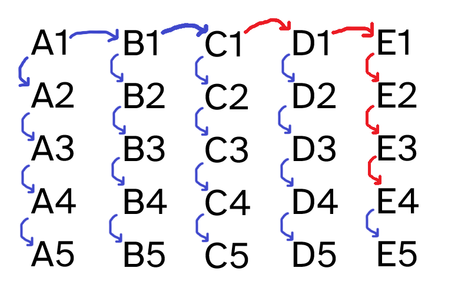

25 horses racing, and you have to find out the fastest ones!

===

# Problem statement

You are in a horse racing track, and you have 25 mechanical horses in front of you.
They are programmed to race around the track in a pre-programmed time that is _always_ the same,
even though you have no idea what these times are.

The racing track accommodates up to 5 horses at a time,
and after the race, it gives you the relative rankings of the horses:
it tells you which horse came in 1st, 2nd, 3rd, 4th, and 5th,
but it doesn't tell you the times.

What is the minimum number of races you need to figure out what are the top 3 fastest horses?

!!! Give it some thought!

If you need any clarification whatsoever, feel free to ask in the comment section below.

# Solvers

Congratulations to the ones that solved this problem correctly and, in particular, to the ones
who sent me their correct solutions:

 - David H., Taiwan;
 - Luiz G., UK;
 - Ashok C., India;
 - Pedro G., Portugal;

Know how to solve this?
Join the list of solvers by [emailing me][email] your solution!

# Solution

There is a way to find the fastest three horses with seven races only.
To show that 7 is the _minimum_ number of races needed,
we need to do two things:

 - we need to show that there is a way to arrange the seven races in such a way that we find the three fastest horses; **and**
 - we need to prove it is impossible to solve this in six races or less.

Typically, finding a solution in seven races is easier to do than to show it is impossible to find a solution with six races or less,
so we will start with the easier thing and show how seven races work.

## Seven races works

Here is how you can find the three fastest horses with only seven races.

The first thing you do is split the 25 horses in five groups of five,
let's call them the groups $A$ through $E$.
Then, you race each of the groups,
which means that now you know what is the fastest horse of each group,
the second fastest horse of each group, etc.
Let's use the values $1$ through $5$ to talk about the (ranked) horses of each group.

So, $A1$ is the fastest horse of group $A$ and $C4$ is the fourth fastest horse of group $C$.

After determining the fastest horse of each group, you bring them together and race them.
In other words, you race the horses $A1$, $B1$, $C1$, $D1$, and $E1$.
This is the sixth race. Suppose these are the results:

 - 1st place: $A1$;
 - 2nd place: $B1$;
 - 3rd place: $C1$;
 - 4th place: $D1$;
 - 5th place: $E1$;

! You can argue that it is unlikely that this is the actual result of the race.
! For example, why couldn't $E1$ actually win the race?
! This is a standard procedure in mathematics:
! name things in an order that is useful for us.
! Before, I gave the names $A$ through $E$ to the groups of horses,
! but those names were arbitrary:
! I could've given the names in a different order.
! In fact, I could've given the names in the order that would later match this sixth race!

After these six races, we can write down the names of the 25 horses and draw arrows that represent the relative speeds of the several horses.
Take a look at the diagram below:

The diagram above shows the 25 horses, and a blue arrow means that the start horse is faster than the end horse.
For example, the top left arrow means that horse $A1$ is faster than horse $B1$,
which we know because of the sixth race.

Take two random horses, say, $C1$ and $E4$.
Do we know which one is faster?
We do: $C1$ is faster than $E4$.
How can we know?
Well, from $C1$ to $E4$ we can follow a path of successive arrows showing that $C1$ is faster than $D1$,
which is faster than $E1$, which is faster than $E2$, which is faster than $E3$,
which in turn is faster than $E4$.

This path of arrows is highlighted in the diagram below:

Now, is $C2$ faster than $E4$..?
Well, we don't know!
$C2$ and $E4$ aren't connected by a path of arrows all pointing in the same direction,
so we can't know which of the two is the fastest!
Understanding this is key to realising what the seventh race is,
and it will be important to prove that this problem is impossible to solve with six races or less.

We need to determine the three fastest horses, so which horses are we racing together now..?

The seventh race has the following horses: $A2$, $A3$, $B1$, $B2$, and $C1$.
Why these five?
Because, for **all** other horses, we already have 3 or more horses that are _definitely_ faster than them,
which means they can't be in the top 3.
In other words, these are the only five horses that may be the 2nd fastest and the 3rd fastest.

## Six races doesn't work

If you are reading this, it is because I forgot to write this part of the proof 🤦.
If you could be so kind as to drop me a short email reminding me of this, I would _greatly_ appreciate it!

[Don't forget to subscribe to the newsletter][subscribe] to get bi-weekly
problems sent straight to your inbox.

[email]: mailto:rodrigo@mathspp.com?subject=Solution%20to%20{{ page.title|regex_replace(['/ /'], ['%20']) }}
[subscribe]: /subscribe
