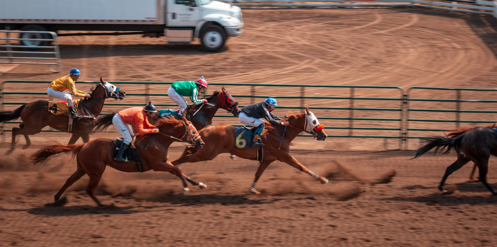

25 horses racing, and you have to find out the fastest ones!

===

# Problem statement

You are in a horse racing track, and you have 25 mechanical horses in front of you.
They are programmed to race around the track in a pre-programmed time that is _always_ the same,
even though you have no idea what these times are.

The racing track accommodates up to 5 horses at a time,
and after the race, it gives you the relative rankings of the horses:
it tells you which horse came in 1st, 2nd, 3rd, 4th, and 5th,
but it doesn't tell you the times.

What is the minimum number of races you need to figure out what are the top 3 fastest horses?

!!! Give it some thought!

If you need any clarification whatsoever, feel free to ask in the comment section below.

# Solvers

Congratulations to the ones that solved this problem correctly and, in particular, to the ones
who sent me their correct solutions:

 - David H., Taiwan;

Know how to solve this?
Join the list of solvers by [emailing me][email] your solution!

# Solution

The solution to this problem will be posted here after it has been live for 2 weeks.

[Don't forget to subscribe to the newsletter][subscribe] to get bi-weekly
problems sent straight to your inbox.

[email]: mailto:rodrigo@mathspp.com?subject=Solution%20to%20{{ page.title|regex_replace(['/ /'], ['%20']) }}
[subscribe]: /subscribe
