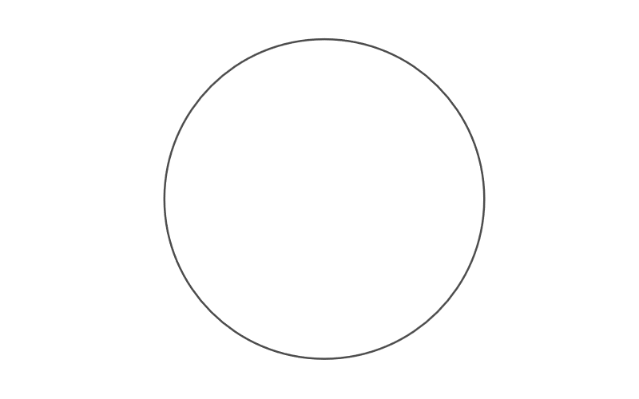

Can you find the centre of the circle with just five lines?

===

# Problem statement

Suppose you have a circle, like the one in the figure below.
At your disposal, you have a compass, a straightedge
(like a ruler, but without length ticks),
and a pencil.

Can you find the centre of the circle with just five lines?
(Every time you use the compass counts as one line,
and every time you use the straightedge counts as another line.)

!!! Give it some thought!

If you need any clarification whatsoever, feel free to ask in the comment section below.

# Solvers

Congratulations to the ones that solved this problem correctly and, in particular, to the ones
who sent me their correct solutions:

 - Dmitry R., USA;
 - Martin J., Czech Republic;
 - David H., Taiwan;
 - Mario R., Ecuador;
 - Paul M., USA;
 - Luis C., Peru;
 - Pietro P., Italy;

Know how to solve this?
Join the list of solvers by [emailing me][email] your solution!

# Solution

I'll post the solution here once this problem has been live for 2 weeks,
which will be around the 27th of March.

[Don't forget to subscribe to the newsletter][subscribe] to get bi-weekly
problems sent straight to your inbox.

[email]: mailto:rodrigo@mathspp.com?subject=Solution%20to%20{{ page.title|regex_replace(['/ /'], ['%20']) }}
[subscribe]: /subscribe
