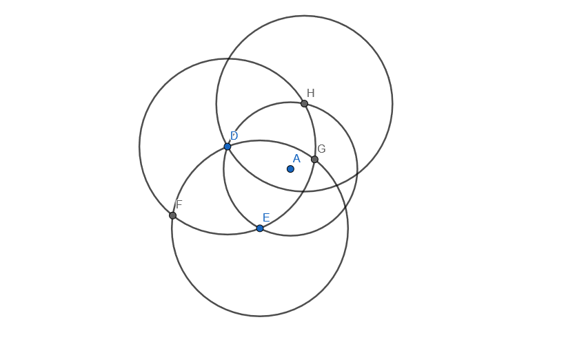

Can you find the centre of the circle with just five lines?

===

# Problem statement

Suppose you have a circle, like the one in the figure below.
At your disposal, you have a compass, a straightedge
(like a ruler, but without length ticks),
and a pencil.

Can you find the centre of the circle with just five lines?
(Every time you use the compass counts as one line,
and every time you use the straightedge counts as another line.)

!!! Give it some thought!

If you need any clarification whatsoever, feel free to ask in the comment section below.

# Solvers

Congratulations to the ones that solved this problem correctly and, in particular, to the ones
who sent me their correct solutions:

 - Dmitry R., USA;
 - Martin J., Czech Republic;
 - David H., Taiwan;
 - Mario R., Ecuador;
 - Paul M., USA;
 - Luis C., Peru;
 - Pietro P., Italy;

Know how to solve this?
Join the list of solvers by [emailing me][email] your solution!

# Solution

There are many ways in which the centre of the circle can be found!
However, doing that with just 5 lines is the challenge.

## Deductive reasoning

Recall that the centre of the circle is the point that is at the same distance of all the points in the circumference.
So, if you draw _any_ chord and then draw its bisector, you know that bisector will go through the centre of the circle (point A in the figure):

In the figure above, I picked two arbitrary points D and E and drew the chord [DE].
Then, I used D and E two draw to circles:

 - one centred at D with radius equal to the length of [DE]; and
 - another centred at E with radius equal to the length of [DE].

Then, the line defined by the two intersections of those two circles goes through the centre (A).
If we do that once more, the intersections of those two bisectors give you the centre:

However, this uses a total of 8 lines.
We want to do this in just 5...
And yet, going down to 6 lines is easy:
we just need to realise we don't really care about the chords, only their endpoints...
And picking arbitrary points on the circumference doesn't cost any “lines”:

The final step comes from realising that we don't need 4 separate circles!
The two bisector lines of the implied chords can be drawn with just 3 circles if we pick the points well enough!

After drawing the first two auxiliary circles, pick one of the circles.
That circle will intersect the original circle at a point that you haven't used yet (H in the figure below).
Use that point as the centre of the third circle, which you can draw with a radius equal to the other two auxiliary circles:

By making use of those 3 circles we can draw 2 bisectors which intersect at the centre of the circle.
That makes up for a total of 5 lines.

## Animated solution

Here is a GIF of the solution:

[Don't forget to subscribe to the newsletter][subscribe] to get bi-weekly
problems sent straight to your inbox.

[email]: mailto:rodrigo@mathspp.com?subject=Solution%20to%20{{ page.title|regex_replace(['/ /'], ['%20']) }}
[subscribe]: /subscribe
