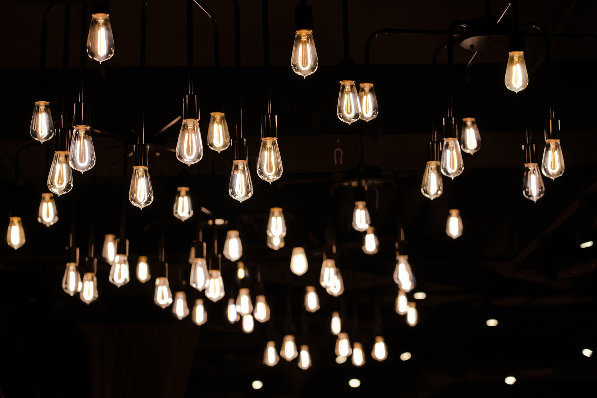

Please help me identify these 100 light bulbs by turning ON and OFF their switches.

===

# Problem statement

I have a very peculiar room in my house.
It's a simple room that doesn't have much decoration.
However, I do have 100 light bulbs hanging from the ceiling because I thought it would look cool.
When I installed the 100 light bulbs I wanted maximum freedom,
so I also installed 100 independent switches:

 - each switch controls exactly one light bulb; and
 - each light bulb is controlled by exactly one switch.

Of course I was completely silly, so I installed the switches in a room that is far from the room with the light bulbs **and** I completely forgot which light switch controls which light bulb.
How can I identify which switch controls which light bulb in the _least amount of trips_ possible?

For example, I could flip ON a switch and then go verify which light bulb turned ON,
and I could do this for the 100 light bulbs...
But that would take me 100 trips.

!!! Give it some thought!

If you need any clarification whatsoever, feel free to ask in the comment section below.

This problem was adapted from [here][source] and is licensed under [CC BY-SA 3.0][cc-by-sa-3].

# Solvers

Congratulations to the ones that solved this problem correctly and, in particular, to the ones
who sent me their correct solutions:

 - David H., Taiwan;
 - Shubham S., India;
 - Dan, USA;
 - Jeena K., India;
 - Frank X., Shenzhen, China;

Know how to solve this?
Join the list of solvers by [emailing me][email] your solution!

# Solution

I'll post the solution here once this problem has been live for 2 weeks,
which will be around the 10th of April.

[Don't forget to subscribe to the newsletter][subscribe] to get bi-weekly
problems sent straight to your inbox.

[email]: mailto:rodrigo@mathspp.com?subject=Solution%20to%20{{ page.title|regex_replace(['/ /'], ['%20']) }}
[subscribe]: /subscribe

[source]: https://puzzling.stackexchange.com/q/20447/41687
[cc-by-sa-3]: https://creativecommons.org/licenses/by-sa/3.0/
