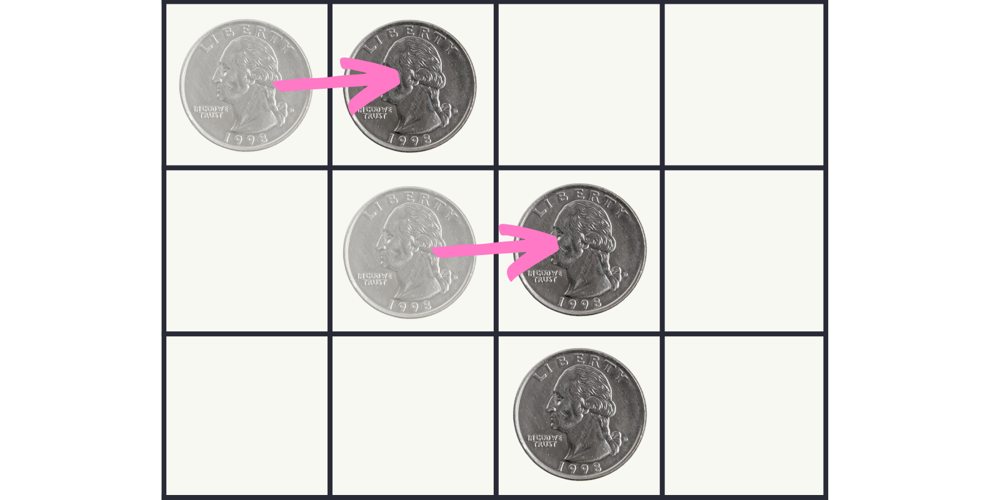
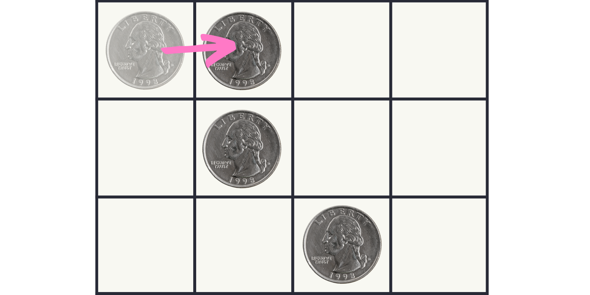
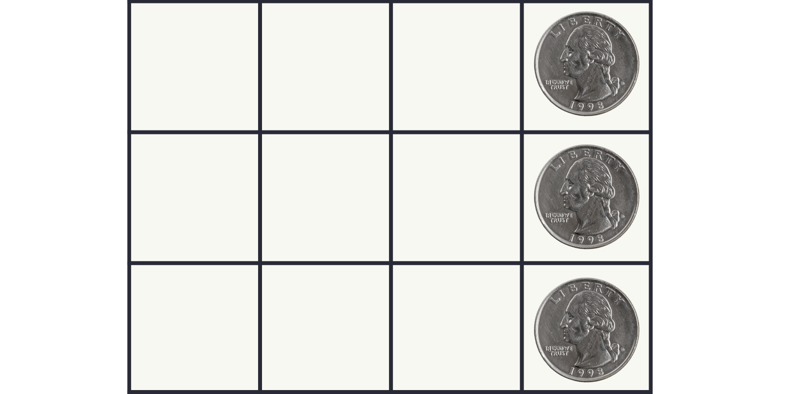

Can you align all of the coins on the right edge of the board?

===

# Problem statement

The diagram above shows a 3 by 4 grid with 3 coins, one per row and one per column,
such that the rightmost column of the grid is empty.

You are allowed to slide the coins to the columns on their right,
but the coins can never leave the board (nor can they be moved back to the left).
Also, you always have to move two coins at a time.

Thus, this is a legal move:

But moving a single coin, such as in the diagram below, is not allowed:

Your objective is to reach this position:

Can you do it?

What if you extend the board two columns to the left and two rows up,
and add another two coins along the diagonal?

!!! Give it some thought!

This is an adaptation of a problem from the [book “Algorithmic Puzzles”][algorithmic-puzzles-amazon] by Anany Levitin and Maria Levitin.[^1]

# Solvers

Congratulations to the ones that solved this problem correctly and, in particular, to the ones
who sent me their correct solutions:

 - David H., Taiwan;

Know how to solve this?
Join the list of solvers by [emailing me][email] your solution!

# Solution

The solution to this problem will be shared when this problem has been live for approximately two weeks,
which should be in late June.

[^1]: This is an Amazon Affiliate link and I may earn a commission if you purchase the book. This comes at no extra cost to you.

[algorithmic-puzzles-amazon]: https://amzn.to/3NJUn5D

[Don't forget to subscribe to the newsletter][subscribe] to get bi-weekly
problems sent straight to your inbox.

[email]: mailto:rodrigo@mathspp.com?subject=Solution%20to%20{{ page.title|regex_replace(['/ /'], ['%20']) }}
[subscribe]: /subscribe
