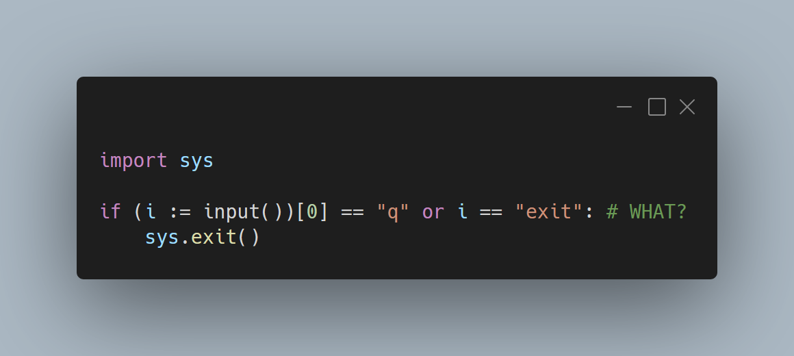

---
metadata:
    description: "The walrus operator was introduced in Python 3.8 and in this post we cover its usages, as well as pitfalls to avoid."
title: "Assignment expressions and the walrus operator := | Pydon't 🐍"
---

The walrus operator `:=` can be really helpful, but if you use it in convoluted
ways it will make your code worse instead of better.
Use `:=` to flatten a sequence of nested `if`s or to reuse partial computations.

===



(If you are new here and have no idea what a Pydon't is, you may want to read the
[Pydon't Manifesto][manifesto].)

## Walrus operator and assignment expressions

The walrus operator is written as `:=` (a colon and an equality sign) and was first
introduced in Python 3.8.
The walrus operator is used in *assignment expressions*, which means assignments can
now be used as a part of an expression, whereas before Python 3.8 the assignments were
only possible as statements.

An assignment statement assigns a value to a variable name, and that is it.
With an assignment expression, that value can then be immediately reused.
Here is an example of the difference:

```py
>>> a = 3
>>> print(a)
3
>>> print(b = 3)
Traceback (most recent call last):
  File "<stdin>", line 1, in <module>
TypeError: 'b' is an invalid keyword argument for print()
>>> print(b := 3)
3
>>> b
3
```

As shown in [PEP 572][pep572], a good usage of assignment expressions can help write
better code: code that is clearer and/or runs faster.

Assignment expressions should be avoided when they make the code too convoluted, even
if it saves you a couple of lines of code.
You don't want to [disrespect the Zen of Python][pydont-zen], and the Zen of Python
recommends writing readable code.

The snippet of code below features what is, in my opinion, a fairly unreadable
usage of an assignment expression:

```py
import sys

if (i := input())[0] == "q" or i == "exit":
    sys.exit()
```

I think a better alternative would have been

```py
import sys

i = input()
if i[0] == "q" or i == "exit":
    sys.exit()
```

The second alternative (without `:=`) is much easier to read than the first one, even
though using `:=` saved one line of code.

However, good uses of assignment expressions can

 - make your code faster,
 - make it more readable/expressive, and
 - make your code shorter.

## Examples in code

Here are a couple of examples of good usages of assignment expressions.

### Controlling a while loop with initialisation

Consider the following `while` loop:

```py
inp = input()
while inp:
    eval(inp)
    inp = input()
```

This code can be used to create a very basic Python repl inside your Python program,
and the REPL stops once you give it an empty input,
but notice that it features some repetition.
First, you have to initialise `inp`, because you want to use it in your `while`
condition, but then you also have to update `inp` inside your `while` loop.

With an assignment expression, the above can be rewritten as:

```py
while inp := input(" >> "):
    eval(inp)
```

This not only makes the code shorter, but it makes it more expressive, by making it
blatantly clear that it is the user input provided by `input()` that is controlling
the `while` loop.

### Reducing visual noise

Say you want to count the number of trailing zeroes in an integer.
An easy way to do so would be to convert the integer to a string, find its length,
and then subtract the length of that same string with all its trailing zeroes
removed.
You could write it like so:

```py
def trailing_zeroes(n):
    s = str(n)
    return len(s) - len(s.rstrip("0"))
```

However, for a function so simple and so short, it kind of looks sad to have
such a short `s = str(n)` line represent half of the body of the `trailing_zeroes`
function.
With an assignment expression, you can rewrite the above as

```py
def trailing_zeroes(n):
    return len(s := str(n)) - len(s.rstrip("0"))
```

The function above can be read as “*return the length of the string `s` you get from
`n`, minus the length of `s` without trailing zeroes*”, so the assignment expression
doesn't hurt the readability of the function and, in my opinion, improves it.
Feel free to disagree, of course, as this is not an objective matter.

### Reuse computations in list comprehensions

Suppose you are writing a list comprehension with an `if` filter,
but the filter test in the
comprehension uses a value that you also want to use in the list itself.
For example, you have a list of integers, and want to keep the factorials of the
numbers for which the factorial has more than $50$ trailing zeroes.

You could do this like so:

```py
from math import factorial as fact

l = [3, 17, 89, 15, 58, 193]
facts = [fact(num) for num in l if trailing_zeroes(fact(num)) > 50]
```

The problem is that the code above computes the factorial for each number twice,
and if the numbers get big, this can become really slow.
Using assignment expressions, this could become

```py
from math import factorial as fact

l = [3, 17, 89, 15, 58, 193]
facts = [f for num in l if trailing_zeroes(f := fact(num)) > 50]
```

The use of `:=` allows to reuse the expensive computation of the factorial of `num`.

Two other similar alternatives, without assignment expressions, would be

```py
from math import factorial as fact

l = [3, 17, 89, 15, 58, 193]
# Alternative 1
facts = [fact(num) for num in l]
facts = [num for num in facts if trailing_zeroes(num) > 50]
# Alternative 2
facts = [num for num in map(fact, l) if trailing_zeroes(num) > 50]
```

Notice that the second one can be more memory efficient if your list `l` is large:
the first alternative first computes the *whole* list of factorials,
whereas the second alternative only computes the factorials as they are needed.
(I'll write more about this in a later Pydon't, [subscribe] so you don't miss it!)

### Flattening related logic

Imagine you reach a point in your code where you need to pick an operation to do to
your data, and you have a series of things you would like to try.
But you also would like to stick to the first one that works.
As a very simple example, suppose we have a string that may contain an email or a phone
number, and you would like to extract the email and, in case you find none, you look
for the phone number.
(For the sake of simplicity, let's assume phone numbers are $9$ digits long and let's
also consider simple `.com` emails with only letters.)

You could do something like:

```py
import re

string = input("Your contact info: >> ")
email = re.search(r"\b(\w+@\w+\.com)\b", string)
if email:
    print(f"Your email is {email.group(1)}.")
else:
    phone = re.search(r"\d{9}", string)
    if phone:
        print(f"Your phone is {phone.group(0)}.")
    else:
        print("No info found...")
```

Notice the code above is nested, but the logic is flat: we look for successive things
and stop as soon as we find something.
With assignment expressions this could be rewritten as:

```py
import re

string = input("Your contact info: >> ")
if email := re.search(r"\b(\w+@\w+\.com)\b", string):
    print(f"Your email is {email.group(1)}.")
elif phone := re.search(r"\d{9}", string):
    print(f"Your phone is {phone.group(0)}.")
else:
    print("No info found...")
```

## Conclusion

Assignment expressions allow the binding of a name to a part of an expression,
which can be used to great benefit in clarifying the flow of some programs or
saving time on expensive computations, for example.
Bad usages of assignment expressions, however, can make code very unreadable
and is therefore crucial to judge whether or not an assignment expression is a good
fit for a particular task.

---

If you liked this Pydon't be sure to leave a reaction below and share this with your friends and fellow Pythonistas.

Also, [don't forget to subscribe to the newsletter][subscribe] so you don't miss
a single Pydon't!

## References

 - Python 3 Documentation, What's New in Python, What's new in Python 3.8 - Assignment expressions, [https://docs.python.org/3/whatsnew/3.8.html#assignment-expressions](https://docs.python.org/3/whatsnew/3.8.html#assignment-expressions).
 - PEP 572 -- Assignment Expressions, [https://www.python.org/dev/peps/pep-0572][pep572].
 - Real Python, "Assignment Expressions: The Walrus Operator", [https://realpython.com/lessons/assignment-expressions/](https://realpython.com/lessons/assignment-expressions/).

Online references consulted on the 26th of January of 2021.

[subscribe]: https://mathspp.com/subscribe
[pydont-zen]: /blog/pydonts/pydont-disrespect-the-zen-of-python
[manifesto]: /blog/pydonts/pydont-manifesto
[pep572]: https://www.python.org/dev/peps/pep-0572
