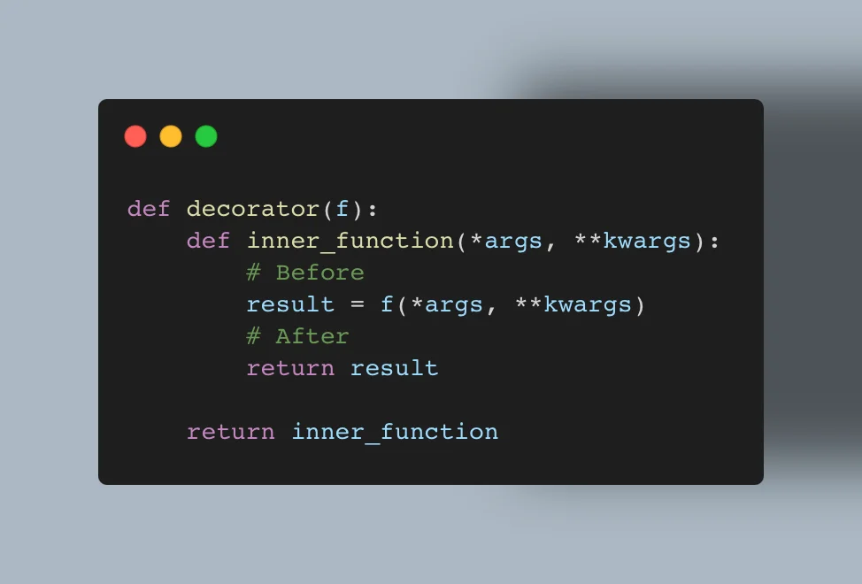
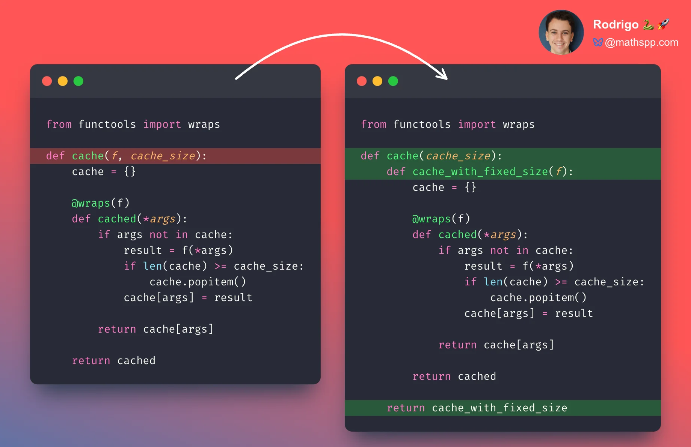

This article teaches the decorator pattern in Python, why it exists, how to use it, and when to use it to write efficient and idiomatic Python code.

===



# Decorators

The decorator pattern is a functional pattern that Python developers leverage to write more modular and composable functions.
In this Pydon't, you will learn exactly why the decorator pattern matters, how to use it, and when to use it.
You will also learn how to implement your custom decorators and more advanced use cases of decorators.

In this Pydon't, you will:

 - learn to recognise when a decorator must be used;
 - learn to identify the functionality that should be extracted into a decorator;
 - use an analogy to understand what a decorator is;
 - implement two simple decorators as initial examples;
 - learn the full anatomy of a general decorator;
 - understand why `functools.wraps` should be used when defining decorators;
 - add arguments to your decorators to make them more useful;
 - handle the multiple usage patterns that decorators need to handle, inspired by the way the standard library does it;
 - see that, sometimes, classes can also be used as decorators; and
 - learn that classes can also be decorated.

<!--v-->
!!! You can get all the Pydon'ts as a [free ebook with over +400 pages and hundreds of tips](/books/pydonts). [Download the ebook “Pydon'ts – write elegant Python code” here](/books/pydonts).
<!--^-->


## A function that did too much

The decorator pattern is a pattern that lets you complement a function with behaviour that is useful but that is orthogonal to the original objective of the function.
This pattern is relevant because you do not want to [overcrowd your functions](/blog/pydonts/functions-a-complete-reference#what-goes-into-a-function-and-what-doesnt), and at the same time it allows you to define this useful behaviour in a way that is reusable by other functions.

As an example, consider how you might have implemented the mathematical operation factorial before it was introduced in the module `math`:

```py
# In modern Python: from math import factorial
def factorial(n):
    r = 1
    while n > 1:
        r *= n
        n -= 1
    return r
```

If you are calling this function a lot with a few large integers as arguments, you may want to cache the results you compute.
For this effect, you may want to use a dictionary that maps inputs to outputs:

```py
_factorial_cache = {}

def factorial(n):
    if n not in _factorial_cache:
        _n = n
        r = 1
        while _n > 1:
            r *= _n
            _n -= 1
        _factorial_cache[n] = r

    return _factorial_cache[n]
```

This solution is far from ideal, since you introduced a function cache that is only loosely coupled to the function it's relevant for, while also introducing code in the function that is not really relevant for the original objective of the function.

Instead of baking caching into the function, which is a poor one-time solution for something I might want to do with several functions, I can write a higher-order function that adds caching to any function I want.
Let me walk you through this transformation.

## Factoring out the orthogonal behaviour

Instead of slapping you with a decorator right off the bat, let me refactor the previous function.
I will take the original function `factorial`, without the cache, and I will define a second function called `cached_factorial` that adds a cache around the function `factorial`:

```py
def factorial(n):
    r = 1
    while n > 1:
        r *= n
        n -= 1
    return r

_factorial_cache = {}
def cached_factorial(n):
    if n not in _factorial_cache:
        _factorial_cache = factorial(n)
    return _factorial_cache[n]
```

This second solution isn't perfect yet.
But it is clearly better in one sense: the pattern of wrapping the original function in a second function – without modifying the implementation of the original function – is more general.
Here, “without modifying the implementation of the original function” is the key idea.

I said that in modern Python you can just import the function `factorial` from the module `math`.
If you do, and if you still want to add a cache to the function `factorial`, you have to use the approach of the `cached_factorial` function:

```py
from math import factorial

_factorial_cache = {}
def cached_factorial(n):
    if n not in _factorial_cache:
        _factorial_cache[n] = factorial(n)
    return _factorial_cache[n]
```

Using this approach, you can add caches to other functions without modifying their implementation.
Take the function `fibonacci` from below, which you cannot find in the module `math`, and add a cache to it without modifying the code I wrote:

```py
def fibonacci(n):
    if n < 2:
        return n
    return fibonacci(n - 1) + fibonacci(n - 2)
```

If you understood the pattern correctly, you should have written something like the following:

```py
_fibonacci_cache = {}
def cached_fibonacci(n):
    if n not in _fibonacci_cache:
        _fibonacci_cache[n] = fibonacci(n)
    return _fibonacci_cache[n]
```

Now comes the interesting part.
This is almost exactly the same code...
Maybe you can do something to avoid this structural duplication?


## A factory of cached functions

Instead of writing a cached function for each function we want to cache, I will take the code from the functions `cached_factorial` and `cached_fibonacci`, which are eerily similar, and I will use it to write a factory of cached functions.
This factory accepts a function as input (the function we want to add a cache to) and it spits out the new cached function:

```py
def cached_function_factory(f):
    # Build the cache:
    cache = {}
    # Build the cached function:
    def cached_f(n):
        if n not in cache:
            cache[n] = f(n)
        return cache[n]

    # Return the new function from the factory:
    return cached_f
```

With this new cached function factory we can create `cached_factorial` and `cached_fibonacci` more easily:

```py
from math import factorial

def cached_function_factory(f):
    cache = {}
    def cached_f(n):
        if n not in cache:
            cache[n] = f(n)
        return cache[n]

    return cached_f

cached_factorial = cached_function_factory(factorial)

def fibonacci(n):
    if n < 2:
        return n
    return fibonacci(n - 1) + fibonacci(n - 2)

cached_fibonacci = cached_function_factory(fibonacci)
```

Now, you can check that the values are being cached by checking how much faster it is to call the function a second time:

```py
# ...

import time

t0 = time.perf_counter()
cached_factorial(1_000_000)
t1 = time.perf_counter()
cached_factorial(1_000_000)
t2 = time.perf_counter()

print(f"1st run took {t1 - t0:.3f}s and 2nd took {t2 - t1:.3f}s.")
# 1st run took 7.828s and 2nd took 0.000s.
```

This shows the function `cached_factorial` is definitely being cached.
A similar snippet of code shows that `cached_fibonacci` is also caching its values:

```py
t0 = time.perf_counter()
cached_fibonacci(40)
t1 = time.perf_counter()
cached_fibonacci(40)
t2 = time.perf_counter()

print(f"1st run took {t1 - t0:.3f}s and 2nd took {t2 - t1:.3f}s.")
# 1st run took 9.989s and 2nd took 0.000s.
```

Why did you have to time the functions instead of looking at the cache dictionaries?
If the cache dictionaries are being populated, then the results are being cached.
Well, can you even access the cache dictionaries?
No![^1]

[^1]: Actually, you can. If there was _no_ single reference to the cache dictionary, the garbage collector would clean it up. To access the cache dictionary of `cached_fibonacci` you could do `_fib_cache = cached_fibonacci.__closure__[0].cell_contents`.

The caching mechanism works thanks to a language feature called a [closure](/blog/pydonts/functions-a-complete-reference#closures).
Thanks to closures, the function `cached_function` has access to the variables `cache` and `f`, which are defined inside the function `cached_function_factory`.
A closure is like a bubble that forms around `cached_function` that keeps the variables `cache` and `f` alive even after `cached_function` is returned from inside `cached_function_factory`.


## A factory of timed functions

Now that you want to time your functions to check the efficacy of their caches, you might want to create a factory of timed functions, to make these tests easier:

```py
import time

def timed_function_factory(f):
    def timed_function(n):
        # Measure time right before running f.
        start_time = time.perf_counter()
        # Compute the result.
        result = f(n)
        # Measure time right after running f.
        end_time = time.perf_counter()
        # Return the original result and the timing.
        return result, end_time - start_time

    return timed_function

timed_factorial = timed_function_factory(cached_factorial)
timed_fibonacci = timed_function_factory(cached_fibonacci)

_, t1 = timed_factorial(999_999)
_, t2 = timed_factorial(999_999)
print(f"1st took {t1:.3f}s and 2nd took {t2:.3f}s.")
# 1st took 7.826s and 2nd took 0.000s.

_, t1 = timed_fibonacci(41)
_, t2 = timed_fibonacci(41)
print(f"1st took {t1:.3f}s and 2nd took {t2:.3f}s.")
# 1st took 16.133s and 2nd took 0.000s.
```

This pattern of creating a higher-order function that accepts a function and builds a new function based off of it is quite useful.
As it turns out, it's the decorator pattern.


## The decorator pattern

The decorator pattern is the name of this pattern we leveraged twice already: you implement a function factory that accepts a function as input and wraps that function with some extra functionality, like caching or profiling.
Then, the factory returns that wrapper function and that's what you use.

“Decorator” is the name you give to the factory function and Python provides special syntax to apply decorators to functions.
When you are defining your function, you can use the at sign `@` together with the decorator name to apply that decorator:

```py
# Apply the decorator `cached_function_factory` to the function `fibonacci`:
@cached_function_factory
def fibonacci(n):
    if n < 2:
        return n
    return fibonacci(n - 1) + fibonacci(n - 2)
```

When using this syntax, the cached function is assigned to the same name as the original function.
So, the syntax with the at sign `@` does not magically create another function with another name.
Instead, it saves the decorated function to the same name.
Here, `fibonacci` will now be cached.

The at sign `@` can only be used to apply a decorator if you have access to the definition of the function.
If you don't have access to the definition of the function, for example if you are importing it from another module, then you have to pass the function to the decorator by hand:

```py
from math import factorial

factorial = cached_function_factory(factorial)
```

The two ways of applying a decorator are equivalent.

In case it helps you, remember that the word “decorate” means “make (something) look more attractive by adding extra items or images to it”, and that is what your Python decorators do.
They “make (a function) more useful by adding extra behaviour to it”.
And, in the case of the at sign `@` syntax, the decorator really is the cherry on top; the thing that makes your function absolutely incredible.


## Caching even more

The module `itertools` has an iterable called `combinations` that accepts two arguments, an iterable `it` and an integer `r`, and then “return[s] successive r-length combinations of elements in the iterable [`it`]”.
In some mathematical contexts, you need to know the length of this result without caring about the actual elements, so you can write a function that computes this:

```py
from itertools import combinations

@cached_function_factory
def combinations_len(n, r):
    return len(list(combinations(range(n), r)))
```

The implementation I shared above uses `combinations` from `itertools` to produce all results and then count them, but you could also use a mathematical formula to compute the answer (and you probably should!).

However, something in my code is wrong...
The expression in the body of the function is right:

```py
n, r = 10, 4
print(len(list(combinations(range(n), r))))  # 210 – correct
```

But the cached function doesn't work:

```py
print(combinations_len(10, 4))
"""
Traceback (most recent call last):
  File "<python-input-77>", line 1, in <module>
    print(combinations_len(10, 4))
          ~~~~~~~~~~~~~~~~^^^^^^^
TypeError: cached_function_factory.<locals>.cached_f() takes 1 positional argument but 2 were given
"""
```

## Implementing general decorators

The issue lies in our implementation of the decorator `cached_function_factory`:

```py
def cached_function_factory(f):
    cache = {}
    def cached_f(n):
        if n not in cache:
            cache[n] = f(n)
        return cache[n]

    return cached_f
```

Do you see the signature of the cached function `cached_f`?
It expects a single argument `n`.
This worked for our functions `fibonacci` and `factorial`, but it doesn't work for `combinations_len` because the function `combinations_len` is supposed to take two arguments.

The problem is that the decorator `cached_function_factory` is not general enough.
To make it more general, you need to modify the signature of the function `cached_f` to accept _any_ number of arguments and to pass those along to `f`.

I will show you what this means in code, and I'll also take this opportunity to rename the decorator:
(I am tired of typing the 23 characters of “`cached_function_factory`”...)

```py
def cache(f):
    cache = {}
    # `cached_f` accepts an arbitrary number of arguments...
    def cached_f(*args):
        if args not in cache:
            cache[args] = f(*args)  # ... and passes them along to f.
        return cache[args]

    return cached_f
```

This new version will work with `factorial`, `combinations_len`, and plenty of other functions:

```py
@cache
def combinations_len(n, r):
    return len(list(combinations(range(n), r)))

print(combinations_len(10, 4))  # 210
```

This decorator `cache` looks useful, right?
If you are thinking about adding it to your toolbox, don't worry.
It's already there:

```py
from functools import cache
```

The decorator `cache` from the module `functools`, that you reimplemented here in part, adds a cache to a function.
The decorator from the module is more robust than yours, though, so prefer that one whenever possible.

As the cache decorator example showed, the inner function of the decorator will _typically_ use `*args` to accept an arbitrary number of positional arguments.
This makes the decorator more flexible.
The same thing is also true of `**kwargs`.

To make the timing decorator as flexible as possible, and to make sure it works with any function whatsoever, you must use `*args` and `**kwargs` in the inner function:

```py
def timed(f):
    def timed_f(*args, **kwargs):
        start_time = time.perf_counter()
        result = f(*args, **kwargs)
        end_time = time.perf_counter()
        return result, end_time - start_time

    return timed_f
```


## Anatomy of a decorator

At this point you already have a pretty solid understanding of the anatomy of a decorator.
Here is a quick recap:

```py
def decorator(function_to_decorate):  # 1
    # 2                # 3
    def inner_function(*args, **kwargs):
        ...  # 4
        result = function_to_decorate(*args, **kwargs)  # 5
        ...  # 6
        return result  # 7

    return inner_function  # 8
```

 1. A decorator is typically a higher-order function that accepts an arbitrary function as argument.
 2. Inside the body of a decorator we typically define an inner function to wrap the function argument.
 3. The inner function accepts `*args` and `**kwargs` so it's general and works with any type of function argument provided.
 4. The inner function can run arbitrary code before the original function has to run.
 5. The inner function calls the original function, either with the original arguments or with modified versions.
 6. The inner function can run arbitrary code after the original function runs.
 7. The inner function returns its result, typically the result that the original function produced.
 8. The decorator returns the inner function that it built, so that the inner function can be used in place of the original one.


What is important for you to realise is that this represents a generic recipe.
It's like a blueprint for you to implement your own decorators.
None of the bullet points above are rules that are set in stone and you can come up with situations and contexts where you'll need decorators that go against those bullet points.
Some decorators will do work before calling the original function but not after (skipping point 6), and some decorators do the opposite (skipping point 4), for example.

My suggestion is that you go through the decorators `cache` and `timed` that you implemented above and see how well they fit the blueprint above.
(Notice how the decorator `timed` breaks the guideline 7., since it doesn't just return the output of the inner function, but also the timing information.)

This picture of the anatomy of a decorator is almost complete.
You are only missing a small detail.

## `functools.wraps` – the decorator for your decorators

Functions are regular Python objects.
You can check a function's name or docstring, for example:

```py
def foo():
    """bar"""

print(foo.__name__)  # foo
print(foo.__doc__)  # bar
```

When you use a decorator around `foo`, you are essentially replacing `foo` with a new function from inside the decorator:

```py
def decorator(f):
    def inner_func():
        pass

    return inner_func

@decorator
def foo():
    """bar"""
```

At this point, what do you get if you print the name of the function `foo`?
Remember that using the at sign `@` is equivalent to doing this:

```py
def foo():
    """bar"""

foo = decorator(foo)
```

You are assigning the result of `decorator(foo)` to the variable `foo`, and the result of `decorator(foo)` is the inner function `inner_func`, so `foo.__name__` is `inner_func` after applying the decorator.
For a similar reason, the docstring of `foo` seems to be gone:

```py
@decorator
def foo():
    """bar"""

print(foo.__name__)  # inner_func
print(foo.__doc__)  # None
```

To preserve useful attributes like `__name__` and `__doc__`, the module `functools` provides the decorator `wraps`.
This decorator can be used _inside your decorators_ to make sure that your inner functions retain the useful information that the original functions had.

Here is `wraps` applied to the do-nothing decorator I defined above:

```py
from functools import wraps

def decorator(f):
    @wraps(f)
    def inner_func():
        pass

    return inner_func

@decorator
def foo():
    """bar"""

print(foo.__name__)  # foo
print(foo.__doc__)  # bar
```

On the one hand, note how `foo` has the name and the docstring from the original function.
On the other hand, what the heck is going on?!
The decorator `wraps` takes arguments?!

Well, yes.
You are applying `wraps` to the inner function `inner_func`, but you need to tell `wraps` what is the original function that contains the information you want to pass on to the inner function, and that is why you pass `f` as an argument to `wraps`.

I will tell you a bit more about decorators that accept arguments in a second.
For now, let me update the general anatomy of a decorator:

```py
from functools import wraps


def decorator(function_to_decorate):
    @wraps(function_to_decorate)  # <--
    def inner_function(*args, **kwargs):
        ...  # Set-up work.
        result = function_to_decorate(*args, **kwargs)
        ...  # Finalise whatever you need.
        return result

    return inner_function
```

When creating a decorator, you will often want to use `wraps` within the inner function.


## Intermission

I want to tell you about decorators with arguments now.
And I want to show you a couple of other neat things.
But if this is the first time you are learning about decorators, I recommend you take a break now.

Get up, go stretch your legs.

When you come back, open an editor.
Can you implement a decorator `cache` by yourself?
Start by making it work with functions that only accept one argument, like `factorial` or `fibonacci`.
Then, make it general.
How do you make it general?
And why do you have to do that?
Reread sections of this Pydon't if you need to.

After you've implemented `cache`, even if you got a little help from the Pydon't, can you implement a decorator `timed` by yourself?
There is no point in going further if you are not comfortable with these ideas around decorators.


## Decorators with arguments

I want to tell you a little bit about decorators that accept arguments, just like `wraps` does.
But `wraps` uses attributes that you and I don't encounter very often, so I want to go back to a simpler example.
Let us talk about caching. Again.

The decorator `cache` that you implemented uses a dictionary to keep track of cached values.
If you call the cached function with many different inputs, the dictionary grows a lot.
And there is no limit to how much it can grow.
Worst case scenario, you run out of memory and your computer hangs!

To prevent this problem, you come up with a brilliant fix: prevent the cache dictionary from having more than 1000 items.
Here is your new implementation:

```py
from functools import wraps  # ;)
def cache(f):
    cache = {}

    @wraps(f)
    def cached(*args):
        if args not in cache:
            if len(cache) >= 1000:
                cache.popitem()  # Pops an item from the dictionary.
            cache[args] = f(*args)

        return cache[args]

    return cached
```

This solves your problem, but you quickly realise that having the cache constrained to 1000 items is a bit arbitrary.
In scenarios where you have little resources, you'd like to have even smaller caches.
When you feel like splurging memory or caching really slow functions that you use a lot, you want to have a larger cache.

That's an easy fix, right?
All you have to do is make the cache size a variable you can control:

```py
from functools import wraps

CACHE_SIZE = 1000

def cache(f):
    cache = {}

    @wraps(f)
    def cached(*args):
        if args not in cache:
            if len(cache) >= CACHE_SIZE:
                cache.popitem()  # Pops an item from the dictionary.
            cache[args] = f(*args)

        return cache[args]

    return cached
```

Well, yes...
But actually, no!
The cache size is now configurable, but the cache size is the same across all caches!
You have slightly more control, but not enough control.

What you really ought to do is to make the cache size a parameter of the function `cache`:

```py
from functools import wraps

def cache(f, cache_size):
    cache = {}

    @wraps(f)
    def cached(*args):
        if args not in cache:
            result = f(*args)
            if len(cache) >= cache_size:
                cache.popitem()  # Pops an item from the dictionary.
            cache[args] = result

        return cache[args]

    return cached
```

Now, you can use the cache with different cache sizes:

```py
from math import sin, cos, factorial

sin = cache(sin, 1000)
cos = cache(cos, 1000)
factorial = cache(factorial, 100)
```

This works just fine!
Until you decide to use the cool at sign `@` syntax I just taught you.
How do you even do that?
I wrote down a couple of attempts below, and none work:

```py
@cache(fibonacci, 10_000)
def fibonacci(n):
    ...
```

```py
@cache(10_000)
def fibonacci(n):
    ...
```

```py
@cache(f, 10_000)
def fibonacci(n):
    ...
```

The problem is that the thing in front of the at sign `@` will be called with the function as its _only_ argument, and currently the decorator `cache` takes two arguments:

```py
def cache(f, cache_size):
    ...
```

What we need to do is split the two parameters into two levels, so that passing in the cache size digs into the next level, where the decorator expects the function.
“Digging into the next level” means that the first level, that expects the cache size, must return the decorator that expects the function.

```py
from functools import wraps

def cache(cache_size):  # Level 1 expects the cache size.
    def cache_with_fixed_size(f):  # Level 2 expects the function.
        cache = {}

        @wraps(f)
        def cached(*args):
            if args not in cache:
                result = f(*args)
                if len(cache) >= cache_size:
                    cache.popitem()  # Pops an item from the dictionary.
                cache[args] = result

            return cache[args]

        return cached

    return cache_with_fixed_size  # Level 1 must return level 2.
```

If it helps, you can look at this outer function as a factory of decorators, since the code that is inside looks pretty much like the decorator `cache` from before.



Is this completely bonkers?
It is a bit mind-bending in the beginning, but this is a useful pattern.
Many decorators accept arguments.

As a few worthy examples, `functools.lru_cache` is the cache decorator from the standard library that does what we were trying to do (a cache with a maximum size) in the proper way.
When you work with web frameworks like Flask, Django, or FastAPI, you use decorators to determine what URLs map to what functions.
And more.


## To parens or not to parens?

As a disclaimer, you may sometimes find decorators with _optional_ arguments.
For example, the decorator `functools.lru_cache` accepts a maximum cache size but that is an optional argument.
Therefore, the decorator `lru_cache` supports all these usage patterns:

```py
@lru_cache        # 1
def f(...): ...

@lru_cache()      # 2
def f(...): ...

@lru_cache(1024)  # 3
def f(...): ...
```

If you think about it for a second, this can look a bit confusing because the same thing, `lru_cache`, can be used as a decorator (see usage 1) or as a factory of decorators (see usages 2 and 3).
This may look puzzling the first time you encounter it, but this flexibility can be implemented with a single conditional statement.
I will present _one_ possible way to achieve this result, based off of the last implementation of `cache` that you have above and a simplification of the [actual pattern implemented in Python 3.13 for `functools.lru_cache`](https://github.com/python/cpython/blob/430ccbc009aa7a2da92b85d7aeadd39e1666e875/Lib/functools.py#L530-L534).

In essence, the implementation of `cache` shown above needs two modifications:

 1. the parameter `cache_size` must have a default value so that `cache` can be used with zero arguments; and
 2. the outer function `cache` needs to check the type of the argument that it received. In case it receives a callable, it's because the user used the outer function directly on the function to be decorated and we need to skip a level:

```py
from functools import wraps

def cache(cache_size=1024):
    def cache_with_fixed_size(f):
        cache = {}

        @wraps(f)
        def cached(*args):
            if args not in cache:
                result = f(*args)
                if len(cache) >= cache_size:
                    cache.popitem()
                cache[args] = result

            return cache[args]

        return cached

    # Was the decorator applied directly on the function?
    if callable(cache_size):
        # Restore the default cache size.
        f, cache_size = cache_size, 1024
        return cache_with_fixed_size(f)
    else:
        return cache_with_fixed_size
```


## Anything can be a decorator

Things weren't always as crazy as they are now, but you can use the at sign `@` syntax with a lot of different things.
It doesn't have to be a name of a function you defined with `def`.
Remember that the at sign `@` is syntactic sugar:

```py
# This...
@<random code here>
def foo():
    pass

# ... is syntactic sugar for this:
foo = <random code here>(foo)
```

This shows that the only thing that you need from `<random code here>` is that it is callable.
In other words, you can write any Python expression you want, as long as it evaluates to a callable.[^2]
Writing a function name is just a standard way of doing it.

[^2]: This is true for Python 3.9+. From Python 3.9 onward, what goes in front of the at sign `@` can be any expression that evaluates to a callable.

An anonymous function would be another way to do it.
Here is a do-nothing decorator implemented with the keyword `lambda`:

```py
@lambda f: f
def foo():
    return 42

print(foo())  # 42
```

Is it an excellent idea to use an anonymous function as a decorator?
Absolutely not, because it's a pain to define even simple decorators with lambda functions.

Whatever you use in front of the at sign `@` doesn't even have to return a function.
Can you guess what is the output of the snippet of code below?
You can only guess correctly if you really grasped how Python interprets the syntax with `@`.

```py
@strf
def foo():
    return

print(type(foo))
```

Let me show you an example that is also fun but a bit more useful.
Remember the sized cache decorator from earlier?
Now I want to add more features to it, like the ability to count how many times the cache is used, how many times we miss the cache, and the ability to clear the cache.

If you give it some thought, you might end up writing something like this:

```py
from functools import wraps

def cache(cache_size):
    def cache_with_fixed_size(f):
        cache = {}

        @wraps(f)
        def cached(*args):
            if args not in cache:
                cached.misses += 1  # <--
                result = f(*args)
                if len(cache) >= cache_size:
                    cache.popitem()
                cache[args] = result
            else:                 # <--
                cached.hits += 1  # <--

            return cache[args]

        cached.hits = 0                   # <--
        cached.misses = 0                 # <--
        cached.clear_cache = cache.clear  # <--

        return cached

    return cache_with_fixed_size
```

Functions are objects, so you can add attributes and functions to it.
Let me show you this abomination in action:

```py
@cache(1024)
def fib(n):
    if n < 2:
        return n
    return fib(n - 1) + fib(n - 2)

fib(1)
print(fib.hits, fib.misses)  # 0 1 – 1 miss
fib(1)
print(fib.hits, fib.misses)  # 1 1 – 1 hit

fib.clear_cache()
fib(1)
print(fib.hits, fib.misses)  # 1 2 – another miss
```

This works but the code is a bit of a mess.
Adding attributes and methods to functions is not a common practice for a reason...


## Classes as decorators

When things reach this level and you want to add functionality to the functions you are decorating, you might be better off using a class as the decorator.
Since classes are also callable, you can define decorators with them.
If `C` is a class name, then `C()` produces an instance of the class `C`, so if you use the class `C` as a decorator, then Python will call `C(f)` with some function `f`, and the resulting instance is supposed to be able to replace the function `f`.

To make this easier to understand, I will take a step back and go back to when you implemented a cache decorator without a maximum size.
To do this with a class, the class `Cache` will accept a function.
You can start implementing this decorator as such:

```py
class Cache:
    def __init__(self, f):
        self.f = f
        self.cache = {}
```

This is enough to use the class `Cache` as a decorator:

```py
@Cache
def fib(n):
    ...
```

If you print `fib`, you will see it is a `Cache` object:

```py
print(fib)  # <__main__.Cache object at 0x100ef8ad0>
```

`fib` is supposed to be a function, so you must be able to call `fib` but currently you can't:

```py
fib(2)
"""
Traceback (most recent call last):
  File "<python-input-11>", line 1, in <module>
    fib(2)
    ~~~^^^
TypeError: 'Cache' object is not callable
"""
```

The class `Cache` is callable but the instances of `Cache` are not.
If you want a class instance to be callable, you need to implement [the dunder method `__call__`](/blog/pydonts/dunder-methods):

```py
class Cache:
    def __init__(self, f):
        self.f = f
        self.cache = {}

    def __call__(self, *args):
        if args not in self.cache:
            self.cache[args] = self.f(*args)

        return self.cache[args]
```

Now that `Cache.__call__` is defined, you can call instances of the class `Cache`:

```py
@Cache
def fib(n):
    if n < 2:
        return n
    return fib(n - 1) + fib(n - 2)

print(fib(6))  # 8
```

Since `Cache` is a class and `fib` is an instance of the class `Cache`, you have access to the original function and to the cache:

```py
print(fib.f)  # <function fib at 0x101072ca0>
print(fib.cache)
# {(1,): 1, (0,): 0, (2,): 1, (3,): 2, (4,): 3, (5,): 5, (6,): 8}
```

Again, since `Cache` is a class, adding attributes or methods to it becomes more intuitive.
This time, maybe you also want to clear the cache info when clearing the cache:

```py
class Cache:
    def __init__(self, f):
        self.f = f
        self.cache = {}
        self.hits = 0
        self.misses = 0

    def __call__(self, *args):
        if args not in self.cache:
            self.misses += 1
            self.cache[args] = self.f(*args)
        else:
            self.hits += 1

        return self.cache[args]

    def clear_cache(self):
        self.cache.clear()
        self.hits = 0
        self.misses = 0
```

You have a cache decorator implemented as a class that provides helpful attributes and methods.
Now, how do you take the decorator `Class` and modify it so that it also accepts a maximum cache size?
Try to do it before you keep reading.

## Classes as decorators with arguments

If your decorator is a class, I think the cleanest way to add parameters to the decorator starts by adding the parameters to the class decorator:

```py
class CacheWithSize:
    def __init__(self, f, maxsize):
        self.f = f      # ^^^^^^^
        self.cache = {}
        self.hits = 0
        self.misses = 0
        self.maxsize = maxsize  # <--

    def __call__(self, *args):
        if args not in self.cache:
            self.misses += 1
            result = self.f(*args)
            if len(self.cache) >= self.maxsize:  # <--
                self.cache.popitem()             # <--
            self.cache[args] = result
        else:
            self.hits += 1

        return self.cache[args]

    def clear_cache(self):
        ...
```

Then, to create the outer decorator – the one that accepts the maximum cache size as the argument – you create a function outside the class:

```py
from functools import partial

class CacheWithSize:
    ...

def cache(maxsize):
    return partial(CacheWithSize, maxsize=maxsize)
```

This implementation uses [`functools.partial` to fix the argument for the cache maximum size](/blog/functools-partial) while “leaving space” for you to specify the function that the cache will apply to:

```py
@cache(1024)
def fib(n):
    if n < 2:
        return n
    return fib(n - 1) + fib(n - 2)
```

The pattern I just showed you of having two separate objects can be more readable than the double nesting of functions, and even though the total nesting decreases, you can still look at `cache` as a factory of decorators!

This pattern also works for decorators with arguments implemented as functions.
For example, when I first introduced [decorators with arguments](#decorators-with-arguments), I showed you a function `cache(f, cache_size)` that almost implemented a cache decorator with a maximum size.
Now, you can take that function of two arguments and write a decorator around it:

```py
from functools import partial, wraps

# Was `def cache(f, cache_size)` in a previous section.
def cache_with_size(f, cache_size):
    cache = {}

    @wraps(f)
    def cached(*args):
        if args not in cache:
            result = f(*args)
            if len(cache) >= cache_size:
                cache.popitem()
            cache[args] = result

        return cache[args]

    return cached

def cache(maxsize):
    return partial(cache_with_size, cache_size=maxsize)
```

If you take a look at the decorators `cache` and `lru_cache` from the module `functools`, you will see that they are implemented as functions that wrap classes.
This shows that this pattern is useful.

Before covering the final major topic of this Pydon't, I suggest you try to implement the profiling decorator `timed` as a class.
This will improve your understanding of the material covered here.


## Classes can be decorated

Much like you can use a decorator with the `@` syntax above a `def` statement, you can also use a decorator with the `@` syntax above a `class` statement, and this lets you decorate a class.
The reasons that would take you to decorate a class are the same reasons that would take you to decorate a function: you want to add functionality to your class and the functionality you want to add is something orthogonal to your class, so it can be abstracted away in a decorator so it's reused.

In case you are wondering, decorating classes isn't a particularly advanced pattern.
Maybe you won't have to write your own class decorators very often, but decorators like `@dataclass` from the module `dataclasses` and `@total_ordering` from the module `functools` show reasonable use cases for decorators targeted at classes.

As a simpler motivating example, consider the following definition of the class `Person`:

```py
class Person:
    def __init__(self, first, last):
        self.first = first
        self.last = last

    def __repr__(self):
        return f"Person(first={self.first!r}, last={self.last!r})"

rodrigo = Person("Rodrigo", "Girão Serrão")
print(rodrigo)  # Person(first='Rodrigo', last='Girão Serrão')
```

[The dunder method `__repr__` is what implements the pretty-printing of `Person` instances](/blog/pydonts/str-and-repr), but it's logic is not particularly tied to the class `Person`.
If I implemented a class `Point3D`, to represent a point in a 3 dimensional space, I'd implement a very similar method `__repr__`:

```py
class Point3D:
    def __init__(self, x, y, z):
        self.x = x
        self.y = y
        self.z = z

    def __repr__(self):
        return f"Point3D(x={self.x}, y={self.y}, z={self.z})"

p = Point3D(1, 0, -2)
print(p)  # Point3D(x=1, y=0, z=-2)
```

As I implement more and more classes and get tired of reimplementing the same logic for `__repr__`, I can create a decorator that adds the method `__repr__` automatically.
To do this, I start by defining a function that implements the logic I have been repeating:

```py
def _general_repr(self):
    class_name = self.__class__.__name__
    attrs = ", ".join(f"{name}={value!r}" for name, value in vars(self).items())
    return f"{class_name}({attrs})"
```

(The attribute access `.__class__.__name__` gives me a readable string for the class name, like `Person` or `Point3D`, and the built-in `vars` gives me a dictionary with all the attributes defined on the object passed in as an argument. You can read more about [the built-in `vars`](/blog/til/vars) and [the dunder attribute `__name__`](/blog/pydonts/name-dunder-attribute).)

After defining this function, I can write a decorator that accepts a class and plugs the function `_general_repr` into the class:

```py
def _general_repr(self): ...

def add_repr(cls):
    cls.__repr__ = _general_repr
    return cls
```

Note how we do not _need_ to define a completely new class in order for `add_repr` to be a valid decorator.
This already works:

```py
@add_repr
class Person:
    def __init__(self, first, last):
        self.first = first
        self.last = last

rodrigo = Person("Rodrigo", "Girão Serrão")
print(rodrigo)  # Person(first='Rodrigo', last='Girão Serrão')

@add_repr
class Point3D:
    def __init__(self, x, y, z):
        self.x = x
        self.y = y
        self.z = z

p = Point3D(1, 0, -2)
print(p)  # Point3D(x=1, y=0, z=-2)
```

As an important disclaimer, note that the decorator `add_repr` I created is not perfect!
It served only as an example decorator.
As an exercise, try to reimplement a (simplified) version of [the decorator `functools.total_ordering`](https://docs.python.org/3/library/functools.html#functools.total_ordering).

## Conclusion

Here's the main takeaway of this Pydon't, for you, on a silver platter:

 > “Do not overcrowd functions with behaviour that is orthogonal to the original objective of the function. Instead, refactor that functionality into a decorator.”

This Pydon't showed you that:

 - decorators are a flexible way to add more functionality to your functions, for example automatic caching and profiling;
 - a decorator is nothing more than a factory of functions;
 - the standard library provides commonly-used decorators like `functools.cache`, `functools.lru_cache`, and `functools.wraps`;
 - the decorator `functools.wraps` is useful when you write your own decorators;
 - most decorators follow a standard pattern, or blueprint;
 - decorators can accept arguments that further customise the behaviour of the decorator and of the resulting function;
 - decorators that accept arguments might be used in three different ways and you can handle those with an `if` statement and the built-in `callable`;
 - you can use a class to implement a decorator and in some cases that's a good idea; and
 - decorators can also be used on classes for the same reasons you'd use decorators on functions.

<!-- v -->
If you liked this Pydon't be sure to leave a reaction below and share this with your friends and fellow Pythonistas.
Also, [don't forget to subscribe to the newsletter][subscribe] so you don't miss a single Pydon't!
<!-- ^ -->

[subscribe]: https://mathspp.com/subscribe
