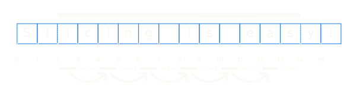

---
metadata:
    description: "In this Pydon't we cover advanced topics related to sequence slicing, like (negative) steps, more idiomatic sequence slicing, slice assignment, and slice deletion."
title: "Mastering sequence slicing | Pydon't 🐍"
---

In this Pydon't we cover advanced topics related to sequence slicing,
like (negative) steps, more idiomatic sequence slicing,
slice assignment, and slice deletion.

===


(If you are new here and have no idea what a Pydon't is, you may want to read the
[Pydon't Manifesto][manifesto].)


## Introduction

In [the previous Pydon't][pydont-sequence-slicing] we looked at using
sequence slicing to manipulate sequences, such as strings or lists.
In this Pydon't we will continue on the subject of slicing sequences,
but we will look at the more advanced topics.
In particular, in this Pydon't you will

 - learn about the step parameter in slicing;
 - see how slicing can be used to copy sequences;
 - learn about slice assignment;
 - learn some more idiomatic slicing patterns;

As it turns out, there is _A LOT_ to say about sequence slicing,
so I will have to split this Pydon't yet again, and next time
we will finish off the subject of slicing sequences with:

 - uncovering the two layers of syntactic sugar surrounding sequence slicing; and
 - seeing how to implement slicing for your custom objects.


## Slicing step

The next stop in your journey to mastering slicing in Python
is knowing about the lesser-used third parameter in the slice syntax:
the step.


### Just the step

The step is a third integer that you can add to your slicing syntax
that allows you to pick _evenly spaced_ elements from the sequence.
If `s` is a sequence, then you've seen how to do slicing with the
syntax `s[start:end]`, and the step comes after those two parameters:
`s[start:end:step]`.
The easiest way to understand how the `step` parameter works is by
omitting the `start` and `end` parameters, like so: `s[::step]`.

Here are a couple of examples:

```py
>>> "a0b0c0d0"[::2]
'abcd'
>>> "a00b00c00d00"[::3]
'abcd'
>>> "a000b000c000d000"[::4]
'abcd'
```

As you can see, in all of the examples above,
we used the `step` parameter to skip all the zeroes in between the letters.

 - When the `step` parameter is `2`, you split the sequence in groups of `2`
and pick the first element of each group.
 - When the `step` parameter is `3`, you split the sequence in groups of `3`
and pick the first element of each group.
 - When the `step` parameter is `4`, you split the sequence in groups of `4`
and pick the first element of each group.
 - ...

You get the idea, right?
Once again, notice that the `step` parameter in slicing is closely related
to the third (optional) argument that the built-in `range` function accepts.


### Start, stop and step

When you also specify start and stop positions, Python will first figure
out the section of the sequence that is encompassed by the start and stop
parameters, and only then it uses the step to pick the correct elements
from the sequence.

For example, can you explain yourself this result:

```py
>>> s = 'Slicing is easy!'
>>> s[2:14:2]
'iigi a'
```

What happens first is that `s[2:14]` tells Python that we only want to work
with a part of our original string:

```py
>>> s = 'Slicing is easy!'
>>> s[2:14]
'icing is eas'
```

Then the step parameter kicks in and tells Python to only pick
a few elements, like the figure below shows:



That is why we get the result that we got:

```py
>>> s = 'Slicing is easy!'
>>> s[2:14:2]
'iigi a'
# We can also first get the substring and then use the `step`...
>>> sub = s[2:14]
>>> sub[::2]
'iigi a'
# ... or do both consecutively without an intermediate variable:
>>> s[2:14][::2]
'iigi a'
```

Give it one more go and try to figure out what the result of

```py
>>> s = "Slicing is easy!"
>>> s[2:14:3]
# ..?
```

is.

To help you with that, here's a figure that schematises the slice above:


This is why we get

```py
>>> s = "Slicing is easy!"
>>> s[2:14:3]
'inie'
```

### Unit and empty steps

Much like with the start and stop parameters, the step parameter can be omitted.
This is what we do when we write a slice of the form `[start:stop]`:
by not including the `step` parameter we use its default value, which is 1.
This is the same as writing `[start:stop:]`,
which is also the same as writing `[start:stop:1]`.
In short, all these three slices are equivalent:

 - `s[start:stop]`;
 - `s[start:stop:]`; and
 - `s[start:stop:1]`.

Here is just one example:

```py
>>> s = "Slicing is easy!"
>>> s[2:14]
'icing is eas'
>>> s[2:14:]
'icing is eas'
>>> s[2:14:1]
'icing is eas'
```

!!! This is exactly the same as with `range`.
!!! When the third argument isn't specified, it is taken to be 1 by default.


### Negative step

We have seen how a positive step parameter behaves,
now we will see how a negative one does.
This is where things really get confusing, and at this point it really is
easier to understand how the slicing works if you are comfortable with
how `range` works with three arguments.

When you specify a slice with `s[start:stop:step]`,
you will get back the elements of `s` that are in the indices pointed to
by `range(start, stop, step)`.
If `step` is negative, then the `range` function will be counting
from `start` to `stop` backwards.
This means that `start` needs to be larger than `stop`,
otherwise there is nothing to count.

For example, `range(3, 10)` gives the integers 3 to 9.
If you want the integers 9 to 3 you can use the step -1,
but you also need to swap the `start` and `stop` arguments.
Not only that, but you also need to tweak them a bit.
The `start` argument is the _first_ number that is included
in the result and the `stop` argument is the first number
that _isn't_, so if you want the integers from 9 to 3,
counting down, you need the `start` argument to be 9
and the `stop` argument to be `2`:

```py
>>> list(range(3, 10))
[3, 4, 5, 6, 7, 8]
>>> list(range(3, 10, -1))      # You can't start at 3 and count *down* to 10.
[]
>>> list(range(10, 3, -1))      # Start at 10 and stop right before 3.
[10, 9, 8, 7, 6, 5, 4]
>>> list(range(9, 2, -1))       # Start at 9 and stop right before 2
[9, 8, 7, 6, 5, 4, 3]
```

If you are a bit confused, that is normal.
Take your time to play around with `range` and get a feel for how this works.

Using the `range` results from above and the figure below,
you should be able to figure out why these slices return these values:

```py
>>> s[3:10]
'cing is'
>>> s[3:10:-1]
''
>>> s[10:3:-1]
' si gni'
>>> s[9:2:-1]
'si gnic
```

Use the `range` results above and this figure to help you out:


If you want to use a negative range that is different from `-1`,
the same principle applies: the `start` parameter of your string
slice should be larger than the `stop` parameter (so that you can count down
from `start` to `stop`) and then the absolute value will tell you how
many elements you skip at a time.
Take your time to work these results out:

```py
>>> s = 'Slicing is easy!'
>>> s[15:2:-1]
'!ysae si gnic'
>>> s[15:2:-2] 
'!ses nc'
>>> s[15:2:-3] 
'!asgc'
>>> s[15:2:-4] 
'!e c'
```

! An important remark is due: while `range` accepts negative integers 
! as the `start` and `end` arguments and interprets those as the _actual_
! negative numbers, remember that slicing also accepts negative numbers
! but those are interpreted in the context of the sequence you are slicing.
!
! What is the implication of this?
!
! It means that if `step` is negative in the slice `s[start:stop:step]`,
! then `start` needs to refer to an element that is _to the right of_
! the element referred to by `stop`.

I will give you an explicit example of the type of confusion that the
above remark is trying to warn you about:

```py
>>> s = 'Slicing is easy!'
>>> list(range(2, -2, -1))
[2, 1, 0, -1]
>>> s[2:-2:-1]
''
>>> s[2]
'i'
>>> s[-2]
'y'
```

Notice how `range(2, -2, -1)` has four integers in it but `s[2:-2:-1]`
is an empty slice.
Why is that?
Because `s[2]` is the first “i” in `s`, while `s[-2]` is the “y”
close to the end of the string.
Using a step of `-1` would have us go from the “i” to the “y”,
but going right to left...
If you start at the “i” and go left, you reach the beginning of the string,
not the “y”.

Perhaps another way to help you look at this is if you recall
that `s[-2]` is the same as `s[len(s)-2]`,
which in this specific case is `s[14]`.
If we take the piece of code above and replace all the `-2` with `14`,
it should become clearer why the slice is empty:

```py
>>> s = 'Slicing is easy!'
>>> list(range(2, 14, -1))
[]
>>> s[2:14:-1]
''
>>> s[2]
'i'
>>> s[14]
'y'
```


### Reversing and then skipping

Another possible way to get you more comfortable with these
negative steps is if you notice the relationship between
slices with a step of the form `-n` and two consecutive
slices with steps `-1` and `n`:

```py
>>> s = 'Slicing is easy!'
>>> s[14:3:-2]
'ya igi'
>>> s[14:3:-1]
'ysae si gni'
>>> s[14:3:-1][::2]
'ya igi'
```

We can take this even further, and realise that the start
and stop parameters are used to shorten the sequence,
and that the step parameter is only then used to skip elements:

```py
>>> s = 'Slicing is easy!'
>>> s[14:3:-2]
'ya igi'
>>> s[4:15]             # Swap `start` and `stop` and add 1...
'ing is easy'
>>> s[4:15][::-1]       # ...then reverse...
'ysae si gni'
>>> s[4:15][::-1][::2]  # ...then pick every other element.
'ya igi'
```


### Zero

For the sake of completeness,
let's just briefly mention what happens if you use 0 as the step parameter,
given that we have taken a look at strictly positive steps and
strictly negative steps:

```py
>>> s = "Slicing is easy!"
>>> s[::0]
Traceback (most recent call last):
  File "<stdin>", line 1, in <module>
ValueError: slice step cannot be zero
```

Using 0 as the step gives a `ValueError`,
and that is all there is to it.


### Recommendations

!!! Did you know that the Python Standard Library (PSL) has around
!!! 6000 usages of sequence slicing, but less than
!!! 500 of those make use of the step parameter?
!!! That means that, in the PSL, only around 8.33% of the slicing
!!! operations make use of the step.
!!! (Rough figures for the PSL of Python 3.9.2 on my Windows machine.)

<!-- \[[^'"\n]*?:[^'"\n]*?:-\d+?\] -->

If I had to guess, I would say there are two main reasons that explain
why only a “small” percentage of all the slices
make use of the step parameter:

 - using a step different from 1 is a very specific operation that
 only makes sense in few occasions and depends a lot on how you
 have structured your data; and
 - step parameters other than 1 and -1 make your code much harder
 to read.

For those reasons, it is recommendable that you do not get overexcited
about slices and force your data to be in such a way that slices
are the best way to get to the data.

For example, _do not_ store colour names and their hexadecimal values
in an alternating fashion just so that you can use `[::2]` and `[1::2]`
to access them.
However, if – for some reason – you receive data in this format,
it is perfectly acceptable for you to split the data with two slices:

```py
# Assume we got `colours` in this format from an API or some other place...
>>> colours = ["red", "#ff0000", "green", "#00ff00", "blue", "#0000ff"]
>>> names = colours[::2]
>>> names
['red', 'green', 'blue']
>>> hexs = colours[1::2]
>>> hexs
['#ff0000', '#00ff00', '#0000ff']
```

Slices with three parameters tend to be dense and hard to parse with your eyes,
given that they are enclosed in `[]` and then have `::` separating the parameters.
If you write a slice of the form `s[a:b:c]`,
you can expect the readers of your code to have to pause for a bit and understand
what is going on.
For that matter, when you write a long or complex slice, first consider reworking
the code so that you don't have to write a long or complex slice.
But if you do end up writing one, you should probably comment
your slice explaining what is going on.

I had a look at how the Python Standard Library makes use of slicing with three
parameters, and I found this nice example taken from the source code of the
[`dataclasses`][dataclasses] module:

```py
# From Lib/dataclasses.py, Python 3.9.2
def _process_class(cls, init, repr, eq, order, unsafe_hash, frozen):
    # [code deleted for brevity]

    # Find our base classes in reverse MRO order, and exclude
    # ourselves.  In reversed order so that more derived classes
    # override earlier field definitions in base classes.  As long as
    # we're iterating over them, see if any are frozen.
    any_frozen_base = False
    has_dataclass_bases = False
    for b in cls.__mro__[-1:0:-1]:
        # ...

    # [code deleted for brevity]
```

Notice that on top of that `for` loop using a slice,
there are 4 lines of comments, and 3 of them are addressing what that
slice is doing: why the step parameter is `-1`, because we want to
“find our base classes in _reverse_ order”,
and then it explains why we the start and stop parameters are `-1` and `0`,
respectively, as it says “and exclude ourselves”.
If we try that slice with a simpler sequence, we can see that `[-1:0:-1]`
does in fact reverse a sequence while skipping the first element:

```py
>>> s = "Slicing is easy!"
>>> s[-1:0:-1]
'!ysae si gnicil'
```

## Sequence copying

Having taken a look at many different ways to slice and dice sequences,
it is now time to mention a very important nuance about sequence slicing:
when we create a slice, we are effectively creating a copy of the original sequence.
This isn't necessarily a bad thing.
For example, there is [one idiomatic slicing operation](#more-idiomatic-slicing)
that makes use of this behaviour.

I brought this up because it is important that you are aware of these subtleties,
so that you can make informed decisions about the way you write your code.

An example of when this copying behaviour might be undesirable is when
you have a really large list and you were considering using
a slice to iterate over just a portion of that list.
In this case, maybe using the slice
will be a waste of resources because all you want is to iterate over a specific
section of the list, and then you are done; you don't actually _need_ to have
that sublist later down the road.

!!! In this case, what you might want to use is the [`islice`][islice] function from the
!!! `itertools` module, that creates an _iterator_ that allows you to iterate
!!! over the portion of the list that you care about.
!!!
!!! _Iterators_ are another awesome feature in Python,
!!! and I'll be exploring them in future Pydon'ts,
!!! so stay tuned for that!

A simple way for you to verify that slicing creates copies of the sliced
sequences is as follows:

```py
>>> l = [1, 2, 3, 4]
>>> l2 = l
>>> l.append(5)     # Append 5 to l...
>>> l2              # ... notice that l2 also got the new 5,
                    # so l2 = l did NOT copy l.
[1, 2, 3, 4, 5]
>>> l3 = l[2:5]     # Slice l into l3.
>>> l3
[3, 4, 5]
>>> l[3] = 42       # Change a value of l...
>>> l 
[1, 2, 3, 42, 5]    # ... the 4 was replaced by 42...
>>> l3
[3, 4, 5]           # ... but l3 still contains the original 4.
```


## Manipulating mutable sequences

Let us continue down this journey of mastering sequence slicing.
So far we have been using slices to extract parts of our sequences,
but slices can also be used to manipulate the contents of our sequences!

! Manipulating sequences with slices can only be done for certain types
! of sequences, namely _mutable_ sequences;
! that is, sequences that we can alter.
! Prime examples of _mutable_ sequences are lists, and prime examples
! of _immutable_ sequences are strings.

### Slice assignment

Say that `l` is a list.
We are used to “regular” assignment,

```py
>>> l = [1, 2, 3, 4]
```

and we are used to assigning to specific indices:

```py
>>> l[2] = 30
>>> l
[1, 2, 30, 4]
```

So how about assigning to slices as well?
That is perfectly fine!

```py
>>> l[:2] = [10, 20]    # Replace the first 2 elements of l.
>>> l
[10, 20, 30, 4]
>>> l[1::2] = [200, 400]    # Swap elements in odd positions.
>>> l
[10, 200, 30, 400]
```

The two short examples above showed how to replace some elements
with the same number of elements.
However, with simpler slices you can also change the size of the original
slice:

```py
>>> l = [1, 2, 3, 4]
>>> l[:2] = [0, 0, 0, 0, 0]
>>> l
[0, 0, 0, 0, 0, 3, 4]
```

When you have a slicing assignment like that, you should read it as
“replace the slice on the left with the new sequence on the right”,
so the example above reads “swap the first two elements of `l`
with five zeroes”.

Notice that, if you use “extended slices” (slices with the step parameter),
then the number of elements on the left and on the right _should_ match:

```py
>>> l = [1, 2, 3, 4]
>>> l[::2]  # This slice has two elements in it...
[1, 3]
>>> l[::2] = [0, 0, 0, 0, 0]    # ... and we try to replace those with 5 elements.
Traceback (most recent call last):
  File "<stdin>", line 1, in <module>
ValueError: attempt to assign sequence of size 5 to extended slice of size 2
```

The fact that you can assign to slices allows you to write some pretty beautiful
things, if you ask me.

For example, as I was exploring the Python Standard Library,
I came across a slicing assignment gem inside the [`urljoin`][urljoin] function.
[`urljoin`][urljoin] from the `urllib.parse` module,
takes a base path and a relative path, and tries to combine the two
to create an absolute path.
Here is an example:

```py
>>> import urllib.parse
>>> urllib.parse.urljoin("https://mathspp.com/blog/", "pydonts/zip-up")
'https://mathspp.com/blog/pydonts/zip-up'
```

I'm using `urllib.parse.urljoin` to take the base URL for my blog and stitch
that together with a relative link that takes me to one of the Pydon'ts I have published.
Now let me show you part of the source code of that function:

```py
# From Lib/urllib/parse.py in Python 3.9.2
def urljoin(base, url, allow_fragments=True):
    """Join a base URL and a possibly relative URL to form an absolute
    interpretation of the latter."""

    # [code deleted for brevity]

    # for rfc3986, ignore all base path should the first character be root.
    if path[:1] == '/':
        segments = path.split('/')
    else:
        segments = base_parts + path.split('/')
        # filter out elements that would cause redundant slashes on re-joining
        # the resolved_path
        segments[1:-1] = filter(None, segments[1:-1])
```

Notice the slice assignment to `segments[1:-1]`?
That `segments` list contains the different portions of the two
URLs I give the `urljoin` function, and then the [`filter`][filter] function
is used to filter out the parts of the URL that are empty.
Let me edit the source code of `urljoin` to add two print statements to it:

```py
# From Lib/urllib/parse.py in Python 3.9.2
def urljoin(base, url, allow_fragments=True):
    """Join a base URL and a possibly relative URL to form an absolute
    interpretation of the latter."""

    # [code deleted for brevity]

    # for rfc3986, ignore all base path should the first character be root.
    if path[:1] == '/':
        segments = path.split('/')
    else:
        segments = base_parts + path.split('/')
        # filter out elements that would cause redundant slashes on re-joining
        # the resolved_path
        print(segments)
        segments[1:-1] = filter(None, segments[1:-1])
        print(segments)
```

Now let me run the same example:

```py
>>> import urllib.parse
>>> urllib.parse.urljoin("https://mathspp.com/blog/", "pydonts/zip-up")
['', 'blog', '', 'pydonts', 'zip-up']   # First `print(segments)`
['', 'blog', 'pydonts', 'zip-up']       # <----------- segments has one less '' in it!
'https://mathspp.com/blog/pydonts/zip-up'
```

We can take the result of the first print and run the filter by hand:

```py
>>> segments = ['', 'blog', '', 'pydonts', 'zip-up']
>>> segments[1:-1]
['blog', '', 'pydonts']
>>> list(filter(None, segments[1:-1]))
['blog', 'pydonts']
>>> segments[1:-1] = filter(None, segments[1:-1])
>>> segments
['', 'blog', 'pydonts', 'zip-up']
```

So this was a very interesting example usage of slice assignment.
It is likely that you won't be doing something like this very frequently,
but knowing about it means that when you do, you will be able to write
that piece of code beautifully.


### Slice deletion

If you can assign to slices, what happens if you assign the empty list `[]` to a slice?

```py
>>> l = [1, 2, 3, 4]
>>> l[:2] = []          # Replace the first two elements with the empty list.
>>> l
[3, 4]
```

If you assign the empty list to a slice, you are effectively deleting those elements
from the list.
You can do this by assigning the empty list, but you can also use the `del` keyword
for the same effect:

```py
>>> l = [1, 2, 3, 4]
>>> del l[:2]
>>> l
[3, 4]
```


## More idiomatic slicing

Now that we have learned some more cool features on sequence slicing,
it is time to see how these features are better used and how they
show up in their more idiomatic forms.

_Idiomatic_ code is code that you can take a look at and read it
for what it does, as a whole, without having to reason about each
little piece individually...
Think of it like "normal" reading: when you were learning, you had
to read character by character, but now you grasp words as a whole.
With enough practice, these idiomatic pieces of code become recognisable as a whole as well.


### Even positions and odd positions

A simple slice that you may want to keep on the back of your mind is the slice that lets you
access all the elements in the even positions of a sequence.
That slice is `[::2]`:

```py
>>> l = ["even", "odd", "even", "odd", "even"]
>>> l[::2]
['even', 'even', 'even']
```

Similarly, `l[1::2]` gives you the odd positions:

```py
>>> l = ["even", "odd", "even", "odd", "even"]
>>> l[1::2]
['odd', 'odd']l = ["even", "odd", "even", "odd", "even"]
l[1::2]
```


### `s[::-1]`

A slice with no start and stop parameters and a `-1` in the step is a very common slicing pattern.
In fact, there are approximately 100 of these slices in the Python Standard Library,
which is roughly one third of all the slices that make use of the step parameter.

`s[::-1]` should be read as “the sequence `s`, but reversed”.
Here is a simple example:

```py
>>> s = "Slicing is easy!"
>>> s[::-1]
'!ysae si gnicilS'
```

What is noteworthy here, and related to the previous remark about slices creating copies,
is that sometimes you don't want to copy the whole thing to reverse your sequence;
for example, if all you want to do is iterate over the sequence in reverse order.
When that is the case, you might want to just use the [`reversed`][reversed] built-in function.
This function takes a sequence and allows you to iterate over the sequence in _reverse_ order,
without paying the extra memory cost of actually copying the whole sequence.


### `l[:]` or `l[::]`

If a slice makes a copy, that means that a slice is a very clean way to copy a sequence!
The slices `[:]` and `[::]` select whole sequences, so those are primes ways to copy
a sequence – for example, a list – when you really want to create copies.

Deep and shallow copies, the distinction between things that are passed by reference
and things that are passed by value, etc, is a big discussion in itself.

It is easy to search the Python Standard Library for usage examples of this idiom
(and for the ones before as well), so I will just leave you with one,
from the `argparse` module, that contains a helper function named `_copy_items`
(I deleted its comments):

```py
# From Lib/argparse.py in Python 3.9.2
def _copy_items(items):
    if items is None:
        return []

    if type(items) is list:
        return items[:]
    import copy
    return copy.copy(items)
```

Notice how the idiom fits in so nicely with the function name:
the function says it copies the items.
What does the function do?
If the `items` argument is a list, then it returns a copy of it!
So `l[:]` and `l[::]` should be read as “a copy of `l`”.

This idiom also explains the thumbnail image in the beginning of the article.


### `del l[:]`

Another idiom that makes use of the slice `[:]`, but with something extra,
is the idiom to delete the contents of a list.

Think of `l[:]` as “opening up `l`”, and then `del l[:]` reads
“open up `l` to delete its _contents_”.
This is the same as doing `l[:] = []` but it is _not_ the same
as doing `l = []` _nor_ is it the same as doing `del l`.

It is easy to see why `del l` is different from the others:
`del l` means that the name `l` is no longer in use:

```py
>>> l = [1, 2, 3, 4]
>>> del l
>>> l
Traceback (most recent call last):
  File "<stdin>", line 1, in <module>
NameError: name 'l' is not defined
```

whereas the idiom just clears the list up:

```py
>>> l = [1, 2, 3, 4]
>>> del l[:]
>>> l
[]
```

What might be trickier to understand is why `del l[:]` and `l[:] = []`
are different from `l = []`.
I'll show you an example that shows they are _clearly_ different,
and then I will leave it up to you to decide whether or not you want
to burn enough neurons to understand what is going on.

First, let me use `l[:] = ...`

```py
>>> l = l_shallow = [1, 2, 3]
>>> l_shallow is l
True
>>> j = []
>>> l[:] = j 
>>> l
[]
>>> l_shallow
[]
>>> l is j
False
>>> l_shallow is l
True
```

and now let me compare it with `l = ...`

```py
>>> l = l_shallow = [1, 2, 3]
>>> l_shallow is l
True
>>> j = []
>>> l = j
>>> l
[]
>>> l_shallow
[1, 2, 3]
>>> l is j
True
>>> l_shallow is l
False
```

You can see above that the results of comparisons like `l is j` and `l_shallow is l`,
as well as the contents of `l_shallow`, change in the two examples.
Therefore, the two things cannot be the same.
What is going on?
Well, deep and shallow copies, and references to mutable objects, and the like, are at fault!
I'll defer a more in-depth discussion of this for a later Pydon't,
as this one has already become quite long.

Just remember, `l[:] = []` and `del l[:]` can be read as “delete the _contents_ of `l`”.


## Conclusion

Here's the main takeaway of this Pydon't, for you, on a silver platter:

 > “*Slices are really powerful and they are an essential tool to master
 for when you work with sequences, like strings and lists.*”

This Pydon't showed you that:

 - slices can have a step parameter that allows to skip elements of the sequence;
 - the default value of the step parameter is `1`;
 - a negative step allows to pick elements from the end of the sequence to the start;
 - when using a negative step, the start parameter should refer to
 an element of the sequence that is to the _right_ of the element referred to by the stop parameter;
 - there is a parallelism between slices (with negative steps) and
 the built-in `range` function;
 - `0` is not a valid step parameter for a slice;
 - slices are more common with just the start and stop parameters,
 in part because slices with `[start:stop:step]` can be really hard to read;
 - slices create _copies_ of the parts of the sequences we are
 looking at, so you have to be mindful of that when memory is constrained;
 - you can assign to slices of mutable objects, like lists;
 - when assigning to a slice, the final length of the sequence might
 change if we use a simple slice on the left (without the step parameter) and if the sequence on the right has a different number
 of elements;
 - you can use the `del` keyword to delete slices of mutable
 sequences, or you can also assign the empty sequence to those slices
 for the same effect;
 - there are some interesting idiomatic slices that you should be aware of:
   - `s[::2]` and `s[1::2]` are “elements in even positions of `s`”
   and “elements in odd positions of `s`”, respectively;
   - `s[::-1]` is “`s`, but reversed”;
   - `l[:]` and `l[::]` are “a copy of `l`”; and
   - `del l[:]` is “delete the contents of `l`” or “empty `l`”,
   which is not the same as doing `l = []`.

If you liked this Pydon't be sure to leave a reaction below and share this with your friends and fellow Pythonistas.
Also, [don't forget to subscribe to the newsletter][subscribe] so you don't miss
a single Pydon't!

[subscribe]: https://mathspp.com/subscribe
[manifesto]: /blog/pydonts/pydont-manifesto
[pydont-sequence-slicing]: /blog/pydonts/idiomatic-sequence-slicing
[pydonts-book]: https://leanpub.com/pydonts
[dataclasses]: https://docs.python.org/3/library/dataclasses.html
[islice]: https://docs.python.org/3/library/itertools.html#itertools.islice
[urljoin]: https://docs.python.org/3/library/urllib.parse.html#urllib.parse.urljoin
[filter]: https://docs.python.org/3/library/functions.html#filter
[reversed]: https://docs.python.org/3/library/functions.html#reversed
