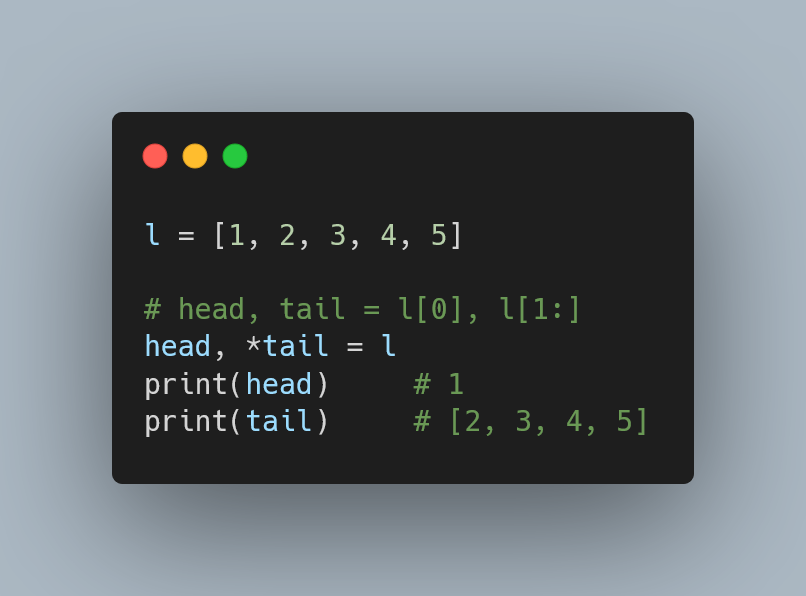

---
metadata:
    description: "When unpacking a list or tuple in Python, avoid using slices."
title: "Unpacking with starred assignments | Pydon't 🐍"
---

How should you unpack a list or a tuple into the first element and then the rest?
Or into the last element and everything else?
Pydon't unpack with slices, prefer starred assignment instead.

===



(If you are new here and have no idea what a Pydon't is, you may want to read the
[Pydon't Manifesto][manifesto].)

# Starred Assignment

It is fairly common to have a list or another iterable that you want to split
in the first element and then the *rest*.
You can do this by using slicing in Python, but the most explicit way is with
*starred assignments*.

This feature was introduced in [PEP 3132 -- Extended Iterable Unpacking][pep3132]
and allows for the following:

```py
>>> l = [1, 2, 3, 4, 5]
>>> head, *tail = l
>>> head
1
>>> tail
[2, 3, 4, 5]
```

This starred assignment is done by placing one `*` to the left of a variable name
in a multiple assignment, and by having any iterable on the right of the assignment.
All variable names get a single element and the variable name with the "star"
(the asterisk `*`) gets all other elements as a list:

```py
>>> string = "Hello!"
>>> *start, last = string
>>> start
['H', 'e', 'l', 'l', 'o']
>>> last
'!'
```

You can have more than two variable names on the left, but **only one** asterisk:

```py
>>> a, b, *c, d = range(5) # any iterable works
>>> a
0
>>> b
1
>>> c
[2, 3]
>>> d
4
```

When you use the starred assignment, the starred name might get an empty list,

```py
>>> a, *b = [1]
>>> a
1
>>> b
[]
```

and an error is issued if there are not enough items to assign to the names that
are not starred:

```py
>>> a, *b = []
Traceback (most recent call last):
  File "<stdin>", line 1, in <module>
ValueError: not enough values to unpack (expected at least 1, got 0)
```

Here is a simple example that hints at the practical use cases of this feature.
The string method `.split` accepts a second argument called `maxsplit` that specifies the maximum number of splits that we want:

```py
>>> sentence = "This is a sentence with many words."
>>> sentence.split(" ")
['This', 'is', 'a', 'sentence', 'with', 'many', 'words.']
>>> sentence.split(" ", maxsplit=3)
['This', 'is', 'a', 'sentence with many words.']
```

By making use of starred assignment, we can easily get the first three words of a sentence:

```py
>>> *first_three, rest = sentence.split(" ", 3)
>>> first_three
['This', 'is', 'a']
>>> rest
'sentence with many words.'
```

# Examples in code

Here are a couple of examples in some actual code, to give more context.

## `reduce` from `functools`

Imagine you wanted to implement a function akin to the `reduce` function from
`functools` (you can reads its documentation [here][reduce]).

Here is how an implementation might look like, using slices:

```py
def reduce(function, list_):
    """Reduce the elements of the list by the binary function."""

    if not list_:
        raise TypeError("Cannot reduce empty list.")
    value = list_[0]
    list_ = list_[1:]
    while list_:
        value = function(value, list_[0])
        list_ = list_[1:]
    return value
```

And here is an equivalent implementation using starred assignment:

```py
def reduce(function, list_):
    """Reduce the elements of the list by the binary function."""

    if not list_:
        raise TypeError("Cannot reduce empty list.")
    value, *list_ = list_
    while list_:
        val, *list_ = list_
        value = function(value, val)
    return value
```

The usage of the starred assignment here makes it abundantly clear that we wish to
unpack the list into an item to be used now and the rest to be used later.

Another similar example, but with the starred name in the beginning, follows.

## Credit card check digit

The [Luhn Algorithm][luhn] is used to compute a check digit for things like credit
card numbers or bank accounts.

Let's implement a function that verifies if the check digit is correct, according
to the Luhn Algorithm, and using starred assignment to separate the check digit
from all the other digits:

```py
def verify_check_digit(digits):
    """Use the Luhn algorithm to verify the check digit."""

    *digits, check_digit = digits
    weight = 2
    acc = 0
    for digit in reversed(digits):
        value = digit * weight
        acc += (value // 10) + (value % 10)
        weight = 3 - weight # 2 -> 1 and 1 -> 2
    return (9 * acc % 10) == check_digit

# Example from Wikipedia.
print(verify_check_digit([7, 9, 9, 2, 7, 3, 9, 8, 7, 1, 3])) # True
```

Maybe it is not obvious to you what the function does just by looking at it,
but it should be very clear that the line `*digits, check_digit = digits` splits
the list `digits` into the items in the beginning and the final digit.

How would you implement the function above, using slices and indexing?
An example could be like so:

```py
def verify_check_digit(digits):
    """Use the Luhn algorithm to verify the check digit."""

    weight = 2
    acc = 0
    for digit in reversed(digits[:-1]):
        value = digit * weight
        acc += (value // 10) + (value % 10)
        weight = 3 - weight # 2 -> 1 and 1 -> 2
    return (9 * acc % 10) == digits[-1]

# Example from Wikipedia.
print(verify_check_digit([7, 9, 9, 2, 7, 3, 9, 8, 7, 1, 3])) # True
```

This also works, but looks a bit more confusing.
Notice we have two similar indexing operations, but one is actually a slice
while the other is a proper indexing.

In the `for` loop we have a `reversed(digits[:-1])` while in the
return value we have `... == digits[-1]`.
If I am not paying enough attention, I won't notice those are different things.
Of course it is *my* fault that I am not paying enough attention, but when I'm
writing code, I prefer for my code to be as clear as possible:
I don't want the reader to spend too much time reading the code, I prefer them
to spend time studying the algorithms.

---

If you liked this Pydon't be sure to leave a reaction below and share this with your friends and fellow Pythonistas.
Comment below a nice use case you found for starred assignments!

Also, [don't forget to subscribe to the newsletter][subscribe] so you don't miss
a single Pydon't!

# References

 - PEP 3132 -- Extended Iterable Unpacking, [https://www.python.org/dev/peps/pep-3132/][pep3132]
 - Python 3.9.1 Documentation, The Python Standard Library, Functional Programming Modules, `functools`, [https://docs.python.org/3/library/functools.html#functools.reduce][reduce] [consulted on the 12th of January of 2021].
 - Luhn Algorithm, Wikipedia, [https://en.wikipedia.org/wiki/Luhn_algorithm][luhn].

[subscribe]: https://mathspp.com/subscribe
[manifesto]: /blog/pydonts/pydont-manifesto
[pep3132]: https://www.python.org/dev/peps/pep-3132/
[reduce]: https://docs.python.org/3/library/functools.html#functools.reduce
[luhn]: https://en.wikipedia.org/wiki/Luhn_algorithm
