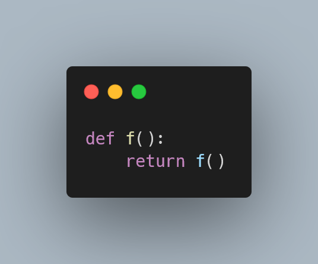

---
metadata:
    description: "Recursion can be very powerful, but in this Pydon't we talk about some things to look out for."
title: "Watch out for recursion | Pydon't 🐍"
---

Recursion is a technique that you should have in your programming
arsenal, but that doesn't mean you should always use recursion
when writing Python code.
Sometimes you should convert the recursion to another
programming style or come up with a different algorithm
altogether.

===



(If you are new here and have no idea what a Pydon't is, you may want to read the
[Pydon't Manifesto][manifesto].)

## Introduction

In this Pydon't I am going to talk a little bit about when and why
recursion might not be the best strategy to solve a problem.
This discussion will entail some particularities of Python, but will
also cover broader topics and concepts that encompass many programming languages.
After this brief discussion,
I will show you some examples of recursive Python code and its
non-recursive counterparts.

Despite what I said I'll do, don't take me wrong:
the purpose of this Pydon't is *not* to make you dislike recursion
or to say that recursion sucks.
I *really* like recursion and I find it very elegant.


## Watch out for recursion

Now that you know what is the purpose of this Pydon't,
let me mention some things that can influence the suitability
of recursion to solve problems.

### `RecursionError`

The first thing we will discuss is the infamous recursion depth limit
that Python enforces.

If you have no idea what I am talking about, then either
 - you never wrote a recursive function in your life, or
 - you are really, *really* good and never made a mistake in your
recursive function definitions.

The recursion depth limit is something that makes your code raise a
`RecursionError` if you make too many recursive calls.
To see what I am talking about, just do the following in your REPL:

```py
>>> def f():
...     return f()
...
>>> f()
Traceback (most recent call last):
  File "<stdin>", line 1, in <module>
  File "<stdin>", line 2, in f
  File "<stdin>", line 2, in f
  File "<stdin>", line 2, in f
  [Previous line repeated 996 more times]
RecursionError: maximum recursion depth exceeded
>>>
```

In many cases, this limit *helps*, because it helps you find recursive
functions for which you did not define the base case properly.

There are, however, cases in which $1000$ recursive calls isn't enough
to finish your computations.
A classical example is that of the factorial function:

```py
>>> def fact(n):
...     if n == 0:
...             return 1
...     return n*fact(n-1)
... 
>>> fact(10) 
3628800
>>> fact(2000)
Traceback (most recent call last):
  File "<stdin>", line 1, in <module>
  File "<stdin>", line 5, in fact
  File "<stdin>", line 5, in fact
  File "<stdin>", line 5, in fact
  [Previous line repeated 995 more times]
  File "<stdin>", line 2, in fact
RecursionError: maximum recursion depth exceeded in comparison
```

Our function is properly defined but by default Python
does not allow us to make sufficient recursive calls.

If you must, you can always set your own recursion depth:

```py
>>> import sys
>>> sys.setrecursionlimit(3000) 
>>> fact(2000)
33162... # (omitted for brevity)
>>> sys.getrecursionlimit()
3000
```

Just be careful with it.
I never tried, but you are likely not to be interested in
having Python run out of memory because of your obscenely large
amount of recursive calls.

Hence, if your function is such that it will be constantly trying to recurse
more than the recursion depth allowed, you might want to consider a different
solution to your problem.

### No tail recursion elimination

In some programming languages, the factorial function shown above
could be tweaked -- so as to perform a tail call -- and that would
prevent some problems while saving memory:
tail calls happen when the recursive call is the very last thing
that is done inside the function, which more or less means that
you do not need to keep any information whatsoever about the context
you are in when you recurse.

In the factorial function above, after recursing with `fact(n-1)`
we still have to perform a multiplication before returning from the function.
If we rewrote the function to carry the partial factorial as an accumulator,
we could have a factorial function that performs tail calls:

```py
>>> def fact(n, partial=1):
...     if n <= 1:
...             return partial
...     return fact(n-1, n*partial)
... 
>>> fact(10)
3628800
```

As you can see, the very last thing done inside the `fact` function is
to call itself, so in theory Python could “forget everything about its
surroundings” when making the recursive call, and save a lot of memory
in the process.

In practice, Python does not do this *intentionally*, and I refer you to the
two articles on the [Neopythonic] blog (by Guido van Rossum) in the references
to read more on why Python does not have such a feature.

Converting recursive functions into tail recursive functions is an interesting
exercise and I challenge you to do so,
but you won't get speed gains for it.
However, it is very easy to remove the recursion of a tail recursive function,
and I will show you how to do it [in the examples below](#more-on-tail-recursion).

### Branching overlap

Another thing to take into account when considering a recursive solution
to a problem is:
is there going to be much overlap in the recursive calls?

If your recursive function branches in its recursive calls *and* the recursive
calls overlap, then you may be wasting plenty of time recalculating the same
values over and over again.
More often than not this can be fixed easily,
but just because a problem *probably* has a simple solution, it doesn't mean
you can outright ignore it.

A classical example of recursion that leads to plenty of wasted computations
is the Fibonacci sequence example:

```py
def fibonacci(n):
    if n <= 1:
        return n
    return fibonacci(n-1) + fibonacci(n-2)
```

A simple modification to this function shows that there are *many* recursive
calls being made:

```py
call_count = 0
def fibonacci(n):
    global call_count
    call_count += 1
    if n <= 1:
        return n
    return fibonacci(n-1) + fibonacci(n-2)

print(fibonacci(10))
print(call_count)   # 177
```

If your function is more involved, then the time you waste on recalculations
can become unbearable.


### Depth-first versus breadth-first

Something else to take into consideration when writing recursive solutions
to your problems is that recursive solutions are inherently depth-first in nature,
whereas your problem might warrant a breadth-first solution.

This is unlikely to be a large concern, but it just goes to show that sometimes,
even though a solution has a very clear recursive solution, you are better off
with not implementing a purely-recursive solution.

A very good example of this distinction popped up [when I solved the water
bucket riddle][water-buckets]: I wanted to write code that solved
(a more generic version of)
that riddle
where you have a bucket that can hold `A` litres, another one that holds `B` litres,
and you have to move water around to get one of the buckets to hold exactly `T` litres.
The solution can be easily expressed in recursive terms, but my implementation
actually used a `while` loop and a BFS algorithm.

If you don't know what this means, the best thing to do is to google it.
For example, visit the Wikipedia pages on
[Depth-first Search](https://en.wikipedia.org/wiki/Depth-first_search)
and
[Breadth-first Search](https://en.wikipedia.org/wiki/Breadth-first_search).
In a short and imprecise sentence,
Depth-First Search (DFS) means that when you are traversing some structure,
you prioritise exploring in depth, and only then you look around, whereas in
Breadth-First Search (BFS) you first explore the level you are at, and only then
go a level deeper.


## Examples in code

I will now show some recursive code that can incur in some of the problems
mentioned above, and will also share non-recursive versions of those same
pieces of code.

### Factorials

The toy example of the factorial is great because it lends itself to countless
different implementations, and the ideas that these implementations exhibit
can then be adapted to more complex recursions.

The main characteristic here is that the recursion of the factorial is a
“linear” recursion, where each call only performs a single recursive call,
and each recursive call is for a simpler problem.

The vanilla recursion follows:

```py
def factorial(n):
    if n <= 1:
        return 1
    return n * factorial(n-1)
```

Like we have seen above, we could use an accumulator to write a tail recursive
version of the factorial, even thought Python won't optimise that in any way:

```py
def factorial(n, partial=1):
    if n <= 1:
        return partial
    return factorial(n-1, n*partial)
```

Now that we have this function written in a tail recursive way,
we can actually remove the recursion altogether following a simple recipe:

```py
def factorial(n):
    partial = 1
    while n > 1:
        n, partial = n-1, n*partial
    return partial
```

This is a generic transformation you can do for any tail recursive function
and [I'll present more examples below](#more-on-tail-recursion).

Still on the factorial, because this is a linear recursion
(and a fairly simple one, yes),
there are many ways in which this function can be rewritten.
I present a couple, pretending for a second that `math.factorial` doesn't exist:

```py
import math
def factorial(n):
    return math.prod(i for i in range(1, n+1))

import functools, operator
def factorial(n):
    return functools.reduce(operator.mul, [i for i in range(1, n+1)])

def factorial(n):
    fact = 1
    for i in range(1, n+1):
        fact *= i
    return fact
```

If you are solving a problem and come up with different solutions,
don't be afraid to try them out.

### More on tail recursion

Let me show you a couple of simple recursive functions,
their tail recursive equivalents and then their non-recursive counterparts.
I will show you the generic transformation, so that you too can rewrite any
tail recursive function as an imperative one with ease.

#### List sum

You can implement your own `sum` recursively:

```py
def sum(l):
    if not l:
        return 0
    return l[0] + sum(l[1:])
```

If you carry a partial sum down the recursive calls,
you can make this tail recursive:

```py
def sum(l, partial=0):
    if not l:
        return partial
    return sum(l[1:], l[0] + partial)
```

From the tail recursive function to the `while` solution is simple:

```py
def sum(l):
    partial = 0
    while l:
        l, partial = l[1:], l[0] + partial
    return partial
```

Notice what happened:
 - the default value of the auxiliary variable becomes the first statement of the function;
 - you write a `while` loop whose condition is the complement of the base case condition;
 - you update your variables just like you did in the tail recursive call,
except now you assign them explicitly; and
 - after the `while` you return the auxiliary variable.

Of course there are simpler implementations for the `sum`, the point here is that
this transformation is *generic* and *always works*.

#### Sorting a list

Here is another example where we sort a list with selection sort.
First, “regular” recursion:

```py
def selection_sort(l):
    if not l:
        return []
    m = min(l)
    idx = l.index(m)
    return [m] + selection_sort(l[:idx]+l[idx+1:])
```

Now a tail recursive version:

```py
def selection_sort(l, partial=None): # partial=[] is bad!
    if partial is None:
        partial = []
    if not l:
        return partial
    m = min(l)
    idx = l.index(m)
    selection_sort(l[:idx]+l[idx+1:], partial + [m])
```

In the above we just have to be careful with something:
the default value of `partial` is supposed to be the empty list, but you should
avoid mutable types in your arguments' default values,
so we go with `None` and then
the very first thing we do is set `partial = []` in case it was `None`.

Finally, applying the recipe, we can remove the recursion:

```py
def selection_sort(l):
    partial = []
    while l:
        m = min(l)
        idx = l.index(m)
        l, partial = l[:idx]+l[idx+1:], partial + [m]
    return partial
```

### Traversing (a directory)

The Depth-first versus Breadth-first distinction is more likely to pop
up when you have to *traverse* something.

In this example, we will traverse a full directory, printing file names
and file sizes.
A simple, purely recursive solution follows:

```py
import pathlib

def print_file_sizes(path):
    """Print file sizes in a directory."""

    path_obj = pathlib.Path(path)
    if path_obj.is_file():
        print(path, path_obj.stat().st_size)
    else:
        for path in path_obj.glob("*"):
            print_file_sizes(path)
```

If you apply that function to a directory tree like this one,

```txt
 - file1.txt
 - subdir1
 | - file2.txt
 | - subdir2
   | - file3.txt
   | - subdir3
     | - deep_file.txt
```

then the first file you will see printed is `deep_file.txt`, because this recursive
solution traverses your file-system depth first.
If you wanted to traverse the directory breadth-first, so that you first found
`file1.txt`, then `file2.txt`, then `file3.txt`, and finally `deep_file.txt`, you
could rewrite your function to look like the following:

```py
import pathlib

def print_file_sizes(dir):
    """Print file sizes in a directory, recurse into subdirs."""

    paths_to_process = [dir]
    while paths_to_process:
        path, *paths_to_process = paths_to_process
        path_obj = pathlib.Path(path)
        if path_obj.is_file():
            print(path, path_obj.stat().st_size)
        else:
            paths_to_process += path_obj.glob("*")
```

This example that I took from my [“Truthy, Falsy, and bool” Pydon't][tfb-pydont]
uses the `paths_to_process` list to keep track of the, well, paths that still
have to be processed, which mimics recursion without actually having to recurse.


### Keeping branching in check

#### Overlaps

When your recursive function branches out a lot, and those branches overlap,
you can save some computational effort by saving the values you computed so far.
This can be as simple as having a dictionary inside which you check for known values
and where you insert the base cases.

! This technique is often called memoisation and will be covered in depth in
! a later Pydon't, so [stay tuned][subscribe]!

```py
call_count = 0

fibonacci_values = {0: 0, 1: 1}
def fibonacci(n):
    global call_count
    call_count += 1

    try:
        return fibonacci_values[n]
    except KeyError:
        fib = fibonacci(n-1) + fibonacci(n-2)
        fibonacci_values[n] = fib
        return fib

print(fibonacci(10))
print(call_count)   # 19
```

Notice that this reduced the recursive calls from 177 to 19.
We can even count the number of times we have to perform calculations:

```py
computation_count = 0

fibonacci_values = {0: 0, 1: 1}
def fibonacci(n):
    try:
        return fibonacci_values[n]
    except KeyError:
        global computation_count
        computation_count += 1
        fib = fibonacci(n-1) + fibonacci(n-2)
        fibonacci_values[n] = fib
        return fib

print(fibonacci(10))
print(computation_count)   # 9
```

This shows that saving partial results can really pay off!

#### Writing recursive branching as loops

To show you how you can rewrite a recursive, branching function as a function
that uses `while` loops we will take a look at another sorting algorithm,
called merge sort.
The way merge sort works is simple: to sort a list, you start by sorting the
first and last halves separately, and then you merge the two sorted halves.

Written recursively, this might look something like this:

```py
def merge(l1, l2):
    result = []
    while l1 and l2:
        if l1[0] < l2[0]:
            h, *l1 = l1
        else:
            h, *l2 = l2
        result.append(h)

    result.extend(l1)  # One of the two lists is empty,
    result.extend(l2)  # the other contains the larger elements.
    return result

def merge_sort(l):
    """Sort a list recursively with the merge sort algorithm."""

    # Base case.
    if len(l) <= 1:
        return l
    # Sort first and last halves.
    m = len(l)//2
    l1, l2 = merge_sort(l[:m]), merge_sort(l[m:])
    # Now put them together.
    return merge(l1, l2)
```

If you don't want to have all this recursive branching, you can use a generic list
to keep track of all the sublists that are still to be sorted:

```py
def merge(l1, l2):
    """Merge two lists in order."""

    result = []
    while l1 and l2:
        if l1[0] < l2[0]:
            h, *l1 = l1
        else:
            h, *l2 = l2
        result.append(h)

    result.extend(l1)  # One of the two lists is empty,
    result.extend(l2)  # the other contains the larger elements.
    return result

def merge_sort(l):
    """Sort a list with the merge sort algorithm."""

    # Save all sorted sublists.
    already_sorted = []
    # Keep track of sublists that need sorting:
    to_sort = [l]
    while to_sort:
        # Pick a list to be sorted.
        lst, *to_sort = to_sort
        # Base case.
        if len(lst) <= 1:
            already_sorted.append(lst)
        else:
            # Split in halves to sort each half.
            m = len(lst) // 2
            to_sort.append(lst[:m])
            to_sort.append(lst[m:])

    # Merge all the sublists.
    while len(already_sorted) > 1:
        l1, l2, *already_sorted = already_sorted
        # Factored out the `merge` to keep this short.
        already_sorted.append(merge(l1, l2))

    return already_sorted[0]
```

! If you don't really know what the `h, *l1 = l1`, `h, *l2 = l2`,
! `lst, *to_sort = to_sort` and `l1, l2, *already_sorted = already_sorted` lines
! are doing, you might want to have a look at
! [this Pydon't about unpacking with starred assignments][star-pydont].

In this particular example, *my* translation of the merge sort to a non-recursive
solution ended up being noticeably larger than the recursive one.
This just goes to show that you need to judge all situations by yourself:
would this be worth it?
Is there an imperative implementation that is better than this direct translation?
The answers to these questions will always depend on the programmer and the context
they are in.

This also shows that the way you *think* about the problem has an effect on the way
the code looks:
even though this last implementation is imperative, it is a direct translation of
a recursive implementation and so it may not look as good as it could!

## Conclusion

Here's the main takeaway of this article, for you, on a silver platter:

 > “Pydon't recurse mindlessly.”

This Pydon't showed you that:

 - Python has a hard limit on the number of recursive calls you can make and raises a `RecursionError` if you cross that limit;
 - Python does not optimise tail recursive calls, and probably never will;
 - tail recursive functions can easily be transformed into imperative functions;
 - recursive functions that branch can waste a lot of computation
if no care is taken;
 - traversing something with pure recursion tends to create depth first traversals,
which might not be the optimal way to solve your problem; and
 - direct translation of recursive functions to imperative ones and vice-versa will
probably produce sub-optimal code, so you need to align your mindset with what you
want to accomplish.

If you liked this Pydon't be sure to leave a reaction below and share this with your friends and fellow Pythonistas.

Also, [don't forget to subscribe to the newsletter][subscribe] so you don't miss
a single Pydon't!

## References

 - Stack Overflow, “What is the maximum recursion depth in Python,
and how to increase it?”,
[https://stackoverflow.com/questions/3323001/what-is-the-maximum-recursion-depth-in-python-and-how-to-increase-it](https://stackoverflow.com/questions/3323001/what-is-the-maximum-recursion-depth-in-python-and-how-to-increase-it).
 - Stack Overflow, “Does Python optimize tail recursion?”, [https://stackoverflow.com/questions/13591970/does-python-optimize-tail-recursion](https://stackoverflow.com/questions/13591970/does-python-optimize-tail-recursion).
 - Neopythonic, Tail Recursion Elimination, [http://neopythonic.blogspot.com/2009/04/tail-recursion-elimination.html](http://neopythonic.blogspot.com/2009/04/tail-recursion-elimination.html).
 - Neopythonic, Final Words on Tail Calls, [http://neopythonic.blogspot.com/2009/04/final-words-on-tail-calls.html](http://neopythonic.blogspot.com/2009/04/final-words-on-tail-calls.html).
 - Documentation, The Python Standard Library, Functional Programming Modules, operator, [https://docs.python.org/3/library/operator.html](https://docs.python.org/3/library/operator.html).

Online references last consulted on the 16th of February of 2021.

[subscribe]: https://mathspp.com/subscribe
[manifesto]: /blog/pydonts/pydont-manifesto
[tfb-pydont]: /blog/pydonts/truthy-falsy-and-bool#processing-data
[star-pydont]: /blog/pydonts/unpacking-with-starred-assignments
[Neopythonic]: https://neopythonic.blogspot.com
[water-buckets]: /blog/water-buckets
