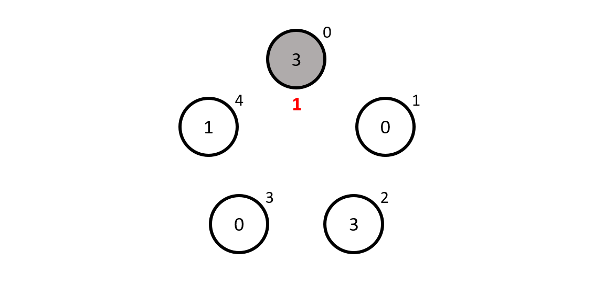

Este artigo contém a minha solução proposta para o [Problema #018 - chapéus num círculo][prob]. Por favor não leias esta solução se ainda não tentaste resolver [o problema][prob] a sério.

===

### Solução

A resposta é bastante interessante e pode ser formulada de forma simples com linguagem matemática; depois de o fazer, vou tentar explicar o que a fórmula quer realmente dizer com uns bonecos.

Seja $a_i$ o número no chapéu do matemático $i$ e seja $g_i$ o palpite que o matemático $i$ vai escrever. Então queremos que $g_i$ satisfaça a equação

$g_i + \sum_{j \neq i} a_j \equiv i \hspace{0.5cm} \text{mod } n$

O que decorre disto é que se $k \equiv \sum_i a_i \text{ mod } n$, então o $k$-ésimo matemático vai acertar e todos os outros vão falhar.

#### Porque é que funciona?

Esta pequena explicação é ainda puramente matemática. Os bonecos vêm a seguir.

Sejam $a_i$, $g_i$ como definidos em cima e seja $k = \sum_i a_i \text{ mod } n$. Repara que

$g_k + \sum_{j \neq k} a_j \equiv k \iff g_k \equiv k - \sum_{j \neq k} a_j.$

Claro que definimos $k = \sum_i a_i$, de modo que a expressão em cima simplifica para

$g_k = \sum_{j} a_j - \sum_{j \neq k} a_j = a_k \hspace{0.5cm} \text{mod } n,$

logo o $k$-ésimo matemático acerta.

#### Explicação da solução

Vamos supor que $n = 5$ e vamos numerar os matemáticos de $0$ a $4$, começando pelo matemático mais acima e indo na direção dos ponteiros do relógio. Os números dentro dos círculos representam os números nos chapéus, que eu atribuí [aleatoriamente][xkcd-random].


Agora vamos supor que somos o matemático número $0$ e que portanto vemos os números $0$, $3$, $0$ e $1$, que somados dão $4$. Agora, somos o matemático $0$ e portanto o nosso palpite $g_0$ deve ser quanto falta para, do matemático $4$, chegar ao $0$... que é $1$, portanto é esse o nosso palpite.

 > Caso nunca tenhas lidado com aritmética modular, somas e subtrações fazem-se da maneira usual, exceto que os números "dão a volta", à volta do *módulo*, que neste caso é o $5$. Isto é igual às horas do dia "darem a volta" no $24$!
 > Para fazer adições e subtrações módulo $5$, basta-nos olhar para os números pequenos ao lado dos matemáticos e contar na direção dos ponteiros do relógio quando estamos a somar, e contra os ponteiros do relógio quando estamos a subtrair. Por exemplo, $3 + 3$ é $1$ porque se começarmos no matemático $3$ e contarmos $3$ matemáticos no sentido dos ponteiros do relógio, acabamos no matemático $1$.

Para recapitular, o palpite do matemático $0$ é $1$ porque a soma dos outros chapéus era $4$ e $4 + 1 \equiv 0$ módulo $5$. Infelizmente, este matemático falhou porque o seu chapéu tinha um $3$ lá...



O matemático $1$ vê $3$, $0$, $1$ e $3$, cuja soma dá $3 + 0 + 1 + 3 \equiv 2$ módulo $5$. Para ir do $2$ ao $1$ temos de somar $4$, que é o palpite do matemático número $1$, que infelizmente também falha...


Depois vem o matemático $2$ que vê $0$, $1$, $3$ e $0$, cuja soma dá $4$. Agora, para ir do $4$ até ao $2$ módulo $5$ é necessário somar $3$, que é o palpite que o matemático $2$ faz... e acerta!


Só para ter a certeza que percebeste, consegues dizer quais são os palpites que os matemáticos $3$ e $4$ fariam? Pista: nenhum deles os dois acerta.


#### Um programa pequeno para explorar isto

Escrevi um pequeníssimo programa em [APL](https://aplwiki.com) para que possas verificar por ti mesmo que matemático é que diz o quê, e para veres que há sempre um matemático que acerta. Para tal, basta seguires [este link][tio] e mudares os números na última linha para o que quiseres. Depois carrega no botão no topo da página para executares o código:

```apl
HatSolver ← {
    ⎕IO ← 0  ⍝ IO delenda est
    n ← ≢⍵
    s ← ⍵ - ⍨ +/⍵
    ⍵ = n| s -⍨ ⍳n
}

⎕← HatSolver 3 0 3 0 1
```

Neste exemplo incluí os números `3 0 3 0 1` que usei no exemplo em cima. Os números que o programa devolve mostram um $0$ por cada matemático que se engana e mostra um $1$ no matemático que vai acertar no seu próprio número.

Se tens alguma questão sobre a minha solução, se encontraste algum erro (woops!) ou se gostavas de partilhar a *tua* solução, deixa um comentário em baixo.

[roger-article]: http://archive.vector.org.uk/art10500850
[xkcd-random]: https://xkcd.com/221/
[tio]: https://tio.run/##SyzI0U2pTMzJT///3yOxJDg/pyy1SOFR2wSFai7OR31TPf3BHAMFhUe9cxWAvJTUnNS8lESF1OISLgUoyAOredS56FHvVi7OYgivd6uCLpBcoaCtDxYGCdgq5NUoFCvogoQf9W7O46rl4gJaAlKPsNwYaBsIG/7/DwA

[prob]: ../../problems/{{ page.slug }}
