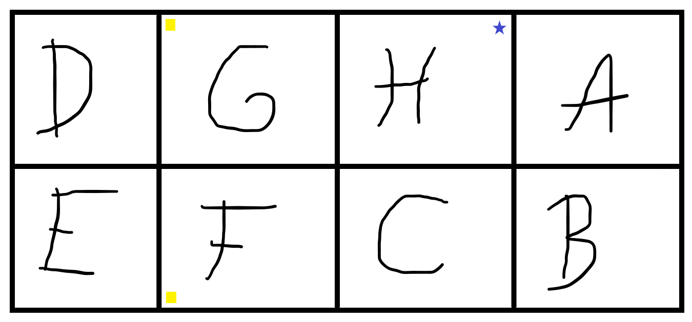
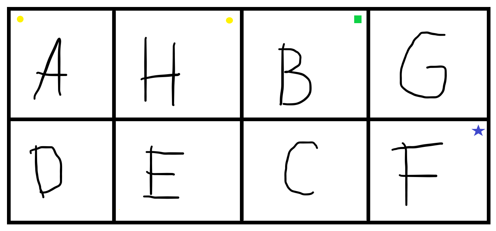
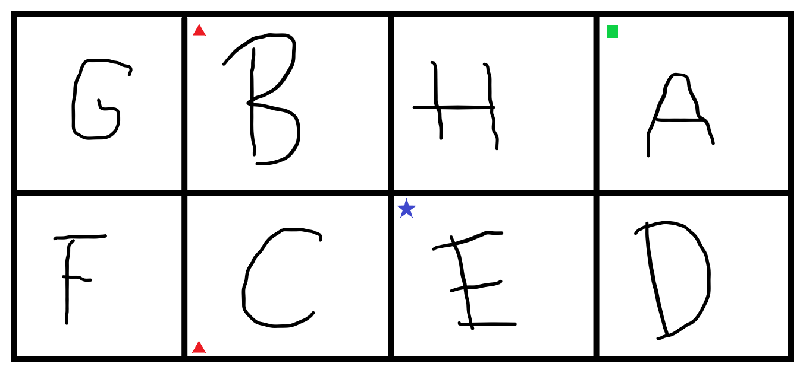

This post contains my proposed solution to [Problem #019 - fold the alphabet][prob]. Please do not read this solution before making a serious attempt [at the problem][prob].

===

### Solution

#### Level 1

For this one, all you had to do was fold the paper along the horizontal line and then fold the resulting piece of paper like a concertina.

#### Level 2

This one is much harder to explain in words so I made some more drawings and made some markings on the sheet of paper:

Now if you flip the sheet of paper (to the back) you also need these markings:

Now this is how you go about it:

 1. fold in half vertically, so that the two red circles (in `H` and `G`) touch. Pinch the paper on letters `H` and `G`;
   
 2. fold in half horizontally, so that the two yellow squares (in `G` and `F`) touch. Pinch the paper on letters `H` and `C`;
   
 3. look for the two blue stars (in `F` and `H`) and pinch on top of them with your thumb and index finger. I want your fingers to really touch the markers, so that there's _exactly_ three layers of paper between your thumb and index fingers;

 4. you are going to take letters `E` and `D` and fold them, inside the fold you are holding, so that the green triangles touch each other;

 5. make the final fold so that `B` goes on top of `C`.

_Voilà!_

#### Level 3

In my opinion this one is easier to understand how it is going to work but it is much harder to do without ruining the piece of paper! Lets get to it!

Here is the front side with some markings:

And the back:

Now here's how you do it:

 1. fold the leftmost vertical crease so that the two yellow circles (in `A` and `H`) touch;
 2. fold from the left again, so that both green squares (the one on `A` just became visible) touch;
 3. fold horizontally so that the red triangles (in `B` and `C`) touch;
 4. fold from the right so that the blue stars (in `E` and `F`) touch;

And that is it! _Almost_. Now comes the hard part... Everything is fine, except `H` is covering your `A`, so the `H` should move from the top of the stack to the bottom... And the way you go about it is by turning the fold inside out, like if you were folding a sock (similar to what happens at [minute 3:44 of this video](https://youtu.be/124L94hoBQg?t=224))...

It took me a couple of tries to get this one right; expect your piece of paper to tear just a little bit... In fact, here's what happened on my first attempt:

As you can see, the `H` was about to be completely ripped from the sheet of paper!

If you have any questions about my solution, found any mistakes (whoops!) or would like to share *your* solution, be sure to leave a comment below... Or a video?

[prob]: ../../problems/{{ page.slug }}
